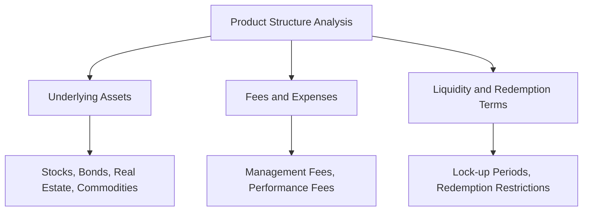
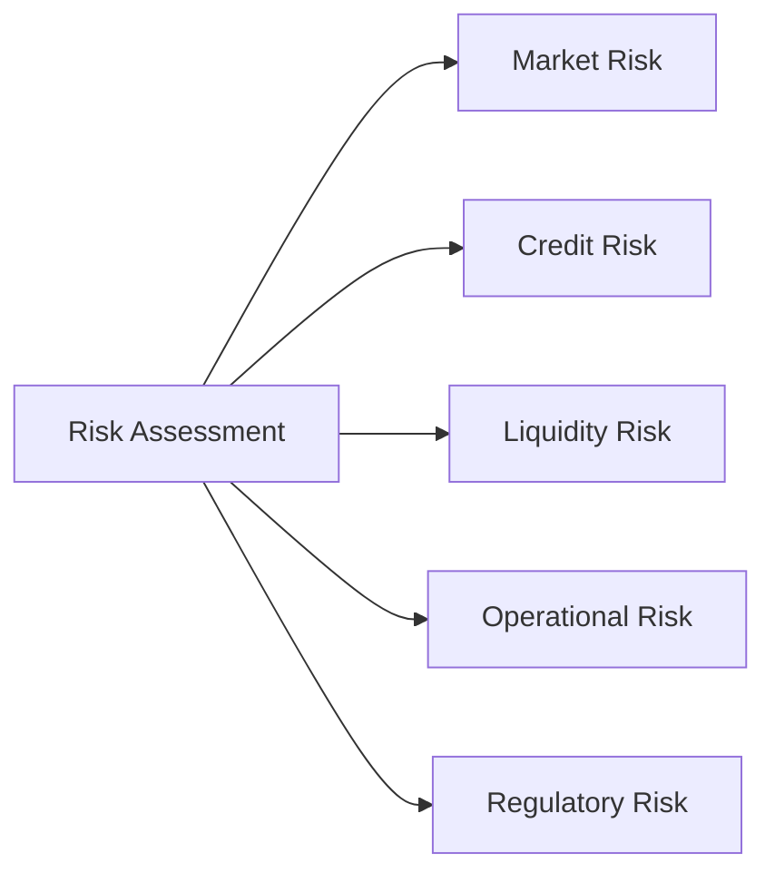

## 6.2 Product Due Diligence

So, you've probably heard the phrase "due diligence" thrown around quite a bit in the investment world. But what exactly does it mean, and why is it so crucial? Well, let's break it down. Product due diligence is essentially the process of thoroughly researching and understanding an investment product before recommending it to your clients. Think of it as doing your homework—really, really well—so you don't get caught off guard later. Trust me, there's nothing worse than recommending a product and later realizing you missed something critical. Been there, done that—lesson learned!

### Why Product Due Diligence Matters

Imagine you're buying a car. You wouldn't just glance at the shiny exterior and hand over your money, right? You'd check the engine, ask about fuel efficiency, safety ratings, and maybe even take it for a test drive. Similarly, when recommending investment products, you need to look under the hood. Your clients rely on your expertise and trust you to guide them wisely. Proper due diligence helps you avoid unpleasant surprises, protects your clients' interests, and maintains your professional reputation.

Let's dive into the key components of product due diligence.

### Issuer Analysis: Who's Behind the Product?

First things first—who's issuing the product? The issuer is the entity creating and distributing the investment. Understanding the issuer is crucial because the quality and reliability of the issuer directly impact the investment's performance and safety.

When analyzing an issuer, consider:

- **Financial Health:** Review financial statements, credit ratings, debt levels, and profitability. Is the issuer financially stable, or are they drowning in debt?
- **Management Quality:** Evaluate the experience, track record, and reputation of the management team. Are they seasoned professionals with a history of success, or is their track record spotty?
- **Business Model:** Understand how the issuer generates revenue and profits. Is their business model sustainable and adaptable to changing market conditions?
- **Reputation:** Look into the issuer's reputation in the industry. Have they faced regulatory issues, lawsuits, or scandals?

### Product Structure: What's Under the Hood?

Next, let's look at the product itself. Understanding the structure helps you identify how the investment works and what factors influence its performance.

Key areas to examine include:

- **Underlying Assets:** What assets back the product? Stocks, bonds, real estate, commodities, derivatives? Knowing this helps you understand the risk and return profile.
- **Fees and Expenses:** What are the management fees, performance fees, and other costs? High fees can significantly erode returns over time.
- **Liquidity and Redemption Terms:** Can investors easily sell or redeem their investment? Or are there lock-up periods, penalties, or restrictions?

Here's a quick visual summary of product structure analysis:

### Risk Assessment: Identifying Potential Pitfalls

Ah, risk—the unavoidable companion of investing. But not all risks are created equal. Your job is to identify and assess potential risks associated with the product, including:

- **Market Risk:** The risk of losses due to market fluctuations.
- **Credit Risk:** The risk that the issuer or counterparties won't fulfill their financial obligations.
- **Liquidity Risk:** The risk that an investment can't be sold quickly enough to prevent or minimize loss.
- **Operational Risk:** The risk of loss resulting from inadequate or failed internal processes, people, systems, or external events.
- **Regulatory Risk:** The risk that changes in laws or regulations negatively impact the investment.

Here's a handy diagram summarizing these risks:

### Performance History: Learning from the Past

While past performance doesn't guarantee future results (you've heard that disclaimer a million times, right?), it's still valuable information. Analyze historical performance data, volatility, and consistency relative to benchmarks and peer groups. Look for patterns and anomalies. Has the product consistently outperformed or underperformed its peers? How volatile has it been during market downturns?

### Regulatory Compliance: Staying on the Right Side of the Law

Compliance isn't the most exciting topic, I'll admit, but it's absolutely essential. Confirm that the product meets all regulatory requirements, disclosure standards, and registration requirements set by CIRO and other regulatory bodies. Non-compliance can lead to hefty fines, legal issues, and damage to your reputation.

### Keeping Detailed Records

Always, always document your due diligence process. Keep detailed records of your research notes, issuer communications, third-party analyses, and any other relevant information. Not only does this help you stay organized, but it also provides evidence of your thoroughness if questions or disputes arise later.

### Regularly Updating Your Due Diligence

Markets change, issuers evolve, and products adapt. Regularly update your due diligence assessments to reflect these changes. A product that was suitable last year might not be today. Keep your finger on the pulse and stay proactive.

### Clearly Communicating with Clients

Finally, communicate clearly and transparently with your clients. Explain the risks, benefits, and limitations of each product. Ensure clients fully understand what they're investing in, so they can make informed decisions aligned with their goals and risk tolerance. Remember, informed clients are happy clients.

### Practical Example: The Case of ABC Income Fund

Let's look at a quick example. Suppose you're considering recommending the ABC Income Fund to your clients. Here's how you'd approach due diligence:

- **Issuer Analysis:** ABC Asset Management has a solid reputation, experienced management, and strong financial health.
- **Product Structure:** The fund invests primarily in corporate bonds and has reasonable fees. However, there's a 90-day redemption notice period.
- **Risk Assessment:** Moderate credit risk (corporate bonds), low liquidity risk (due to redemption notice), and manageable market risk.
- **Performance History:** Consistent returns slightly above benchmark, moderate volatility.
- **Regulatory Compliance:** Fully compliant with CIRO and CSA regulations.

By thoroughly analyzing these factors, you can confidently recommend the ABC Income Fund to suitable clients.

### Additional Resources

To deepen your understanding, check out these resources:

- [CIRO Guidance Note 09-0087 – Best Practices for Product Due Diligence](https://www.ciro.ca/rules-and-enforcement/guidance-notes)
- [CSA Staff Notice 33-315 – Suitability and Know Your Product Obligations](https://www.securities-administrators.ca/)
- Book: "Due Diligence Handbook: Corporate Governance, Risk Management, and Business Planning" by Linda S. Spedding
- Online Course: [CSI’s Investment Management Techniques](https://www.csi.ca/student/en_ca/courses/csi/imt.xhtml)

---

## Master Your Skills: Product Due Diligence Essentials Quiz



### What is the primary purpose of product due diligence?

- [x] To thoroughly research and understand investment products before recommending them to clients.
- [ ] To guarantee future investment returns.
- [ ] To avoid regulatory compliance entirely.
- [ ] To minimize all investment risks completely.

> **Explanation:** Product due diligence involves thoroughly researching and understanding investment products to make informed recommendations, not to guarantee returns or eliminate all risks.

### Which factor is NOT typically part of issuer analysis?

- [ ] Financial health
- [ ] Management quality
- [ ] Business model
- [x] Investor's personal financial goals

> **Explanation:** Issuer analysis focuses on the issuer's characteristics, not the investor's personal financial goals.

### Liquidity risk refers to:

- [ ] The risk of issuer bankruptcy.
- [ ] The risk of market fluctuations.
- [x] The risk that an investment can't be sold quickly enough to minimize loss.
- [ ] The risk of operational failures.

> **Explanation:** Liquidity risk is the inability to quickly sell an investment without significant loss.

### Why is regulatory compliance important in product due diligence?

- [x] It ensures the product meets legal and regulatory standards.
- [ ] It guarantees high returns.
- [ ] It eliminates all investment risks.
- [ ] It simplifies investment decisions.

> **Explanation:** Regulatory compliance ensures products meet legal standards, protecting investors and advisors.

### Historical performance analysis helps to:

- [x] Understand past volatility and consistency relative to benchmarks.
- [ ] Predict exact future performance.
- [ ] Eliminate market risk.
- [ ] Guarantee future returns.

> **Explanation:** Historical analysis provides insights into past volatility and consistency, aiding informed decisions.

### Operational risk is best described as:

- [ ] Risk from market fluctuations.
- [x] Risk from inadequate internal processes or systems.
- [ ] Risk of issuer default.
- [ ] Risk of regulatory non-compliance.

> **Explanation:** Operational risk arises from internal failures or inadequate processes.

### Why is maintaining detailed due diligence records important?

- [x] To provide evidence of thorough research.
- [ ] To guarantee investment success.
- [ ] To reduce investment volatility.
- [ ] To increase product liquidity.

> **Explanation:** Detailed records provide evidence of compliance and thorough analysis.

### Which of these is NOT typically part of product structure analysis?

- [ ] Underlying assets
- [ ] Fees and expenses
- [ ] Redemption terms
- [x] Client's risk tolerance

> **Explanation:** Client's risk tolerance is part of suitability analysis, not product structure.

### Regulatory compliance in product due diligence primarily involves:

- [x] Ensuring products meet disclosure and registration requirements.
- [ ] Maximizing investment returns.
- [ ] Minimizing market volatility.
- [ ] Selecting products with high ratings only.

> **Explanation:** Compliance ensures products meet regulatory disclosure and registration standards.

### Issuer analysis includes evaluating:

- [x] Financial health and management quality.
- [ ] Past client investment returns.
- [ ] Client's investment objectives.
- [ ] Market timing strategies.

> **Explanation:** Issuer analysis evaluates the issuer's financial health and management quality.


