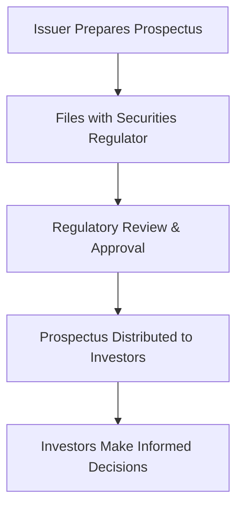
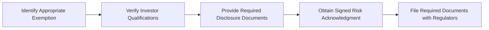

## 6.3 New Issues and Prospectus Exemptions

So, you're probably familiar with the excitement around new securities issues, right? I mean, who doesn't love the idea of getting in early on a promising investment? But here's the thing—before those shiny new securities hit the market, there's a whole regulatory dance that issuers and investment professionals need to master. Let's dive into how this works, what a prospectus is, and when you can skip it (legally, of course!).

### Understanding the Prospectus Requirement

First things first: what's a prospectus anyway? Think of it as a detailed "tell-all" document that issuers must provide when they're offering new securities to the public. It's like the nutritional label on your cereal box—it tells you exactly what's inside, so you can make an informed decision.

A prospectus typically includes:

- Detailed issuer information (who they are, their business model, management team, etc.)
- Audited financial statements (the numbers don't lie!)
- Risk factors (what could possibly go wrong?)
- Intended use of proceeds (where exactly your money is going)

The goal here is transparency. Investors deserve to know exactly what they're getting into. And regulators like CIRO (Canadian Investment Regulatory Organization) are pretty strict about this stuff—for good reason.

Here's a quick visual to help you grasp the prospectus process:

### When Can You Skip the Prospectus? (Prospectus Exemptions)

Okay, so preparing a full prospectus can be costly and time-consuming. But here's the good news—there are scenarios where issuers can legally skip the full prospectus process. These are called "prospectus exemptions," and they're outlined in National Instrument 45-106.

Let's break down the most common exemptions:

#### Accredited Investor Exemption

This one's pretty popular. Basically, if you're dealing with sophisticated investors who meet certain financial criteria, you don't need a full prospectus. Accredited investors typically include:

- Individuals with net financial assets exceeding $1 million.
- Individuals whose net income exceeds $200,000 annually (or $300,000 combined with a spouse).
- Institutional investors like pension funds, banks, and insurance companies.

Why the exemption? Well, regulators figure these folks can handle themselves—they've got the resources and knowledge to assess risks without the full disclosure of a prospectus.

#### Minimum Amount Investment Exemption

This exemption kicks in when an investor commits to a substantial minimum investment—currently set at $150,000 or more. The logic here? If someone's willing and able to invest that kind of money, they're likely sophisticated enough to understand the risks involved.

#### Private Issuer Exemption

This exemption is designed for private companies issuing securities to a limited group of investors—usually family, close friends, or business associates. The idea is that these investors already have a close relationship with the issuer, so they don't need the same level of disclosure.

#### Offering Memorandum Exemption

This exemption allows issuers to distribute securities based on a simplified disclosure document called an "Offering Memorandum" (OM). It's less detailed than a full prospectus but still provides essential information about the issuer, the securities, and associated risks.

Here's a quick comparison table to summarize these exemptions:

| Exemption Type | Key Criteria | Disclosure Required | Investor Qualification |
|----------------|--------------|---------------------|------------------------|
| Accredited Investor | Financial thresholds or institutional status | Minimal (Risk acknowledgment form) | Accredited status verification |
| Minimum Amount Investment | Minimum investment of $150,000 | Minimal disclosure | Minimum investment verification |
| Private Issuer | Limited investor group (family, friends, associates) | Minimal | Relationship verification |
| Offering Memorandum | Simplified disclosure document | Offering Memorandum (OM) | Risk acknowledgment form |

### Compliance and Best Practices

Now, just because you're exempt from a full prospectus doesn't mean it's a free-for-all. CIRO expects strict compliance with exemption conditions. Here's what you need to watch out for:

- **Investor Qualification Verification:** Always verify that investors meet exemption criteria. Keep detailed records—trust me, you'll thank yourself later if regulators come knocking.
- **Risk Disclosure:** Clearly communicate risks to investors. Exempt market products often have limited liquidity and higher risk profiles. Investors need to understand exactly what they're getting into.
- **Filing Obligations:** Depending on the exemption, issuers may need to file reports with securities regulators. For example, issuers using the Offering Memorandum exemption must file the OM and related documents with regulators.

Here's a quick visual summary of compliance steps:

### Communicating Risks to Clients

As a registered representative, it's crucial to clearly explain exemption-related risks to your clients. I remember early in my career, a client was super excited about an exempt market product. But when I explained the limited liquidity and higher risk, they realized it wasn't a good fit for their risk tolerance. Transparency builds trust—always prioritize clear communication.

### Real-World Example: The Tech Startup Scenario

Let's say a promising tech startup wants to raise capital quickly without the hassle of a full prospectus. They decide to use the Accredited Investor exemption. They approach high-net-worth individuals and institutional investors, provide basic disclosure, and obtain signed risk acknowledgment forms. The startup verifies each investor's accredited status and files the necessary forms with regulators. Boom—capital raised efficiently, legally, and transparently.

### Common Pitfalls and How to Avoid Them

- **Poor Record-Keeping:** Always document investor qualifications and disclosures meticulously.
- **Misunderstanding Exemption Criteria:** Double-check exemption requirements—mistakes here can lead to regulatory headaches.
- **Inadequate Risk Disclosure:** Clearly communicate risks—never assume investors "just know."

### Additional Resources for Further Exploration

- **National Instrument 45-106 – Prospectus Exemptions:** [NI 45-106](https://www.securities-administrators.ca/)
- **CIRO Notice 21-0190 – Guidance on Prospectus Exemptions:** [CIRO Notice](https://www.ciro.ca/rules-and-enforcement/notices)
- **Book:** "Canadian Securities Regulation" by David Johnston, Kathleen Doyle Rockwell, and Cristie Ford
- **Online Course:** CSI’s ["Exempt Market Proficiency Course"](https://www.csi.ca/student/en_ca/courses/csi/empc.xhtml)

---

## Test Your Knowledge: Prospectus Requirements and Exemptions Quiz



### What is the primary purpose of a prospectus?

- [x] To provide detailed disclosure to investors about a new securities offering.
- [ ] To guarantee investment returns.
- [ ] To eliminate investment risks.
- [ ] To simplify the investment process.

> **Explanation:** A prospectus provides detailed issuer information, financial statements, risk factors, and intended use of proceeds, ensuring investors can make informed decisions.

### Which investor type typically qualifies under the Accredited Investor exemption?

- [x] An individual with net financial assets exceeding $1 million.
- [ ] Any individual investor.
- [ ] Investors purchasing securities worth $10,000.
- [ ] Investors with no prior investment experience.

> **Explanation:** Accredited investors must meet specific financial thresholds or institutional criteria.

### What's the minimum investment amount required for the Minimum Amount Investment exemption?

- [x] $150,000
- [ ] $50,000
- [ ] $100,000
- [ ] $200,000

> **Explanation:** The current minimum threshold is $150,000.

### Which exemption allows private companies to issue securities to family and close associates without a prospectus?

- [x] Private Issuer Exemption
- [ ] Accredited Investor Exemption
- [ ] Offering Memorandum Exemption
- [ ] Minimum Amount Investment Exemption

> **Explanation:** The Private Issuer Exemption allows private companies to issue securities to a limited group without a prospectus.

### What document is used in the Offering Memorandum exemption?

- [x] Offering Memorandum (OM)
- [ ] Full Prospectus
- [ ] Financial Statement Only
- [ ] Investor Agreement

> **Explanation:** The Offering Memorandum is a simplified disclosure document used in this exemption.


