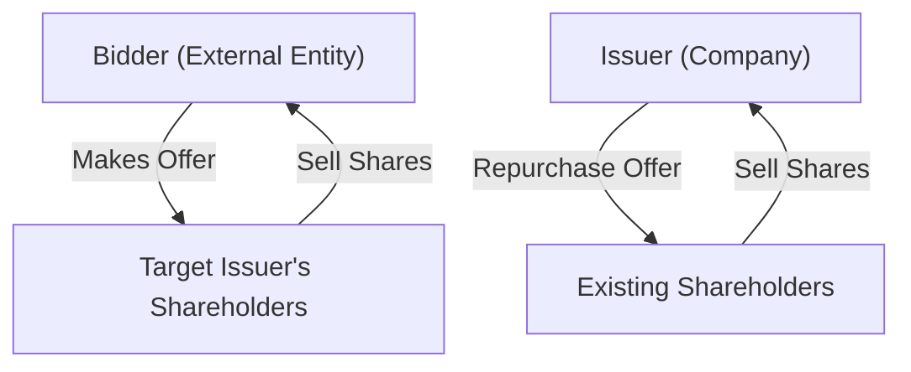
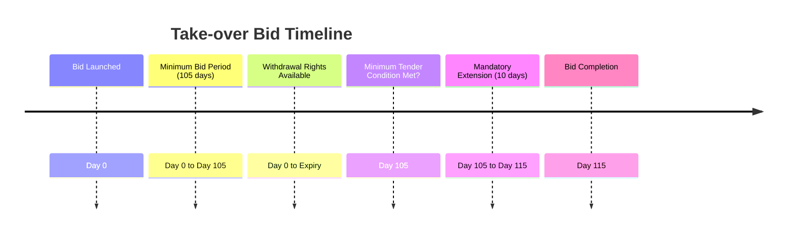

Ever heard the phrase, "If you can't beat 'em, buy 'em"? Well, that's exactly what take-over bids are all about. And issuer bids? Think of them as a company saying, "Hey, we believe in ourselves so much, we'd like to buy our own shares back." Both these transactions are significant events in the financial markets, and as a registered representative, it's crucial to understand their ins and outs. So, let's dive in!

## Understanding Take-over Bids and Issuer Bids

First things first, let's clearly differentiate between these two types of bids:

- **Take-over Bid:** This is an offer made by an individual or entity (the "bidder") to purchase voting securities of another company (the "target issuer"), usually aiming to gain control or significant influence over the target company. It's like someone knocking on your door, offering to buy your house—only in this case, it's shares they're after.

- **Issuer Bid:** This is when a company offers to repurchase its own securities from existing shareholders. It's like a company saying, "We think our shares are undervalued, and we'd like to buy some back to boost shareholder value."

Let's visualize this clearly:

## Regulatory Framework in Canada: National Instrument 62-104

In Canada, take-over bids and issuer bids are governed primarily by **National Instrument 62-104 (NI 62-104)**. This regulation outlines detailed disclosure, timing, and procedural requirements to ensure fairness, transparency, and protection for all shareholders involved.

You can check out the full details here: [NI 62-104](https://www.securities-administrators.ca/).

## Mandatory Disclosure Requirements

Transparency is key. Both take-over and issuer bids require extensive disclosure documents to ensure shareholders have all the information they need to make informed decisions.

### Bid Circulars

The **Bid Circular** is the primary disclosure document provided by the bidder (or issuer, in the case of issuer bids). It must include:

- Terms and conditions of the offer
- Identity and background of the bidder
- Purpose of the bid and future plans for the target issuer
- Method of financing the bid
- Any prior transactions involving the bidder and the target issuer
- Valuation reports (if required)

### Directors' Circulars

The target company's board of directors must respond to a take-over bid through a **Directors' Circular**, providing their recommendation to shareholders. This document includes:

- Directors' recommendation (accept, reject, or neutral)
- Reasons for their recommendation
- Any conflicts of interest or relationships with the bidder
- Any alternative transactions considered or pursued

### Valuation Reports

In certain cases, especially when related parties are involved, independent valuation reports are mandatory. These reports provide an unbiased assessment of the fair market value of the securities involved, helping shareholders make informed decisions.

## Procedural and Timing Requirements

Timing matters—a lot. NI 62-104 sets clear timelines to ensure fairness and transparency:

- **Minimum Bid Period:** Take-over bids must remain open for at least **105 days**, unless the target board agrees to shorten this period (minimum 35 days).
- **Withdrawal Rights:** Shareholders can withdraw their tendered shares at any time before the bid expires.
- **Minimum Tender Condition:** At least 50% of the outstanding securities, excluding those already held by the bidder, must be tendered for the bid to succeed.
- **Extension Period:** If the minimum tender condition is met, the bid must be extended by at least 10 additional days, allowing remaining shareholders to tender their shares.

Here's a quick visual summary:

## Protecting Minority Shareholders

The Canadian regulatory framework places significant emphasis on protecting minority shareholders. Key protections include:

- **Equal Treatment:** All shareholders must receive identical consideration for their shares. No special deals for certain shareholders.
- **Withdrawal Rights:** Shareholders can change their minds and withdraw their shares anytime before the bid expires.
- **Minimum Tender Condition:** Ensures that a majority of independent shareholders support the bid before it can proceed.

## Practical Example: The XYZ Corp Take-over Bid

Let's look at a practical example. Imagine XYZ Corp wants to acquire ABC Ltd. XYZ Corp offers ABC shareholders $25 per share, a premium over the current market price of $20.

- XYZ Corp issues a Bid Circular detailing the offer.
- ABC Ltd's board reviews the offer and issues a Directors' Circular recommending shareholders accept the bid, citing the premium and strategic benefits.
- Shareholders have 105 days to consider the offer. During this period, some shareholders tender their shares, while others wait.
- By day 105, 60% of independent shareholders have tendered their shares, meeting the minimum tender condition.
- XYZ Corp extends the bid for an additional 10 days, allowing remaining shareholders to tender.
- After the extension, XYZ Corp successfully acquires ABC Ltd.

## Communicating with Clients: Best Practices

As a registered representative, your role is crucial in helping clients understand these bids. Here's what you should do:

- Clearly explain the terms and conditions of the bid.
- Discuss the implications and risks involved, including potential outcomes if the bid succeeds or fails.
- Provide clients with all relevant disclosure documents (Bid Circular, Directors' Circular, valuation reports).
- Encourage clients to carefully consider their investment objectives and risk tolerance before making a decision.
- Ensure clients understand their rights, including withdrawal rights and minimum tender conditions.

## Common Pitfalls and How to Avoid Them

- **Incomplete Disclosure:** Always ensure clients receive all relevant documents. Missing information can lead to uninformed decisions and potential regulatory issues.
- **Miscommunication of Risks:** Clearly outline potential risks and outcomes. Clients should never feel pressured or misled.
- **Ignoring Minority Protections:** Ensure clients understand their rights and protections under Canadian regulations.

## Additional Resources for Further Exploration

Want to dive deeper? Here are some excellent resources:

- **National Instrument 62-104 – Take-over Bids and Issuer Bids:** [NI 62-104](https://www.securities-administrators.ca/)
- **Book:** "Mergers, Acquisitions, and Other Restructuring Activities" by Donald DePamphilis
- **Online Course:** CSI’s "Mergers and Acquisitions" – [CSI M&A Course](https://www.csi.ca/student/en_ca/courses/csi/ma.xhtml)

---

## Test Your Knowledge: Take-over Bids and Issuer Bids in Canada Quiz



### What is the primary purpose of a take-over bid?

- [x] To acquire control or significant influence over a target issuer.
- [ ] To repurchase a company's own shares.
- [ ] To issue new shares to existing shareholders.
- [ ] To liquidate a company's assets.

> **Explanation:** A take-over bid is specifically aimed at acquiring control or significant influence over another company.

### Which document is issued by the target company's board in response to a take-over bid?

- [x] Directors' Circular
- [ ] Bid Circular
- [ ] Valuation Report
- [ ] Prospectus

> **Explanation:** The Directors' Circular is issued by the target company's board, providing their recommendation regarding the take-over bid.

### How long must a take-over bid remain open under Canadian regulations (unless shortened by the target board)?

- [x] 105 days
- [ ] 60 days
- [ ] 90 days
- [ ] 120 days

> **Explanation:** The minimum bid period is 105 days, unless the target issuer's board agrees to shorten it.

### What is the minimum tender condition required for a take-over bid to succeed?

- [x] At least 50% of shares must be tendered.
- [ ] At least 25% of shares.
- [ ] At least 75% of shares.
- [ ] No minimum requirement.

> **Explanation:** A minimum of 50% of shares must be tendered for the bid to succeed.

### Which of the following is NOT a mandatory disclosure document in a take-over bid?

- [ ] Bid Circular
- [ ] Directors' Circular
- [ ] Valuation Report (if required)
- [x] Annual Financial Report

> **Explanation:** Annual financial reports are regular disclosures, not specifically required for take-over bids.

### Issuer bids involve:

- [x] A company repurchasing its own shares.
- [ ] An external entity acquiring control of a company.
- [ ] Selling shares to external investors.
- [ ] Issuing new shares to the public.

> **Explanation:** Issuer bids involve a company repurchasing its own shares from existing shareholders.

### How long must a take-over bid be extended once the minimum tender condition is met?

- [x] At least 10 days
- [ ] At least 15 days
- [ ] At least 30 days
- [ ] At least 5 days

> **Explanation:** Once the minimum tender condition is met, the bid must be extended by at least an additional 10 days.

### What principle ensures all shareholders receive identical consideration in a take-over bid?

- [x] Equal treatment provision
- [ ] Withdrawal rights
- [ ] Minimum tender condition
- [ ] Directors' recommendation

> **Explanation:** Equal treatment ensures all shareholders receive identical consideration for their shares.

### Issuer bids involve which of the following?

- [x] A company repurchasing its own shares
- [ ] An external entity acquiring control of a company
- [ ] A merger between two companies
- [ ] An initial public offering

> **Explanation:** Issuer bids specifically involve a company buying back its own shares from shareholders.

### Which regulatory instrument governs take-over bids and issuer bids in Canada?

- [x] National Instrument 62-104
- [ ] National Instrument 81-102
- [ ] National Instrument 31-103
- [ ] National Instrument 45-106

> **Explanation:** National Instrument 62-104 specifically governs take-over bids and issuer bids in Canada.


