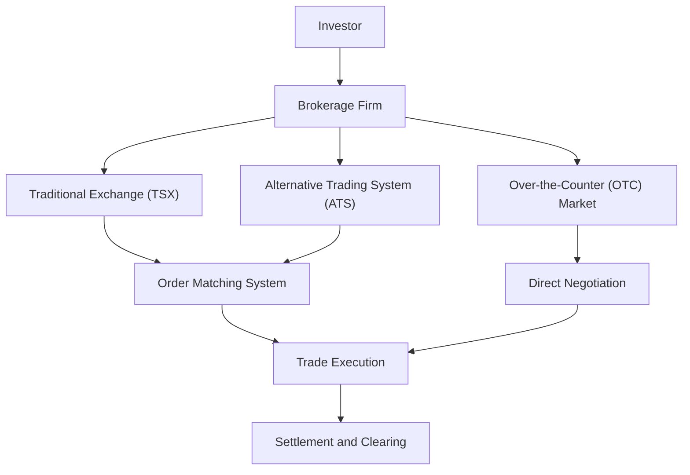

## 7.1 How Securities Are Traded

If you've ever watched financial news or chatted with friends about investing, you've probably heard phrases like "trading on the TSX," "buying OTC," or "placing an order through a brokerage." But, um, what exactly does all that mean? How do securities actually get traded? Let's break it down step-by-step, exploring the Canadian securities market and how it all works under the watchful eye of the Canadian Investment Regulatory Organization (CIRO).

### First Things First: What Exactly Are Securities?

Simply put, securities are financial instruments that represent ownership (stocks), debt obligations (bonds), or rights to buy or sell assets (derivatives). When you buy a stock, you're essentially buying a tiny piece of ownership in a company. Bonds, meanwhile, are loans you make to governments or corporations, and derivatives are contracts whose value depends on underlying assets like stocks or commodities.

### Where Do Securities Get Traded?

In Canada, securities trading happens primarily through three main channels:

1. **Traditional Exchanges**: Think of the Toronto Stock Exchange (TSX)—Canada's largest and most well-known exchange. Exchanges like the TSX provide a centralized, regulated marketplace where buyers and sellers meet electronically.

2. **Alternative Trading Systems (ATS)**: These are electronic platforms that match buyers and sellers outside traditional exchanges. ATS platforms offer flexibility and often lower transaction costs. They're regulated by CIRO and provincial regulators to ensure fairness and transparency.

3. **Over-the-Counter (OTC) Markets**: OTC trading occurs directly between two parties without a centralized exchange. This market is typically used for securities not listed on formal exchanges, such as certain bonds or smaller company shares. OTC markets can offer more flexibility but usually come with less transparency and higher risks.

Here's a quick visual to help you picture it:

### Who Are the Main Players?

Trading securities isn't a solo sport. It involves several key participants, each playing a crucial role:

- **Retail Investors**: Regular folks like you and me, investing our savings for retirement, education, or just to grow our wealth.
- **Institutional Investors**: Big players like pension funds, mutual funds, insurance companies, and hedge funds. They trade in large volumes and can significantly influence market prices.
- **Brokerage Firms**: These are licensed intermediaries registered with CIRO. They execute trades on behalf of investors, provide investment advice, and ensure compliance with regulations.
- **Market Makers**: Firms or individuals who continuously buy and sell securities, providing liquidity and helping maintain orderly markets. They quote both buy (bid) and sell (ask) prices, making it easier for investors to trade.

### How Does a Trade Actually Happen?

Let's walk through a typical trade scenario:

Imagine you're a retail investor who wants to buy 100 shares of a popular Canadian company listed on the TSX. Here's how it usually goes down:

1. **Placing an Order**: You log into your brokerage account and place a buy order specifying the number of shares and the price you're willing to pay.
2. **Brokerage Firm's Role**: Your brokerage firm routes your order to the appropriate trading venue (TSX, ATS, or OTC).
3. **Order Matching**: On the TSX or ATS, an electronic matching system automatically pairs your buy order with a corresponding sell order.
4. **Trade Execution**: Once matched, the trade is executed, and both buyer and seller receive confirmations.
5. **Settlement and Clearing**: Finally, the trade is settled—usually within two business days (T+2)—where securities and funds officially change hands.

### Trading Hours and Sessions

Trading doesn't happen 24/7—well, at least not officially. Canadian markets typically have three main trading sessions:

- **Pre-market Session**: Early morning trading before regular market hours. Liquidity is lower, and volatility can be higher, so tread carefully.
- **Regular Market Hours**: Typically from 9:30 AM to 4:00 PM Eastern Time. This is when most trading activity occurs, offering the highest liquidity.
- **After-hours Session**: Trading after regular market hours. Like pre-market, liquidity is lower, and prices can swing more dramatically.

### Key Principles Governing Securities Trading

CIRO and provincial securities regulators ensure that Canadian markets operate fairly, transparently, and efficiently. Key principles include:

- **Transparency**: Investors must have access to accurate, timely information about securities and market conditions.
- **Fairness**: All investors should have equal opportunities to trade without unfair advantages.
- **Efficiency**: Trades should execute quickly and accurately, minimizing costs and risks.

### Common Pitfalls and Best Practices

Trading securities can be exciting, but it's not without risks. Here are some common pitfalls and how to avoid them:

- **Chasing Hot Stocks**: Jumping into trendy stocks without proper research can lead to losses. Always perform due diligence.
- **Ignoring Liquidity**: Trading illiquid securities can make it tough to buy or sell without significantly affecting the price. Stick to securities with adequate liquidity.
- **Overtrading**: Excessive buying and selling can rack up fees and erode returns. Develop a clear investment strategy and stick to it.

### A Quick Glossary to Keep Handy

- **Brokerage Firm**: A licensed financial institution facilitating securities trades.
- **Market Maker**: Provides liquidity by continuously buying and selling securities at quoted prices.
- **Alternative Trading System (ATS)**: Electronic platforms matching buyers and sellers outside traditional exchanges.
- **Over-the-Counter (OTC) Market**: Decentralized market for securities not listed on formal exchanges.
- **Liquidity**: Ease of buying or selling a security without significantly affecting its price.
- **Volatility**: Degree of price variation over time.

### Personal Anecdote: My First Trade

I still remember my first trade vividly. I was nervous, excited, and honestly, a bit clueless. I placed an order for shares in a Canadian bank through my brokerage account, watched anxiously as the order executed, and then spent the next few days obsessively checking the stock price. It was thrilling, but I quickly learned the importance of patience, research, and having a solid trading strategy.

### Resources for Further Exploration

Want to dive deeper? Check out these resources:

- [Toronto Stock Exchange (TSX)](https://www.tsx.com/)
- [CIRO Trading Rules and Regulations](https://www.ciro.ca/)
- "Trading and Exchanges: Market Microstructure for Practitioners" by Larry Harris
- Online Course: [Financial Markets by Yale University (Coursera)](https://www.coursera.org/learn/financial-markets-global)

---

## Test Your Knowledge: Securities Trading Fundamentals Quiz



### What is the primary role of a brokerage firm?

- [x] To facilitate buying and selling of securities for clients.
- [ ] To regulate market activities.
- [ ] To issue new securities.
- [ ] To guarantee investment returns.

> **Explanation:** Brokerage firms act as intermediaries, executing trades on behalf of investors.

### Which of these is NOT a traditional exchange?

- [ ] Toronto Stock Exchange (TSX)
- [x] Over-the-Counter (OTC) Market
- [ ] New York Stock Exchange (NYSE)
- [ ] NASDAQ

> **Explanation:** OTC markets are decentralized and do not operate as traditional centralized exchanges.

### What does liquidity refer to in securities trading?

- [x] The ease of buying or selling a security without significantly affecting its price.
- [ ] The profitability of a security.
- [ ] The volatility of a security.
- [ ] The maturity date of a bond.

> **Explanation:** Liquidity indicates how easily an asset can be bought or sold in the market without impacting its price.

### Which trading session typically has the highest liquidity?

- [ ] Pre-market session
- [x] Regular market hours
- [ ] After-hours trading
- [ ] Weekend trading

> **Explanation:** Regular market hours usually have the highest liquidity and lowest volatility.


