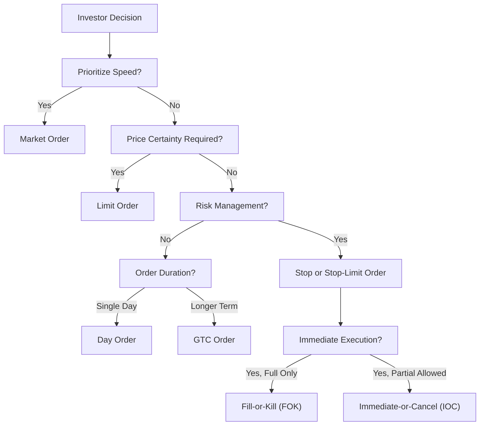

## 7.2 Types of Orders

So, you're ready to trade! You've done your research, you have a strategy, and now it's time to execute. But wait—how exactly do you place your trade? Well, that's where understanding the different types of orders comes into play. Choosing the right order type can make a huge difference in your trading success, aligning your trades with your investment objectives, risk tolerance, and market conditions.

Let's dive into the main types of orders you'll encounter in Canadian markets, their advantages, risks, and when you might want to use each one.

### Market Orders: Speed Over Price Certainty

A **market order** is the simplest and fastest way to execute a trade. When you place a market order, you're basically saying, "Hey, buy or sell this security right now, at the best available price."

**Advantages:**
- Immediate execution.
- Ideal for highly liquid securities where prices don't fluctuate dramatically.

**Risks:**
- You have no control over the exact price. In volatile markets, you might end up paying more or receiving less than you anticipated.

**Example:**
Imagine you're watching shares of Maple Leaf Tech Inc. (fictional company) rise rapidly due to positive news. You place a market order to buy 100 shares immediately at the current market price of $25.50. Your order executes instantly, and you secure your shares quickly—though maybe at a slightly higher price if the stock is moving fast.

### Limit Orders: Control Your Price

A **limit order** lets you specify the exact price at which you're willing to buy or sell. It gives you control over price but doesn't guarantee execution.

**Advantages:**
- Price certainty—you won't pay more or sell for less than your specified limit.
- Useful in volatile markets to avoid unexpected price swings.

**Risks:**
- Your order might never execute if the market price doesn't reach your limit.

**Example:**
Suppose you believe shares of Northern Energy Ltd. (fictional company) are currently overpriced at $40. You place a limit order to buy 200 shares at $38. If the price dips to $38 or lower, your order executes. If it doesn't, your order remains unfilled.

### Stop Orders (Stop-Loss Orders): Protect Your Profits, Limit Your Losses

A **stop order** (or stop-loss order) becomes active only when the security reaches a specified "stop" price. Once triggered, it converts into a market order.

**Advantages:**
- Helps you limit losses or lock in profits automatically.
- Great for managing risk, especially if you can't constantly monitor the market.

**Risks:**
- Once triggered, execution price isn't guaranteed—it could be worse than your stop price, especially in rapidly declining markets.

**Example:**
You bought shares of Prairie Gold Mining (fictional company) at $15, and they're now trading at $20. To protect your profits, you set a stop-loss order at $18. If the stock drops to $18, your stop-loss triggers, converting into a market order, selling your shares immediately.

### Stop-Limit Orders: Combining Control and Protection

A **stop-limit order** combines the features of stop and limit orders. When the security reaches your stop price, the order converts into a limit order.

**Advantages:**
- Offers greater control over execution price after the stop is triggered.

**Risks:**
- Your order might not execute if the price moves quickly past your limit price.

**Example:**
Let's say you own shares of Rocky Mountain Retail (fictional company) at $50. You set a stop-limit order with a stop price of $48 and a limit price of $47.50. If the stock hits $48, your order activates as a limit order at $47.50. If the price falls below $47.50 rapidly, your order might remain unfilled.

### Day Orders: Short-Term Trading

A **day order** is valid only for the trading day it's placed. If it doesn't execute by market close, it's automatically cancelled.

**Advantages:**
- Useful for short-term traders who want to capitalize on daily price movements.

**Risks:**
- Requires active monitoring if you want to re-enter the order the next day.

### Good-Till-Cancelled (GTC) Orders: Set It and (Almost) Forget It

A **Good-Till-Cancelled (GTC)** order remains active until executed or explicitly cancelled by you. CIRO regulations typically set a maximum duration (often 90 days), after which the order expires if not executed.

**Advantages:**
- Convenient for investors who don't want to re-enter orders daily.
- Ideal for long-term price targets.

**Risks:**
- You might forget about it, and market conditions could change significantly.

### Fill-or-Kill (FOK) Orders: All or Nothing, Right Now

A **Fill-or-Kill (FOK)** order must be executed immediately and completely or cancelled entirely.

**Advantages:**
- Ensures immediate full execution, useful for large orders where partial fills aren't acceptable.

**Risks:**
- If the market can't fulfill the entire order immediately, you get nothing.

### Immediate-or-Cancel (IOC) Orders: Quick Execution, Partial Allowed

An **Immediate-or-Cancel (IOC)** order must execute immediately, either fully or partially. Any unfilled portion is cancelled.

**Advantages:**
- Allows partial fills, providing flexibility.

**Risks:**
- Partial execution might not meet your full investment objectives.

### Quick Visual Recap: Order Types Flowchart

Here's a handy diagram summarizing the order types we've discussed:

### Best Practices and Common Pitfalls

- **Always double-check your order type:** Mistakes here can be costly. Trust me, I've seen traders accidentally place market orders instead of limit orders and end up paying way more than intended.
- **Understand market conditions:** Volatile markets can significantly impact your execution price, especially with market and stop orders.
- **Regularly review GTC orders:** Don't just set and forget. Market conditions change, and so should your orders.

### Resources for Further Exploration:

- [CIRO Order Types and Trading Practices](https://www.ciro.ca/)
- "The Art of Execution" by Lee Freeman-Shor
- Online Course: [Trading Basics by Investopedia Academy](https://academy.investopedia.com/products/trading-for-beginners)

---

## Master Your Trades: Types of Orders Knowledge Quiz



### Which order type guarantees immediate execution but not price?

- [x] Market Order
- [ ] Limit Order
- [ ] Stop-Limit Order
- [ ] Good-Till-Cancelled (GTC) Order

> **Explanation:** Market orders execute immediately at the current market price, but the exact price isn't guaranteed.

### What happens to a day order if it's not executed by market close?

- [x] It expires automatically.
- [ ] It converts to a market order.
- [ ] It remains active indefinitely.
- [ ] It becomes a GTC order.

> **Explanation:** Day orders expire automatically if not executed by the end of the trading day.

### Which order type becomes active only after reaching a specified trigger price?

- [x] Stop Order
- [ ] Market Order
- [ ] Day Order
- [ ] Limit Order

> **Explanation:** Stop orders activate only when the security reaches the specified stop price.

### A Fill-or-Kill (FOK) order must be executed:

- [x] Immediately and completely
- [ ] Partially, if necessary
- [ ] At the end of the trading day
- [ ] Within a week

> **Explanation:** FOK orders must be executed immediately and completely or cancelled.

### Which order type allows partial fills with the remainder cancelled immediately?

- [x] Immediate-or-Cancel (IOC) Order
- [ ] Fill-or-Kill (FOK) Order
- [ ] Day Order
- [ ] Stop-Limit Order

> **Explanation:** IOC orders allow partial fills; any unfilled portion is cancelled immediately.


