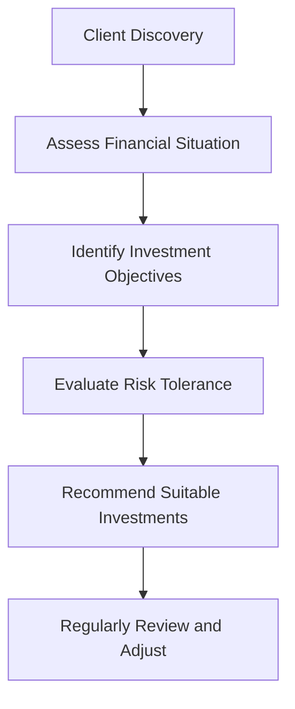

## 7.3 Sales and Trading Conduct

Alright, let's dive into one of the most crucial aspects of the securities industry—sales and trading conduct. If you've ever wondered why there are so many rules around how trades are executed or why your advisor spends so much time documenting conversations, you're about to find out. It's all about maintaining trust, integrity, and fairness in the financial markets. And trust me, that's no small feat.

### Why Sales and Trading Conduct Matters

Think of the financial market as a bustling city intersection. Without clear rules, traffic lights, and signs, you'd have chaos—accidents, confusion, and frustration everywhere. Similarly, without strict standards for sales and trading conduct, financial markets would descend into disorder, harming investors and eroding trust.

CIRO (the Canadian Investment Regulatory Organization) sets the rules of the road here. After all, their primary goal is to protect investors and ensure market integrity. To achieve this, CIRO mandates high standards of conduct, requiring registered representatives to act honestly, fairly, and in good faith. This isn't just a nice-to-have—it's the law.

### Acting Honestly, Fairly, and in Good Faith

So, what exactly does it mean to act honestly, fairly, and in good faith? Well, it's pretty straightforward, but let's unpack it a bit:

- **Honesty**: Representatives must always provide truthful information. No exaggerations, no misleading statements, no hiding important facts. If a client asks about risks or fees, the representative must be upfront and transparent.

- **Fairness**: Treating all clients equitably. No favoritism, no discrimination. Every client deserves fair treatment, regardless of their account size or investment knowledge.

- **Good Faith**: Acting with genuine intent to serve the client's best interests. This means placing the client's needs ahead of personal gain or incentives.

Here's a quick example: Imagine a representative recommending a high-risk investment to an elderly client who clearly stated they prefer safe, stable returns. Even if the representative genuinely believes the investment could be profitable, it's not acting in good faith because it disregards the client's stated objectives and risk tolerance.

### Avoiding Misrepresentation, Manipulation, and Deception

Misrepresentation, manipulation, and deceptive practices are absolute no-go zones. CIRO is crystal clear on this. Misrepresentation involves providing false or misleading information about securities, products, or market conditions. Manipulation refers to artificially influencing market prices or trading volumes. Deception covers any practice intended to mislead or defraud investors.

Let's say a representative exaggerates the potential returns of a mutual fund to entice a client into investing. Not only is this unethical, but it's also illegal. CIRO actively monitors trading activities and swiftly addresses these violations.

### Proper Disclosure: Risks, Fees, Conflicts of Interest, and Material Information

Transparency is the cornerstone of ethical trading. Representatives must disclose all relevant information clearly and promptly. This includes:

- **Risks**: Clearly outlining potential downsides and volatility associated with investments.
- **Fees**: Providing detailed information about commissions, management fees, and any other costs.
- **Conflicts of Interest**: Disclosing any personal or financial interests that could influence recommendations.
- **Material Information**: Sharing any information that could reasonably affect an investor's decision to buy or sell securities.

For example, if a representative receives a higher commission for selling a particular investment product, they must disclose this conflict of interest upfront. Clients deserve to know if recommendations are influenced by personal incentives.

### Ensuring Suitability of Trades

Suitability is all about matching investments to the client's unique profile. Representatives must thoroughly understand each client's financial situation, investment objectives, and risk tolerance. Recommendations must align with these factors.

Here's a simple scenario: Suppose a client explicitly states they're saving for a down payment on a house in two years. Recommending volatile, speculative stocks would be unsuitable. Instead, safer, short-term investments like guaranteed investment certificates (GICs) or high-interest savings accounts would be appropriate.

Let's visualize this suitability assessment process:

Suitability isn't a one-time task—it's an ongoing responsibility. Representatives must regularly review client portfolios and adjust recommendations as circumstances change.

### Accurate and Timely Record-Keeping

Ever wonder why your advisor meticulously documents every conversation and transaction? Accurate record-keeping is essential for compliance and client protection. CIRO requires representatives to maintain detailed records of all trading activities, client interactions, recommendations, and disclosures.

Proper documentation helps resolve disputes, ensures accountability, and provides evidence during regulatory audits. And believe me, when CIRO auditors come knocking, having organized, accurate records makes everyone's life easier.

### CIRO's Monitoring and Audits

Speaking of audits—CIRO doesn't just set rules and hope everyone follows them. They actively monitor trading activities, conduct regular audits, and investigate complaints or suspicious activities. Their goal? Ensuring compliance and swiftly addressing any misconduct.

Here's how CIRO's monitoring process typically works:

CIRO's vigilance helps maintain investor confidence and market integrity. Representatives who adhere to high standards have nothing to fear—compliance becomes second nature.

### Common Pitfalls and How to Avoid Them

Let's quickly touch on some common pitfalls representatives encounter and how to steer clear:

- **Inadequate Disclosure**: Always err on the side of transparency. When in doubt, disclose more rather than less.
- **Ignoring Suitability**: Regularly revisit client profiles and objectives. Life changes—so should investment strategies.
- **Poor Record-Keeping**: Implement robust systems and processes for documentation. Digital tools can streamline this significantly.
- **Conflicts of Interest**: Identify, disclose, and manage conflicts proactively. Transparency builds trust.

### Real-World Case Study: The Importance of Suitability and Disclosure

Let's look at a quick case study to illustrate these principles:

**Scenario**: Alex, a registered representative, recommends a speculative biotech stock to Maria, a retiree with a conservative risk profile. Alex fails to disclose the high volatility and significant risks associated with the investment. Maria invests based on Alex's recommendation and subsequently suffers substantial losses.

**Outcome**: CIRO investigates the complaint, finding Alex failed to ensure suitability and proper disclosure. Alex faces disciplinary action, including fines and mandatory retraining. Maria's trust is lost, and the firm's reputation suffers.

**Lesson Learned**: Suitability and disclosure aren't optional—they're fundamental responsibilities. Ignoring them can lead to severe consequences for everyone involved.

### Glossary of Key Terms

- **Suitability**: Ensuring investment recommendations align with client objectives, risk tolerance, and financial situation.
- **Conflict of Interest**: A situation where personal interests may compromise professional judgment or client interests.
- **Material Information**: Information that could reasonably influence an investor's decision to buy or sell securities.

### Resources for Further Exploration

Want to dig deeper? Check out these excellent resources:

- [CIRO Conduct and Trading Regulations](https://www.ciro.ca/)
- "Investment Ethics" by Sarah Peck
- Online Course: [Ethics in Finance by CFA Institute](https://www.cfainstitute.org/en/ethics-standards)

Remember, maintaining high standards of conduct isn't just about compliance—it's about building lasting trust and integrity in the financial industry. And trust me, that's worth its weight in gold.

## Test Your Knowledge: CIRO Sales and Trading Conduct Standards Quiz



### What does CIRO mandate regarding sales and trading conduct?

- [x] Representatives must act honestly, fairly, and in good faith.
- [ ] Representatives can prioritize personal interests over client interests.
- [ ] Representatives may occasionally exaggerate investment returns.
- [ ] Representatives are not required to disclose conflicts of interest.

> **Explanation:** CIRO mandates representatives to act honestly, fairly, and in good faith, always prioritizing client interests.

### Which practice is considered unethical and illegal?

- [x] Misrepresenting investment risks.
- [ ] Clearly disclosing fees.
- [ ] Documenting client interactions.
- [ ] Regularly reviewing client portfolios.

> **Explanation:** Misrepresenting investment risks is unethical and illegal under CIRO regulations.

### What is the primary purpose of suitability assessments?

- [x] To match investments with client objectives and risk tolerance.
- [ ] To maximize commissions for representatives.
- [ ] To speed up trading processes.
- [ ] To avoid documentation.

> **Explanation:** Suitability assessments ensure investments align with client objectives and risk tolerance.


