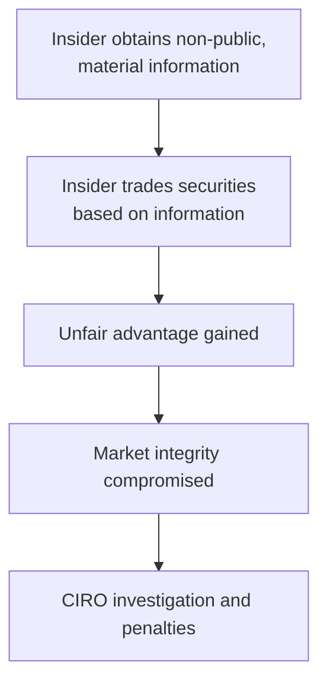
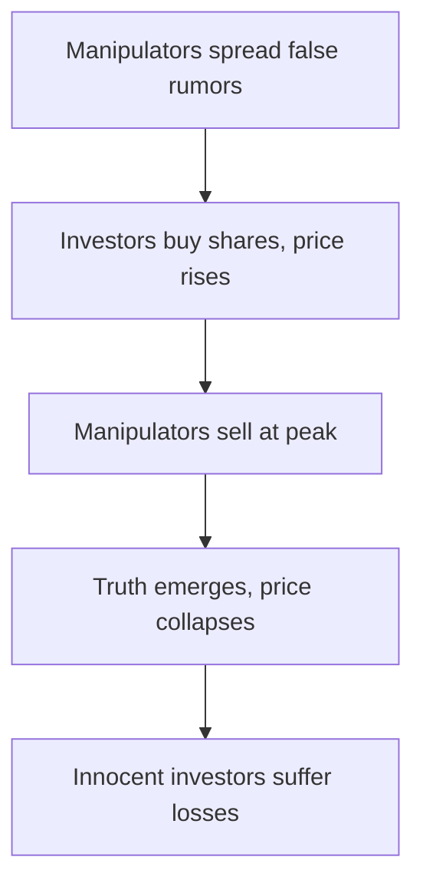
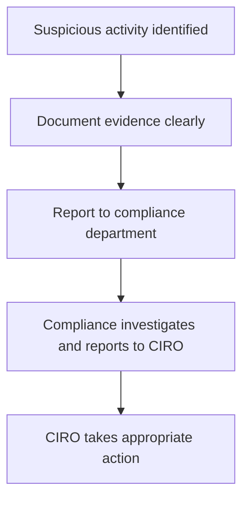

## Prohibited Activities: Protecting Market Integrity and Investor Trust

Okay, let's get real for a second. Imagine you're at a poker game, and one player secretly knows everyone's cards. Not exactly fair, right? Well, the financial markets aren't much different. To keep things fair and transparent, CIRO (Canadian Investment Regulatory Organization) explicitly prohibits certain trading practices. These prohibited activities can seriously undermine market integrity, investor confidence, and, frankly, your career. Let's dive into these practices, understand why they're problematic, and learn how to steer clear of trouble.

## Insider Trading: The Ultimate No-No

Insider trading is probably the best-known prohibited activity. It's basically trading securities based on material, non-public information. "Material" means information that could significantly affect the price of a security. Think about it: if you knew a company was about to announce a groundbreaking product or a disastrous quarterly loss before anyone else, you could make a killing—or avoid a huge loss. But that's cheating, plain and simple.

### Real-Life Example:

Remember Martha Stewart? Yep, the famous lifestyle guru. She got caught up in an insider trading scandal back in 2004. Stewart sold shares of ImClone Systems after receiving non-public information about an FDA rejection. She avoided a loss, but ended up serving jail time and paying hefty fines. Not exactly a good look.

### Consequences of Insider Trading:

- Severe financial penalties
- Criminal charges, including imprisonment
- Permanent damage to your professional reputation
- CIRO disciplinary actions, including suspension or permanent ban from the industry

Here's a quick visual to illustrate insider trading:

## Market Manipulation: Playing Dirty Tricks

Market manipulation involves deceptive practices designed to artificially inflate or deflate securities prices. It's like rigging the game to your advantage—totally unethical and illegal. Common forms include:

- **Wash Trading:** Buying and selling the same security simultaneously to create artificial trading volume.
- **Spoofing:** Placing fake orders to create false impressions of market demand or supply.
- **Pump-and-Dump Schemes:** Hyping up a stock through misleading statements, then selling once the price spikes.

### Example of Pump-and-Dump:

Say a group of traders starts spreading false rumors online about a small biotech company claiming they've found a miracle cure. Investors rush in, driving the price sky-high. The manipulators then sell their shares at inflated prices, leaving innocent investors holding worthless stock when the truth comes out. Ouch.

Here's a visual breakdown:

## Front Running: Jumping the Queue

Front running is when a representative trades ahead of client orders based on advance knowledge of pending transactions. Imagine your client wants to buy a large block of shares. Knowing this will likely push the price up, you quickly buy shares for yourself first. When your client's order executes, the price rises, and you profit unfairly. Not cool.

CIRO takes front running seriously because it directly undermines client trust and market fairness.

### Front Running Example:

Let's say you're a registered representative, and your client instructs you to buy 100,000 shares of XYZ Corp. You anticipate this large order will push the stock price higher. So, you secretly purchase 10,000 shares for your personal account first. After executing your client's order, the stock price indeed rises, and you sell your shares for a quick profit. This unethical practice is strictly prohibited by CIRO.

## Churning: Trading for Commissions, Not Clients

Churning refers to excessive trading in a client's account primarily to generate commissions, without regard to the client's investment objectives or interests. It's like a mechanic charging you for repairs you don't need—just to pad their wallet.

### Signs of Churning:

- Frequent buying and selling without clear investment rationale
- High turnover rates in the client's account
- Excessive commissions relative to account size

### Example of Churning:

Imagine a senior citizen with a conservative investment profile. Their advisor repeatedly buys and sells high-risk stocks, generating hefty commissions but providing no real benefit to the client. Eventually, the client's portfolio suffers significant losses, while the advisor pockets large commissions. This unethical practice can lead to severe penalties and loss of professional credibility.

## Unauthorized Trading: Going Rogue

Unauthorized trading occurs when a representative executes trades without explicit client authorization or beyond the scope of client instructions. It's like ordering food for someone without asking—except way more serious.

### Preventing Unauthorized Trading:

- Always obtain clear, documented client authorization before executing trades.
- Regularly confirm client instructions and investment objectives.
- Maintain accurate records of all communications and authorizations.

## Reporting Suspicious Activities: Speak Up!

If you suspect any prohibited activities or breaches of conduct, it's your duty to report them immediately to your firm's compliance department and, if necessary, CIRO. Staying silent isn't an option—your integrity and reputation depend on it.

Here's a quick visual guide on reporting:

## Glossary of Key Terms:

- **Insider Trading:** Trading securities based on non-public, material information.
- **Market Manipulation:** Actions intended to deceive investors by artificially affecting market prices.
- **Front Running:** Trading ahead of client orders for personal gain.
- **Churning:** Excessive trading to generate commissions without client benefit.
- **Unauthorized Trading:** Executing trades without explicit client authorization.

## Resources for Further Exploration:

- [CIRO Enforcement Actions and Guidelines](https://www.ciro.ca/)
- "Market Manipulation and Insider Trading" by Janet Austin
- Online Course: [Compliance and Regulatory Environment by CSI](https://www.csi.ca/student/en_ca/courses/csi/compliance.xhtml)

Remember, maintaining market integrity isn't just about following rules—it's about building trust, protecting investors, and ensuring a fair playing field for everyone. Stay informed, stay ethical, and always prioritize your clients' best interests.

## Test Your Knowledge: Prohibited Trading Activities and CIRO Regulations Quiz



### What constitutes insider trading under CIRO regulations?

- [x] Trading based on non-public, material information.
- [ ] Trading frequently to generate commissions.
- [ ] Executing trades without client authorization.
- [ ] Placing fake orders to manipulate market prices.

> **Explanation:** Insider trading specifically involves trading securities based on material, non-public information, giving traders an unfair advantage.

### Which of the following is an example of market manipulation?

- [x] Wash trading
- [ ] Diversification
- [x] Pump-and-dump schemes
- [ ] Portfolio rebalancing

> **Explanation:** Wash trading and pump-and-dump schemes are deceptive practices aimed at artificially influencing market prices.

### Front running involves:

- [x] Trading ahead of client orders based on advance knowledge.
- [ ] Excessive trading to generate commissions.
- [ ] Trading based on publicly available information.
- [ ] Executing trades without client authorization.

> **Explanation:** Front running is specifically trading ahead of client orders to profit from anticipated price movements caused by those orders.

### Churning is characterized by:

- [x] Excessive trading in client accounts primarily for commissions.
- [ ] Trading based on non-public information.
- [ ] Placing fake orders to influence market prices.
- [ ] Trading ahead of client orders.

> **Explanation:** Churning involves excessive trading without regard to client interests, primarily to generate commissions.

### Unauthorized trading occurs when:

- [x] Trades are executed without explicit client authorization.
- [ ] Trades are based on publicly available information.
- [ ] Trades are made frequently to generate commissions.
- [ ] Trades are executed after obtaining client consent.

> **Explanation:** Unauthorized trading specifically refers to executing trades without clear client authorization or beyond client instructions.

### If you suspect prohibited activities, you should first:

- [x] Document evidence and report to your compliance department.
- [ ] Ignore it to avoid conflict.
- [ ] Discuss it informally with colleagues.
- [ ] Post about it on social media.

> **Explanation:** Always document and report suspicious activities to your compliance department immediately.

### Martha Stewart's insider trading scandal involved:

- [x] Selling shares based on non-public FDA rejection information.
- [ ] Manipulating market prices through fake orders.
- [ ] Excessive trading to generate commissions.
- [ ] Trading ahead of client orders.

> **Explanation:** Martha Stewart sold shares based on non-public information, leading to legal penalties.

### A pump-and-dump scheme typically involves:

- [x] Spreading misleading information to inflate stock prices temporarily.
- [ ] Trading securities based on publicly available information.
- [ ] Frequent trading to generate commissions.
- [ ] Executing trades without client authorization.

> **Explanation:** Pump-and-dump schemes artificially inflate stock prices through misinformation, allowing manipulators to sell at a profit.

### Which of these is a sign of potential churning?

- [x] Frequent trades without clear investment rationale.
- [ ] Occasional portfolio rebalancing.
- [ ] Trades based on client instructions.
- [ ] Trades executed after thorough client consultation.

> **Explanation:** Frequent, unnecessary trades without clear rationale indicate possible churning.

### CIRO's role in prohibited activities is to:

- [x] Investigate and penalize violations to maintain market integrity.
- [ ] Promote insider trading practices.
- [ ] Encourage market manipulation.
- [ ] Ignore minor breaches of conduct.

> **Explanation:** CIRO actively investigates and penalizes prohibited activities to protect market fairness and investor trust.

### Representatives should:

- [x] Report suspicious activities promptly to compliance.
- [ ] Engage in insider trading if profitable.
- [ ] Manipulate markets to benefit clients.
- [ ] Execute unauthorized trades occasionally.

> **Explanation:** Representatives must always report suspicious activities and adhere strictly to ethical guidelines.


