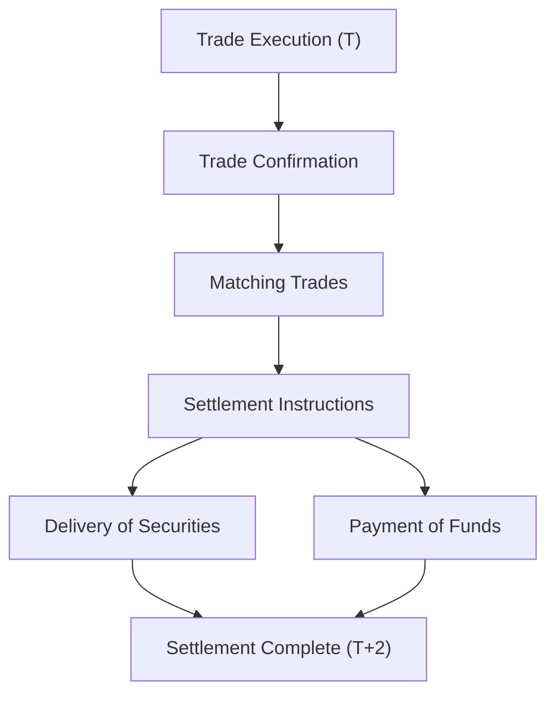
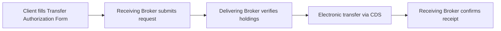
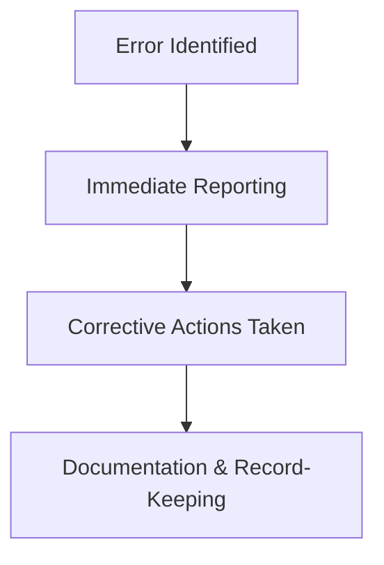

## 7.5 Settlements, Transfers, and Corrections

So, you've executed a trade—congratulations! But wait, we're not quite done yet. After the excitement of buying or selling securities, there's still the crucial step of actually exchanging the securities and funds. This is called **settlement**, and it's a vital part of the trading process. Let's dive in and explore settlements, transfers, and corrections in detail, and why getting them right is so important.

### Understanding Settlements in Securities Trading

Settlement is basically the final step in the trading process, where ownership of securities officially changes hands from seller to buyer, and payment is made. Think of it like buying a house—you've agreed on the price, signed the papers, but the deal isn't complete until the keys and money actually change hands. Similarly, in securities trading, settlement ensures the securities and cash are exchanged smoothly and securely.

In Canada, the standard settlement period for most securities transactions is **T+2**, meaning the trade settles two business days after the trade date. Let's break that down:

- **Trade Date (T)**: The day you execute your trade.
- **Settlement Date (T+2)**: Two business days after the trade date, when the securities and funds officially change hands.

Here's a quick example to illustrate:

**Example:**  
Let's say you buy 100 shares of XYZ Corp. on Monday (the trade date). Your trade will settle on Wednesday (T+2). On Wednesday, your brokerage firm will debit your account for the purchase amount, and the seller's brokerage will transfer the shares to your account.

### The Settlement Process: Step-by-Step

To help visualize this, let's use a simple diagram:

Here's what's happening at each step:

- **Trade Execution:** Buyer and seller agree on the trade.
- **Trade Confirmation:** Both parties confirm trade details (price, quantity, etc.).
- **Matching Trades:** Brokerage firms match trade details to ensure accuracy.
- **Settlement Instructions:** Instructions are sent to the Canadian Depository for Securities (CDS) for settlement.
- **Delivery of Securities & Payment of Funds:** Securities and funds are exchanged simultaneously.
- **Settlement Complete:** Ownership officially transfers, and the transaction is finalized.

### Transfers: Moving Securities Between Accounts

Transfers involve moving securities from one brokerage account or financial institution to another. Maybe you're consolidating your accounts, switching brokers, or gifting shares to a family member. Whatever the reason, transfers require proper documentation and authorization.

There are generally two types of transfers:

1. **Internal Transfers:** Moving securities between accounts within the same brokerage firm. Usually pretty straightforward and quick.
2. **External Transfers:** Moving securities between different brokerage firms or institutions. These require more documentation and typically take longer.

Let's say you decide to move your investment portfolio from Broker A to Broker B. Here's how the external transfer process typically works:

- You fill out a Transfer Authorization Form (TAF) at your new brokerage (Broker B).
- Broker B submits the request to Broker A.
- Broker A verifies your details and securities holdings.
- Once verified, Broker A transfers your securities electronically through CDS to Broker B.
- Broker B confirms receipt, and voilà—your securities are now safely housed at your new brokerage.

Here's a simplified visual:

### Corrections: Oops, Mistakes Happen!

Let's face it—mistakes can and do happen. Maybe a trade was executed incorrectly, settlement instructions were miscommunicated, or there was a clerical error in record-keeping. Whatever the cause, corrections are essential to maintaining accurate records and regulatory compliance.

If you spot an error, it's crucial to act quickly. Promptly identifying, reporting, and rectifying errors can prevent costly penalties, interest charges, or even regulatory scrutiny from CIRO (Canadian Investment Regulatory Organization).

Here's how corrections typically unfold:

- **Identification:** You or your brokerage identifies an error.
- **Reporting:** The error is reported immediately to the relevant parties (client, brokerage, CDS, or CIRO if necessary).
- **Rectification:** Corrective actions are taken, which might include reversing trades, adjusting settlement instructions, or updating records.
- **Documentation:** Accurate records of the correction are maintained for compliance purposes.

Let's look at a quick example:

**Example:**  
You intended to buy 100 shares of ABC Corp., but due to a clerical error, 1,000 shares were purchased instead. Yikes! Your brokerage immediately identifies the mistake, contacts you, and initiates corrective actions. They reverse the excess 900 shares, update your account records, and document the correction thoroughly.

Here's a visual overview of the corrections process:

### Importance of Accurate Record-Keeping

Brokerage firms are required by CIRO to maintain meticulous records of all settlement activities, transfers, and corrections. Accurate records ensure transparency, accountability, and regulatory compliance. They also help protect investors by providing clear evidence of transactions and corrective actions taken.

Poor record-keeping can lead to serious issues like regulatory penalties, client dissatisfaction, or even legal disputes. So, keeping accurate and detailed records isn't just good practice—it's essential.

### Common Pitfalls and Best Practices

Here are some common pitfalls to avoid and best practices to follow:

**Common Pitfalls:**

- Delayed reporting of errors.
- Inaccurate or incomplete documentation.
- Miscommunication between brokerage firms.
- Failure to verify client instructions.

**Best Practices:**

- Promptly identify and report errors.
- Maintain clear, detailed documentation for all transactions.
- Regularly review and reconcile account records.
- Train staff thoroughly on settlement, transfer, and correction procedures.

### Resources for Further Exploration

Want to dive deeper? Check out these resources:

- [Canadian Depository for Securities (CDS)](https://www.cds.ca/) – The central clearinghouse for securities in Canada.
- ["Securities Operations: A Guide to Trade and Position Management" by Michael Simmons](https://www.amazon.ca/Securities-Operations-Guide-Position-Management/dp/0471497584) – A comprehensive guide to securities operations.
- Online Course: [Securities Settlement and Clearing by CSI](https://www.csi.ca/student/en_ca/courses/csi/settlement.xhtml) – An excellent course for understanding the settlement process in detail.

---

## Test Your Knowledge: Securities Settlements, Transfers, and Corrections Quiz



### What is the standard settlement period for most securities transactions in Canada?

- [x] T+2 (trade date plus two business days)
- [ ] T+1 (trade date plus one business day)
- [ ] T+3 (trade date plus three business days)
- [ ] Same-day settlement

> **Explanation:** The standard settlement period in Canada is T+2, meaning trades settle two business days after the trade date.

### Which organization handles the settlement of securities in Canada?

- [x] Canadian Depository for Securities (CDS)
- [ ] Canadian Investment Regulatory Organization (CIRO)
- [ ] Canadian Investor Protection Fund (CIPF)
- [ ] Bank of Canada

> **Explanation:** CDS is Canada's central clearinghouse responsible for securities settlement.

### What form is typically required to initiate an external transfer of securities between brokerage firms?

- [x] Transfer Authorization Form (TAF)
- [ ] New Account Application Form (NAAF)
- [ ] Trade Confirmation Form
- [ ] Settlement Instruction Form

> **Explanation:** A Transfer Authorization Form (TAF) is required to move securities between different brokerage firms.

### What is the first step when an error in trade execution is identified?

- [x] Immediate reporting of the error
- [ ] Documentation of the error
- [ ] Corrective action
- [ ] Client notification after correction

> **Explanation:** Immediate reporting is essential to quickly address and rectify errors.

### Which of the following is NOT a common pitfall in settlements and transfers?

- [ ] Delayed reporting of errors
- [ ] Inaccurate documentation
- [x] Regular reconciliation of account records
- [ ] Miscommunication between brokerage firms

> **Explanation:** Regular reconciliation of account records is a best practice, not a pitfall.

### Who oversees regulatory compliance regarding settlements, transfers, and corrections in Canada?

- [ ] MFDA
- [ ] IIROC
- [x] CIRO
- [ ] CIPF

> **Explanation:** CIRO (Canadian Investment Regulatory Organization) oversees regulatory compliance in Canada.


