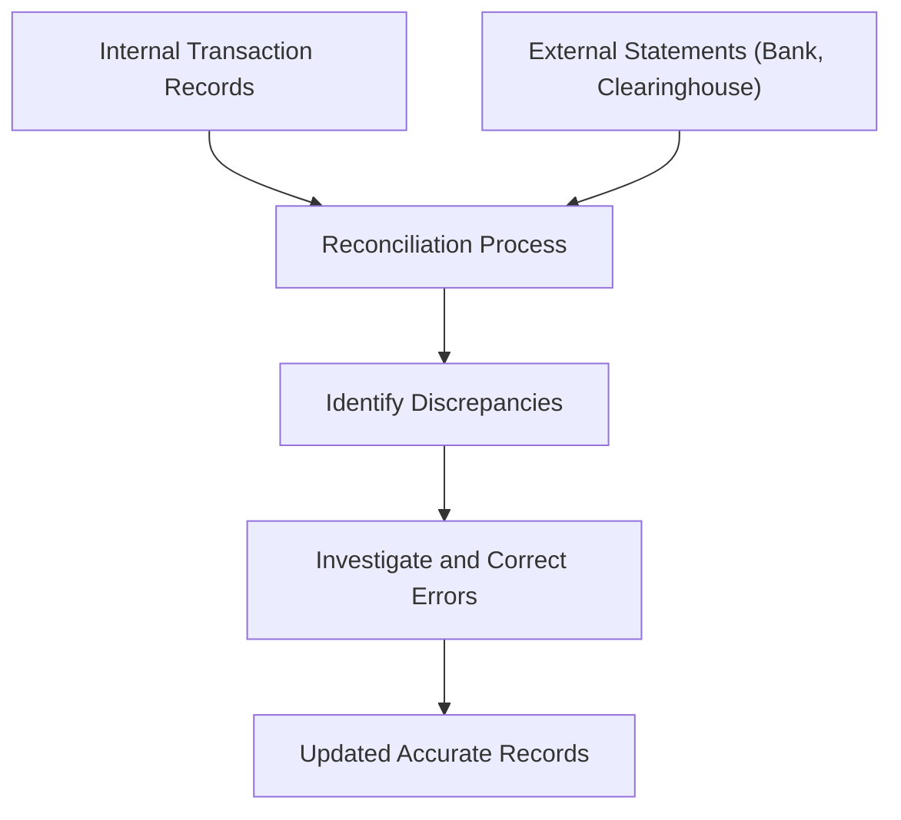
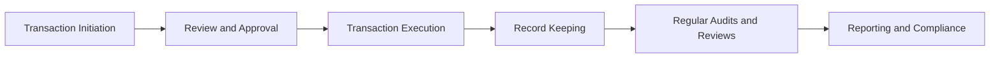

## 8.1 Accounting for Client Transactions

So, you've probably heard the saying, "numbers never lie," right? Well, in the world of investment dealing, accurate accounting for client transactions is the backbone of trust and regulatory compliance. Whether you're a seasoned financial professional or just dipping your toes into the industry, understanding how to properly account for client transactions is absolutely crucial. Let's dive into the nitty-gritty details, shall we?

### Why Accurate Accounting Matters

Imagine this: your client, let's call her Sarah, receives her quarterly account statement and notices an unfamiliar transaction. Maybe it's a dividend payment she wasn't expecting, or worse, a trade she didn't authorize. Yikes. Situations like these can quickly erode trust, create compliance headaches, and even lead to regulatory penalties. That's why investment dealers must maintain meticulous, accurate, and timely records of every single client transaction.

### Key Elements of Transaction Records

When accounting for client transactions, there are several critical elements that must always be documented clearly and accurately:

- **Transaction Date**: The exact date when the transaction occurred.
- **Securities Involved**: Clearly identify the type and quantity of securities traded.
- **Transaction Amount**: The total monetary value of the transaction.
- **Commissions and Fees**: Any charges associated with executing the transaction.
- **Taxes**: Applicable taxes, such as GST/HST, clearly itemized.

Here's a quick example to illustrate this clearly:

| Date       | Transaction Type | Security            | Quantity | Price per Unit | Total Amount | Commission | Taxes | Net Amount |
|------------|------------------|---------------------|----------|----------------|--------------|------------|-------|------------|
| 2025-01-15 | Purchase         | XYZ Corp. Shares    | 100      | $25.00         | $2,500.00    | $50.00     | $6.50 | $2,556.50  |

This kind of detailed record-keeping ensures transparency and helps resolve any client inquiries quickly and effectively.

### Regulatory Compliance: CIRO and GAAP

Now, let's talk regulations. Investment dealers in Canada must adhere strictly to the Canadian Investment Regulatory Organization (CIRO) rules, provincial securities laws, and Canadian Generally Accepted Accounting Principles (GAAP). These standards ensure consistency, accuracy, and fairness across the industry.

CIRO mandates that dealers retain transaction records for a minimum of seven years from the transaction date. And trust me, regulators take this seriously. Non-compliance can lead to hefty fines, reputational damage, and even suspension of licenses. Not something anyone wants to experience, right?

### Reconciliation: Keeping Everything in Check

Ever balanced your chequebook or compared your credit card statement with your receipts? That's reconciliation in a nutshell. In investment dealing, reconciliation involves regularly comparing internal transaction records with external statements (like bank statements or clearinghouse reports) to spot and correct discrepancies promptly.

Here's a simplified visual of the reconciliation process:

Regular reconciliation—typically monthly or quarterly—isn't just good practice; it's essential. It helps catch errors early, prevents fraud, and maintains client confidence.

### Providing Clear and Accurate Client Statements

Investment dealers must provide clients with clear, detailed account statements regularly—usually monthly or quarterly. These statements should include:

- All transactions (purchases, sales, dividends, interest payments)
- Current holdings and market value
- Account balances and performance summaries
- Fees, commissions, and taxes clearly itemized

Think of these statements as your client's financial report card. Clear, accurate, and timely statements keep clients informed and confident in your services.

### Robust Internal Controls and Audit Procedures

Let's be honest, mistakes happen. But robust internal controls and audit procedures significantly reduce the likelihood of errors and fraud. Internal controls include processes like:

- Segregation of duties (different people handling different aspects of transactions)
- Regular internal audits and reviews
- Approval processes for significant transactions
- Training programs to ensure staff understand compliance requirements

Here's a simple diagram showing how internal controls work:

These controls ensure accuracy, completeness, and compliance with regulatory requirements.

### Cybersecurity and Privacy Compliance

In today's digital age, cybersecurity and privacy are paramount. Investment dealers must ensure their accounting systems and software comply with cybersecurity standards and privacy laws, protecting sensitive client information from unauthorized access or breaches.

Think about it—would you trust your financial advisor if their systems were easily hacked? Probably not. Robust cybersecurity measures, including encryption, secure data storage, regular software updates, and employee cybersecurity training, are essential.

### Real-Life Example: The Importance of Accurate Records

Let me share a quick story. A few years back, a friend of mine, let's call him Mike, worked at a mid-sized investment firm. One day, a client called, confused about a dividend payment that didn't match their expectations. Mike quickly checked the transaction records, realized there was a typo in the dividend amount, and corrected it immediately. Because the firm had strong internal controls and accurate records, the issue was resolved swiftly, and the client remained happy. Crisis averted!

### Glossary of Key Terms

Just to make sure we're all on the same page, here's a quick refresher on some key terms:

- **Reconciliation:** Comparing internal financial records with external statements to ensure accuracy.
- **GAAP (Generally Accepted Accounting Principles):** Standardized accounting rules used in Canada for financial reporting.
- **Transaction Record:** Detailed documentation of financial transactions.
- **Internal Controls:** Processes ensuring the integrity of financial and accounting information.

### Best Practices and Common Pitfalls

To wrap things up, here are some quick tips to keep your accounting practices top-notch:

**Best Practices:**
- Maintain detailed, accurate records of all transactions.
- Conduct regular reconciliations and audits.
- Provide clear, timely client statements.
- Implement strong cybersecurity measures.

**Common Pitfalls:**
- Neglecting regular reconciliation.
- Poor documentation practices.
- Weak internal controls leading to errors or fraud.
- Non-compliance with CIRO and GAAP standards.

### Further Reading and Resources

Want to dive deeper? Here are some fantastic resources:

- [CIRO Rule Book - Client Account Records](https://www.ciro.ca)
- [CPA Canada Handbook – Accounting Standards](https://www.cpacanada.ca)
- Book: *Accounting for Investments, Equities, Futures, and Options* by R. Venkata Subramani
- Online Course: ["Financial Accounting Fundamentals" by Coursera](https://www.coursera.org/learn/financial-accounting-fundamentals)

So, there you have it—everything you need to know about accounting for client transactions. Remember, accurate accounting isn't just about compliance; it's about building trust and maintaining strong client relationships. Keep those records precise, stay compliant, and you'll be golden!

## Test Your Knowledge: Accounting for Client Transactions Quiz



### What is the minimum retention period for transaction records mandated by CIRO?

- [x] Seven years
- [ ] Five years
- [ ] Ten years
- [ ] Three years

> **Explanation:** CIRO mandates that investment dealers retain transaction records for at least seven years from the transaction date.

### Which of the following is NOT typically included in a client transaction record?

- [ ] Transaction date
- [ ] Securities involved
- [x] Client's personal hobbies
- [ ] Commissions and fees

> **Explanation:** Client transaction records must include transaction date, securities involved, commissions, and fees, but personal hobbies are irrelevant.

### What is reconciliation in investment accounting?

- [ ] Calculating client returns
- [x] Comparing internal records with external statements
- [ ] Preparing client tax documents
- [ ] Auditing employee performance

> **Explanation:** Reconciliation involves comparing internal transaction records with external statements to identify and correct discrepancies.

### Which of the following is NOT typically included in client account statements?

- [ ] Transaction details
- [ ] Account balances
- [x] Employee salary details
- [ ] Fees and commissions

> **Explanation:** Client statements include transactions, holdings, balances, and fees, but not employee-related information.

### GAAP stands for:

- [ ] General Accounting and Auditing Procedures
- [x] Generally Accepted Accounting Principles
- [ ] Government Authorized Accounting Practices
- [ ] General Auditing and Accounting Policies

> **Explanation:** GAAP stands for Generally Accepted Accounting Principles, the standardized accounting rules used in Canada.

### Which of these is NOT typically part of internal controls?

- [ ] Regular audits
- [ ] Transaction approvals
- [x] Client investment advice
- [ ] Employee training programs

> **Explanation:** Internal controls involve audits, approvals, and training, but client investment advice is separate.

### Accurate client transaction records help to:

- [x] Maintain client trust
- [x] Ensure regulatory compliance
- [ ] Increase investment returns
- [ ] Reduce market risk

> **Explanation:** Accurate records maintain trust and compliance but don't directly affect returns or market risk.

### Which of these must appear on client statements?

- [x] Commissions and fees
- [ ] Employee salaries
- [ ] Internal audit results
- [ ] Competitor analysis

> **Explanation:** Client statements must clearly show commissions and fees, but not unrelated internal information.

### Robust cybersecurity measures include:

- [x] Encryption
- [x] Regular software updates
- [ ] Sharing passwords among staff
- [ ] Public Wi-Fi usage for sensitive transactions

> **Explanation:** Encryption and updates enhance security; password sharing and public Wi-Fi usage compromise it.

### Internal controls primarily aim to:

- [ ] Maximize profits
- [x] Ensure accuracy and compliance
- [ ] Increase sales volume
- [ ] Speed up transactions

> **Explanation:** Internal controls primarily ensure accuracy and compliance, not profitability or speed.


