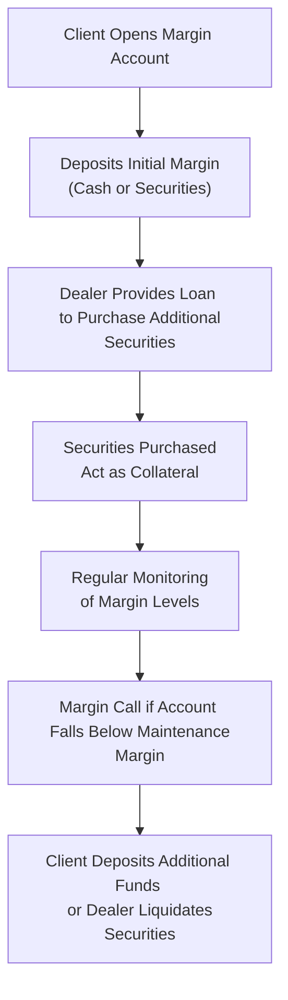

## 8.2 Margin Accounts

So, you've probably heard the term "margin account" thrown around quite a bit in the financial world. Maybe you've even considered opening one yourself or advising clients on their use. But what exactly are margin accounts, and why do they matter so much in the investment industry? Let's dive in and unpack everything you need to know—risks, regulations, best practices, and all.

### What Exactly Is a Margin Account?

Simply put, a margin account is a brokerage account where clients can borrow money from their investment dealer to purchase securities. The securities themselves act as collateral for the loan. Think of it like buying a house with a mortgage—the house secures the loan, and if you can't make payments, the bank can take the house. Similarly, if the securities' value drops significantly, the dealer can sell them to recover the loaned funds.

Here's a quick visual to illustrate how margin accounts work:

### Understanding Margin Requirements

When dealing with margin accounts, you'll encounter two key terms: **initial margin** and **maintenance margin**.

- **Initial Margin:** This is the minimum equity a client must deposit to open a margin position. CIRO (Canadian Investment Regulatory Organization) sets clear guidelines on initial margin requirements, typically expressed as a percentage of the purchase price.

- **Maintenance Margin:** This is the minimum equity level that must be maintained in the account at all times. If the account equity falls below this level, the dealer issues a margin call, requiring the client to deposit additional funds or securities immediately.

Let's say you want to buy $10,000 worth of shares on margin. If the initial margin requirement is 50%, you'd need to deposit at least $5,000 of your own money. The dealer loans you the remaining $5,000. Now, if the maintenance margin is 30%, your account equity must always remain above $3,000 (30% of $10,000). If the stock value drops and your equity falls below this threshold, you'll get a margin call. And trust me, nobody likes getting that call.

### Margin Calls: The Not-So-Fun Part

A margin call is essentially a demand from your dealer to deposit additional funds or securities into your account to meet the minimum maintenance margin requirement. If you can't meet the call promptly, the dealer has the right to liquidate your securities to cover the shortfall. Ouch.

Here's an example to illustrate:

**Example:**

- You purchase $20,000 of XYZ stock on margin with an initial margin requirement of 50%. You deposit $10,000, and your dealer loans you the other $10,000.
- The maintenance margin is set at 30%, meaning your equity must always remain above $6,000 (30% of $20,000).
- Unfortunately, XYZ stock drops significantly, and your holdings are now worth only $15,000. Your equity is now just $5,000 ($15,000 market value - $10,000 loan).
- Since your equity ($5,000) is below the required maintenance margin ($4,500, which is 30% of $15,000), you're still okay—for now. But if the stock drops further, say to $12,000, your equity becomes $2,000 ($12,000 - $10,000), which is below the required $3,600 (30% of $12,000). Now, you'll receive a margin call for $1,600 to restore your equity to the required level.

### CIRO Regulations and Dealer Responsibilities

CIRO, Canada's unified regulatory body overseeing investment dealers, has strict guidelines governing margin accounts. Dealers must:

- Clearly explain margin account risks to clients, including potential losses exceeding the initial investment, margin calls, and forced liquidation.
- Regularly monitor client margin accounts to ensure compliance with margin requirements.
- Promptly notify clients when their margin account falls below required levels, clearly indicating the amount required to restore compliance.
- Document all margin account agreements, clearly outlining terms, conditions, interest rates, and client obligations.
- Ensure margin lending practices comply with provincial securities regulations and CIRO guidelines to avoid excessive client leverage and systemic risk.

Dealers must maintain transparency and clarity in all communications. It's not just good practice—it's mandatory.

### Risks Associated with Margin Accounts

Margin accounts can amplify gains, sure. But they can also amplify losses. Here are some key risks to consider:

- **Magnified Losses:** If the securities purchased on margin decline in value, losses can exceed the initial investment.
- **Margin Calls:** Clients must be prepared to deposit additional funds quickly if a margin call occurs.
- **Forced Liquidation:** If clients can't meet margin calls, dealers may liquidate securities without prior notice, potentially at unfavorable prices.
- **Interest Costs:** Borrowing funds isn't free—interest charges can accumulate, especially if positions are held long-term.

### Best Practices for Managing Margin Accounts

To avoid pitfalls, here are some best practices dealers and clients should follow:

- **Clear Communication:** Dealers must clearly explain the risks and responsibilities associated with margin accounts upfront.
- **Regular Monitoring:** Both dealers and clients should regularly monitor margin positions to avoid unexpected margin calls.
- **Conservative Leverage:** Encourage clients to use conservative leverage levels, especially if they're new to margin trading.
- **Emergency Funds:** Clients should maintain sufficient liquidity to meet potential margin calls.
- **Documentation:** Ensure all margin agreements are thoroughly documented, clearly outlining terms, interest rates, and obligations.

### Real-Life Anecdote: A Lesson Learned the Hard Way

I once knew an investor—let's call him Dave—who got overly excited about margin trading. Dave saw his portfolio skyrocket initially, and he thought he'd cracked the code. But when the market turned, Dave wasn't prepared. He received a margin call he couldn't meet, and the dealer liquidated his holdings at a significant loss. Dave learned the hard way that margin trading isn't a game—it's serious business.

### Glossary of Key Terms

- **Margin Account:** A brokerage account where the client borrows money from the dealer to purchase securities.
- **Margin Call:** A demand from the dealer for the client to deposit additional funds or securities into the account to meet minimum margin requirements.
- **Initial Margin:** The minimum amount of equity a client must deposit when purchasing securities on margin.
- **Maintenance Margin:** The minimum equity level that must be maintained in a margin account to avoid a margin call.

### Further Reading and Resources

- [CIRO Margin Requirements and Guidelines](https://www.ciro.ca)
- Book: *"Margin Trading from A to Z: A Complete Guide to Borrowing, Investing, and Regulation"* by Michael T. Curley
- Online Article: [Understanding Margin Accounts by Investopedia](https://www.investopedia.com/terms/m/marginaccount.asp)

---

## Mastering Margin Accounts: Test Your Knowledge with This Quick Quiz!



### What is the primary purpose of a margin account?

- [x] To allow investors to borrow funds from dealers to purchase securities.
- [ ] To provide tax advantages for investors.
- [ ] To guarantee returns on investments.
- [ ] To allow investors to trade without any initial deposit.

> **Explanation:** Margin accounts enable investors to borrow money from dealers, using purchased securities as collateral.

### What happens if your margin account equity falls below the maintenance margin?

- [x] You receive a margin call requiring additional funds or securities.
- [ ] Your account is immediately closed.
- [ ] You receive a warning but no immediate action is required.
- [ ] You automatically receive additional funds from the dealer.

> **Explanation:** Falling below the maintenance margin triggers a margin call, requiring immediate action.

### Who sets the guidelines for margin requirements in Canada?

- [x] CIRO (Canadian Investment Regulatory Organization)
- [ ] Canadian Revenue Agency (CRA)
- [ ] Bank of Canada
- [ ] Provincial governments only

> **Explanation:** CIRO sets and enforces margin requirements for Canadian investment dealers.

### Which of the following is NOT a risk associated with margin accounts?

- [ ] Margin calls
- [ ] Forced liquidation of securities
- [ ] Interest charges
- [x] Guaranteed returns

> **Explanation:** Margin accounts do not guarantee returns; they can amplify losses and lead to margin calls.


