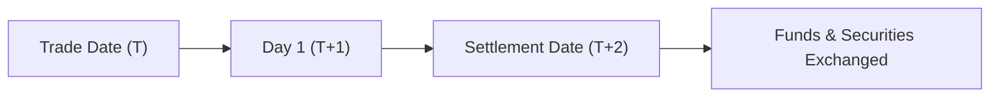

## 8.3 Cash Accounts

If you've ever opened a brokerage account, chances are you've encountered the term "cash account." But what exactly does it mean, and how does it differ from other types of accounts, like margin accounts? Well, let's dive into it together.

### What Exactly Is a Cash Account?

Simply put, a **cash account** is a brokerage account where you, the client, pay the full amount for securities at the time of purchase. No borrowing, no credit—just straightforward, pay-as-you-go investing. It's like shopping with cash instead of a credit card. You buy stocks, bonds, or other securities, and you pay the full bill upfront. Easy, right?

Now, you might think, "Why wouldn't everyone just use a cash account?" Well, there are some limitations. For instance, you can't engage in short selling in a cash account. Short selling involves selling securities you don't actually own, hoping to buy them back later at a lower price. Since short selling involves borrowing securities, it's a no-go in cash accounts.

### Settlement Cycle: The T+2 Rule

One critical aspect of cash accounts is understanding the settlement cycle. In Canada (and most global markets), securities transactions settle on a T+2 basis. This means that trades must be settled within two business days after the trade date. So, if you buy shares on Monday, you need to have the funds available in your account by Wednesday.

Here's a quick visual to help you grasp the concept:

Let's say you buy $5,000 worth of shares in Company XYZ on Monday. You have until Wednesday (T+2) to ensure your account has sufficient funds to cover this purchase. If the funds aren't there, well, that's when things can get messy.

### Dealer Responsibilities: Ensuring Smooth Transactions

Investment dealers have a big responsibility when it comes to managing cash accounts. CIRO (Canadian Investment Regulatory Organization) sets clear guidelines to ensure everything runs smoothly. Dealers must:

- Clearly communicate the rules and limitations of cash accounts to clients.
- Monitor accounts to ensure sufficient funds are available for settlement.
- Promptly address any payment deficiencies.
- Maintain accurate records of all transactions, including deposits, withdrawals, securities purchases, sales, dividends, and interest payments.

Think of dealers as the referees in a hockey game—they keep things fair, transparent, and orderly. Without them, things could quickly spiral out of control.

### Common Pitfalls and How to Avoid Them

Let's talk about some common issues that can pop up with cash accounts and how you can steer clear of trouble:

#### 1. Insufficient Funds at Settlement

Imagine you've bought shares, but when settlement day rolls around, your account doesn't have enough cash. Uh-oh. This situation is called a "payment deficiency," and your dealer will need to address it immediately. You might face penalties, restrictions on future trading, or even forced liquidation of your securities. Not fun.

**Best Practice:** Always double-check your account balance before placing trades. If you're transferring funds from another account, do it early to avoid last-minute hiccups.

#### 2. Unauthorized Overdrafts or Credit Extensions

Dealers aren't allowed to extend unauthorized credit or overdrafts in cash accounts. If your account goes into overdraft, your dealer must take immediate action to correct it. This could mean selling securities from your account to cover the shortfall.

**Best Practice:** Keep a buffer of cash in your account to handle unexpected expenses or delays in fund transfers.

#### 3. Attempting Short Selling in a Cash Account

Short selling is strictly prohibited in cash accounts because it involves borrowing securities. Attempting to short sell in a cash account can lead to regulatory penalties and account restrictions.

**Best Practice:** If you're interested in short selling, consider opening a margin account, which allows borrowing and short selling under specific conditions.

### Real-Life Example: Meet Sarah, the New Investor

Let me tell you about Sarah. She's new to investing and recently opened a cash account. Excited to get started, Sarah bought $2,000 worth of shares in a tech company on a Tuesday. Unfortunately, she forgot to transfer funds into her brokerage account until Thursday morning—one day after settlement.

Her dealer quickly contacted her, explaining the deficiency. Luckily, Sarah was able to transfer the funds immediately, avoiding penalties. But it was a stressful experience she won't soon forget.

Sarah learned a valuable lesson: always ensure funds are available before settlement day. Now, she keeps a small cash buffer in her account to avoid future issues. Smart move, Sarah!

### CIRO Regulations: Keeping Things Transparent and Fair

CIRO, Canada's national self-regulatory organization, oversees investment dealers and ensures market integrity. They set clear rules for managing cash accounts, including:

- Ensuring timely settlement (T+2).
- Prohibiting unauthorized credit extensions and overdrafts.
- Requiring accurate and detailed record-keeping.

Dealers must comply with these regulations to maintain their CIRO membership. Non-compliance can lead to fines, penalties, or even suspension. CIRO's guidelines help protect investors like you, ensuring the market remains fair, transparent, and trustworthy.

### Record-Keeping: Why It Matters

Accurate record-keeping isn't just good practice—it's a regulatory requirement. Dealers must maintain detailed records of all cash account transactions, including:

- Deposits and withdrawals
- Securities purchases and sales
- Dividends and interest payments

Proper records help resolve disputes, track account activity, and ensure compliance with CIRO regulations. Think of it as keeping receipts for your purchases—it's always good to have proof, just in case.

### Quick Reference Glossary

Let's quickly recap some key terms:

- **Cash Account:** A brokerage account where the client pays the full amount for securities at the time of purchase.
- **Settlement Cycle (T+2):** The period within which securities transactions must be settled, typically two business days after the trade date.
- **Short Selling:** Selling securities that the seller does not own, typically prohibited in cash accounts.

### Further Reading and Resources

Want to dive deeper? Check out these resources:

- [CIRO Cash Account Regulations](https://www.ciro.ca)
- Book: *Securities Operations: A Guide to Trade and Position Management* by Michael Simmons
- Online Article: ["Cash Account vs. Margin Account"](https://www.investopedia.com/articles/investing/110614/cash-account-vs-margin-account.asp) by Investopedia

---

## Test Your Knowledge: Cash Accounts, Settlement Cycles, and CIRO Regulations Quiz



### What is the primary characteristic of a cash account?

- [x] Clients must pay the full amount for securities purchased.
- [ ] Clients can borrow funds to purchase securities.
- [ ] Clients can engage in short selling freely.
- [ ] Clients have unlimited overdraft privileges.

> **Explanation:** In a cash account, clients must pay the full amount upfront and cannot borrow funds or engage in short selling.

### How long is the standard settlement cycle for securities transactions in Canada?

- [x] Two business days (T+2)
- [ ] One business day (T+1)
- [ ] Three business days (T+3)
- [ ] Same day (T+0)

> **Explanation:** Securities transactions typically settle within two business days after the trade date, known as T+2.

### Which activity is strictly prohibited in a cash account?

- [x] Short selling
- [ ] Buying mutual funds
- [ ] Investing in bonds
- [ ] Receiving dividends

> **Explanation:** Short selling involves borrowing securities, which is prohibited in cash accounts.

### What happens if a client fails to provide sufficient funds by the settlement date?

- [x] The dealer must promptly address the payment deficiency.
- [ ] The dealer can ignore the deficiency.
- [ ] The client receives a bonus.
- [ ] The settlement cycle is extended indefinitely.

> **Explanation:** Dealers must promptly address payment deficiencies to comply with CIRO regulations.

### Dealers must maintain accurate records of which transactions?

- [x] Deposits and withdrawals
- [x] Securities purchases and sales
- [x] Dividends and interest payments
- [ ] Client's personal hobbies

> **Explanation:** Dealers must maintain accurate records of deposits, withdrawals, securities transactions, dividends, and interest payments.

### CIRO regulations prohibit dealers from:

- [x] Extending unauthorized credit or overdrafts in cash accounts.
- [ ] Maintaining accurate records.
- [ ] Communicating settlement rules to clients.
- [ ] Monitoring client accounts.

> **Explanation:** Unauthorized credit extensions and overdrafts are strictly prohibited by CIRO.

### Short selling in a cash account is:

- [x] Prohibited because it involves borrowing securities.
- [ ] Allowed with dealer approval.
- [ ] Encouraged for experienced investors.
- [ ] Allowed if the client has sufficient cash.

> **Explanation:** Short selling involves borrowing securities, which is prohibited in cash accounts.

### What is the purpose of accurate record-keeping for cash accounts?

- [x] To resolve disputes and ensure regulatory compliance.
- [ ] To increase client confusion.
- [ ] To delay settlement cycles.
- [ ] To encourage unauthorized trading.

> **Explanation:** Accurate records help resolve disputes, track account activity, and comply with CIRO regulations.

### If you purchase securities on Monday, when must the transaction settle?

- [x] Wednesday (T+2)
- [ ] Monday (same day)
- [ ] Tuesday (T+1)
- [ ] Friday (T+3)

> **Explanation:** Purchases made on Monday must settle by Wednesday (T+2).

### Which of the following is allowed in a cash account?

- [x] Buying securities with available cash.
- [ ] Short selling securities.
- [ ] Borrowing funds to purchase securities.
- [ ] Overdrafting the account.

> **Explanation:** Only buying securities with available cash is permitted in cash accounts.

### What should clients do to avoid payment deficiencies?

- [x] Ensure sufficient funds are available before placing trades.
- [ ] Ignore account balances.
- [ ] Rely on dealers to cover deficiencies.
- [ ] Short sell securities.

> **Explanation:** Clients should always verify sufficient funds before trading to avoid deficiencies.


