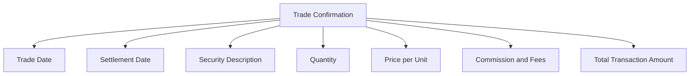
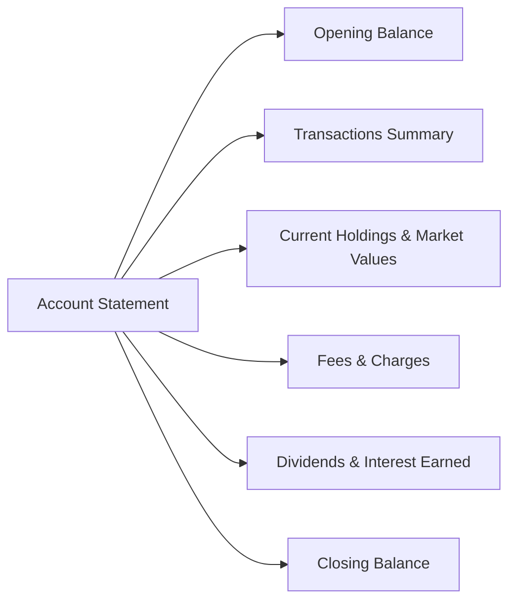

## 8.4 Communicating Trading Information to Customers

So, you've executed a trade for your client. Great! But hold on—your job isn't quite done yet. Now comes the critical part: clearly and promptly communicating the details of that trade to your client. Sounds simple, right? Well, you'd be surprised how often this step gets overlooked or mishandled, leading to confusion, frustration, and even regulatory headaches. Let's dive into exactly how you should communicate trading information to your clients, following CIRO's guidelines and industry best practices.

### Why Clear Communication Matters

First off, let's talk about why this is so important. Imagine you're the client. You've just trusted your advisor to invest your hard-earned money. Wouldn't you want to know exactly what's happening with your investments? Of course you would! Clear communication builds trust, reduces misunderstandings, and ensures transparency. Plus, it's not just good practice—it's a regulatory requirement enforced by the Canadian Investment Regulatory Organization (CIRO).

### Types of Trading Communications

There are two main types of communications you'll regularly provide to your clients:

- **Trade Confirmations**
- **Account Statements**

Let's break down each of these in detail.

### Trade Confirmations: The Essentials

A trade confirmation is a written notification provided to clients detailing the specifics of a securities transaction. CIRO mandates that trade confirmations must be sent promptly after each transaction—typically no later than the next business day following the trade date.

Here's what every trade confirmation must include:

- **Trade Date**: The date the transaction was executed.
- **Settlement Date**: When the securities and payment actually change hands (usually two business days after the trade date, known as T+2).
- **Security Description**: Clearly identify the security traded (e.g., "Royal Bank of Canada Common Shares").
- **Quantity**: Number of shares or units traded.
- **Price**: The price per share or unit at which the trade was executed.
- **Commission and Fees**: Clearly outline any commissions, fees, or charges associated with the transaction.
- **Total Transaction Amount**: The total cost or proceeds from the trade, including all fees and commissions.

Here's a quick visual summary:

Let's look at a practical example to make this crystal clear:

**Example:**

Suppose your client, Ms. Patel, purchases 100 shares of XYZ Corp. at $25 per share on February 10, 2025. Your commission is $50. Here's how her trade confirmation might look:

| Trade Confirmation Details | Information |
|----------------------------|-------------|
| Trade Date                 | Feb 10, 2025|
| Settlement Date            | Feb 12, 2025|
| Security Description       | XYZ Corp. Common Shares|
| Quantity                   | 100 shares  |
| Price per Share            | $25.00      |
| Commission                 | $50.00      |
| Total Transaction Amount   | $2,550.00   |

Ms. Patel receives this confirmation promptly, ensuring she understands exactly what she's bought, how much she's paid, and what fees she's incurred.

### Account Statements: Keeping Clients Informed

In addition to trade confirmations, clients must receive periodic account statements. These statements summarize all transactions, holdings, and account balances over a specific period—usually monthly or quarterly, depending on account activity.

Account statements typically include:

- Opening and closing balances
- Details of all transactions during the period
- Current holdings and their market values
- Fees, charges, and commissions clearly itemized
- Any dividends or interest earned

Here's a simple diagram illustrating the components of an account statement:

### Transparency and Disclosure: Avoiding Surprises

Transparency isn't just a buzzword—it's a regulatory requirement. CIRO expects investment dealers to clearly disclose all fees, commissions, charges, and potential conflicts of interest associated with transactions. This means no hidden fees or surprise charges. Ever.

For instance, if your firm receives additional compensation or incentives for recommending certain products, you must disclose this clearly to your clients. Transparency builds trust and helps clients make informed decisions.

### Delivery Methods: How to Communicate Effectively

So, how exactly should you deliver these communications? CIRO allows various methods, including:

- **Mail**: Traditional, reliable, but slower.
- **Electronic Delivery**: Fast, efficient, and increasingly popular. But remember, clients must explicitly consent to electronic delivery and be able to access and retain electronic documents.

Regardless of the method, communications must be secure, confidential, and accessible. Make sure your clients understand how they'll receive their information and confirm they're comfortable with the chosen method.

### Record-Keeping: Staying Compliant and Organized

CIRO regulations require investment dealers to maintain accurate records of all client communications, including electronic communications. This isn't just bureaucratic red tape—it's essential for regulatory compliance, dispute resolution, and internal audits.

You should keep records of:

- Trade confirmations
- Account statements
- Emails and electronic messages
- Notes from client meetings and phone calls

Proper record-keeping can save you from headaches down the road. Trust me—I've seen cases where thorough documentation has literally saved careers.

### Common Pitfalls and How to Avoid Them

Let's quickly touch on some common mistakes investment dealers make and how to avoid them:

- **Delayed Communications**: Always send trade confirmations promptly—ideally the same day or next business day.
- **Incomplete Information**: Double-check confirmations and statements for accuracy and completeness.
- **Lack of Transparency**: Clearly disclose all fees, commissions, and conflicts of interest upfront.
- **Poor Record-Keeping**: Implement robust systems to store and retrieve client communications easily.

### Real-Life Scenario: A Lesson Learned

I once knew a dealer who delayed sending out trade confirmations because he was "too busy." Well, guess what? A client disputed a trade weeks later, claiming they never authorized it. Without timely confirmations and proper records, the dealer had a tough time proving otherwise. Long story short: CIRO got involved, and it wasn't pretty. Moral of the story? Always communicate promptly and keep meticulous records.

### Resources for Further Learning

Want to dive deeper into effective client communication? Check out these resources:

- [CIRO Client Communication Guidelines](https://www.ciro.ca)
- Book: *Effective Client Communication in Financial Services* by Robert L. Finder
- Online Course: [Client Communication Skills for Financial Professionals](https://www.udemy.com/course/client-communication-skills-for-financial-professionals/) by Udemy

---

## Test Your Knowledge: Communicating Trading Information to Customers Quiz



### What must be included in every trade confirmation?

- [x] Trade date, settlement date, security description, quantity, price, commission, and total transaction amount.
- [ ] Only the trade date and security description.
- [ ] Client's personal financial details.
- [ ] Market forecasts and recommendations.

> **Explanation:** CIRO requires detailed information including trade date, settlement date, security description, quantity, price, commission, and total transaction amount.

### How soon must a trade confirmation typically be sent to the client?

- [x] No later than the next business day following the trade date.
- [ ] Within one week of the trade.
- [ ] Monthly, along with the account statement.
- [ ] Only upon client's request.

> **Explanation:** CIRO mandates prompt delivery, typically no later than the next business day.

### Which of the following is NOT typically included in an account statement?

- [ ] Opening and closing balances.
- [ ] Transaction details.
- [ ] Current holdings and market values.
- [x] Advisor's personal investment portfolio.

> **Explanation:** Advisor's personal investments are irrelevant and not disclosed in client statements.

### Electronic delivery of trading information is acceptable under what condition?

- [x] Clients explicitly consent and can access electronic documents.
- [ ] Electronic delivery is mandatory for all clients.
- [ ] Only if the client has an email address.
- [ ] Electronic delivery is never permitted.

> **Explanation:** Clients must explicitly consent and have the capability to access electronic documents.

### Why is transparency in disclosing fees and commissions important?

- [x] It builds trust and helps clients make informed decisions.
- [ ] It reduces the firm's profitability.
- [ ] It's optional and not regulated.
- [ ] It complicates client relationships.

> **Explanation:** Transparency is essential for trust-building and informed decision-making, and it's a regulatory requirement.


