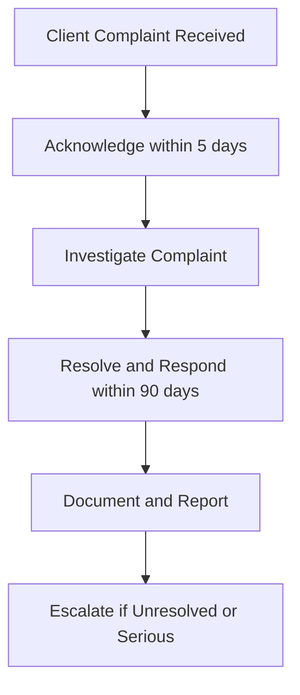

## 8.5 Client Complaints and Account Transfer Requests

So, you've been working hard to build strong relationships with your clients, right? You've done your due diligence, recommended suitable investments, and communicated clearly. But here's the thing: no matter how good you are, complaints will inevitably pop up. And sometimes, clients decide to move their accounts elsewhere. How you handle these situations can make or break your reputation. Let's dive into how to manage client complaints and account transfer requests effectively, following CIRO's guidelines and industry best practices.

### Understanding Client Complaints

First things first, let's define what we're talking about here:

- **Client Complaint:** An expression of dissatisfaction by a client regarding products, services, or conduct of the investment dealer.

Complaints can range from minor misunderstandings to serious allegations of misconduct. Regardless of severity, every complaint deserves your attention. Why? Because handling complaints effectively can actually strengthen your client relationships. Sounds counterintuitive, I know—but it's true.

### CIRO Regulations on Complaint Handling

CIRO (Canadian Investment Regulatory Organization) has clear, strict guidelines on how investment dealers must handle client complaints. Here's a quick rundown of the key requirements:

- **Acknowledgment:** You must acknowledge receipt of a complaint promptly, typically within five business days.
- **Investigation:** Conduct a thorough investigation into the complaint, gathering all relevant facts and documentation.
- **Resolution Timeline:** Provide a substantive response to the client within 90 calendar days of receiving the complaint.
- **Escalation:** Serious complaints or unresolved issues must be escalated to senior management or compliance departments.
- **Documentation and Reporting:** Maintain detailed records of all complaints, including the nature of the complaint, investigation steps, communications, and resolution outcomes.

Let's visualize this process clearly:

### Practical Steps for Handling Client Complaints

Now, let's get practical. Here's a step-by-step approach to effectively managing client complaints:

#### Step 1: Listen and Acknowledge

When a client complains, your first instinct might be to get defensive. Resist that urge! Instead, actively listen and acknowledge their concerns. A simple, empathetic statement like, "I understand why you're frustrated, and I want to help resolve this," can go a long way.

#### Step 2: Document Everything

Keep detailed records of all interactions related to the complaint. Document emails, phone calls, meetings—everything. Trust me, good documentation can save you from headaches down the road.

#### Step 3: Investigate Thoroughly

Dig deep to understand exactly what happened. Talk to relevant colleagues, review account records, and analyze transactions. Be objective and thorough—your credibility depends on it.

#### Step 4: Communicate Clearly and Transparently

Keep your client informed throughout the investigation. Even if you don't have all the answers right away, regular updates show you're taking their concerns seriously.

#### Step 5: Resolve Promptly and Fairly

Once you've completed your investigation, propose a fair resolution. Whether it's correcting an error, offering compensation, or simply clarifying a misunderstanding, aim for a solution that rebuilds trust.

#### Step 6: Learn and Improve

Finally, analyze complaints to identify patterns or systemic issues. Use these insights to improve your processes and prevent similar complaints in the future.

### Real-Life Example: The Power of Effective Complaint Handling

Let me share a quick story. A colleague of mine once had a client who was furious about an unexpected fee. Instead of brushing it off, he took the time to listen, investigate, and explain the situation clearly. Turns out, the fee was legitimate—but poorly communicated. He apologized sincerely, waived the fee as a gesture of goodwill, and improved the firm's fee disclosure process. The client not only stayed but became one of his strongest advocates. Moral of the story? Effective complaint handling can turn angry clients into loyal supporters.

### Account Transfer Requests: Facilitating Smooth Transitions

Now, let's talk about another tricky situation: account transfer requests.

- **Account Transfer Request:** A client's request to transfer their account holdings from one dealer to another.

Clients transfer accounts for various reasons—better service, lower fees, personal relationships—you name it. Whatever the reason, your role is to facilitate the transfer smoothly and professionally.

### CIRO Guidelines for Account Transfers

CIRO mandates that investment dealers handle account transfer requests promptly and efficiently. Here's what you need to know:

- **Prompt Action:** Dealers must initiate the transfer process promptly upon receiving a valid request.
- **Clear Communication:** Inform clients clearly about the transfer process, timelines, and any fees involved.
- **Documentation:** Maintain accurate records of all transfer requests, including dates, instructions, and confirmations.
- **Cooperation:** Dealers must cooperate fully with receiving institutions to avoid unnecessary delays.

Here's a visual breakdown of the account transfer process:

### Best Practices for Handling Account Transfers

Let's look at some practical tips to make account transfers seamless:

- **Be Professional and Courteous:** Even if you're disappointed to lose a client, remain professional. Your reputation matters.
- **Explain Clearly:** Walk your client through the transfer process, timelines, and any potential fees. Transparency reduces misunderstandings.
- **Coordinate with Receiving Dealer:** Work closely with the receiving institution to ensure a smooth transition. Quick cooperation benefits everyone involved.
- **Follow Up:** After the transfer, confirm with your client that everything went smoothly. This final touch leaves a positive impression.

### Common Pitfalls and How to Avoid Them

Here are some common pitfalls in handling complaints and transfers—and how to steer clear of them:

- **Ignoring or Delaying Complaints:** Never ignore or delay addressing complaints. It only escalates frustration and risks regulatory action.
- **Poor Documentation:** Always document thoroughly. Poor records can lead to regulatory issues and client dissatisfaction.
- **Lack of Transparency:** Be upfront about processes, timelines, and fees. Hidden surprises erode trust.
- **Taking Transfers Personally:** Don't take account transfers personally. Stay professional and supportive—clients appreciate it, and your reputation stays intact.

### Continuous Improvement: Learning from Complaints and Transfers

Complaints and transfers aren't just hassles—they're valuable learning opportunities. Regularly review complaint and transfer records to identify trends, improve processes, and enhance client service. CIRO expects dealers to use these insights proactively, and honestly, it's just good business sense.

### Resources for Further Exploration

Want to dive deeper? Here are some fantastic resources:

- [CIRO Complaint Handling and Account Transfer Guidelines](https://www.ciro.ca)
- Book: "Managing Client Complaints in Financial Services" by David Tattam
- Online Article: ["How to Handle Customer Complaints Effectively"](https://hbr.org/2020/03/how-to-handle-customer-complaints-effectively) by Harvard Business Review

---

## Test Your Knowledge: Client Complaints and Account Transfer Requests Quiz



### According to CIRO, within how many days must you acknowledge receipt of a client complaint?

- [x] Within 5 business days
- [ ] Within 10 business days
- [ ] Within 30 calendar days
- [ ] Within 90 calendar days

> **Explanation:** CIRO guidelines require acknowledging client complaints promptly, typically within five business days.

### What is the maximum timeframe allowed by CIRO to provide a substantive response to a client complaint?

- [ ] 30 calendar days
- [ ] 60 calendar days
- [x] 90 calendar days
- [ ] 120 calendar days

> **Explanation:** CIRO mandates providing a substantive response within 90 calendar days.

### What should you do first when receiving a client complaint?

- [ ] Immediately defend your actions
- [x] Listen and acknowledge the client's concerns
- [ ] Escalate directly to senior management
- [ ] Ignore minor complaints

> **Explanation:** Actively listening and acknowledging the client's concerns is the critical first step.

### Which of the following is essential to maintain when handling complaints and transfers?

- [x] Detailed documentation
- [ ] Informal verbal agreements
- [ ] Minimal communication
- [ ] Personal opinions

> **Explanation:** Maintaining detailed documentation is essential for compliance and effective resolution.

### What is an account transfer request?

- [x] A client's request to move their account holdings from one dealer to another
- [ ] A request to close an account permanently
- [ ] A complaint about account management
- [ ] A request for additional account services

> **Explanation:** An account transfer request involves moving holdings from one dealer to another.


