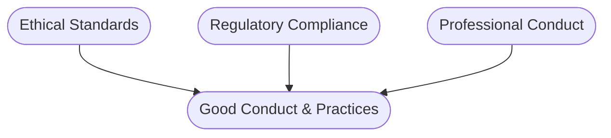
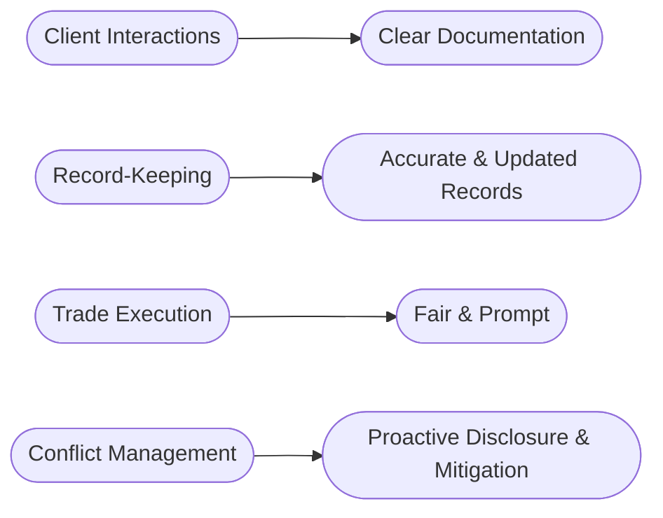

## 9.1 Review of Good Conduct and Practices

So, here we are—Chapter 9. You've made it this far, and that's fantastic! By now, you've probably realized that working in the securities industry isn't just about knowing financial products and markets. Nope, it's way more than that. It's about integrating ethical standards, regulatory compliance, and professional conduct into your daily routine. Let's dive into a comprehensive review of what good conduct and practices really mean, why they're crucial, and how you can make sure you're always on the right track.

### Integrating Ethical Standards, Regulatory Compliance, and Professional Conduct

First things first—ethics, compliance, and professionalism aren't separate boxes you tick off and forget about. They're intertwined, influencing every decision you make. Think of them as a three-legged stool; remove one leg, and the whole thing collapses.

- **Ethical Standards:** These are your moral compass, guiding you to do what's right even when no one's watching. Integrity, fairness, transparency—these aren't just buzzwords; they're foundational to your professional reputation.
- **Regulatory Compliance:** This involves adhering strictly to the rules set by regulatory bodies like the Canadian Investment Regulatory Organization (CIRO). Staying compliant isn't optional—it's mandatory, and it protects you, your firm, and your clients.
- **Professional Conduct:** This is about demonstrating competence, diligence, and accountability in your everyday interactions. It's the glue that holds your client relationships together.

Here's a quick visual to help you remember:

### Key Principles of Conduct

Let's quickly recap the core principles we've discussed throughout this handbook:

- **Integrity:** Always act honestly and consistently, even when it's tough. Clients trust you with their financial futures; integrity ensures that trust isn't misplaced.
- **Fairness:** Treat all clients equitably, without bias or favoritism. Fairness builds long-term relationships and a solid reputation.
- **Transparency:** Clearly communicate all relevant information. Transparency reduces misunderstandings and builds trust.
- **Diligence:** Consistently put in the effort to fulfill your professional responsibilities. Diligence ensures accuracy and reliability.
- **Professionalism:** Maintain competence, accountability, and respect. Professionalism is your calling card in the industry.

### Ongoing Education and Staying Current

The securities industry is constantly evolving. Regulations change, new products emerge, and market dynamics shift. So, staying current isn't just smart—it's essential. Regularly engage in continuing education, attend webinars, and consult resources provided by organizations like CSI and CIRO. Trust me, staying informed is your best defense against mistakes and regulatory mishaps.

### Clear, Accurate, and Timely Client Communication

Ever had a misunderstanding spiral out of control because of poor communication? Yeah, me too. In our industry, clear, accurate, and timely communication isn't just good practice—it's essential. Clients rely on your expertise, and clear communication helps them make informed decisions. Whether it's explaining investment risks, fees, or performance, transparency is your best friend.

### Mitigating Risks Through Good Conduct

Let's face it—mistakes happen. But adhering to good conduct and practices significantly reduces risks like regulatory penalties, reputational damage, and financial losses. Imagine a scenario where a misunderstanding leads to a client complaint. Proper documentation, clear communication, and adherence to compliance procedures can quickly resolve the issue, protecting your reputation and your firm's integrity.

### Practical Examples of Best Practices

Let's get practical. Here are some real-world examples of best practices you should adopt:

- **Client Interactions:** Always document client meetings and conversations. Confirm instructions in writing and ensure clients fully understand risks and benefits.
- **Record-Keeping:** Maintain comprehensive, accurate, and up-to-date client records. This practice supports regulatory compliance and helps you provide personalized advice.
- **Trade Execution:** Execute client orders promptly, accurately, and fairly. Avoid front-running or preferential treatment.
- **Conflict Management:** Proactively identify potential conflicts of interest. Disclose them clearly to clients and implement strategies to avoid or mitigate these conflicts.

Here's a quick visual summary:

### The Role of Internal Compliance Departments

Compliance officers aren't your adversaries—they're your allies! Regularly consulting your compliance department ensures you're aligned with regulatory standards. They help you navigate complex scenarios, interpret regulations, and avoid pitfalls. Don't hesitate to reach out; they're there to support you.

### Maintaining Comprehensive Client Records

Ever had that sinking feeling when you couldn't find an important document? Yeah, it's awful. Comprehensive client records aren't just regulatory requirements—they're essential tools for effective client service. Accurate records help you track client objectives, risk tolerance, and investment history, enabling you to provide tailored advice and quickly address concerns.

### Proactive Conflict-of-Interest Management

Conflicts of interest are inevitable in our industry. The key is how you handle them. Always disclose potential conflicts clearly and promptly. Implement measures to avoid conflicts whenever possible, and if unavoidable, mitigate them effectively. Remember, transparency is your ally.

Here's a simple conflict management strategy:

### Summarizing Key Regulatory Requirements and Ethical Considerations

Let's quickly recap some key points from earlier chapters:

- **Registration and Licensing:** Ensure you're properly registered and licensed for your activities (Chapter 4).
- **Suitability and Due Diligence:** Always recommend investments aligned with client objectives and risk tolerance (Chapter 6).
- **Trading and Settlement:** Execute trades ethically and settle promptly to maintain market integrity (Chapter 7).
- **Privacy and Cybersecurity:** Protect client data diligently to maintain trust and comply with privacy laws (Chapter 4).

### Final Thoughts

At the end of the day, good conduct and practices aren't just about avoiding trouble—they're about building a successful, sustainable career. By consistently integrating ethical standards, regulatory compliance, and professional conduct into your daily practices, you'll foster trust, build strong client relationships, and enhance your professional reputation.

Keep learning, stay informed, and always strive to do what's right. You've got this!

---

## Additional Resources for Further Exploration

- [Canadian Investment Regulatory Organization (CIRO)](https://www.ciro.ca)
- [Canadian Securities Administrators (CSA)](https://www.securities-administrators.ca)
- "Ethics and the Conduct of Business" by John R. Boatright, Pearson Education Canada.
- "The Compliance Handbook: A Guide to Operationalizing Your Compliance Program" by Thomas Fox.
- [CSI Continuing Education](https://www.csi.ca/student/en_ca/continuing-education.xhtml)

---

## Test Your Knowledge: Good Conduct and Practices in the Securities Industry



### Which principle emphasizes honesty and consistency in actions and decisions?

- [x] Integrity
- [ ] Transparency
- [ ] Diligence
- [ ] Professionalism

> **Explanation:** Integrity involves adhering to moral and ethical principles, ensuring honesty and consistency in your professional actions.

### Why is ongoing education crucial for securities professionals?

- [x] To stay current with regulatory changes and market developments.
- [ ] To increase sales commissions.
- [ ] To avoid client interactions.
- [ ] To reduce workload.

> **Explanation:** Ongoing education helps professionals remain informed about regulatory updates, market trends, and best practices, reducing risks of errors and non-compliance.

### Which practice best demonstrates transparency?

- [x] Clearly explaining investment risks and fees to clients.
- [ ] Providing selective information to clients.
- [ ] Avoiding difficult conversations.
- [ ] Minimizing client communication.

> **Explanation:** Transparency involves clear, open communication, ensuring clients fully understand relevant information.

### What's the primary role of internal compliance departments?

- [x] To ensure adherence to regulatory standards and firm policies.
- [ ] To maximize firm profits.
- [ ] To handle client investments directly.
- [ ] To market financial products.

> **Explanation:** Compliance departments help ensure that professionals follow regulatory standards, protecting the firm and its clients.

### Which of the following exemplifies diligent record-keeping?

- [x] Maintaining accurate, comprehensive, and updated client records.
- [ ] Keeping minimal client information.
- [ ] Updating records only annually.
- [ ] Discarding old client records regularly.

> **Explanation:** Diligent record-keeping involves maintaining comprehensive, accurate, and current client information.

### How should conflicts of interest be managed?

- [x] Through proactive disclosure and effective mitigation.
- [ ] By ignoring them.
- [ ] By hiding them from clients.
- [ ] By transferring clients to another firm.

> **Explanation:** Conflicts must be openly disclosed and managed effectively to maintain trust and regulatory compliance.

### Which principle emphasizes treating clients equitably without bias?

- [x] Fairness
- [ ] Profitability
- [ ] Exclusivity
- [ ] Confidentiality

> **Explanation:** Fairness ensures equitable treatment of all clients, fostering trust and long-term relationships.

### What risk is reduced by adhering to good conduct and practices?

- [x] Regulatory penalties
- [x] Reputational damage
- [x] Financial losses
- [ ] Increased client satisfaction

> **Explanation:** Good conduct significantly reduces risks such as regulatory penalties, reputational harm, and financial losses.

### Which practice exemplifies professionalism in trade execution?

- [x] Prompt and fair execution of client orders.
- [ ] Prioritizing trades for high-value clients.
- [ ] Delaying trade execution.
- [ ] Executing trades without client consent.

> **Explanation:** Professionalism in trade execution involves prompt, accurate, and fair handling of client orders.

### Integrity in the securities industry primarily involves:

- [x] Honesty and consistency in actions and decisions.
- [ ] Maximizing personal profit.
- [ ] Avoiding client interactions.
- [ ] Minimizing transparency.

> **Explanation:** Integrity is about consistently adhering to ethical principles, ensuring honesty and reliability in your professional conduct.


