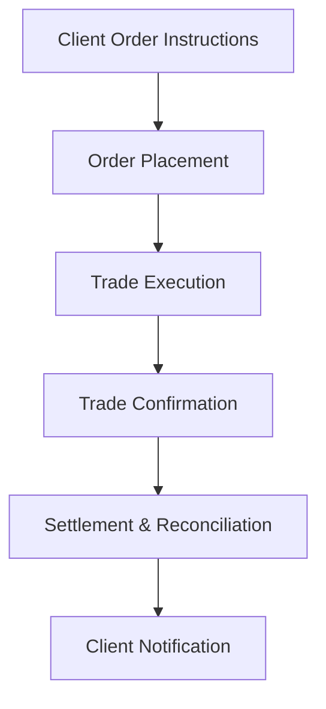

## 9.2 Case Study: The Chengs' Accounts

So, you've made it to the final stretch of your Conduct and Practices Handbook Course—congratulations! Now, let's put everything you've learned into action with a practical, real-world scenario. Meet the Cheng family. They're fictional, sure, but their situation is very much rooted in the realities you'll encounter as a financial professional. Let's dive in.

### Introducing the Cheng Family

Imagine it's Monday morning, and you're meeting your new clients, David and Emily Cheng. David is 45 years old, working as a senior project manager at a tech firm, earning around $120,000 annually. Emily, 43, is a freelance graphic designer, earning approximately $60,000 per year. They have two kids, aged 12 and 15, and live in a suburban home in Vancouver, BC.

Here's a snapshot of their financial situation:

- **Annual Household Income:** $180,000
- **Total Net Worth:** $1,200,000 (including home equity of $600,000)
- **Investable Assets:** $300,000 in cash and mutual funds
- **Liabilities:** Mortgage balance of $250,000, no other significant debts
- **Investment Objectives:** Retirement planning, education funding for kids, moderate growth
- **Risk Tolerance:** Moderate (they're okay with some market fluctuations, but nothing too wild)
- **Time Horizon:** 20 years until retirement, 3-6 years until kids' university education

### The Importance of Thorough Client Discovery and NAAF

Remember how we talked about the New Account Application Form (NAAF)? Well, it's not just paperwork—it's your roadmap. Completing the NAAF accurately is crucial because it sets the foundation for your entire client relationship. For the Chengs, you'll need to gather detailed information about their financial situation, objectives, risk tolerance, and personal circumstances. This helps you fulfill regulatory requirements and, more importantly, ensures your recommendations truly align with their goals.

### Conducting Effective KYC Assessments and Suitability Analysis

The Know-Your-Client (KYC) process isn't just a regulatory checkbox—it's your chance to truly understand your clients. For the Chengs, you'd ask questions like:

- "What does retirement look like for you?"
- "How comfortable are you with market volatility?"
- "Do you anticipate any significant financial changes in the near future?"

Based on their answers, you can perform a suitability analysis, matching investment products and strategies to their specific goals, risk tolerance, and timelines. For instance, given their moderate risk tolerance and long-term retirement horizon, a balanced portfolio of equities and fixed-income investments might be suitable.

### Conducting Comprehensive Product Due Diligence

Now, let's say you're considering recommending a balanced mutual fund and a Registered Education Savings Plan (RESP) for their children's education. Before making these recommendations, you'd conduct thorough product due diligence, evaluating:

- Historical performance and volatility
- Management fees and expense ratios
- Liquidity and redemption terms
- Alignment with the Chengs' objectives and risk profile

For example, you'd avoid recommending high-risk, speculative investments like cryptocurrencies or leveraged ETFs, as these wouldn't align with their moderate risk tolerance and clearly defined goals.

### Clear, Transparent, and Timely Communication

Transparency is key. When presenting your recommendations, clearly explain why you've selected each investment, the associated risks, potential returns, and how they align with the Chengs' objectives. For example:

> "I've recommended this balanced mutual fund because it offers a diversified mix of equities and bonds, aligning with your moderate risk tolerance. Historically, it's had moderate volatility but consistent returns, suitable for your retirement goals."

### Maintaining Accurate Client Records

Trust me, accurate record-keeping can save you from headaches down the road. Document every interaction, recommendation, and transaction clearly. For the Chengs, you'd maintain records of:

- Completed NAAF and KYC forms
- Investment recommendations and rationale
- Trade confirmations and account statements
- Notes from client meetings and communications

### Navigating Potential Conflicts of Interest

Conflicts of interest can pop up unexpectedly. Let's say your firm offers incentives for recommending certain mutual funds. If one of these funds aligns perfectly with the Chengs' needs, great—but you must disclose this incentive transparently. Explain clearly:

> "Just so you're aware, our firm receives additional compensation for recommending this particular fund. However, I've selected it solely based on its suitability for your investment objectives."

If the conflict is significant, consider alternative products or strategies to avoid compromising your fiduciary duty.

### Proper Trade Execution Practices

When executing trades for the Chengs, follow proper procedures meticulously:

- Clearly document order instructions.
- Provide timely trade confirmations.
- Ensure accurate settlement and reconciliation.
- Promptly correct any trade errors, communicating transparently with your clients.

Here's a quick visual summary of the trade execution process:

### Ongoing Account Monitoring and Periodic Reviews

Life changes, and so do financial goals. Regularly review the Chengs' accounts—at least annually or when significant life events occur (like a job change or inheritance). Adjust investment strategies proactively to reflect evolving circumstances, ensuring continued suitability.

### Handling Client Complaints and Account Transfers

Let's say, hypothetically, the Chengs express dissatisfaction with portfolio performance. Don't panic! Handle complaints professionally:

- Acknowledge their concerns promptly.
- Investigate thoroughly and transparently.
- Communicate findings clearly, offering solutions or adjustments as needed.

If they request an account transfer, facilitate it smoothly and professionally, maintaining goodwill and compliance.

### Key Lessons Learned from the Chengs' Case Study

So, what have we learned from the Chengs?

- Thorough client discovery and accurate NAAF completion are foundational.
- Effective KYC assessments and suitability analyses ensure appropriate recommendations.
- Comprehensive product due diligence protects clients and your professional integrity.
- Transparent communication builds trust and long-term relationships.
- Accurate record-keeping safeguards compliance and accountability.
- Proactive conflict disclosure maintains ethical standards.
- Proper trade execution practices ensure operational excellence.
- Ongoing account monitoring and reviews keep strategies aligned with client goals.
- Professional handling of complaints and transfers preserves client relationships and reputation.

### Wrapping It All Up

The Cheng family's scenario brings together everything we've discussed throughout this course—ethics, compliance, client management, and professionalism. Remember, your role isn't just about managing money; it's about building trust, understanding your clients deeply, and guiding them confidently toward their financial dreams.

Now, go out there and put these best practices into action. Your clients—and your career—will thank you for it!

---

## Test Your Knowledge: Investment Suitability and Client Management Quiz



### What is the primary purpose of the Know-Your-Client (KYC) process?

- [x] To gather detailed information about a client's financial situation, objectives, and risk tolerance.
- [ ] To promote speculative investments.
- [ ] To minimize regulatory paperwork.
- [ ] To guarantee investment returns.

> **Explanation:** KYC ensures you understand your client's financial situation, objectives, and risk tolerance, enabling suitable investment recommendations.

### Why is product due diligence critical when recommending investments?

- [x] It ensures investment products align with client goals, risk tolerance, and timelines.
- [ ] It guarantees high returns.
- [ ] It reduces client communication.
- [ ] It eliminates market risk.

> **Explanation:** Product due diligence helps advisors select investments that align with client objectives, risk tolerance, and timelines, although it doesn't eliminate market risk entirely.

### When should suitability analysis be conducted?

- [x] Before making investment recommendations.
- [ ] Only after a client complaint.
- [ ] Only at account opening.
- [ ] Only when requested by the client.

> **Explanation:** Suitability analysis should be conducted prior to making investment recommendations and periodically thereafter to ensure ongoing alignment with client goals.

### How should potential conflicts of interest be handled?

- [x] Clearly disclosed to clients, avoided, or mitigated appropriately.
- [ ] Ignored if minor.
- [ ] Only disclosed if clients ask.
- [ ] Kept confidential.

> **Explanation:** Transparency is crucial—any potential conflicts must be disclosed, avoided, or mitigated to maintain trust and compliance.

### What type of portfolio would likely suit the Cheng family's moderate risk tolerance and long-term retirement goals?

- [x] A balanced portfolio of equities and fixed-income investments.
- [ ] Aggressive speculative investments.
- [ ] Exclusively fixed-income securities.
- [ ] Short-term speculative stocks.

> **Explanation:** A balanced portfolio aligns well with moderate risk tolerance and long-term objectives.

### Which of the following is NOT a key component of product due diligence?

- [ ] Evaluating investment risks.
- [ ] Assessing fees and liquidity.
- [x] Ensuring guaranteed returns.
- [ ] Aligning with client objectives.

> **Explanation:** Product due diligence involves evaluating risks, fees, liquidity, and alignment with objectives, but it cannot guarantee returns.

### What should you document when executing trades for clients?

- [x] Order instructions, confirmations, and settlements.
- [ ] Only trade confirmations.
- [ ] Only client complaints.
- [ ] Only regulatory audits.

> **Explanation:** Comprehensive documentation protects both clients and advisors, ensuring transparency and compliance.

### How often should client accounts be reviewed?

- [x] At least annually or when significant life events occur.
- [ ] Only at account opening.
- [ ] Every five years.
- [ ] Only upon client request.

> **Explanation:** Regular reviews ensure investment strategies remain aligned with evolving client circumstances and goals.

### What should you do if a client requests an account transfer?

- [x] Facilitate the transfer smoothly and professionally.
- [ ] Delay the transfer to retain the client.
- [ ] Refuse the transfer request.
- [ ] Discourage the client from transferring.

> **Explanation:** Professionalism and compliance require facilitating smooth account transfers upon client request.

### Proper trade execution includes all of the following EXCEPT:

- [ ] Order placement.
- [ ] Trade confirmation.
- [ ] Settlement procedures.
- [x] Ignoring trade errors.

> **Explanation:** Proper trade execution involves promptly addressing and correcting any errors, not ignoring them.

### What is the main benefit of clear, transparent client communication?

- [x] It builds trust and ensures clients understand investment decisions.
- [ ] It reduces the need for documentation.
- [ ] It guarantees investment returns.
- [ ] It eliminates regulatory oversight.

> **Explanation:** Clear communication fosters trust, understanding, and compliance, though it doesn't guarantee returns or eliminate oversight.


