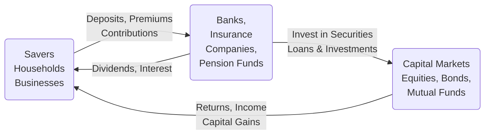

## 1.3 Financial Intermediaries Other than Investment Dealers

Financial intermediaries play a central role in facilitating the movement of funds within the Canadian securities industry. While investment dealers (brokerage firms) are often front and centre, a wide range of other entities occupy equally critical positions in the financial marketplace. Understanding these institutions, their operations, and their regulatory frameworks is essential for anyone exploring Canada’s dynamic financial environment.

In this section, we will explore the primary financial intermediaries operating beyond investment dealers:

1. Banks (Chartered Banks)
2. Insurance Companies  
3. Pension Funds  
4. Mutual Fund Dealers and Mutual Fund Companies  
5. Credit Unions and Trust Companies

Each of these intermediaries has unique functions, regulatory obligations, and risk management strategies. They also offer various products and services that span deposits, loans, investment management, and wealth advisory. Let us examine each category in detail and highlight why these entities matter to the broader Canadian securities industry.

---

## Role of Banks (Chartered Banks)

### Overview and Context
Chartered banks in Canada are authorized under federal legislation and regulated primarily by the Office of the Superintendent of Financial Institutions (OSFI). Their core duties include accepting deposits, offering loans, and providing a host of banking services. Additionally, many large chartered banks, such as the Royal Bank of Canada (RBC) and Toronto-Dominion Bank (TD), have investment dealer subsidiaries that underwrite and distribute securities:
• RBC Dominion Securities  
• TD Securities  

### Key Functions and Services
1. Deposit-Taking and Lending: By using customer deposits to lend funds, banks create liquidity and stimulate economic activity.  
2. Wealth Management: Banks often offer personal and institutional wealth management through subsidiaries or dedicated divisions.  
3. Securities Underwriting and Distribution: Through their investment dealer arms, banks help corporations and governments raise capital by underwriting new issues of shares or bonds.  
4. Financial Advisory: Banks may also have specialized teams that provide corporate finance advisory, mergers and acquisitions guidance, and risk management strategies.

### Real-World Example
Suppose RBC underwrites a new corporate bond for a leading Canadian manufacturing company. RBC uses its deposit network to collect savings from ordinary Canadians and institutional clients, then channels these funds into the corporate bond offering. This direct link between savers and borrowers underscores the bank’s primary role as a conduit for capital.

---

## Insurance Companies as Financial Intermediaries

### Risk Pooling and Long-Term Obligations
Insurance companies accumulate premiums from policyholders and invest these funds to cover future claims. Their long-term liabilities—such as life insurance policies, annuities, and disability coverage—make them significant buyers of fixed-income securities, equities, and alternative investments. In Canada, leading insurers include Manulife Financial and Sun Life Financial.

### Investment Strategies
1. Asset Matching: Insurance firms often align the maturity profiles of their investments (e.g., long-term bonds) with actuarial estimates of liabilities.  
2. Diversification: Insurers invest in equities, corporate and government bonds, real estate, and sometimes private placements to achieve a well-diversified portfolio.  
3. Regulatory Capital Requirements: OSFI imposes risk-based capital requirements, ensuring insurers maintain sufficient capital to protect policyholders.

### Real-World Example
A large Canadian life insurance firm might collect monthly premiums from thousands of policyholders. Investing these cumulative premiums in a portfolio of government bonds, high-grade corporate bonds, and large-cap Canadian equities ensures they can meet future obligations—such as paying out death benefits and annuities—while also generating stable returns.

---

## Pension Funds: Managing Retirement Assets

### Purpose and Importance
Pension funds collect and invest contributions from employees and employers to secure retirement benefits. The Canada Pension Plan Investment Board (CPPIB) manages one of the largest Canadian pension funds for all employed persons across most provinces. At the provincial level, organizations like the Ontario Teachers’ Pension Plan (OTPP) manage retirement assets for specific groups.

### Investment Strategies
1. Long-Term Focus: Pension funds often have a long-term investment horizon, which allows them to invest in a wide range of assets, including private equity, infrastructure, and real estate.  
2. Active Portfolio Management: Many pension funds deploy sophisticated in-house teams or external managers using advanced quantitative models and fundamental analyses.  
3. Risk Management: Since pension liabilities extend far into the future, pension funds must carefully balance growth-oriented portfolios (to meet retirees’ needs) with prudent risk controls.

### Regulatory Oversight
Most pension plans in Canada are regulated provincially (or federally for certain industries). Regulators monitor funding ratios and require periodic actuarial valuations to ensure that liabilities remain fully funded. OSFI has jurisdiction over federally regulated pension plans, such as those of interprovincial transportation firms or chartered banks.

---

## Mutual Fund Dealers and Mutual Fund Companies

### Mutual Fund Basics
Mutual funds pool money from multiple investors to invest in a diversified portfolio of securities (stocks, bonds, or other assets). Retail investors then own units or shares in the mutual fund. This structure provides an easy entry point into the markets, enabling smaller investors to benefit from professional management and broad diversification.

### The Role of Mutual Fund Dealers
Mutual fund dealers are licensed to distribute mutual funds to clients. Under CIRO (Canadian Investment Regulatory Organization), mutual fund dealers must:
1. Adhere to Know Your Client (KYC) rules and suitability practices.  
2. Provide clients with simplified prospectuses or Fund Facts documents.  
3. Maintain compliance with account opening procedures.  

### Regulation and Disclosure Requirements
Mutual fund companies are governed by securities legislation, primarily through National Instruments (e.g., NI 81-101 and NI 81-102), which outline prospectus requirements, investment restrictions, and operational standards:
• Continuous Disclosure: Mutual funds must publish net asset value (NAV) daily or weekly (depending on the fund type).  
• Portfolio Limitations: Funds face concentration limits to reduce risk (e.g., maximum allocation to a single issuer).  
• Fee Transparency: Manufacturers must clearly disclose management fees (MER), trailing commissions, and other costs so that investors understand the expenses associated with their investments.

### Practical Scenario
An investor with CAD 5,000 looking for exposure to Canadian equities could purchase units of a Canadian equity mutual fund through a mutual fund dealer. The dealer would gather the necessary KYC information, ensuring the fund aligns with the investor’s objectives and risk tolerance. All relevant disclosures, such as fees and investment objectives, would be shared before finalizing the transaction.

---

## Credit Unions and Trust Companies

### Credit Unions
Credit unions are cooperative financial institutions owned by their members. They:
1. Accept deposits and offer loans, similar to banks.  
2. Often provide community-focused financial solutions with a local governance structure.  
3. May offer investment products like guaranteed investment certificates (GICs) or mutual funds, commonly through partnerships with mutual fund dealers or wealth management platforms.

Because credit unions are provincially regulated, requirements can vary across provinces. However, they maintain deposit insurance systems (e.g., the Deposit Guarantee Corporation of Manitoba) akin to the Canada Deposit Insurance Corporation (CDIC) for chartered banks.

### Trust Companies
Trust companies, meanwhile, specialize in fiduciary services, overseeing estates and other wealth management accounts with legal responsibilities to act in the best interest of beneficiaries. Some trust companies also accept deposits, make loans, and provide wealth management under trust arrangements.

---

## Interconnectedness of Financial Intermediaries

To visualize the flow of capital and risk among these participants, consider the following mermaid diagram:

In this simplified representation:
• Savers (households, businesses) provide money through deposits, premiums, and pension contributions.  
• Financial intermediaries (banks, insurance companies, pension funds) invest these funds in capital markets, creating loans, acquiring equities, or underwriting bonds.  
• Returns from these investments flow back to intermediaries, who then compensate savers through interest payments, insurance benefits, pensions, or distributions.

---

## Regulatory Oversight

### Office of the Superintendent of Financial Institutions (OSFI)
OSFI is responsible for ensuring the solvency of federally regulated financial institutions (banks, insurance companies, and certain pension plans). It sets guidelines and rules around capital adequacy, risk management, and corporate governance. Institutions must regularly report their financial positions to OSFI, which has authority to intervene when solvency or consumer protection is at risk.

### Provincial Securities Commissions
Mutual fund dealers and other market participants (excluding institutions under OSFI jurisdiction) are typically overseen by provincial or territorial securities commissions. These commissions work collectively under the Canadian Securities Administrators (CSA) to harmonize regulations. Registration, disclosure, and conduct requirements form the core pillars of securities laws nationwide.

### CIRO (Canadian Investment Regulatory Organization)
CIRO, formerly IIROC and the MFDA, is Canada’s self-regulatory organization for investment and mutual fund dealers. It enforces rules around proficiency, client disclosures, and business conduct. CIRO fosters confidence in Canada’s capital markets by ensuring professional standards and ethical behaviour among intermediaries.

---

## Best Practices, Common Risks, and Strategies

1. Diversification: Whether through insurance companies investing premiums, pension funds pursuing growth, or credit unions offering mutual fund products, a well-diversified portfolio is fundamental to mitigating risk.  
2. Liquidity Management: Banks and credit unions must balance long-term lending with accessible short-term deposits. Insurers must match asset maturities to future payout obligations, while pension funds plan for disbursements over extended timelines.  
3. Regulatory Compliance: All intermediaries must maintain thorough records, meet capital requirements, and comply with KYC regulations. Breaches can result in severe penalties from OSFI, provincial commissions, or CIRO.  
4. Ethical Standards: Maintaining transparency and placing clients’ interests first build trust in the system. Advisors and institutional managers must adhere to codes of conduct to foster long-term client relationships.

---

## Case Study: Canadian Pension Fund Investment

A notable example is the Ontario Teachers’ Pension Plan (OTPP). Known for its well-diversified portfolio, OTPP invests in public equities, private equity, real estate, and infrastructure worldwide. OTPP’s long-term focus allows it to weather short-term market volatility while delivering consistent returns for retirees. This approach, supported by a robust risk management framework, illustrates how pension funds can effectively balance risk and reward over longer horizons.

---

## Summary and Actionable Insights

Financial intermediaries beyond investment dealers—such as banks, insurers, pension funds, mutual fund dealers, credit unions, and trust companies—form the backbone of Canada’s financial system. They each serve unique functions:

• Banks create liquidity by accepting deposits and extending loans, with large institutions also underwriting securities.  
• Insurance companies pool risk, investing premiums in long-term securities to match liabilities.  
• Pension funds manage retirement assets, adopting long-term growth strategies.  
• Mutual fund dealers grant retail investors access to professionally managed products.  
• Credit unions and trust companies round out the landscape by offering deposit-taking, lending, and fiduciary services often with a localized or specialized approach.

Understanding how these entities operate and interact helps finance professionals gain a holistic view of the Canadian securities industry. Aspiring investors should recognize that their choice of intermediary can shape fees, product availability, and risk exposure. Whether funding a future retirement, building a risk-managed estate plan, or aiming for capital growth, an awareness of these intermediaries and their functions can lead to more informed financial decisions.

---

## References and Additional Resources

- Office of the Superintendent of Financial Institutions Canada (OSFI):  
  <https://www.osfi-bsif.gc.ca>  
  Provides guidelines, advisories, and updates for federally regulated banks, insurers, and pension plans.

- Canadian Life and Health Insurance Association (CLHIA):  
  <https://www.clhia.ca>  
  Offers resources on insurance regulations, best practices, and consumer information.

- Canadian Pension & Benefits Institute (CPBI):  
  <https://www.cpbi-icra.ca>  
  Provides educational events and publications on pension and benefit plans.

- CSA (Canadian Securities Administrators):  
  <https://www.securities-administrators.ca>  
  Oversees provincial and territorial securities regulations and coordinates national frameworks.

- CIRO:  
  The Canadian Investment Regulatory Organization ensures standards for investment and mutual fund dealers, working alongside provincial securities commissions.

---

## Glossary

● Chartered Bank: A financial institution authorized under federal legislation to accept deposits, provide loans, and offer other banking services across Canada.  
● Insurance Company: An institution that pools risks by collecting premiums and investing these funds on behalf of policyholders.  
● Pension Fund: A professionally managed investment pool that collects and invests contributions to provide retirement income for members.  
● Mutual Fund Dealer: A dealer licensed to distribute mutual funds; must comply with regulations set forth by CIRO, the CSA, and provincial rules.  
● Office of the Superintendent of Financial Institutions (OSFI): The primary regulator for federally regulated financial institutions, ensuring their stability and solvency.

---

## Quiz: Financial Intermediaries in the Canadian Market



### Which entity primarily accepts deposits, provides loans, and may underwrite securities through its subsidiaries?

- [x] Chartered Bank
- [ ] Credit Union
- [ ] Pension Fund
- [ ] Insurance Company

> **Explanation:** Chartered banks accept deposits and provide loans, and often have investment dealer subsidiaries that underwrite securities.

### What is the main purpose of an insurance company in financial intermediation?

- [ ] Providing short-term loans
- [x] Pooling risk through the collection of premiums and investing these funds
- [ ] Regulating federally chartered banks
- [ ] Overseeing the mutual fund industry

> **Explanation:** Insurance companies collect premiums to pool risk and invest these funds to cover future claims.  

### Pension funds typically have which type of investment horizon?

- [x] Long-term
- [ ] Short-term
- [ ] Medium-term only
- [ ] Ultra-short-term

> **Explanation:** Pension funds invest with a long-term focus to ensure sufficient assets for future retirement obligations.

### Mutual fund dealers must follow which core regulatory principle when on-boarding clients?

- [x] Know Your Client (KYC)
- [ ] Fondo Complaints Management (FCM)
- [ ] High-Leverage Tactics (HLT)
- [ ] Bank Guarantee Standards (BGS)

> **Explanation:** Mutual fund dealers must comply with KYC rules, ensuring that investments match the client’s objectives and risk profile.

### Among the following financial intermediaries, whose main focus is pooling and investing retirement contributions?

- [ ] Insurance Companies
- [x] Pension Funds
- [ ] Chartered Banks
- [ ] Mutual Fund Dealers

> **Explanation:** Pension funds collect and invest contributions to provide retirement benefits to their members.

### Which regulator enforces capital adequacy and risk management for Canadian banks at the federal level?

- [x] OSFI
- [ ] CSA
- [ ] CIRO
- [ ] Provincial Securities Commissions

> **Explanation:** The Office of the Superintendent of Financial Institutions (OSFI) supervises federally regulated financial institutions, including banks and insurers.

### Credit unions in Canada are typically regulated at which level?

- [ ] Federal only
- [x] Provincial
- [x] Territorial
- [ ] International

> **Explanation:** Credit unions are regulated at the provincial or territorial level, with deposit insurance provided by provincial/territorial agencies rather than the CDIC (federal).

### Trust companies specialize in which service area?

- [ ] Day trading
- [ ] Short-term financing
- [x] Fiduciary services and estate management
- [ ] Commodity-based investments

> **Explanation:** Trust companies are key providers of fiduciary services, including managing estates and wealth under trust arrangements.

### Which statement best describes the role of CIRO?

- [x] It serves as the self-regulatory organization overseeing investment and mutual fund dealers in Canada.
- [ ] It is responsible for federal taxation policy.
- [ ] It provides deposit insurance across all Canadian banks.
- [ ] It manages Canada’s national pension fund.

> **Explanation:** CIRO is Canada’s self-regulatory organization for investment and mutual fund dealers, promoting professional standards and investor protection.

### True or False: Insurance companies can safety-match their long-term liabilities with fixed-income investments and other assets.

- [x] True
- [ ] False

> **Explanation:** Insurance companies often match their long-term obligations with similarly timed, long-duration investments that mitigate interest rate and liquidity risks.



---

