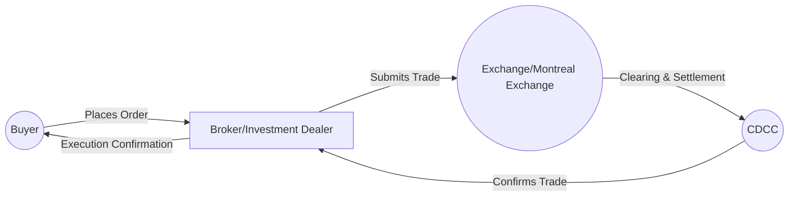

## 10.1 The Role of Derivatives

Derivatives are powerful financial instruments that can serve a variety of purposes, ranging from risk management to speculation. As the Canadian investment landscape evolves, an in-depth grasp of derivatives is increasingly vital for finance professionals, portfolio managers, and individual investors seeking to protect or enhance their returns. This section explores the core attributes of derivatives, their role in hedging and speculation, and their standing within Canada’s regulatory framework.

---

## Introduction to Derivatives

### Defining Derivatives

A derivative is a financial instrument whose price is derived from an underlying asset or market indicator. This underlying asset can range from individual securities (e.g., stocks, bonds) and commodities (e.g., oil, gold) to currency pairs and equity indexes. The aim of a derivative can be to manage future price fluctuations (hedging), capitalize on price movements (speculation), or facilitate transactional efficiency in financial markets.

Key Examples of Underlying Assets in Canada:
• Canadian bank stocks (e.g., RBC, TD).  
• Government of Canada bonds.  
• Canadian equity indexes such as the S&P/TSX Composite.  
• Commodity-based indexes like crude oil and natural gas (often particularly relevant in Canadian markets).

### Common Types of Derivatives

• Futures: Standardized contracts to buy or sell an asset at a predetermined price on a specific future date. Traded primarily on exchanges such as the Montreal Exchange (MX).  
• Options: Contracts that grant the holder the right, but not the obligation, to buy (call) or sell (put) an asset at a specified price before or on a certain date.  
• Swaps: Over-the-counter (OTC) contracts where parties exchange cash flows, commonly used for interest rate and currency hedging.  
• Forwards: Non-standardized contracts similar to futures but negotiated directly between two parties, generally trading over the counter.

---

## Purpose and Applications of Derivatives

### Hedging: Mitigating Risk

Derivatives offer investors and companies the ability to manage or “hedge” risk exposure. For instance, a Canadian pension fund holding a large equity portfolio can purchase index futures to protect against potential market downturns. Similarly, an exporter receiving U.S. dollars can use currency futures or forward contracts to hedge against fluctuations in the USD/CAD exchange rate, thereby stabilizing cash flows.

> “Hedging” is akin to an insurance policy. You pay a relatively small premium (or opportunity cost) to guard against adverse price movements in the underlying asset.

#### Example: A Mining Company Hedge
Suppose a Canadian mining firm anticipates producing gold in six months. Concerned about a decline in gold prices, it might enter into a futures contract to lock in a favorable sale price. If gold prices drop, the profit from the futures contract offsets losses in the spot gold market.

### Speculation: Enhancing Returns

Beyond risk mitigation, derivatives can also be used for speculation, with the potential for amplified returns due to leverage. When speculating, investors take positions in derivatives with the expectation that the value of the underlying asset will move in a favorable direction. However, speculation inherently involves higher risk, as losses can exceed the initial capital outlay.

#### Example: A Retail Investor’s Call Option
A retail investor who expects Canadian bank stocks to rally may purchase call options on RBC. If the stock’s price rises above the strike price, these options can generate significant returns. Conversely, if RBC’s share price remains below the strike price, the loss is limited to the option premium.  

---

## Key Benefits of Derivatives

### Price Discovery and Liquidity

Derivatives, especially standardized contracts traded on regulated exchanges such as the Montreal Exchange (MX), foster improved price discovery. With frequent trading, the contract prices reflect the collective expectations of market participants concerning the future value of the underlying asset. This constant interaction among buyers and sellers often results in tighter bid-ask spreads and deeper market liquidity, thereby reducing transaction costs.

### Lower Transaction Costs and Leverage

Thanks to exchange-standardized contracts, traders can transact derivatives more cost-effectively than transacting in the underlying securities (particularly for large positions). Furthermore, the use of margin requirements on derivatives can free up capital, allowing investors to allocate funds to other opportunities. This leverage factor, while beneficial when trades move in the investor’s favor, also magnifies potential losses—requiring careful risk management.

---

## Regulatory Environment in Canada

### The Role of CIRO (Canadian Investment Regulatory Organization)

The Canadian Investment Regulatory Organization (CIRO) ensures market integrity by imposing and enforcing guidelines for participants who trade in derivatives. These guidelines cover:
• Suitability requirements: Ensuring the derivatives sold match the investor’s financial situation, objectives, and risk profile.  
• Risk disclosures: Informing investors about the potential for significant losses and complexities associated with derivatives.  
• Reporting standards: Obligations on dealers to maintain accurate records and comply with risk management regulations.

Visit the official CIRO website for up-to-date rules and guidelines:  
[https://www.ciroselfregulatoryorganization.ca](https://www.ciroselfregulatoryorganization.ca)

### Montreal Exchange (MX)

Many exchange-traded derivative contracts in Canada are listed on the Montreal Exchange (MX). The MX sets margin requirements and compliance obligations designed to create a fair and transparent trading environment. Notable derivative instruments on the MX include:
• Equity options and index options.  
• Interest rate futures on Government of Canada bonds.  
• Index futures on the S&P/TSX 60 Index.

Visit the Montreal Exchange website for detailed contract specifications:  
[https://www.m-x.ca](https://www.m-x.ca)

### Canadian Derivatives Clearing Corporation (CDCC)

The Canadian Derivatives Clearing Corporation (CDCC) acts as the central clearinghouse, mitigating counterparty risk for exchange-traded products and certain OTC derivatives. It ensures that each party to the transaction meets margin requirements and performs settlement as agreed.

Visit CDCC for more information on clearing, margin, and settlement practices:  
[https://www.cdcc.ca](https://www.cdcc.ca)

---

## Understanding Key Risks

### Counterparty Risk

Counterparty risk—especially relevant in OTC trades—refers to the possibility that one party in a derivative contract will default on its obligations. This risk is lower for exchange-traded derivatives cleared by a central counterparty such as the CDCC, but it remains a crucial consideration for unregulated or lightly regulated environments.

### Market Risk

If the underlying asset moves negatively relative to an investor’s position, losses can accumulate rapidly. Due to derivatives’ leverage, even small price movements can lead to outsized losses.

### Legal and Operational Risk

Complex documentation requirements may lead to misinterpretations and disputes. Operational risks include technical or communication failures during trade execution and settlement processes.

---

## How Derivatives Function: A Visual Overview

Below is a basic Mermaid diagram illustrating how a standardized exchange-traded derivative transaction flows among key parties:

1. The buyer places an order with a broker or investment dealer.  
2. The broker submits the trade to the Montreal Exchange.  
3. The trade is cleared through the Canadian Derivatives Clearing Corporation (CDCC).  
4. Both the buyer and seller receive confirmations once the trade is successfully matched and cleared.

---

## Practical Uses of Derivatives in Canada

### Portfolio Hedging with Index Futures

A portfolio manager overseeing a broad portfolio of Canadian equities could hedge potential market downturns by selling (short) S&P/TSX 60 Index futures. If the index declines, the gains on the short futures position would offset losses in the physical equity holdings.

### Currency Hedging for Cross-Border Investments

Canadian investors venturing into U.S. markets can hedge currency exposure through USD/CAD forward contracts. Such hedges reduce the risk of currency fluctuations eroding returns when converting profits back into Canadian dollars.

### Commodity Hedging in Energy-Rich Regions

Energy corporations in Alberta and Saskatchewan can hedge their exposure to crude oil or natural gas price swings by using futures or swaps. This helps stabilize revenue streams, facilitate budgeting, and reduce the volatility of earnings.

### Interest Rate Swaps for Canadian Banks

Large Canadian banks like RBC and TD frequently enter into interest rate swaps to manage changes in interest rates, ensuring profitability in both rising and falling rate environments.

---

## Best Practices and Common Pitfalls

### Best Practices

• Clearly define the strategy’s objective—hedging, speculation, or otherwise.  
• Match the underlying asset closely to the exposure you wish to hedge or speculate on (e.g., the S&P/TSX 60 Index futures for a predominantly Canadian stocks portfolio).  
• Maintain robust risk management protocols.  
• Stay informed on CIRO guidelines and margin requirements.  
• Keep detailed records of trades, confirmations, and statements.

### Common Pitfalls

• Over-leveraging: Insufficient capital to cover potential losses if trades move against you.  
• Underestimating liquidity risk: Lack of adequate market depth can result in large bid-ask spreads.  
• Neglecting regulatory compliance: Failure to meet disclosure, suitability, or reporting standards.  
• Incomplete understanding of product features: Complex payoffs (e.g., exotic options) can obscure risk exposure.

---

## Resources for Further Exploration

• CIRO Official Guidelines:  
  [https://www.ciroselfregulatoryorganization.ca](https://www.ciroselfregulatoryorganization.ca)

• Montreal Exchange (MX) – Contract Specifications:  
  [https://www.m-x.ca](https://www.m-x.ca)

• Canadian Derivatives Clearing Corporation (CDCC) – Clearing, Margin, and Settlement:  
  [https://www.cdcc.ca](https://www.cdcc.ca)

• QuantLib – An open-source library for quantitative finance, including derivative pricing:  
  [https://www.quantlib.org](https://www.quantlib.org)

• Reference Text: “Options, Futures, and Other Derivatives” by John Hull

---

## Summary and Key Takeaways

Derivatives are integral financial instruments in Canada’s capital markets. They allow investors and institutions to better manage risks, make more efficient use of capital, and explore a range of speculative strategies. Familiarity with their mechanics, pricing, and regulatory requirements is key for those aiming to leverage these tools responsibly. Professionals must remain vigilant about potential pitfalls—especially those related to leverage, counterparty risk, and compliance.

By developing a strong foundation in derivative products, Canadian market participants can confidently harness the benefits of these instruments without succumbing to the common missteps that often plague inexperienced traders.

---

## Test Your Knowledge: Derivatives in Canadian Markets Quiz



### Derivatives derive their value primarily from which of the following?

- [x] An underlying asset or equity index
- [ ] Government regulations
- [ ] Company dividends
- [ ] Broker commissions

> **Explanation:**( A derivative’s price is contingent upon the price of an underlying asset or market factor.)

### Which of the following best describes hedging?

- [x] Using derivatives to reduce or offset the risk of adverse price movements
- [ ] Taking on higher risk to amplify returns
- [ ] Attempting to distort market prices for profit
- [ ] Maintaining a fully uninvested cash position

> **Explanation:**( Hedging involves using derivatives or other instruments to protect an existing position from declining in value.)

### What is the main difference between exchange-traded and over-the-counter (OTC) derivatives?

- [x] Exchange-traded derivatives are standardized and cleared through a central counterparty, while OTC derivatives are customizable and pose higher counterparty risk.
- [ ] Exchange-traded derivatives carry no risk, unlike OTC derivatives.
- [ ] OTC derivatives are illegal in Canada.
- [ ] Exchange-traded derivatives are exclusively used for speculation.

> **Explanation:**( Exchange-traded contracts are standardized and cleared, thus minimizing counterparty risk, whereas OTC products are negotiated directly between parties.)

### If a Canadian investor purchases put options on a stock, what strategy are they employing?

- [x] They are seeking protection against a potential decline in the stock’s price.
- [ ] They are attempting to replicate a bond portfolio.
- [ ] They are expecting the underlying stock price to remain unchanged.
- [ ] They are trying to stabilize interest rates.

> **Explanation:**( Put options grant the right to sell at a specific price, effectively providing a hedge if the price falls.)

### Which of the following is a potential pitfall of using leverage in derivatives trading?

- [x] Losses can be magnified significantly.
- [ ] Interest rates improve, increasing profits.
- [x] Regulatory compliance becomes unnecessary.
- [ ] Unlimited gains are guaranteed.

> **Explanation:**( Leverage amplifies both gains and losses; if a trade moves against the investor, losses can exceed the initial margin.)

### Which entity primarily oversees derivatives regulations and investor protections in Canada?

- [x] CIRO (Canadian Investment Regulatory Organization)
- [ ] Canada Mortgage and Housing Corporation
- [ ] The World Bank
- [ ] Canadian Competition Bureau

> **Explanation:**( CIRO is responsible for enforcing regulations and ensuring investor protection in the Canadian securities and derivatives markets.)

### Why might a Canadian pension fund use equity index futures?

- [x] To hedge market risk on a portfolio of Canadian equities
- [ ] To eliminate currency risk from U.S. investments
- [x] To reduce the costs associated with bond investments
- [ ] To avoid all forms of risk entirely

> **Explanation:**( A pension fund can short equity index futures to offset potential losses in its underlying equity portfolio, effectively hedging a portion of its market risk.)

### What function does the Canadian Derivatives Clearing Corporation (CDCC) serve?

- [x] It acts as a central counterparty, reducing counterparty risk for exchange-traded derivatives.
- [ ] It sets the legal precedents for derivative litigation.
- [ ] It dictates interest rates for open contracts.
- [ ] It prohibits the trading of OTC derivatives.

> **Explanation:**( The CDCC’s central clearing role mitigates counterparty risk, ensuring trades settle smoothly.)

### Which of the following best describes speculation with derivatives?

- [x] Taking positions in the market with the expectation of benefiting from future price changes
- [ ] Neither gaining nor losing by locking in prices
- [ ] Matching all trades with offsetting positions to eliminate risk
- [ ] Donating portfolio proceeds to a charitable organization

> **Explanation:**( Speculation involves accepting risk in anticipation of price movement that will produce a profit.)

### CIRO regulations require that advisors ensure a derivative product is suitable for a client. True or False?

- [x] True
- [ ] False

> **Explanation:** Suitability is a key requirement of CIRO regulations: the advisor must verify that recommendations align with the client’s risk tolerance and investment objectives.



---

## For Additional Practice and Deeper Preparation

**Elevate your exam readiness with our comprehensive app, "Securities CA: Mock Exams," designed to challenge and refine your skills.**

* **Master Challenging Questions:** Dive into expertly crafted sample exam questions that go beyond standard references.
* **Scenario-Driven Learning:** Experience scenario-driven case questions and in-depth solutions to build practical expertise.
* **Sharpen Exam Strategies:** Build confidence with step-by-step explanations designed to refine your exam-day tactics.
* **Gain Real-World Insights:** Acquire practical tips and detailed rationales that demystify complex concepts.
* **CIRO and CSI Alignment:** Stay current with CIRO guidelines and CSI’s exam structure, with questions intentionally more challenging than the actual exam.

**Download the App Today:**

> Note: While these courses are specifically crafted to align with the CSC® exams outlines, they are independently developed and not endorsed by CSI or CIRO.
