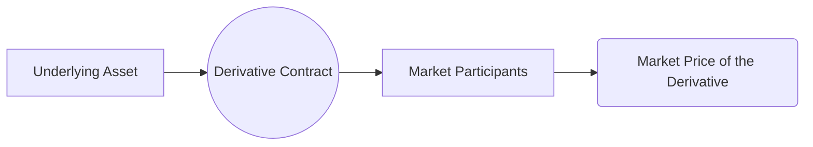

## 10.2 Types of Underlying Assets

Derivatives play a pivotal role in the Canadian securities landscape, offering investors and institutions a means to hedge risk, speculate on market movements, or refine their asset allocations. At their core, derivatives derive their value from an underlying asset or pool of assets. Understanding the types of underlying assets is crucial to effectively price, trade, and manage derivatives.

---

### Overview of Underlying Assets

Underlying assets can be broadly categorized into five main classes:

1. Equity (e.g., single stocks or stock indexes)  
2. Fixed income (e.g., government bonds, corporate bonds)  
3. Commodities (e.g., precious metals, oil, agricultural products)  
4. Currencies (e.g., CAD, USD, EUR)  
5. Interest rates (e.g., benchmark rates such as CDOR in Canada)

Each type of underlying asset class has distinct characteristics and risk factors. For instance, the volatility of equity markets can significantly impact the value of stock options, while the economic supply-demand dynamics in the oil market affect the value of crude oil futures. In Canada, derivatives on equities and interest rates—mainly those listed on the Montreal Exchange—tend to be among the most actively traded.

Below is a simplified diagram representing how a derivative’s value is linked to its underlying asset:

In this diagram:
• The Underlying Asset (A) drives the price of the Derivative Contract (B).  
• Market Participants (C) trade the derivative based on expectations of changes in the underlying.  
• The Market Price of the Derivative (D) reflects the collective sentiment and analytical valuations.

---

### Equity Underlying Assets

Derivative products based on equities are among the most common. They include single-stock options, index options, and index futures.

#### Single-Stock Options

• These derive their value from the price movements of a single equity security (e.g., a TSX-listed company like RBC or TD).  
• Option buyers can speculate on whether the stock price will go up (call options) or down (put options).  
• In Canada, single-stock options are primarily listed on the Montreal Exchange.

#### Equity Index Derivatives

• These derivatives use broader equity benchmarks, such as the S&P/TSX 60, as the underlying assets.  
• Traders and portfolio managers use equity index options and futures to gain diversified exposure or hedge their overall Canadian equity portfolios.  
• A drop in the index prompted by macroeconomic news or sector-wide developments will directly influence the value of the index-based derivative.

##### Example: Hedging a Canadian Equity Portfolio using Index Futures  
Suppose a Canadian pension fund wants to protect its equity portfolio from a near-term market decline. The fund might sell S&P/TSX 60 index futures to offset potential losses. If the index falls, losses in the physical portfolio can be partially offset by gains in the short futures position.

---

### Fixed Income Underlying Assets

Fixed income derivatives include contracts based on government bonds (federal, provincial, or municipal) and corporate bonds.

#### Government Bonds

• Derivatives may be linked to Government of Canada bonds with various maturities.  
• Because government bonds are generally considered to have lower default risk, the primary risk is interest rate volatility rather than credit risk.  
• Options on Government of Canada bond futures (e.g., 10-year bond futures) are heavily influenced by Bank of Canada policy, economic indicators, and market sentiment.

#### Corporate Bonds

• While less common than government bond derivatives, corporate bond derivatives may reference solid, investment-grade issuers like major Canadian banks.  
• These derivatives incorporate both interest rate risk and credit risk, potentially making them more volatile.  
• Investors might use these products to hedge or speculate on the credit spread changes of specific corporate issuers.

---

### Commodity Underlying Assets

Commodity derivatives span physical products such as precious metals, energy products, and agricultural goods. Although the Canadian commodity market is vast—particularly in oil, natural gas, and agricultural products—many Canadian investors trade global commodity contracts listed on major international exchanges (e.g., CME Group).

#### Precious Metals

• Gold, silver, platinum, and palladium are popular precious metals.  
• Price drivers include global economic conditions, geopolitical events, currency movements, and investor sentiment on safe-haven assets.  
• Canadian investors may trade gold futures or use exchange-traded funds (ETFs) with embedded derivative strategies.

#### Energy (Oil, Natural Gas)

• Canada, being one of the world’s major energy producers, sees significant activity in energy-related derivatives.  
• Supply-demand imbalances, OPEC decisions, and environmental factors often affect prices.  
• Crude oil and natural gas futures are common instruments for hedging by producers, such as Canadian oil sands companies seeking to stabilize revenues.

#### Agricultural Products

• Wheat, canola, and other agricultural products are essential to Canada’s economy.  
• Commodity prices can be volatile due to weather conditions, trade policies, and global demand.  
• Farmers and agribusinesses frequently use futures and options to lock in prices.

---

### Currency Underlying Assets

Currency derivatives—futures, forwards, and options—enable market participants to manage foreign exchange risks or speculate on currency fluctuations. In Canada, the Canadian dollar (CAD) is often paired with major currencies such as the U.S. dollar (USD), euro (EUR), and British pound (GBP).

• Currency options and futures remain popular among exporters, importers, and cross-border investors looking to hedge currency exposure.  
• For example, a Canadian exporter receiving U.S. dollar payments could purchase a CAD call/USD put option to lock in a favorable exchange rate.  
• Supply and demand dynamics in foreign exchange markets can rapidly shift with changing economic data, geopolitical events, and sentiment about future interest rate differentials.

---

### Interest Rate Underlying Assets

Interest rate derivatives are unique in that they reference an interest rate, such as a benchmark short-term rate (e.g., CDOR in Canada or LIBOR/now SOFR outside Canada). Common instruments include interest rate swaps and forward rate agreements (FRAs). These derivatives allow institutions to manage exposure to fluctuations in short-term or long-term interest rates.

#### Interest Rate Swaps

• Involve exchanging fixed interest payments for floating interest payments (or vice versa) over time.  
• Commonly used by Canadian banks, corporations, or pension funds to transform their interest rate exposure.  
• For example, a corporation with outstanding variable-rate debt might enter a swap to pay a fixed rate and receive a floating rate, mitigating future rate-hike exposure.

#### Forward Rate Agreements (FRAs)

• Over-the-counter contracts to lock in a future interest rate for a specified period on a notional principal amount.  
• Often used to manage short-term interest rate volatility—e.g., a bank anticipating future fluctuations in short-term rates might use an FRA to stabilize its funding costs.

---

### Risk Factors and Key Considerations

When trading derivatives, it is critical to understand how the characteristics of the underlying assets influence risks and return potential:

• **Volatility:** Higher volatility typically increases option premiums. For instance, when oil prices become more volatile, both calls and puts see premium expansion.  
• **Correlation:** Knowing if various markets move in tandem or inversely affects hedging effectiveness and risk management.  
• **Liquidity:** Underlying assets with deep, liquid markets—like Government of Canada bonds or the S&P/TSX 60 index—tend to have narrower bid-ask spreads.  
• **Supply and Demand:** Especially relevant in commodities (e.g., seasonal changes in the energy market or weather patterns in agricultural commodities).

---

### Practical Example: Using Interest Rate Futures to Hedge Mortgage Portfolio Risk

A Canadian bank with a large fixed-rate mortgage portfolio may worry about rising interest rates, which could reduce the market value of its mortgage portfolio. To guard against interest rate risk, the bank can sell interest rate futures on short-term Government of Canada bonds. If rates rise and the mortgage portfolio value declines, gains on the futures short position can help offset the losses.

---

### Tools, Regulations, and Best Practices

#### Regulatory Institutions and Resources

• **CIRO (Canadian Investment Regulatory Organization)**: Oversees IIROC and MFDA legacy frameworks, helping ensure that market participants operate fairly and transparently.  
• **Bank of Canada**: A key resource for interest rate information, official monetary policy statements, and economic analyses (https://www.bankofcanada.ca).  
• **SEDAR+** (System for Electronic Document Analysis and Retrieval): Access corporate filings, financial statements, and regulatory documents (https://www.sedar.com).  

#### Analytical Tools and Frameworks

• **Python Libraries**: Pandas, NumPy, and Matplotlib for time-series analysis of volatility and correlation.  
• **Bloomberg/Refinitiv Eikon**: Professional platforms to screen derivatives, retrieve real-time quotes, and evaluate trading strategies.  
• **Risk Models**: Value-at-Risk (VaR), sensitivity analysis (Greeks for options) to stress test derivative positions.

#### Best Practices

• **Understand the Underlying:** Conduct thorough due diligence on the economic factors driving the asset.  
• **Monitor Correlation and Diversification:** Evaluate how the derivative’s performance might offset or amplify other exposures in your portfolio.  
• **Stay Alert to Regulatory Changes:** Keep abreast of updates from CIRO, the Montreal Exchange, or global regulatory bodies.  
• **Model Potential Outcomes:** Use scenario analysis to predict how changes in price, volatility, or interest rates might affect derivative valuations.

---

### Common Pitfalls and Challenges

• **Misjudging Liquidity:** Thinly traded commodity or corporate bond derivatives carry higher price impact costs.  
• **Underestimating Volatility:** Missing the importance of implied volatility can lead to inaccurate option valuations.  
• **Over-Hedging or Under-Hedging:** Lack of proper position sizing can undermine risk management goals.  
• **Regulatory Compliance:** Failing to maintain hedger or speculator status, or not meeting margin and reporting requirements, can lead to fines or sanctions.

---

### Summary

The choice of underlying asset—be it equities, fixed income, commodities, currencies, or interest rates—directly affects a derivative’s pricing, volatility, and overall risk profile. Canadian investors and professionals who grasp these nuances can strategically select and manage derivatives to achieve hedging and investment objectives. By staying informed about the economic and regulatory environment, employing robust analytical tools, and applying thorough risk management practices, derivatives users can navigate Canada’s dynamic financial markets effectively and responsibly.

---

## Quiz: Types of Underlying Assets



### Which of the following is NOT typically considered one of the main categories of underlying assets in derivatives?

- [ ] Equities  
- [ ] Fixed Income  
- [ ] Commodities  
- [x] Real Estate Investment Trusts  

> **Explanation:** The main classes for underlying assets include equities, fixed income, commodities, currencies, and interest rates. Real Estate Investment Trusts (REITs) can be part of the equity space but are not usually listed as a separate core asset category for derivatives.

### A Canadian investor who wants to hedge potential downside in their TSX-listed stock portfolio might use:

- [x] Index options based on the S&P/TSX 60  
- [ ] Precious metals futures  
- [ ] Foreign currency swaps  
- [ ] Wheat futures  

> **Explanation:** Index options on the S&P/TSX 60 provide broad equity market coverage to offset losses in a diversified Canadian equity portfolio.

### Which type of underlying asset is primarily impacted by both credit risk and interest rate risk?

- [ ] Crude oil  
- [ ] USD/CAD currency pair  
- [x] Corporate bonds  
- [ ] Wheat  

> **Explanation:** Corporate bonds have both credit risk (issuer default risk) and interest rate risk (changes in overall market interest rates).

### What is a fundamental driver of gold derivative prices?

- [ ] Agricultural harvesting cycles  
- [x] Investor sentiment and safe-haven demand  
- [ ] Average mortgage rates in Canada  
- [ ] OPEC production decisions  

> **Explanation:** Gold prices are closely linked to investor sentiment—especially safe-haven demand—and global economic conditions.

### A Canadian bank might use interest rate swaps to:

- [x] Exchange fixed-rate payments for floating-rate payments  
- [ ] Lock in a specific currency exchange rate for the future  
- [x] Hedge interest rate risk on its variable-rate liabilities  
- [ ] Speculate on a specific commodity’s price moves  

> **Explanation:** Interest rate swaps are powerful instruments that allow financial institutions to manage and swap out their interest rate exposures, including exchanging fixed for floating rates and vice versa.

### Which benchmark rate is commonly used for interest rate derivatives in Canada?

- [x] CDOR  
- [ ] LIBOR  
- [ ] ESTR  
- [ ] SARON  

> **Explanation:** The Canadian Dollar Offered Rate (CDOR) is widely used within the Canadian market for interest rate derivatives.

### Which of the following is a potential pitfall when using commodity derivatives?

- [x] Misjudging market liquidity  
- [ ] Achieving price transparency  
- [x] Over-hedging leading to offsetting profits and losses  
- [ ] Measuring implied volatility  

> **Explanation:** Thin liquidity in certain commodity markets can lead to higher transaction costs. Additionally, over-hedging might cancel out potential gains or cause new losses.

### Which of the following best describes a forward rate agreement (FRA)?

- [x] A contract to lock in a future interest rate on a notional amount  
- [ ] A security providing partial ownership in a company  
- [ ] A method of exchanging one currency for another at the current spot bid  
- [ ] A call option on a commodity index  

> **Explanation:** An FRA is an over-the-counter contract used to lock in borrowing or lending interest rates for future periods.

### SEDAR+ (System for Electronic Document Analysis and Retrieval) is used for:

- [x] Accessing corporate filings and financial statements of Canadian-listed companies  
- [ ] Retrieving spot exchange rates for the CAD/USD currency pair  
- [ ] Real-time commodity quotes for the Chicago Mercantile Exchange  
- [ ] Mortgage pre-approval applications  

> **Explanation:** SEDAR+ is Canada’s primary platform for accessing financial statements, prospectuses, and other mandatory corporate disclosures.

### Derivatives in the Canadian market based on the S&P/TSX 60 index:

- [x] Are often used for hedging or speculating on broader Canadian equity market movements  
- [ ] Represent a strategy for swapping fixed and floating interest rates  
- [ ] Are always illiquid because the TSX equity market is small  
- [ ] Are categorized under currency derivatives  

> **Explanation:** S&P/TSX 60 index derivatives, such as futures and options, enable market participants to hedge or speculate on Canada’s broader equity market performance.



---

## For Additional Practice and Deeper Preparation

**Elevate your exam readiness with our comprehensive app, "Securities CA: Mock Exams," designed to challenge and refine your skills.**

* **Master Challenging Questions:** Dive into expertly crafted sample exam questions that go beyond standard references.
* **Scenario-Driven Learning:** Experience scenario-driven case questions and in-depth solutions to build practical expertise.
* **Sharpen Exam Strategies:** Build confidence with step-by-step explanations designed to refine your exam-day tactics.
* **Gain Real-World Insights:** Acquire practical tips and detailed rationales that demystify complex concepts.
* **CIRO and CSI Alignment:** Stay current with CIRO guidelines and CSI’s exam structure, with questions intentionally more challenging than the actual exam.

**Download the App Today:**

> Note: While these courses are specifically crafted to align with the CSC® exams outlines, they are independently developed and not endorsed by CSI or CIRO.
