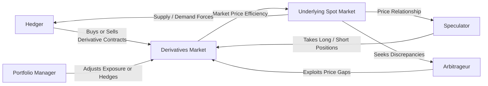

## 10.3 The Users of Derivatives

Derivatives—contracts whose value is derived from underlying assets such as stocks, bonds, commodities, or market indices—play a critical role in modern finance. In Canada, regulated derivatives markets enable a wide variety of participants to hedge risks, generate returns, and manage complex portfolios more efficiently. This section examines the key categories of derivative users, their primary motivations, and the regulatory backdrop that governs their activities.

Derivatives are complex instruments, and understanding who uses them and why is vital for professionals and investors seeking to navigate Canadian markets. The four main categories of users are:

1. Hedgers  
2. Speculators  
3. Arbitrageurs  
4. Portfolio Managers  

Below, we explore how each group utilizes derivatives, providing examples, diagrams, and practical scenarios relevant to the Canadian financial landscape. We will also highlight regulatory considerations, best practices, and potential pitfalls.

---

## Hedgers

### Overview  
Hedgers use derivatives to manage the price risk associated with their business or investment holdings. In essence, hedgers seek to offset potential losses in the cash or spot market by taking an opposing position in derivative contracts. 

For a simple example, consider a Canadian wheat farmer who expects to harvest a crop in six months. The farmer can enter into a futures contract to lock in a specific price for the wheat today to protect against falling prices in the future. Conversely, a food-processing company that needs to purchase wheat may use futures contracts to hedge the risk of rising prices.

### Common Hedging Instruments  
• Futures Contracts: Standardized agreements to buy or sell an underlying asset at a set date and price.  
• Options Contracts: Grants the right (but not the obligation) to buy (call option) or sell (put option) an asset at a predetermined strike price.  
• Swaps: Commonly used to hedge interest rate or currency exchange risk.  

### Hedging Example: Pension Fund Interest Rate Risk  
A Canadian pension fund might hold a large portfolio of fixed-income securities. To safeguard against rising interest rates—which would lower the market value of their bond holdings—fund managers could employ an interest rate swap. In this arrangement, the pension fund might swap a fixed-rate obligation for a floating-rate payment, thus offsetting the risk of rising rates.  

### Canadian Regulatory Context  
• The Canadian Investment Regulatory Organization (CIRO) enforces proficiency and suitability standards. Advisors must ensure clients understand all relevant risks before using derivatives to hedge.  
• Provincial securities commissions, such as the Ontario Securities Commission (OSC) and the Alberta Securities Commission (ASC), oversee derivatives trading and set disclosure requirements.  

---

## Speculators

### Overview  
While hedgers aim to reduce or eliminate risk, speculators actively seek risk in pursuit of larger profits. Speculators attempt to profit from anticipated price movements of underlying assets. They do not typically hold the underlying assets and, instead, rely on leverage inherent in derivatives to magnify potential gains (and losses).  

### Motivations and Strategies  
• **Leverage**: Speculators can open a derivatives position at a fraction of the cost of directly buying the underlying asset.  
• **Directional Betting**: They forecast whether prices will go up or down and place trades accordingly.  
• **Profit from Volatility**: Speculators who expect large price swings can use options strategies (e.g., straddles) to gain from volatility.

### Real-World Canadian Example: Active Traders  
Some active traders at major banking institutions (such as RBC or TD Securities) engage in proprietary trading, speculating on short-term market fluctuations. These traders use sophisticated models to predict price movements. Although such trading may generate significant gains, it also carries substantial risk.  

### Regulatory Considerations  
• CIRO guidelines require that speculative derivative trading is undertaken only by those with suitable risk tolerance and market knowledge.  
• Margin requirements: Speculators must maintain certain margin levels, as set by Canadian exchanges and regulators, to cover potential losses.  

---

## Arbitrageurs

### Overview  
Arbitrageurs look for price discrepancies between similar or identical instruments in different markets. By buying low and selling high (often simultaneously), they aim to earn riskless or near-riskless profits.  

### Types of Arbitrage  
• **Between Markets**: Buying an asset on one exchange while simultaneously shorting it on another exchange if there is a price difference.  
• **Cash-and-Carry Arbitrage**: Exploiting the mispricing between the futures market and the spot market.  
• **Inter-Commodity Arbitrage**: Identifying consistent price movements between correlated or substitutable commodities.  

### Example: Stock Index Futures Vs. ETFs  
If a stock index futures contract on the S&P/TSX 60 is mispriced compared to the underlying exchange-traded fund (ETF), an arbitrageur might buy one while shorting the other. When prices converge, the arbitrageur closes both positions, realizing a profit.  

### Impact on Markets  
Arbitrage serves a valuable role by helping prices converge to fair value. In Canada, arbitrageurs play a part in ensuring that derivatives markets, such as the Montreal Exchange (MX) for options and futures, remain efficient.  

---

## Portfolio Managers

### Overview  
Portfolio managers, whether operating on behalf of retail clients or large institutional investors like pension funds, use derivatives to shape portfolio exposure in a cost-effective manner. This might include quickly hedging certain segments of a portfolio or taking strategic positions to capture additional returns.

### Practical Uses for Portfolio Managers  
1. **Hedging Market Risk**: If a portfolio manager fears a market downturn, they may buy put options on relevant indices to protect the portfolio’s value.  
2. **Desire for Quick Exposure**: Instead of buying multiple equities to gain exposure to a market sector, a manager can purchase a single futures contract on a related index or sector ETF.  
3. **Overlay Strategies**: Managers might use derivatives overlays to adjust a portfolio’s market exposure without selling the underlying assets.  

### Canadian Example: Adjusting Equity Exposure  
A Canadian balanced fund manager might be underweight equity but wants to increase the fund’s equity exposure rapidly if economic indicators turn favorable. Instead of buying dozens of individual stocks, the manager could purchase index futures (e.g., S&P/TSX 60 futures) to promptly adjust asset allocation.  

### Regulatory Oversight and Best Practices  
• Discretionary Portfolio Managers must be registered with the relevant provincial securities commission and comply with CIRO rules regarding derivatives usage.  
• Suitability, complexity, and risk disclosure are essential. Clients must be informed of the strategy’s rationale and potential risks.  

---

## Key Motivations and Risk Tolerance of Each User Group

Below is a concise table summarizing the goals, risk tolerance, and typical benefit of each main user group of derivatives:

| User Type      | Motivation                       | Risk Tolerance               | Typical Benefit                         |
|----------------|----------------------------------|------------------------------|-----------------------------------------|
| Hedgers        | Mitigate price or credit risk    | Generally low to moderate   | Protection from adverse price movements |
| Speculators    | Profit from anticipated price moves | Higher risk appetite      | Potential for significant gains         |
| Arbitrageurs   | Seek risk-free or low-risk profits from mispricing | Moderate (transaction-oriented) | Gains from price convergence            |
| Portfolio Managers | Efficiently manage portfolio exposure | Varies by strategy and mandate | Cost-effective hedging or exposure    |

---

## Mermaid Diagram: Derivative Users and Market Flow

Below is a simplified diagram describing how different user types interact with derivatives markets.  

In this diagram, each user type (Hedger, Speculator, Arbitrageur, Portfolio Manager) enters the derivatives market for unique purposes, influencing both the derivatives and the underlying markets.

---

## Regulatory Environment in Canada

The Canadian regulatory landscape for derivatives involves multiple entities, each with specific responsibilities:

- **Canadian Investment Regulatory Organization (CIRO)**: Formerly IIROC, CIRO provides oversight and regulation for investment dealers, ensuring they maintain proficiency standards and proper client suitability processes for derivative products.  
- **Provincial Securities Commissions**: Such as the Ontario Securities Commission (OSC) and the British Columbia Securities Commission (BCSC), which enforce local regulations, register market participants, and promote market integrity.  
- **Canadian Derivatives Clearing Corporation (CDCC)**: Manages clearing and settlement of exchange-traded derivative contracts in Canada (especially on the Montreal Exchange).

Regulatory requirements emphasize the importance of:  
1. Understanding client risk profiles.  
2. Adequate capital and margin requirements for providers and participants.  
3. Transparent disclosure of costs, benefits, and risks.  

---

## Additional Resources and References

1. **CIRO Guidelines on Derivatives**:  
   Visit the CIRO (formerly IIROC) website for up-to-date information on derivatives rules, proficiency standards, and your obligations as a dealer or advisor.  
   • https://www.iiroc.ca (Now integrated under CIRO)

2. **“Derivatives Markets” by Robert L. McDonald**:  
   A comprehensive academic resource that explores hedging, speculation, and arbitrage in-depth, with mathematical models, case studies, and real-world examples.

3. **CFA Institute Materials**:  
   The CFA Program curriculum includes robust sections on derivative instruments and portfolio management, offering advanced insights into derivative strategies for institutional investors.

4. **Open-Source Financial Tools**:  
   • Python libraries (NumPy, pandas) and Jupyter notebooks to model derivative payoffs.  
   • R packages (quantmod, TTR) for technical analysis and simulation of derivative strategies.

---

## Best Practices and Key Considerations

1. **Risk Management**: Always quantify potential downside before using derivatives, especially when employing leverage.  
2. **Documentation and Monitoring**: Accurate record-keeping and continuous monitoring of derivative positions are vital.  
3. **Regulatory Compliance**: Stay informed of changes in CIRO or provincial regulations.  
4. **Appropriate Suitability**: Ensure the derivative strategy aligns with each client’s time horizon, objectives, and risk tolerance.  
5. **Education and Training**: Ongoing education is critical. Many Canadian institutions provide derivative training modules; professional designations (like CSC®, CFA®) also cover derivative strategies.

---

## Applying Concepts: Strategy Ideas and Exercises

• **Exercise 1: Hedging a Stock Portfolio**  
  Imagine you hold a diversified Canadian equity portfolio worth $1 million. Predicting a market downturn, consider how purchasing put options on the S&P/TSX 60 Index could protect against losses. Calculate potential premiums and weigh the trade-offs between cost and protection.

• **Exercise 2: Simple Arbitrage Case**  
  If two futures contracts on the same underlying Canadian gold mining company trade at different prices in Toronto and New York, outline a step-by-step approach to lock in an arbitrage profit.

• **Exercise 3: Speculative Option Strategy**  
  Select a liquid Canadian stock and design a short-term options strategy (e.g., a call spread) if you believe the stock will rise. Assess the risk-versus-reward profile, max profit, and breakeven points.

---

## Summary and Looking Ahead

Derivatives can serve as powerful tools across the spectrum of market participants. While hedgers use these instruments to reduce or eliminate price risk, speculators willingly take on risk for the possibility of enhanced returns. Arbitrageurs bring efficiency to the markets by eliminating pricing discrepancies, and portfolio managers rely on derivatives to tailor asset class exposures swiftly. In Canada, these activities unfold under the watchful eye of CIRO and provincial regulators, ensuring that appropriate levels of risk disclosure, proficiency, and capital safeguards are in place.

By understanding the motivations and strategies employed by different derivative users, you can leverage these insights in your own portfolio, whether to mitigate risk, seek additional alpha, or refine asset allocations. As you progress, remember the importance of consistent review, continuous education, and regulatory compliance. Derivatives demand respect: when used properly, they can add significant value to your investment strategy.

---

## Test Your Knowledge: Canadian Derivatives Users Quiz



### Which of the following best describes a hedger’s primary motivation for using derivatives?

- [ ] To maximize speculative gains.  
- [x] To protect against unfavorable price movements on existing holdings.  
- [ ] To profit from arbitrage opportunities in different markets.  
- [ ] To magnify exposure to market volatility.  

> **Explanation:** Hedgers seek to mitigate or eliminate price risk in their portfolios or businesses, commonly using derivatives to lock in prices or offset potential losses.

### What is typically the greatest risk faced by speculators using derivatives?

- [x] Losses from leveraged positions.  
- [ ] Inability to find a counterparty for settlement.  
- [ ] Low volatility leading to minimal gains.  
- [ ] The elimination of risk altogether.  

> **Explanation:** Speculators take on higher risk, often leveraging derivatives. If the market moves against their position, substantial losses—even exceeding initial capital—are possible.

### Which market participant is primarily focused on exploiting price discrepancies between two equivalent instruments?

- [ ] Hedger  
- [ ] Speculator  
- [x] Arbitrageur  
- [ ] Market Maker  

> **Explanation:** Arbitrageurs typically look for price differences in related instruments or markets for a near risk-free profit through simultaneous buy-sell transactions.

### A Canadian pension fund with a large bond portfolio is concerned about rising interest rates. Which derivative would it most likely use to hedge this risk?

- [ ] Equity index futures  
- [x] Interest rate swaps  
- [ ] Currency forwards  
- [ ] Commodity futures  

> **Explanation:** Interest rate swaps are commonly used to mitigate the impact of rising rates on fixed-income portfolios; the fund could swap fixed for floating rates.

### Which of the following best describes the primary role of a portfolio manager when employing derivatives?

- [x] To efficiently manage and adjust a portfolio’s exposure to various market sectors.  
- [ ] To maximize personal gain through risk-free arbitrage.  
- [x] To hedge market and sector-specific risks without restructuring the entire portfolio.  
- [ ] To eliminate all forms of investment risk for the client.  

> **Explanation:** Portfolio managers use derivatives to adjust asset allocation or hedge specific risks quickly. They do not eliminate all risks; they manage them according to the investment policy statement.

### Why are there strict proficiency and suitability requirements in Canada for derivatives trading?

- [x] Because derivatives are complex and can result in significant losses if misunderstood.  
- [ ] Because all market players must follow the same investment strategy.  
- [ ] Because derivatives are risk-free products.  
- [ ] Because there is no regulatory oversight in Canada.  

> **Explanation:** Derivatives involve unique risks and complexities; Canadian regulators (CIRO, provincial commissions) enforce strict guidelines to protect investors.

### What is a disadvantage of using leverage in derivatives for speculation?

- [x] Potential losses can exceed the initial premium or margin.  
- [ ] Margin requirements are typically zero, weakening returns.  
- [x] Market movements are always predictable, so leverage is unnecessary.  
- [ ] Hedging becomes impossible with leveraged positions.  

> **Explanation:** While leverage can amplify gains, it equally amplifies losses, which can exceed the initial margin or premium amount.

### Which best describes how arbitrageurs impact the market?

- [ ] They increase market inefficiency by creating new pricing errors.  
- [x] They help stabilize prices by trading away mispricing.  
- [ ] They increase volatility by constantly entering and leaving positions.  
- [ ] They reduce liquidity by restricting access to major exchanges.  

> **Explanation:** Arbitrageurs help maintain efficient markets by quickly exploiting and eliminating pricing discrepancies, thus stabilizing prices.

### In practical terms, how might a Canadian portfolio manager quickly increase equity exposure?

- [x] Purchasing equity index futures contracts on the S&P/TSX 60.  
- [ ] Buying foreign currency forwards.  
- [ ] Writing a covered call on an existing equity holding.  
- [ ] Shorting bond futures.  

> **Explanation:** Using equity index futures is an efficient way to gain immediate exposure to a broad range of stocks without buying them individually.

### True or False: According to Canadian regulations, derivatives can only be used by institutional investors.

- [x] True  
- [ ] False  

> **Explanation:** This statement is false. In Canada, derivatives can be used by both institutional and retail investors, provided they meet suitability requirements and understand the risks.  



---

