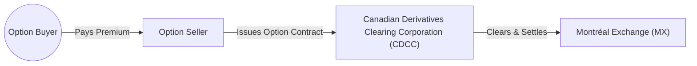

## 10.4 Options

Options are versatile derivative contracts that provide the holder with the right, but not the obligation, to buy or sell an underlying asset at a predetermined price on or before a specific date. In Canada, options are commonly traded on the Montreal Exchange (MX), with standardized terms and conditions. Their flexibility makes them especially useful for hedging portfolio risk or for taking speculative positions on the direction of markets.

This section will cover:  
• Fundamentals of options and their key terms  
• Types of options (calls and puts)  
• Major option uses, including hedging and speculation  
• An introduction to option pricing models  
• The Canadian regulatory and trading environment for options  
• Best practices, pitfalls, and real-world applications  

By the end of this chapter, you will have a thorough understanding of how options are structured, priced, and traded within Canada’s regulated markets, as well as how they can be integrated into investment strategies to manage risk and pursue potential gains.

---

## Understanding Options

### What Is an Option?

An option is a binding contract between two parties:  
• The option buyer (holder) obtains the right—without the obligation—to buy or sell an underlying asset at a set price (the strike price).  
• The option seller (writer) must fulfill the transaction if the buyer decides to exercise the right.  

Options come with an expiration date, after which they become worthless if not exercised. The option buyer pays a premium to the writer for this right.

### Key Terms and Definitions

• Strike Price: The price at which the underlying can be bought or sold if the option is exercised.  
• Expiration: The date by which the holder must exercise the option or let it expire.  
• Premium: The upfront cost paid by the option buyer to the option writer for the rights conferred by the contract.  
• Intrinsic Value: Any built-in profit in the option if it were exercised immediately. For a call, this is max(0, current underlying price – strike price). For a put, this is max(0, strike price – current underlying price).  
• Time Value: The portion of the option premium beyond intrinsic value, driven by factors such as time to expiration and implied volatility.

The total premium of an option is typically expressed as:  
Premium = Intrinsic Value + Time Value  

---

## Types of Options

### Call Options

A call option gives its holder the right to buy an underlying asset at the strike price. Investors often purchase call options when they anticipate an increase in the underlying’s price. For instance, if you purchase a call on shares of a major Canadian bank like RBC or TD, you expect that the stock will rise before the option expires.

• Profit Potential: If the underlying price rises above the strike price, the call option can become very profitable, as you can buy the underlying at a lower, predetermined price.  
• Risk for the Buyer: The maximum loss is limited to the premium paid.  
• Risk for the Writer: If the market price exceeds the strike price significantly, the writer could face substantial losses.

### Put Options

A put option grants the holder the right to sell an underlying asset at the strike price. Puts are frequently used for hedging: an investor can buy puts to protect a stock portfolio from a drop in market prices.

• Profit Potential: If the market price falls below the strike price, the put may become valuable because you can sell the underlying at a higher, predetermined price.  
• Risk for the Buyer: The maximum loss is limited to the premium paid.  
• Risk for the Writer: If the market price plunges significantly below the strike price, the writer could face large losses, as they must buy the asset at the (higher) strike price if the option is exercised.

---

## Common Uses of Options

### Hedging Strategies

Investors often use options to protect existing positions against adverse price movements. For example, a large Canadian pension fund with a substantial equity portfolio may purchase put options to insure against a sudden market downturn. This is called a protective put strategy.

• Example: If an investor holds 1,000 shares of a resource company listed on the TSX and worries about a short-term drop, they can buy puts on that company’s shares to ensure they can sell the shares at the strike price if the market falls.

### Speculative Strategies

Because of their leverage, options attract investors who want to profit from anticipated price moves with a limited initial investment. For instance, if an investor believes a Canadian technology stock will surge in the coming months, they can buy calls, potentially generating large gains while risking only the premium.

• Example: Suppose you believe ABC Tech (traded on the TSX) will rise from $40 to $50. Rather than buying 100 shares at $40 (cost: $4,000), you buy one call contract representing 100 shares for a premium of $2 per share ($200 total). If the stock goes to $50 before expiration, your call might be worth $1,000 or more, representing a substantially higher rate of return on your initial $200—albeit with the possibility of losing the entire premium if the stock fails to rise as expected.

---

## Option Pricing Models

### Factors Influencing Option Value

The value of an option depends on:

• Underlying Price: Higher for calls, lower for puts, all else being equal.  
• Strike Price: The closer the strike to the current market price, the greater the option’s cost.  
• Time to Expiration: The further away the expiration date, the more time value.  
• Volatility: Higher volatility usually increases option prices, reflecting a higher probability of large price moves.  
• Interest Rates: Typically have a minor effect but can influence forward prices and thus option premiums.  

### Black–Scholes–Merton (BSM) Model

This famous pricing model calculates the value of European-style calls and puts by considering the variables mentioned above. The formula, in simplified terms, is:

Let:  
• C = price of the call option  
• S = current price of the underlying  
• K = strike price  
• r = risk-free interest rate  
• σ = volatility  
• T = time to maturity (in years)  
• Φ = cumulative distribution function of a standard normal distribution  

Then,  
C = S Φ(d₁) – K e^(−rT) Φ(d₂)  

Where:  
d₁ = [ln(S/K) + (r + σ²/2)T] / [σ √T]  
d₂ = d₁ – σ √T  

Although real-world trading often involves American-style options (which can be exercised any time up to expiration), Black–Scholes–Merton provides a foundational framework. Many financial institutions, including RBC and TD, might use variations or more advanced models (e.g., binomial trees, Monte Carlo simulations) to value Canadian-traded options.

### Binomial Models

A binomial model breaks the time to expiration into discrete steps. At each step, the underlying price can move up or down by specified factors. Over multiple steps, this creates a “tree” of possible prices. Option values are found by backward induction, averaging discounted payoffs at each node.

• Advantages: Flexible with respect to exercise style and dividend assumptions.  
• Common Usage: Favored in academic and practitioner settings for teaching and testing hypothetical scenarios.

---

## Trading Options in Canada

### Montreal Exchange (MX)

Standardized equity options in Canada are primarily listed on the Montreal Exchange. The MX sets the contract size (typically 100 shares per contract), strike increments, and expiration cycles (monthly and/or quarterly expirations). Each option series is clearly defined by:  
• Underlying security  
• Strike price  
• Expiration date  
• Option type (call or put)  

### Clearing and Settlement

The Canadian Derivatives Clearing Corporation (CDCC) handles the clearing of equity and index options in Canada. The CDCC interposes itself as the counterparty to all parties in a trade, mitigating credit risk.

• Margin Requirements: Writers of options must deposit margin to ensure they can fulfill obligations, with margin determined by CDCC rules.  
• Settlement: If exercised, clearing is coordinated to deliver shares (for calls) or cash settlement (for some index options).

This simplified diagram shows how the option buyer purchases a standardized option from the writer through the exchange, with the CDCC ensuring the position is effectively guaranteed.

---

## Practical Applications and Examples

### Protective Put for Canadian Investors

Assume you hold 500 shares in a mid-cap Canadian mining firm, and the current market price is $30 per share. You are concerned that short-term volatility in global metal prices could negatively impact this stock.

• You buy 5 put option contracts (5 × 100 shares = 500 shares) with a strike price of $29, paying a premium of $1.50 per share.  
• If the stock drops below $29, your put becomes more valuable, offsetting the losses on the stock itself.  
• If the stock stays above $29, the maximum loss is the premium of $1.50 per share.

### Covered Call with Canadian Bank Stocks

You own 200 shares of a Canadian bank trading at $80. You want extra income and are willing to potentially sell your shares at $85.

• You write (sell) 2 call contracts with a strike price of $85, receiving a premium of $2.00 per share (total premium = $2.00 × 200 = $400).  
• If the stock stays below $85 at expiration, you retain the premium as extra income.  
• If the stock surpasses $85 and the calls are exercised, you’ll sell your shares at $85 but keep the premium.

Covered calls are popular among investors seeking additional income on stable or slowly appreciating stocks. Many advisors in Canada use covered calls on blue-chip stocks like RBC or TD.

---

## Best Practices and Common Pitfalls

1. Understand the Risks: While maximum loss for buyers is limited to the premium, option writers can face substantial risks.  
2. Watch Volatility and Time Decay: An option’s value can erode quickly if the underlying fails to move in the predicted direction within the expected timeframe.  
3. Use Stress Tests: Before entering an option position, consider how your portfolio will behave if market conditions fluctuate sharply.  
4. Strive for Liquidity: In fast-moving markets, having a liquid underlying (e.g., a highly traded TSX stock) is crucial.  
5. Stay Informed About Taxes: Gains and losses on options can have distinct tax treatments in Canada. Consult guidelines on short-term gains, capital gains, or income classification.  

---

## Regulatory Environment and Resources

The Canadian Investment Regulatory Organization (CIRO) oversees the conduct of market participants. For listed options, the Montreal Exchange (MX) enforces its own rules aligned with CIRO’s guidelines.

Key resources for further study include:  
• Montreal Exchange (MX) – Options product specifications and educational resources:  
  → https://www.m-x.ca  
• Canadian Derivatives Clearing Corporation (CDCC) – Margin requirements and clearing processes:  
  → https://www.cdcc.ca  
• Black–Scholes–Merton Implementations – Open-source code in R, Python, and C++ repositories (e.g., GitHub):  
  → Example Python library: https://github.com/quantlib/QuantLib  
• Sheldon Natenberg’s “Option Volatility & Pricing” – Specialized text on volatility strategies and pricing.  

---

## Summary

Options are powerful tools that can help investors mitigate risks or speculate on price movements with a portion of capital relative to direct investment in the underlying. Calls and puts, the two main types of options, offer flexibility and leverage but also require a thorough understanding of pricing concepts such as intrinsic value, time value, and implied volatility. In Canada, standardized options trading on the Montreal Exchange is governed by strict regulations and cleared by the CDCC, ensuring efficient and reliable transactions.

Investors looking to hedge Canadian portfolios or engage in more advanced speculative strategies should become comfortable with how options work, how their values are determined, and which strategies suit their market outlook and risk tolerance. By mastering these concepts, you can effectively integrate options into your broader investment plan, whether you aim to protect existing positions or capitalize on anticipated market swings.

---

## Test Your Knowledge of Canadian Options: Calls, Puts, and Key Concepts



### Which statement best describes an option contract?

- [x] It grants the buyer the right, but not the obligation, to buy or sell an underlying asset at a set price.  
- [ ] It obligates both the buyer and the seller to complete the trade at maturity.  
- [ ] It is only available for stocks on U.S. exchanges.  
- [ ] It contains no time element.  

> **Explanation:**( An option contract provides the buyer with a right, but not an obligation. The seller has the obligation if the buyer exercises.)

### What is a primary motivation for buying a put option in a Canadian portfolio?

- [x] To hedge against potential declines in the underlying asset’s price  
- [ ] To speculate on price increases in the underlying asset  
- [ ] To earn dividend income  
- [ ] To remove market risk entirely  

> **Explanation:**( Purchasing puts is a common hedging strategy to protect against falling prices. Although it cannot remove all risk, it helps mitigate downside losses.)

### In the context of option pricing, “time value” refers to:

- [x] The portion of an option’s premium above intrinsic value, influenced by volatility and expiration.  
- [ ] The difference between the current underlying price and the strike price.  
- [ ] The interest earned on the strike price.  
- [ ] The exact number of days left until expiration, multiplied by volatility.  

> **Explanation:**( Time value is the extra premium beyond intrinsic value due to the probability of future price movement and remaining time until expiration.)

### Which of the following is true for a covered call?

- [x] The call is written against an existing position of the underlying asset.  
- [ ] The call writer must buy the shares at the strike price.  
- [ ] It is the same as a protective put strategy.  
- [ ] It involves buying a call, not selling one.  

> **Explanation:**( A covered call involves writing (selling) calls on a stock you already own. The underlying shares “cover” the potential obligation to deliver if exercised.)

### When trading a call option on the Montreal Exchange, which organization is primarily responsible for clearing and settlement?

- [x] The Canadian Derivatives Clearing Corporation (CDCC)  
- [ ] The Canadian Investment Regulatory Organization (CIRO)  
- [ ] The Ontario Securities Commission (OSC)  
- [ ] The Toronto Stock Exchange (TSX)  

> **Explanation:**( The CDCC is responsible for clearing and settling trades for standardized options in Canada.)

### What is the maximum loss incurred by the buyer of a call option?

- [x] The premium paid  
- [ ] The difference between the stock price and the strike price  
- [ ] There is no limit to the loss  
- [ ] The intrinsic value of the option  

> **Explanation:**( For an option buyer, the total loss is limited to the premium paid if the option expires worthless.)

### Which of the following factors typically increases the price of an option according to the Black–Scholes–Merton model?

- [x] Higher volatility of the underlying asset  
- [ ] Lower time to expiration  
- [x] Increase in the underlying’s dividend yield  
- [ ] A stable underlying price with minimal movement  

> **Explanation:** An increase in volatility tends to elevate option prices. Dividend yield can sometimes decrease call prices in a real-world setting, but under certain assumptions, it might enter pricing in more complex ways. However, in the simplest classical sense, higher anticipated movement (volatility) leads to higher option premiums.

(Note: This question has two correct marks to reflect nuance. In some models, higher dividends can actually dampen a call’s price slightly. In advanced contexts, though, certain design assumptions might alter that effect. The key idea is that volatility unequivocally increases both put and call valuations.)

---

### What is a practical use of a protective put?

- [x] Limiting downside risk for a holding of the underlying shares  
- [ ] Guaranteeing earning dividends on the underlying stock  
- [ ] Generating additional income from a stagnant stock  
- [ ] Rolling forward an option that’s about to expire  

> **Explanation:**( A protective put is purchased to limit downside risk—like an insurance policy—on an existing long position in the underlying asset.)

### Which of the following best describes the binomial model for option pricing?

- [x] It models price moves at discrete intervals, building a tree of possible outcomes.  
- [ ] It is the standard for American Treasury bond quotations.  
- [ ] It ignores volatility and assumes the underlying price is constant.  
- [ ] It cannot handle early exercise features.  

> **Explanation:**( The binomial model separates the time period into discrete steps, allowing either an up or down move in each step, and can handle American-style early exercise.)

### The intrinsic value of a call option at expiration is positive if:

- [x] True  
- [ ] False  

> **Explanation:** At expiration, the intrinsic value of a call is max(0, underlying price – strike price). If that difference is positive, the option expires in-the-money with a tangible payoff.



---

