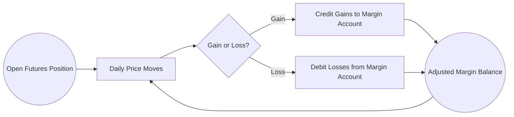

## 10.5 Forwards and Futures

In the world of derivatives, forwards and futures are two of the most practical and versatile instrument types for hedging, risk management, and speculative activities. In this section, we examine both forward and futures contracts in detail, focusing on their structures, uses, benefits, and challenges, particularly as they apply within the Canadian market. We will also explore specific examples involving major financial institutions such as RBC or TD, and review official Canadian regulations, including margin guidelines from the Canadian Derivatives Clearing Corporation (CDCC).

---

## Introduction to Forwards and Futures

Both forwards and futures are derivative contracts that obligate two parties to buy or sell an underlying asset at a specified price (the “forward price” or “futures price”) on a defined future date. The underlying asset can be a commodity, an interest rate, a currency, or even a stock index. While forwards and futures share common foundational concepts, there are important differences in how they are structured, traded, and settled.

### Key Terminology

• Underlying Asset: The financial instrument or commodity that underpins the derivative contract (e.g., crude oil, foreign currency, government bonds).  
• Expiration Date: The date on which the contract must be settled or delivered.  
• Settlement: The final conclusion of the contract, which can involve physical delivery of the asset or a cash payment (cash settlement).  
• Counterparty Risk: The risk that one of the parties to the contract will not fulfill their part of the agreement.  
• Marking to Market: The process of adjusting the value of a futures contract each day to reflect changes in the underlying asset’s price.

---

## Forwards: Essential Concepts

A forward contract is a customized agreement, negotiated privately between two parties, to buy or sell an underlying asset at a specified price on a future date. Unlike futures, forwards are traded over-the-counter (OTC) rather than on an exchange. This customization can be useful for organizations or investors who have unique hedging requirements.

### Characteristics of Forward Contracts

• Privately Negotiated  
• Customized Terms (quantity, quality, delivery locations)  
• Not Standardized  
• Settlement Occurs at Maturity (no daily marking to market)  
• Counterparty Risk is Present

As an example, a Canadian grain producer may enter into a forward contract with a local mill to lock in the sale price of wheat at harvest time. Because the contract is privately negotiated, it can specify delivery location, quality of the wheat, and other tailored conditions that might not be available in a standardized future.

### Uses and Advantages

1. Hedging:  
   A forward agreement allows hedgers (e.g., manufacturers, exporters, farmers) to lock in prices for commodities or currencies. As a result, these organizations can mitigate the risk posed by price fluctuations over time.

2. Customization:  
   Because forward contracts are negotiated directly, the contract terms can be adapted to specific needs, making them suitable for businesses with complex or niche requirements.

3. Specific Delivery Conditions:  
   The forward can outline the exact specifications required for delivery, including quantity, grade, or settlement date.

### Risks and Challenges

• Counterparty Risk:  
  Since forwards are OTC contracts, there is no exchange or clearinghouse to guarantee performance. If one party cannot fulfill its obligations, the other party may face losses.

• Liquidity Risk:  
  Forward contracts are often illiquid, and exiting a forward position before maturity can be difficult or costly.

• Regulatory Oversight:  
  OTC markets are generally less regulated than exchange-traded markets, though large financial institutions in Canada are still subject to oversight from regulatory bodies like the Office of the Superintendent of Financial Institutions (OSFI).

---

## Futures: Essential Concepts

A futures contract is similar to a forward contract in that it involves a commitment to buy or sell an asset at a predetermined price on a future date. However, futures are standardized and traded on regulated exchanges such as the Montreal Exchange. The most notable differences from forwards include standardization, daily marking to market, and the presence of a clearinghouse.

### Characteristics of Futures Contracts

• Standardized Terms (contract size, delivery quality, settlement date)  
• Exchange-Traded (e.g., the Montreal Exchange)  
• Daily Marking to Market  
• Clearinghouse Guarantees Performance (e.g., the Canadian Derivatives Clearing Corporation, CDCC)  
• Lower Counterparty Risk

Futures exist for a variety of underlying assets. Canadian traders often use interest rate futures, equity index futures, or commodity-linked futures. For instance, the Montreal Exchange offers interest rate futures contracts based on Government of Canada bond yields.

### How Futures Work: Daily Marking to Market

Unlike forwards, futures contracts are “marked to market” at the end of each trading day. Any gains or losses in the contract’s value are posted automatically to each participant’s margin account. This mechanism ensures that losses are handled incrementally, reducing the risk of a catastrophic default at contract maturity.

To visualize the marking-to-market process, consider the following diagram:

• Margin Account: Traders deposit an initial margin (collateral) and must maintain a minimum maintenance margin. If the contract moves against their position, they may receive a “margin call” requiring them to replenish the margin account.  
• Collateral Management: Because of daily marking to market, large losses are less likely to accumulate unchecked.

### Role of the Clearinghouse (CDCC)

The clearinghouse, such as the Canadian Derivatives Clearing Corporation (CDCC), acts as the buyer to every seller and the seller to every buyer. If a participant defaults, the clearinghouse absorbs the risk and uses its reserve funds to fulfill the contract. This centralized system effectively removes counterparty risk from individual market participants.

### Uses and Advantages

1. Hedging:  
   Canadian pension funds, banks, and corporations frequently use futures to hedge interest rate risks, currency exposures, or commodity price risks.

2. Price Discovery:  
   Because futures markets are highly transparent and liquid, they provide efficient price-discovery mechanisms.

3. Liquidity & Ease of Entry/Exit:  
   Futures exchanges are generally more liquid than OTC forward markets. Participants can typically offset their positions before expiration, facilitating risk management in real time.

4. Regulatory Framework:  
   Futures trading is regulated by the exchange itself and agencies like the Investment Industry Regulatory Organization of Canada (IIROC), providing investors with confidence in market integrity.

### Risks and Challenges

• Basis Risk:  
  The difference between the spot price and futures price may fluctuate, introducing an imperfect hedge.

• Margin Calls:  
  Traders must maintain adequate margin. Rapid market movements can trigger frequent margin calls, requiring additional capital.

• Contract Standardization:  
  Contracts may not perfectly match the hedger’s needs (delivery location or quality specification), resulting in a less precise hedge.

---

## Practical Examples in Canadian Finance

### Hedging Interest Rate Risk with Futures

Example: A Canadian bank, such as RBC, may use Government of Canada bond futures to hedge against falling bond prices ahead of an interest rate announcement by the Bank of Canada. By shorting the appropriate futures contract, the bank profits on the futures position if rates rise and bond prices fall, offsetting losses in its bond portfolio.

### Currency Hedging for Exporters

Canadian exporters receiving U.S. dollars in future sales may hedge currency exposure by entering into a forward or futures contract to lock in the CAD/USD exchange rate. If the exporter is concerned about any liquidity constraints or wants to avoid counterparty risk, a futures contract on the Montreal Exchange could be an ideal solution.

### Commodity Risk for Agricultural Producers

A wheat farmer in Saskatchewan may prefer a forward contract with a local processor to precisely match delivery grades and timelines. This forward arrangement ensures the farmer knows the price beforehand, reducing uncertainty and stabilizing income.

---

## Step-by-Step Guidance: Setting up a Futures Hedge

Below is a simplified guide to implementing a futures hedge using interest rate futures listed on the Montreal Exchange:

1. Identify Risk  
   Determine the specific interest rate exposure. For instance, you hold a portfolio of 10-year Government of Canada bonds vulnerable to rising interest rates.  
2. Calculate Hedge Ratio  
   Estimate the number of futures contracts necessary to hedge the portfolio. This involves duration calculations, or use of open-source tools such as Python’s QuantLib library.  
3. Open a Futures Account  
   Work with an investment dealer to open a margin account. Follow the dealer’s and CDCC’s margin guidelines.  
4. Place the Futures Order  
   Example: Sell (short) a specified number of 10-year Government of Canada bond futures.  
5. Monitor Daily Mark-to-Market  
   Observe gains or losses posted to your margin account each day.  
6. Adjust Position if Needed  
   If exposure changes or if you want to tweak your hedge, you can buy or sell more futures contracts.  
7. Close or Roll Over Futures Position  
   If you wish to keep the hedge for a longer time, you can roll it over into the next contract month. Or you can close the position if the risk has passed.

---

## Best Practices and Pitfalls

### Best Practices

• Diversify Your Hedging Instruments  
  Avoid relying on a single type of derivative for hedging. Utilize both forwards and futures as appropriate for your organization’s needs.  

• Maintain Adequate Margin  
  Always uphold margin requirements to avoid forced liquidations of your position.  

• Continuous Monitoring  
  Effective hedges require monitoring both the underlying assets and market conditions.  

• Leverage Technology and Analytics  
  Tools like Python’s Pyfolio or QuantLib can assist with analyzing historical performance, stress testing, and calculating Value at Risk (VaR).

### Common Pitfalls

• Over-Hedging or Under-Hedging  
  Ensure that the hedge ratio accurately reflects your exposure.  

• Ignoring Basis Risk  
  Even a well-planned hedge can fail if the futures price does not move in tandem with the spot price.  

• Regulatory Non-Compliance  
  Stay informed about the latest IIROC or CDCC regulations and reporting requirements. This is key for institutions with large derivative exposures.

---

## Regulatory Landscape in Canada

In Canada, derivatives markets—particularly futures—are regulated by provincial authorities, self-regulatory organizations (SROs), and the exchanges themselves. The Montreal Exchange is the principal marketplace for exchange-traded derivatives in Canada. The Canadian Derivatives Clearing Corporation (CDCC) handles clearing and settlement services for these contracts. Participants should consult:

• The Montreal Exchange (www.m-x.ca) for contract specifications and trading rules.  
• CDCC margin guidelines (www.cdcc.ca) for clearing and settlement procedures.  
• The Bank of Canada (www.bankofcanada.ca) website for information on interest rates and yield curves.

---

## Additional Resources and Tools

• Bank of Canada Publications: Stay updated on interest rate announcements, monetary policy reports, and yield curve data.  
• Open-Source Libraries:  
  – Python’s QuantLib for fixed-income analytics, interest rate curve construction, and derivatives valuation.  
  – Pyfolio for performance analysis of trading strategies, including futures-based hedges.  
• Montreal Exchange: Detailed contract specifications for equity index futures, interest rate futures, and ETF options.  
• Global Comparisons: While the focus in this section is on Canada, you may find additional perspectives by looking at global futures markets such as the Chicago Mercantile Exchange (CME).

---

## Conclusion and Key Takeaways

For both individual investors and large financial institutions in Canada, forwards and futures remain vitally important for hedging against price fluctuations and managing various forms of risk. Forwards offer customization in OTC markets while futures provide liquidity, standardized contracts, and daily marking to market under the umbrella of exchange clearinghouses. A thorough understanding of how each product works, as well as the associated risks and regulations, is essential for effective and responsible use in the dynamic Canadian financial landscape.

---

## Test Your Knowledge: Forwards & Futures in the Canadian Derivatives Market



### Which statement best describes the difference between forwards and futures?

- [x] Futures are exchange-traded and marked to market, while forwards are OTC contracts with no daily settlement.
- [ ] Forwards are standardized and traded on regulated exchanges, while futures are privately negotiated.
- [ ] Forwards are regulated by CDCC, while futures remain unregulated in Canada.
- [ ] Futures cannot be used for hedging currency exposures, unlike forwards.

> **Explanation:** Forwards are privately negotiated (OTC) contracts and are settled at maturity with no daily marking to market. Futures are standardized and cleared through an exchange with daily marking to market.

### What primary advantage does daily marking to market offer futures participants?

- [x] It allows gains or losses to be recognized and settled on a daily basis, reducing counterparty default risk.
- [ ] It locks in a fixed premium at the start of the contract.
- [x] It guarantees that futures contracts will be held until expiration.
- [ ] It makes futures illiquid.

> **Explanation:** Daily marking to market ensures that any losses are settled as they occur, minimizing the buildup of large unsecured exposures that could lead to defaults.

### What is a key risk associated with forward contracts?

- [x] Counterparty risk, because there is no central clearinghouse in OTC markets.
- [ ] High regulatory fees charged by the Montreal Exchange.
- [ ] No customization for the underlying asset or contract size.
- [ ] Daily margin calls triggered by price movements.

> **Explanation:** Forwards, traded OTC, do not benefit from a clearinghouse guarantee. If one party defaults, the other party bears all losses.

### Why might a Canadian agricultural producer choose to use a forward contract instead of a futures contract?

- [x] The producer may need customized terms (such as delivery location and quality specifications) not offered by a standardized futures contract.
- [ ] Futures contracts prohibit agricultural producers from hedging.
- [ ] Forward contracts eliminate all price risk.
- [ ] Forward contracts don’t need to be settled at maturity.

> **Explanation:** One of the main advantages of forward contracts is that they can be tailored to suit specific needs, such as exact delivery terms, which might not be available in standardized futures.

### What happens to a futures position that experiences a loss after the daily settlement (mark-to-market) process?

- [x] The loss is debited from the trader’s margin account.
- [ ] The entire contract terminates immediately.
- [x] The contract reverts to a forward arrangement.
- [ ] The trader’s margin requirement is reduced.

> **Explanation:** The daily mark-to-market system requires that all losses be deducted from the trader’s margin account, ensuring that the clearinghouse is protected from building credit risk.

### Which entity in Canada acts as the central counterparty for exchange-traded derivatives?

- [x] The Canadian Derivatives Clearing Corporation (CDCC).
- [ ] The AMF (Autorité des marchés financiers).
- [ ] The Bank of Canada.
- [ ] OSFI (Office of the Superintendent of Financial Institutions).

> **Explanation:** The CDCC is the clearinghouse that serves as the buyer to every seller and the seller to every buyer for derivatives traded on the Montreal Exchange.

### Which of the following best describes the concept of “basis risk” in futures hedging?

- [x] The risk that the futures price and the spot price of the underlying asset may not move in perfect correlation.
- [ ] The risk that the exchange might raise margin requirements overnight. 
- [x] The risk that you cannot find a buyer for your futures contract.
- [ ] The risk that the underlying asset disappears.

> **Explanation:** Basis risk arises when the spot and futures prices do not move identically, potentially leaving a residual gain or loss despite the hedge.

### Which statement is true of futures contracts on the Montreal Exchange?

- [x] They are standardized and regulated, reducing counterparty risk for participants.
- [ ] They are exclusive to foreign currency only.
- [ ] They require physical delivery in every case.
- [ ] They require no margin to trade.

> **Explanation:** Futures contracts on the Montreal Exchange are standardized, benefit from the regulatory oversight, and participants face reduced counterparty risk thanks to the clearinghouse structure.

### How do most Canadian exporters hedge foreign currency risk using derivatives?

- [x] By using forwards or futures to lock in exchange rates, reducing uncertainty in CAD receipts.
- [ ] By investing all receipts in local stocks on the TSX.
- [ ] By buying commodity-linked exchange-traded funds (ETFs).
- [ ] By opting for covered calls on fixed-income securities.

> **Explanation:** Canadian exporters often use forward or futures contracts to manage currency volatility and ensure more predictable cash flows in Canadian dollars.

### In a futures contract, marking to market occurs:

- [x] True
- [ ] False

> **Explanation:** Futures contracts must be marked to market daily per exchange rules, ensuring that losses and gains are credited or debited promptly.



---

## For Additional Practice and Deeper Preparation

**Elevate your exam readiness with our comprehensive app, "Securities CA: Mock Exams," designed to challenge and refine your skills.**

* **Master Challenging Questions:** Dive into expertly crafted sample exam questions that go beyond standard references.
* **Scenario-Driven Learning:** Experience scenario-driven case questions and in-depth solutions to build practical expertise.
* **Sharpen Exam Strategies:** Build confidence with step-by-step explanations designed to refine your exam-day tactics.
* **Gain Real-World Insights:** Acquire practical tips and detailed rationales that demystify complex concepts.
* **CIRO and CSI Alignment:** Stay current with CIRO guidelines and CSI’s exam structure, with questions intentionally more challenging than the actual exam.

**Download the App Today:**

> Note: While these courses are specifically crafted to align with the CSC® exams outlines, they are independently developed and not endorsed by CSI or CIRO.
