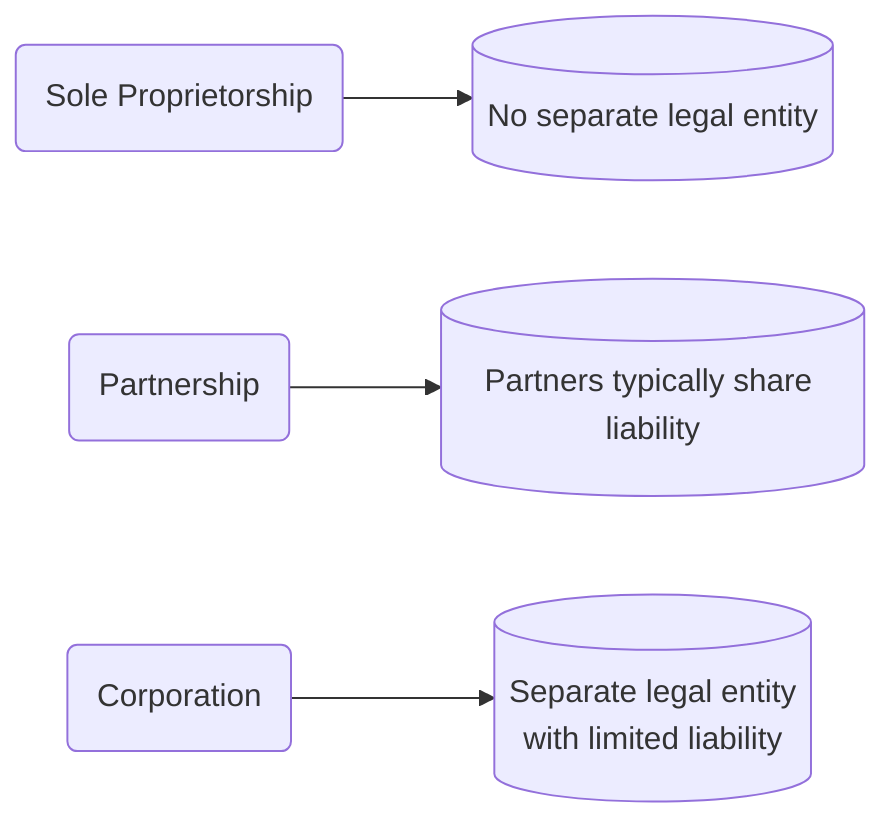
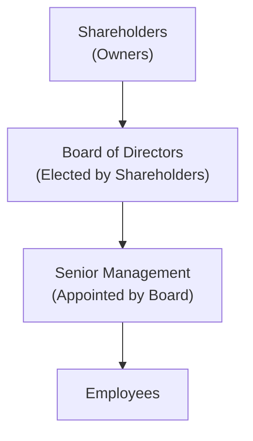

## 11.1 Corporations and Their Structure

In Canada, business owners can choose among several organizational structures, each with its own advantages and implications for liability, taxation, governance, and funding. The primary types of business structures are:

• Sole Proprietorship  
• Partnership  
• Corporation  

This section focuses on the corporate form—its unique features, governance framework, and the ways Canadian corporations are regulated. We will begin with an overview of how corporations differ from other business entities and then explore the internal and external mechanisms that guide their operations.

---

### Comparing Key Business Structures

Before concentrating on corporations, it is helpful to understand how they compare to the other main Canadian business forms.

#### Sole Proprietorship
• Operated by a single individual (the “proprietor”).  
• The proprietor and the business are considered the same legal entity for liability purposes.  
• The proprietor bears unlimited personal liability for the debts of the business.  
• Receives all profits and is personally taxed on business income.  
• Easy and inexpensive to start, but limited in terms of accessing external capital (e.g., large loans or public investments).

#### Partnership
• Formed by two or more individuals (or entities) who share ownership.  
• Partners ordinarily have joint and several liability, meaning they share responsibility for the partnership’s debts.  
• Profits flow through to partners, who are individually taxed.  
• More potential for capital than a sole proprietorship, but disagreements and liability complexities can arise.  
• In limited partnerships (LPs) or limited liability partnerships (LLPs), certain partners enjoy limited liability status while at least one partner remains fully liable in an LP, or unlimited liability is somewhat mitigated in professional LLPs.

#### Corporation
• A separate legal entity, distinct from its owners (shareholders).  
• Enjoys many of the rights and responsibilities of a natural person (e.g., it can sue, be sued, own property, and enter contracts).  
• Offers limited liability to shareholders, who are generally responsible only up to the amount of their investment.  
• Has the potential to raise large amounts of capital by issuing shares or debt instruments to the public or private investors.  
• More complex and costly to start, operate, and maintain, especially for those seeking public financing, due to regulatory requirements and compliance costs.

Below is a simplified visualization of how each business structure relates to its owners with respect to liabilities and separate legal existence.

---

### Corporations as Separate Legal Entities

A corporation is established under federal (e.g., the Canada Business Corporations Act) or provincial legislation. Once incorporated, the corporation exists independently from its founders and shareholders. This concept of separate legal entity means:

1. **Limited Liability**: Shareholders’ financial liability is confined to their share investment. If a corporation faces bankruptcy, shareholder personal assets generally are not at risk beyond the value of their stock.  
2. **Perpetual Existence**: A corporation’s existence does not depend on the participation or life span of any particular shareholder. Shares can be transferred or sold without dissolving the corporation.  
3. **Ability to Raise Capital**: Corporations can raise funds by issuing shares (equity financing) or bonds (debt financing). Public corporations often trade shares on exchanges such as the Toronto Stock Exchange (TSX), making it easier to attract broad investor interest.

---

### Essential Participants in a Corporate Structure

A corporation’s governance is built upon a clear hierarchy. Understanding these different roles is crucial for recognizing how decision-making power flows within a corporate framework.

1. **Shareholders (Owners)**  
   • Provide capital by purchasing shares of the company.  
   • Participate in the profits of the corporation, usually through dividends or capital gains when shares appreciate in value.  
   • Have voting rights on key matters, including electing the Board of Directors.  

2. **Board of Directors (Elected by Shareholders)**  
   • Sets the firm’s strategic direction and major policies.  
   • Has the power to appoint and replace senior management.  
   • Owes a fiduciary duty to act in the corporation’s best interest, aligning strategy and operations with shareholder interests.  

3. **Senior Management (Appointed by the Board)**  
   • Implements the strategies and policies defined by the Board.  
   • Oversees daily operations, financial decisions, and supervises employees in all departments (finance, marketing, operations, etc.).  
   • Includes officers such as the Chief Executive Officer (CEO), Chief Financial Officer (CFO), and Chief Operating Officer (COO).  

4. **Employees**  
   • Carry out the day-to-day functions that keep the business operational.  
   • Benefit from the direction provided by senior management.

---

### Types of Corporations: Private vs. Public

Corporations vary in size, ownership structure, and the extent to which they must comply with regulatory requirements. Two main categories are:

1. **Private (Closely Held) Corporations**  
   • Shares are not traded on a public exchange, and ownership is often confined to a few individuals (e.g., family members, small investor groups).  
   • Disclosures are typically more limited, though basic reporting requirements still apply.  
   • Access to capital can be more difficult, as private corporations often rely on personal networks, private equity, or bank loans.

2. **Public (Widely Held) Corporations**  
   • Shares trade on public stock exchanges (e.g., TSX).  
   • Subject to more extensive regulatory filing requirements, such as continuous disclosure (annual and quarterly financial statements, material change reports, etc.) to ensure transparency for the investing public.  
   • Easier access to capital through large pools of investors.  

Examples in Canada include established corporations such as RBC (Royal Bank of Canada) and TD (Toronto-Dominion Bank), which trade on the TSX and NYSE, requiring strict adherence to continuous disclosure regimes.

---

### Corporate Bylaws and Governance Policies

At the heart of a corporation’s day-to-day administration are its bylaws. These rules, approved by shareholders, outline procedures related to:

• Convening and conducting shareholder and director meetings.  
• Setting voting procedures for shareholders.  
• Defining the structure of the Board of Directors and committees.  
• Establishing roles and responsibilities for officers and key organizational practices.

In addition to bylaws, many corporations adopt **corporate governance guidelines**—codes of ethics, conflict-of-interest policies, and detailed financial oversight roles. These guidelines help ensure that management decisions stay aligned with the corporation’s best interests and regulatory standards.

---

### Corporate Governance and Regulatory Compliance

#### Canadian Regulators
When a corporation decides to raise capital by selling securities to the public, it must comply with requirements enforced by agencies under the umbrella of the **Canadian Securities Administrators (CSA)**. Specific provinces may have their own commissions, such as:

• **Ontario Securities Commission (OSC)**  
• **Authorité des marchés financiers (AMF)** in Québec  
• **British Columbia Securities Commission** (BCSC)

Meanwhile, the **Canadian Investment Regulatory Organization (CIRO)** regulates investment dealers and mutual fund dealers to ensure consumer protection and market integrity. Public corporations are expected to follow stringent rules for disclosures, insider trading, and market fairness.

#### Corporate Governance Guidelines
Most corporate governance guidelines in Canada encourage best practices, including:

• Establishing independent Board committees (e.g., Audit Committee, Corporate Governance Committee).  
• **Transparency** in accounting and financial reporting.  
• Mandatory codes of ethics for directors and officers.  
• Effective internal controls to detect fraud and ensure compliance with securities regulations.

The **Ontario Securities Commission** publishes corporate governance guidelines that strongly influence board composition, risk management policies, and disclosure requirements.

---

### Practical Considerations and Real-World Scenarios

#### Raising Capital: Private vs. Public Routes
• A Canadian startup might begin as a private corporation funded by friends, family, and angel investors. Over time, if the company’s growth requires significant capital, it may go through an initial public offering (IPO) to broaden its shareholder base and attract institutional investors such as Canadian pension funds.  
• Major banks or large publicly listed corporations may continuously raise capital through new share offerings or bonds, benefiting from high levels of transparency and brand credibility in the Canadian market.

#### Limited Liability in Action
• Suppose a Canadian technology firm faces litigation due to product liability claims. Its shareholders, while exposed to potential share value declines, are generally insulated from personal financial liability.  
• This separation of liability encourages broader participation in the capital market, fostering entrepreneurial ventures that drive economic growth.

#### Corporate Governance Best Practices
• RBC’s Board of Directors regularly reviews risk management policies, ensuring compliance with oversight bodies such as the OSFI (Office of the Superintendent of Financial Institutions) and CIRO.  
• TD requires conflict-of-interest disclosures from top executives to prevent situations where personal interest conflicts with corporate duties.

---

### Applying the Concepts: Step-by-Step Guidance

1. **Choosing the Right Structure**  
   • An entrepreneur must decide whether to register a sole proprietorship, partnership, or corporation. Factors like risk tolerance, funding needs, and limitations on personal liability play a vital role in making this decision.

2. **Incorporation Process**  
   • Prepare and file Articles of Incorporation under the relevant legislation (federal or provincial).  
   • Draft bylaws that detail the governance procedures.  
   • Issue initial shares to founders and investors.

3. **Establishing Corporate Governance**  
   • Elect a Board of Directors that possesses the necessary expertise.  
   • Create committees (e.g., Audit Committee) where required.  
   • Adopt a code of ethics and policies that address potential conflicts of interest, insider trading, and other compliance concerns.

4. **Regulatory Compliance**  
   • If seeking public financing, file a prospectus with the provincial securities commissions.  
   • Provide continuous disclosures (annual and quarterly financial statements, material change reports) once publicly listed.  
   • Follow CIRO guidelines if trading in mutual funds or as an investment dealer.

5. **Ongoing Operations**  
   • Prepare annual financial statements in compliance with IFRS or ASPE (Canadian Accounting Standards for Private Enterprises) depending on public vs. private status.  
   • Conduct annual shareholder meetings, present audited financial statements, and re-elect directors.

---

### Common Pitfalls and Strategies to Overcome Them

• **Insufficient Governance Structure**: A poorly structured Board or unclear bylaws may slow decision-making and increase legal vulnerabilities. → Strategy: Seek professional legal advice to draft robust bylaws and establish well-structured governance.  
• **Resistance to Transparency**: Private owners sometimes hesitate to provide detailed disclosures, which may limit access to outside capital. → Strategy: Adopt transparent practices to build investor confidence, even if you remain private.  
• **Non-Compliance with Regulatory Requirements**: Failure to file continuous disclosures or meet CIRO regulations can lead to penalties or trading halts. → Strategy: Implement an internal compliance function and consult with securities law professionals.

---

### Glossary

• **Legal Entity**: An organization (e.g., corporation) with rights and responsibilities at law, separate from its owners or members.  
• **Limited Liability**: A legal principle by which a shareholder’s financial exposure is capped at the amount invested; personal assets are shielded in the event of corporate losses.  
• **Corporate Bylaws**: Operational rules established by shareholders that guide how a corporation holds meetings, votes on decisions, and designates managerial roles.  
• **Board of Directors**: The group of individuals elected by shareholders to oversee the strategic vision, major policies, and leadership appointments of a corporation.

---

### Additional Resources

Below are references and resources that offer deeper insights into forming and managing corporations in Canada:

• **Canada Business Corporations Act** (Federal):  
  https://laws-lois.justice.gc.ca/eng/acts/C-44/  

• **Canadian Investment Regulatory Organization (CIRO)**:  
  https://www.ciro.ca/  

• **Corporate Governance Guidelines – Ontario Securities Commission**:  
  https://www.osc.ca/  

• **“The Corporation” by John Micklethwait and Adrian Wooldridge**  
  A thorough exploration of the history and evolution of corporations globally.

• **Open-Source Financial Tools**  
  • *GNUCash* – for small-scale corporate bookkeeping.  
  • *Ledger-cli* – a command-line double-entry accounting system.  

---

## Test Your Knowledge: Corporate Structures and Governance Quiz



### Which statement best describes a corporation’s legal status compared to a sole proprietorship?

- [ ] They share unlimited liability with shareholders.
- [x] It is a separate legal entity with limited liability for shareholders.
- [ ] It cannot own property or enter into legal contracts.
- [ ] It is fully liable for the personal debts of its founders.

> **Explanation:** A corporation is considered a separate legal entity from its shareholders, providing limited liability for owners.  

### Which of the following roles is typically elected by shareholders?

- [ ] Chief Executive Officer (CEO)
- [ ] Chief Financial Officer (CFO)
- [x] Board of Directors
- [ ] Senior Management Team

> **Explanation:** The Board of Directors is elected by shareholders and is responsible for overseeing major corporate decisions and hiring executive management.  

### Which is an advantage of a private (closely held) corporation?

- [ ] Greater ease of raising capital compared to public corporations.
- [x] More confidentiality of operating details and minimal public disclosures.
- [ ] Mandatory listing on major stock exchanges.
- [ ] Strict continuous disclosure requirements.

> **Explanation:** Private corporations keep operations confidential since they are not subject to public disclosure rules like public companies.  

### What is the main reason that public corporations have more stringent reporting requirements?

- [x] They issue shares to the public and must protect investors.
- [ ] They intend to remain small and closely held.
- [ ] They are organized as sole proprietorships.
- [ ] They are limited liability partnerships.

> **Explanation:** Public corporations issue shares to general investors, requiring transparent reporting to safeguard shareholders’ interests and comply with securities regulations.  

### What is a key function of corporate bylaws?

- [x] Defining how meetings are held and voting procedures are conducted.
- [ ] Approving major acquisitions and mergers.
- [x] Determining Board oversight and corporate governance policies.
- [ ] Determining personal tax obligations of shareholders.

> **Explanation:** Bylaws provide detailed rules on internal operations (such as meetings, voting, and managerial duties) and uphold strong governance mechanisms.  

### Why is limited liability so critical to the corporate structure?

- [x] It protects shareholders from losses beyond the amount of their investment.
- [ ] It reduces the corporate income tax rate.
- [ ] It limits directors’ fiduciary responsibilities.
- [ ] It eliminates all obligations to creditors.

> **Explanation:** Limited liability ensures shareholders’ personal assets are protected if the corporation cannot meet its debts or faces litigation.  

### What is a common challenge for private corporations compared to public corporations?

- [x] Difficulty attracting large-scale financing.
- [ ] Excessive disclosure obligations.
- [x] Frequent shareholder turnover.
- [ ] The inability to distribute dividends.

> **Explanation:** Private corporations often rely on personal networks or bank loans to raise money, making it challenging to access the vast capital markets available to public corporations.  

### Which entity is responsible for appointing senior management?

- [ ] Shareholders
- [x] Board of Directors
- [ ] Creditors
- [ ] Regulators

> **Explanation:** The Board hires and supervises senior management, ensuring they adhere to the corporation’s strategic goals.  

### For a corporation publicly listed on the Toronto Stock Exchange (TSX), which statement is true?

- [x] It must file annual and quarterly financial statements and disclose material changes.
- [ ] It faces no oversight from provincial securities commissions.
- [ ] Its shares are private and cannot be traded publicly.
- [ ] It cannot issue dividends to shareholders.

> **Explanation:** A TSX-listed corporation must comply with continuous disclosure requirements and material change regulations.  

### Provincial securities commissions primarily regulate:

- [x] The issuance and trading of securities within provincial jurisdictions.
- [ ] The formation of sole proprietorships.
- [ ] The standardization of global accounting principles.
- [ ] The creation of a corporate code of ethics.

> **Explanation:** Securities commissions ensure compliance with provincial laws, requiring corporations to meet obligations for issuing and trading securities.  



---

## For Additional Practice and Deeper Preparation

**Elevate your exam readiness with our comprehensive app, "Securities CA: Mock Exams," designed to challenge and refine your skills.**

* **Master Challenging Questions:** Dive into expertly crafted sample exam questions that go beyond standard references.
* **Scenario-Driven Learning:** Experience scenario-driven case questions and in-depth solutions to build practical expertise.
* **Sharpen Exam Strategies:** Build confidence with step-by-step explanations designed to refine your exam-day tactics.
* **Gain Real-World Insights:** Acquire practical tips and detailed rationales that demystify complex concepts.
* **CIRO and CSI Alignment:** Stay current with CIRO guidelines and CSI’s exam structure, with questions intentionally more challenging than the actual exam.

**Download the App Today:**

> Note: While these courses are specifically crafted to align with the CSC® exams outlines, they are independently developed and not endorsed by CSI or CIRO.
