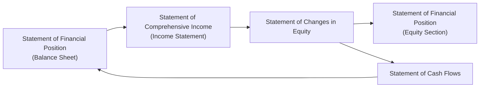

## 11.2 Financial Statements of a Corporation

Effective decision-making in corporate finance depends largely on the availability of accurate, timely, and comparable financial information. Financial statements serve as the primary gateway to understanding a corporation’s financial health. Investors, creditors, regulators, and other stakeholders scrutinize these statements to assess performance, cash flow generation, and overall stability. Within Canada, publicly traded companies adhere to International Financial Reporting Standards (IFRS), providing consistent information that can be compared across global markets. This section explores the core purpose behind each of the four primary financial statements, demonstrating how they fit together to provide a comprehensive snapshot of a corporation’s financial activities and position.

---

### Purpose and Importance of Financial Statements

Financial statements are designed to:
• Provide stakeholders (investors, creditors, and others) with insight into a corporation’s performance over a specified period.  
• Reveal the financial position of the company at a specific point in time.  
• Present cash inflows and outflows, providing an essential gauge of liquidity and solvency.  
• Disclose changes in equity (such as the issuance of new shares or dividends paid).  

Each statement, along with the notes, offers a different perspective of the company’s finances. Taken together, they present a multidimensional picture of the firm’s overall health, guiding strategic decisions ranging from investment to corporate governance. In the Canadian context, these statements must comply with IFRS for public companies, ensuring transparency and consistency for domestic and global investors alike.

---

### The Four Primary Financial Statements

Under generally accepted accounting principles (GAAP) and IFRS, corporations in Canada typically prepare four main financial statements:

1. Statement of Financial Position (often referred to as the Balance Sheet)  
2. Statement of Comprehensive Income (commonly called the Income Statement)  
3. Statement of Changes in Equity  
4. Statement of Cash Flows  

Each statement complements the others, ensuring that users obtain a complete overview of the company’s finances.

Below is a simple diagram illustrating how these statements interconnect:

In this diagram:  
• The Statement of Financial Position provides the starting point.  
• The Statement of Comprehensive Income shows how revenue and expenses affect equity over the reporting period.  
• The Statement of Changes in Equity tracks changes to equity components such as retained earnings, including items from net income and dividends.  
• The Statement of Cash Flows details the cash side of operations, ultimately returning to the balance sheet’s cash balance.

---

#### 11.2.2.1 Statement of Financial Position (Balance Sheet)

The Statement of Financial Position, or Balance Sheet, displays the company’s financial standing at a specific moment. Its basic equation is:

Assets – Liabilities = Shareholders’ Equity

• **Assets:** Resources owned by the company, typically categorized into:  
  – Current Assets (e.g., cash, accounts receivable, inventory).  
  – Non-Current or Long-Term Assets (e.g., property, plant, equipment, intangible assets).  

• **Liabilities:** Obligations the company owes to outside parties, typically split into:  
  – Current Liabilities (e.g., accounts payable, short-term debt).  
  – Non-Current or Long-Term Liabilities (e.g., long-term loans, bonds payable).  

• **Shareholders’ Equity:** The residual interest in the company’s assets after deducting liabilities. Major components include:  
  – Share Capital (common and preferred shares).  
  – Retained Earnings (accumulated net income not distributed as dividends).  
  – Other Reserves (e.g., foreign currency translation, unrealized gains or losses under certain IFRS treatments).  

For example, a major Canadian bank like the Royal Bank of Canada (RBC) often reports substantial current assets (such as cash and loans due within one year) in conjunction with large short-term obligations (like deposits) and significant long-term debt instruments (bond issuances). By comparing RBC’s total assets and total liabilities, stakeholders can gauge the bank’s overall financial leverage and risk.

---

#### 11.2.2.2 Statement of Comprehensive Income (Income Statement)

The Statement of Comprehensive Income (or Income Statement) shows the company’s financial performance over a reporting period, highlighting how revenues and expenses ultimately translate into net income or net loss. Key elements include:

• **Revenues:** Money generated from core business operations (e.g., sales of goods, interest income, service fees).  
• **Cost of Goods Sold (COGS):** Direct costs associated with producing or acquiring goods sold, including materials and direct labor.  
• **Operating Expenses:** Overheads such as salaries, utilities, office expenses, and marketing costs.  
• **Interest and Taxes:** Financing costs and applicable taxes that reduce gross profits to net income.  
• **Net Income (or Net Loss):** The final outcome after subtracting all expenses (including interest and taxes) from total revenues.

The statement may also present additional components of comprehensive income (e.g., unrealized gains on investments designated as fair value through other comprehensive income). Public companies like TD Bank often break out their results by segment (e.g., Canadian Retail, Wholesale Banking) so that shareholders can see which business lines drive profitability.

---

#### 11.2.2.3 Statement of Changes in Equity

The Statement of Changes in Equity tracks how each component of shareholders’ equity evolves over the reporting period:

• **Share Capital:** Changes can occur if the company issues new shares or repurchases existing shares.  
• **Retained Earnings:** Increases with net income, decreases by paying out dividends or incurring losses.  
• **Reserves:** Reflect other comprehensive income items like foreign exchange gains/losses, revaluation gains, and more.

Investors interested in stable, dividend-paying stocks (for example, some well-established Canadian utility companies) pay close attention to the retained earnings component. Consistent growth in retained earnings combined with predictable dividend payouts can signal strong historical profitability and shareholder-friendly management.

---

#### 11.2.2.4 Statement of Cash Flows

The Statement of Cash Flows discloses the company’s cash inflows and outflows separated into three areas:

1. **Operating Activities:** Includes cash generated or used by core business operations (e.g., cash received from customers, payments to suppliers).  
2. **Investing Activities:** Captures cash used for capital expenditures, acquisitions, or proceeds from selling long-term assets.  
3. **Financing Activities:** Shows changes in long-term debt, issuance of shares, repurchase of shares, and payment of dividends.

This statement is crucial for assessing a firm’s liquidity and solvency. Even if the company shows net income on the Income Statement, it may be experiencing cash shortfalls. For instance, a Canadian technology start-up could be profitable on paper (due to recognition of accrued revenues) but still have negative net cash flow from operations if those revenues are not yet collected in cash.

---

### The Notes to the Financial Statements: Adding Context

The Notes to the Financial Statements provide essential explanatory detail for the numbers reported. They often include:

• **Accounting Policies:** Descriptions of how specific items are recognized and measured, ensuring transparency about IFRS or GAAP assumptions.  
• **Risk Factors:** Insights into credit risk, currency risk, liquidity risk, and market risk.  
• **Segment Information:** Detailed breakdowns of financial results by line of business or geographical region.  
• **Supplementary Details:** Additional context for items like pension obligations, lease commitments, and contingent liabilities.

These notes can be wide-ranging and may constitute the bulk of a corporation’s annual report. The SEDAR+ system (https://www.sedarplus.ca/) is where Canadian public companies file these statements and associated notes, making them accessible to the investing public.

---

### IFRS vs. ASPE in Canada

In Canada, publicly accountable enterprises (PAEs) are required to use IFRS for financial reporting. However, private enterprises may elect to use either IFRS or Accounting Standards for Private Enterprises (ASPE). Below are some key differences:

• **Public vs. Private:** IFRS is mandatory for companies that raise funds from the public. ASPE is tailored for Canadian private enterprises that typically have fewer external stakeholders.  
• **Fair Value vs. Historical Cost:** IFRS leans toward fair value measurement in areas like investment property and certain financial instruments. In contrast, ASPE may allow or mandate more frequent use of historical cost.  
• **Disclosure Requirements:** IFRS often requires more robust disclosure. ASPE has streamlined disclosures, creating less of an administrative burden for private companies.

By understanding the differences between IFRS and ASPE, investors and advisors can more accurately interpret financial data from both public and private Canadian corporations.

---

### Practical Perspectives and Best Practices

• **Comparability:** When analyzing firms in the same industry—such as comparing RBC to TD—ensure that both follow IFRS. Similar reporting standards help maintain consistency when matching financial metrics across industry peers.  
• **Liquidity Focus:** Watch short-term liquidity indicators such as the current and quick ratios on the Balance Sheet, and ensure that any shortfall in cash flow is explained in the Statement of Cash Flows.  
• **Document Assumptions:** Refer meticulously to the Notes to identify any non-recurring items or changes in accounting policies, which might affect year-over-year comparisons.  
• **Regulatory Environment:** Familiarize yourself with the CPA Canada Handbook (https://www.cpacanada.ca/) and IFRS standards (https://www.ifrs.org/) for deeper guidelines on reporting frameworks.  
• **Open-Source Tools and Resources:** Use widely available open-source software (e.g., Python libraries like pandas) to retrieve and process data from sources like SEDAR+ for more sophisticated financial analyses.

---

### Key Takeaways

1. **Financial Statements Are Interconnected:** Each statement offers a unique viewpoint, yet all work together to form a collective picture of corporate performance and position.  
2. **IFRS Domination:** Publicly accountable enterprises in Canada adhere to IFRS, promoting consistency for investors worldwide.  
3. **Stakeholder Decision-Making:** Whether you’re an investor, creditor, or advisor, these statements—when properly analyzed—significantly enhance decision-making accuracy.  
4. **Notes Provide Vital Detail:** Never overlook the statement notes; they’re integral for understanding the assumptions and risks underlying the reported numbers.  
5. **Context Matters:** Economic environments, industry trends, and strategic initiatives can all influence how statements are interpreted and used.

By blending theoretical knowledge with real-world context, readers can confidently navigate and interpret financial insights from Canada’s largest public companies, as well as smaller private enterprises.

---

## Quiz: Financial Statements of Corporations



### Which statement best describes the purpose of the Statement of Financial Position?

- [x] It shows a company’s assets, liabilities, and shareholders’ equity at a specific point in time.
- [ ] It details revenues and expenses over a defined period.
- [ ] It analyzes the company’s cash inflows and outflows.
- [ ] It focuses solely on retained earnings.

> **Explanation:** The Statement of Financial Position (Balance Sheet) captures a firm’s financial standing at a particular moment by listing its assets, liabilities, and equity.

### Which of the following items would most likely be classified under Non-Current Assets on the Balance Sheet?

- [x] Property, plant, and equipment
- [ ] Accounts receivable
- [ ] Cash equivalents
- [ ] Short-term investments

> **Explanation:** Non-current (long-term) assets include property, equipment, intangible assets, and other resources expected to be used for more than one operating cycle (usually over one year).

### The direct costs associated with producing or acquiring goods sold is generally referred to as:

- [x] Cost of Goods Sold (COGS)
- [ ] Operating Expenses
- [ ] Interest Expense
- [ ] Retained Earnings

> **Explanation:** COGS includes expenses directly tied to the production of goods or acquisition of inventory. Operating expenses like administrative salaries and marketing are excluded.

### In the Statement of Comprehensive Income, net income is calculated as:

- [x] Revenues minus all expenses (including interest and taxes)
- [ ] Assets minus liabilities
- [ ] Operating cash flow minus investing cash flow
- [ ] Shareholders’ equity minus dividends

> **Explanation:** Net income (or net loss) results from total revenues minus all expenses, interest, and taxes over a specific period.

### What is the primary focus of the Statement of Changes in Equity?

- [x] Detailing how share capital, retained earnings, and reserves change over the reporting period
- [ ] Presenting cash flows from operating, investing, and financing activities
- [x] Reflecting how dividends paid out affect retained earnings
- [ ] Listing current and non-current liabilities

> **Explanation:** The Statement of Changes in Equity illustrates how different components of shareholders’ equity (share capital, retained earnings, other reserves) fluctuate—often due to dividends, net income, or share issuances.

### What are the three main segments of the Statement of Cash Flows?

- [x] Operating, Investing, and Financing
- [ ] Operating, Non-Operating, and Retained Earnings
- [ ] Liquidity, Solvency, and Profitability
- [ ] Cash, Inventory, and Accounts Receivable

> **Explanation:** The Statement of Cash Flows categorizes cash movements as arising from operating activities, investing activities, or financing activities.

### Which of the following is NOT typically found in the Notes to the Financial Statements?

- [x] Marketing campaign strategies for the coming year
- [ ] Accounting policies used
- [x] Detailed risk analysis
- [ ] Segment information

> **Explanation:** The Notes to the Financial Statements include accounting policies, segment details, and risk factors. Marketing campaign strategies are outside the standard scope of financial disclosures.

### When comparing IFRS to ASPE, one key difference is:

- [x] IFRS generally requires more extensive disclosures than ASPE.
- [ ] ASPE is mandatory for all public companies.
- [ ] IFRS prohibits the use of fair value measurement.
- [ ] ASPE requires global comparability while IFRS is specific to Canada.

> **Explanation:** Publicly accountable enterprises must use IFRS, which often mandates more comprehensive disclosures than ASPE (designed for private enterprises).

### What is one advantage of using IFRS in Canada for public companies?

- [x] Improved comparability across international markets
- [ ] Less rigorous disclosure requirements  
- [ ] It is only required for small private enterprises
- [ ] It eliminates the need for an external audit

> **Explanation:** IFRS fosters consistency and comparability of financial statements on a global scale, benefiting international investors and stakeholders.

### Under IFRS, public companies in Canada must publish their financial statements where investors can access them electronically:

- [x] True
- [ ] False

> **Explanation:** Canadian public companies are required to file their financial statements on SEDAR+ (https://www.sedarplus.ca/), ensuring transparency and easy public access.



---

## For Additional Practice and Deeper Preparation

**Elevate your exam readiness with our comprehensive app, "Securities CA: Mock Exams," designed to challenge and refine your skills.**

* **Master Challenging Questions:** Dive into expertly crafted sample exam questions that go beyond standard references.
* **Scenario-Driven Learning:** Experience scenario-driven case questions and in-depth solutions to build practical expertise.
* **Sharpen Exam Strategies:** Build confidence with step-by-step explanations designed to refine your exam-day tactics.
* **Gain Real-World Insights:** Acquire practical tips and detailed rationales that demystify complex concepts.
* **CIRO and CSI Alignment:** Stay current with CIRO guidelines and CSI’s exam structure, with questions intentionally more challenging than the actual exam.

**Download the App Today:**

> Note: While these courses are specifically crafted to align with the CSC® exams outlines, they are independently developed and not endorsed by CSI or CIRO.
