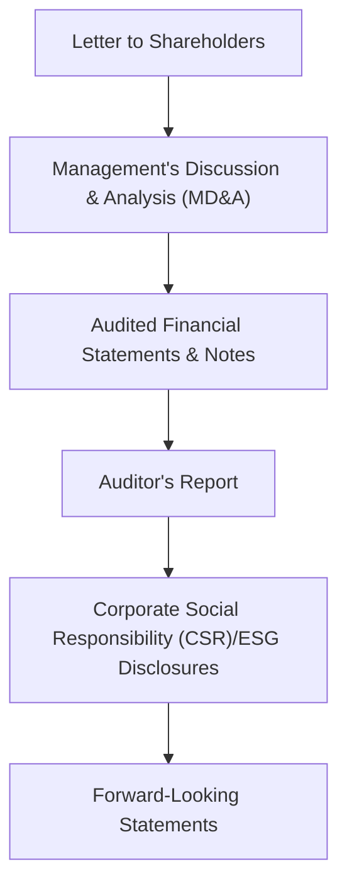

## 11.3 The Annual Report

An annual report is more than just a statutory filing—it is the primary conduit through which a publicly traded company communicates its performance, outlook, and strategy to shareholders and potential investors. In Canada, the annual report brings together several critical elements: a Letter to Shareholders, Management’s Discussion and Analysis (MD&A), audited financial statements, and the external auditor’s report. It increasingly includes information regarding a company’s outlook, social and environmental stewardship, and its overall strategy for long-term, sustainable growth.

Whether you hold shares in a Canadian bank or are simply learning about investment fundamentals, understanding the structure, purpose, and regulatory environment surrounding annual reports is essential for making informed decisions. This section provides a deep dive into each component of the annual report and offers guidance on how to interpret disclosures, identify credibility, and evaluate a corporation’s future prospects.

---

### Functional Overview of the Annual Report

From the perspective of investors, the annual report is the ultimate snapshot of a corporation's direction over the previous fiscal year. It is designed to:

• Provide transparent disclosure of operating results and strategies.  
• Offer management's perspective on the successes and challenges from the prior year, as well as plans for the future.  
• Satisfy regulatory requirements for continuous disclosure as mandated by the Canadian Securities Administrators (CSA) and the Canadian Investment Regulatory Organization (CIRO).  
• Demonstrate accountability to shareholders by presenting audited statements and organizational governance structures.

In the Canadian context, the release of an annual report adheres to stringent guidelines. Many publicly traded firms also publish additional interim reports or corporate updates throughout the fiscal year, in compliance with continuous disclosure rules. However, the annual report remains the most comprehensive retrospective and forward-looking document.

---

### Key Components of the Annual Report

Below is a Mermaid diagram illustrating the main sections of a typical Canadian annual report:

#### Letter to Shareholders

The annual report customarily begins with a letter from the Chief Executive Officer (CEO) or the Chair of the Board of Directors. This letter offers a narrative tone and aims to:

• Recap the company’s achievements and challenges throughout the year.  
• Outline relevant market events and how they affected the firm’s results.  
• Set the stage for the strategic objectives that management envisions for upcoming periods.  

While not typically heavy on granular detail, the letter provides a theme that readers can keep in mind as they review subsequent sections.

#### Management’s Discussion and Analysis (MD&A)

Immediately following the introductory letter, the MD&A section presents an essential explanatory narrative of the company’s performance. In Canada, the CSA provides guidance on how public companies must present the MD&A. This section often includes:

• Financial and operational highlights: Management explains annual revenue changes, significant expenses, or profit margin developments.  
• Analysis of industry trends: If the company is in an industry sensitive to commodity prices, for example, you can expect a discussion of oil prices or other relevant market conditions.  
• Strategic positioning: Management may detail new product lines, partnerships, acquisitions, or research and development directions.  
• Principal risks and uncertainties: Identifying the firm’s exposure to interest rate shifts, currency fluctuations, or other factors.  
• Liquidity and capital resources: Explains the company’s ability to meet its financial obligations.  

The CSA Staff Notice on MD&A best practices (available at https://www.securities-administrators.ca/) provides a comprehensive framework to help issuers present clear, relevant, and balanced information. This MD&A section acts as a road map, helping current and potential investors interpret the numbers and anticipate where the company might go next.

#### Audited Financial Statements and Notes

At the heart of the annual report are the audited financial statements, typically including:

• Balance Sheet (Statement of Financial Position)  
• Income Statement (Statement of Operations)  
• Statement of Cash Flows  
• Statement of Changes in Equity  

Accompanying the primary statements are the notes to the financial statements. These notes are indispensable for understanding:

• Accounting policies: The methods the company adopts for revenue recognition, inventory valuation, and depreciation.  
• Commitments and contingencies: Unsettled lawsuits, pending acquisitions, or other liabilities that could affect future financial results.  
• Segment information: A breakdown of data across various lines of business.  
• Detailed insights into risk management, derivative use, and hedging strategies (especially relevant for financial institutions, like RBC or TD).  

With open-source accounting software and financial tools (such as GnuCash or similar open platforms), investors and analysts can import these statements and perform ratio analyses, trend evaluations, and peer comparisons.

#### Auditor’s Report

Before readers can assess the numbers, they typically turn to the auditor’s report for reassurance that the company’s financial statements are presented fairly and in accordance with the required accounting standards (IFRS in Canada for most public companies). The external auditor’s primary responsibilities include:

• **Providing an independent opinion**: Affirming that management’s representation of the company’s affairs is accurate or identifying areas of concern.  
• **Conducting the audit**: Verifying transactions, testing internal controls, and ensuring no material misstatements exist.  
• **Highlighting any emphasis of matters**: If there is a noteworthy risk such as a pending litigation or going concern doubt, the auditor will highlight it.  

An unqualified (“clean”) opinion from the auditor typically indicates that the investor can rely on the statements. However, if the auditor issues a qualified opinion, adverse opinion, or highlights a “going concern” issue, these warnings warrant further investigation by stakeholders.

#### Corporate Social Responsibility (CSR) or Environmental, Social, and Governance (ESG) Disclosures

Many annual reports now include a section devoted to corporate social responsibility (CSR) or broader Environment, Social, and Governance (ESG) factors, reflecting modern expectations from shareholders, customers, and the public. ESG guidelines and voluntary reporting frameworks (such as the Global Reporting Initiative — GRI) have gained traction because they:

• Demonstrate a company’s commitment to ethics, environmental well-being, and social impact.  
• Disclose energy usage, carbon footprint, diversity initiatives, and community engagement.  
• Reflect the firm’s approach to governance, including board composition, management compensation, and shareholder rights.  

Canadian pension funds, for example, increasingly consider ESG factors in their investment strategies. Their rationale is that strong ESG performance can signal effective risk management and potentially lead to more sustainable long-term returns.

#### Forward-Looking Statements Disclaimers

Publicly traded companies are encouraged—and often required—to provide an outlook on future projects or profitability. However, Canadian regulators, including the CSA and CIRO, mandate that companies include cautionary disclaimers around forward-looking statements to remind investors that such projections:

• Are based on management’s current assumptions and expectations.  
• Subject to known and unknown risks that could affect outcome.  
• Could diverge significantly from reality if economic or market circumstances change.  

Investors should weigh these forward-looking statements carefully, recognizing that unforeseen external events—such as interest rate changes by the Bank of Canada or global economic shifts—could alter outcomes significantly.

---

### Continuous Disclosure and Regulatory Compliance

In Canada, securities regulators place a strong emphasis on continuous disclosure to ensure that material information is made available promptly to the investing public. This includes:

• Timely release of quarterly and annual earnings.  
• Disclosure of material changes, such as mergers, acquisitions, or large contract wins.  
• Adherence to insider trading regulations, with directors and senior management disclosing share trades.  

CIRO maintains oversight of investment dealers to ensure they properly comply with continuous disclosure norms, underlining the importance of transparency and maintaining fair and efficient capital markets in Canada.

---

### Practical Case Example: A Canadian Bank Annual Report

Consider a real-world scenario involving a major Canadian bank, such as RBC. Each year, RBC publishes an annual report that includes:

1. A letter from the President and CEO outlining how changes in the Canadian economy influenced results—e.g., lower or higher interest rates affecting net interest margin.  
2. MD&A highlighting strategic initiatives, like expanding digital banking platforms or forging wealth management partnerships abroad, plus discussion of capital adequacy under Basel III requirements.  
3. Audited financial statements reflecting the bank’s capital position, provisioning for loan losses, and performance across business segments such as retail banking, corporate banking, wealth management, and insurance.  
4. An auditor’s report from a large, international audit firm, which typically offers an unqualified opinion.  
5. A CSR or ESG report outlining the bank’s community investments (like scholarships or small business grants) and detailing its policy on responsible lending (considering carbon emissions or environmental screening of projects).

---

### Step-by-Step Guidance for Reading an Annual Report

1. **Skim the Letter to Shareholders:** Identify the company’s success highlights and overarching strategic direction.  
2. **Dive Into the MD&A:** Look for detailed operational metrics, risk disclosures, and forward-looking statements.  
3. **Analyze the Financial Statements:** Check year-over-year trends in revenue, net income, debt levels, and liquidity.  
4. **Review the Auditor’s Report:** A clean opinion signals confidence, but watch for qualified or adverse opinions, which may highlight dwindling resources or questionable accounting practices.  
5. **Assess CSR/ESG Content:** Consider whether the company’s governance, social, and environmental initiatives align with your investing values or risk tolerance.  
6. **Evaluate Forward-Looking Statements:** Keep in mind that these projections are not guaranteed and assess them against known market conditions.  
7. **Take Note of Regulatory Filings:** Seek additional context from SEDAR+ (the System for Electronic Document Analysis and Retrieval Plus) where you will find the entire repository of a company’s filings in Canada.

---

### Common Pitfalls and Best Practices

• **Overlooking the Notes:** Many new investors focus on top-line figures but skip the extensive disclosures in the footnotes, missing critical details about accounting assumptions and potential contingencies.  
• **Forgetting Macro Factors:** Even robust MD&A commentary can be blindsided by external macroeconomic shifts (e.g., changes in the Bank of Canada’s benchmark rates).  
• **Ignoring Qualitative Factors:** CSR/ESG discussions may reveal corporate culture, reputational risks, and governance quality. These intangible factors can have long-term financial implications.  
• **Relying Solely on the Auditor’s Opinion:** A clean auditor opinion attests to the fairness of the presentation, but not necessarily the future viability or profitability of the organization.  

When analyzing annual reports, it is crucial to seek multiple perspectives, including industry comparisons, to gain a fuller investment thesis. Tools such as open-source financial modeling software or widely used platforms like Microsoft Excel can help break down the raw data into spreadsheets, ratios, and charts for a deeper investigation.

---

### Glossary

• **Management’s Discussion and Analysis (MD&A):** A narrative section where management explains the company’s financial results, condition, and plans, providing an important bridge between raw financial numbers and management’s strategic viewpoint.  

• **Auditor’s Report:** An independent examiner’s assessment of the company’s financial statements, focusing on whether they are free from material misstatements and fairly presented according to applicable accounting standards.  

• **Corporate Social Responsibility (CSR):** Voluntary initiatives that illustrate an organization’s commitment to social welfare, environmental protection, and community involvement beyond the legal minimum.  

• **Forward-Looking Statements:** Speculative statements about future events, results, or trends that are inherently uncertain and typically accompanied by cautionary language to manage investor expectations.

---

### Additional Resources

• [CSA Staff Notice on MD&A Best Practices](https://www.securities-administrators.ca/) – Offers official guidelines for transparent and effective disclosure in public companies’ MD&A reports.  
• [CIRO (Canadian Investment Regulatory Organization)](https://www.ciro.ca/) – Provides regulation for investment dealers in areas such as disclosure, licensing, and compliance.  
• “Corporate Governance and Ethics” by Zabihollah Rezaee (book) – A comprehensive exploration of governance theories, ethical frameworks, and the role of transparent annual reports in building corporate credibility.

---

### Key Takeaways

• The annual report is a critical, multi-faceted document serving as an in-depth communication tool for both existing shareholders and potential investors.  
• MD&A bridges the gap between raw figures and the context necessary to understand a company’s performance, risks, and direction.  
• The auditor’s report lends credibility to management’s disclosures by providing an independent verification of the financial statements.  
• CSR/ESG disclosures in the annual report are increasingly vital for understanding a company’s broader impact and long-term sustainability practices.  
• Continuous disclosure requirements demand accurate and upfront reporting, reinforcing investor confidence in the Canadian capital markets.  

Annual reports act as the primary lens through which the public can view a corporation’s strategy and solvency. By combining qualitative analysis with financial ratio checks, you will gain a deeper understanding of an organization’s strengths, weaknesses, and future outlook. As the commentators of your own investments, never underestimate the annual report's ability to offer a wealth of insights and foresight into the corporate engine that drives your portfolio.

---

## Test Your Knowledge: Mastering Key Elements of Annual Reports



### Which section of the annual report contains a narrative explanation of a company's performance and major risks?

- [ ] Auditor's Report
- [x] Management’s Discussion and Analysis (MD&A)
- [ ] Letter to Shareholders
- [ ] Statement of Financial Position

> **Explanation:** The MD&A is designed to provide context for operating results, growth strategies, and potential risks that cannot be fully understood through numbers alone.

### Which of the following best describes the primary goal of an external auditor’s report?

- [x] To provide assurance that the financial statements are presented fairly
- [ ] To disclose non-financial aspects of the company’s performance
- [x] To highlight the company’s future strategy for growth
- [ ] To approve management’s compensation and bonuses

> **Explanation:** External auditors focus on attesting to the fairness and accuracy of a company’s financial statements. They do not set management’s compensation or design growth strategies.

### What is a typical reason for including CSR or ESG information in an annual report?

- [x] Investors and stakeholders increasingly value transparency regarding environmental and social impact
- [ ] Regulators require all companies to have zero carbon emissions
- [ ] It eliminates the need to show detailed financial data
- [ ] CSR/ESG discussions are legally barred from being disclosed publicly

> **Explanation:** CSR or ESG data meets growing stakeholder interest in sustainable business practices and responsible governance. Although not always mandated by law, providing ESG data is a best practice embraced by many corporations.

### Why should investors carefully read the footnotes to the financial statements?

- [x] They often contain important disclosures about accounting policies, risks, and key assumptions
- [ ] They duplicate the MD&A, so there is no additional insight
- [ ] They summarize only forward-looking statements
- [ ] They are automatically summarized by auditors

> **Explanation:** Footnotes can reveal nuances such as key accounting policies, pending litigation, or segment breakdowns that significantly affect the numbers in the statements.

### Which of the following is a best practice when interpreting forward-looking statements?

- [x] Recognize they are based on current assumptions, may not come true, and require cautious evaluation
- [ ] Assume they will materialize exactly as forecasted
- [x] Disregard them as irrelevant speculation
- [ ] Consider them more credible than audited figures

> **Explanation:** Forward-looking statements are speculative by nature. Investors should understand their inherent uncertainty and treat them with healthy skepticism.

### Why is continuous disclosure important under Canadian securities regulations?

- [x] It ensures that material information is shared promptly, maintaining investor confidence
- [ ] It makes quarterly and annual financial statements optional
- [ ] It prohibits the release of forward-looking statements
- [ ] It only applies to auditors, not management

> **Explanation:** Continuous disclosure rules govern the timely release of material events and financial updates, safeguarding transparency and fairness in the marketplace.

### If an auditor issues a “qualified opinion,” what does this mean?

- [x] There is a limited scope or specific issue preventing a fully unqualified (clean) opinion
- [ ] The auditor believes there are significant material misstatements
- [x] The auditor uncovered fraud and immediately disclaimed any opinion
- [ ] Management has approval from the auditor for compensation decisions

> **Explanation:** A qualified opinion is neither completely unqualified nor outright adverse; it often indicates certain reservations about specific parts of the financial statements.

### Which financial statement would you review to assess a company's short-term liquidity?

- [x] Statement of Financial Position (Balance Sheet)
- [ ] Statement of Changes in Equity
- [ ] MD&A
- [ ] Auditor’s Report

> **Explanation:** The Statement of Financial Position details short-term assets and liabilities, providing a snapshot of liquidity and financial health.

### What is the primary purpose of the Letter to Shareholders?

- [x] To provide a general overview and set the tone for the rest of the annual report
- [ ] To replace the need for audited financial statements
- [ ] To disclose only CSR achievements
- [ ] To serve as a substitute for the MD&A

> **Explanation:** The letter to shareholders highlights significant achievements, challenges, and themes from the reporting year, guiding readers toward a broader narrative.

### Forward-looking statements are inherently over-optimistic. True or False?

- [x] True
- [ ] False

> **Explanation:** Many forward-looking statements rely on management’s best assumptions and may exhibit optimism about future operations or results. Nonetheless, they must include cautionary language to highlight the inherent uncertainty.



---

