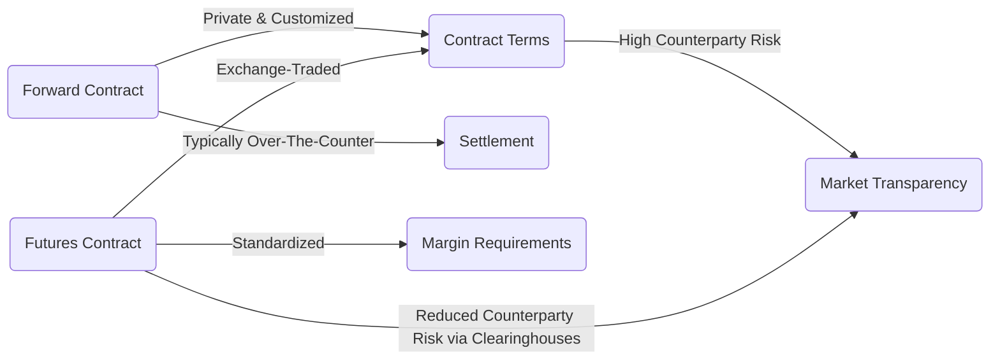

## 11.5 Forwards and Futures

In today’s highly interconnected financial environment, public corporations often use derivatives to manage risks and, in some cases, for speculative purposes. While forwards and futures contracts are covered extensively in Chapter 10 under derivatives, it is crucial to understand how these instruments can appear in a corporation’s financial statements. From hedging strategies to annual report disclosures, forward and futures contracts have a direct impact on both corporate risk management practices and a firm’s reported financial performance. 

This section explores how these contracts are structured, how they are accounted for under Canadian and international standards, and how they appear in a corporation’s annual reports.

---

## Introduction to Forwards and Futures in Corporate Contexts

Public corporations encounter various forms of risk, including currency fluctuations, changes in interest rates, and commodity price volatility. Forwards and futures can serve as essential tools to hedge—or reduce—these risks. At the same time, some firms may engage in speculative trades to potentially earn additional profits from anticipated market movements.

• A forward contract is a private agreement between two parties to buy or sell an asset at a set price on a future date.  
• A futures contract is a standardized agreement traded on organized exchanges, requiring the purchase or sale of an asset at a specified date and price.

These differences give rise to variations in liquidity, credit risk, pricing transparency, and ultimately, in the accounting treatments recognized on financial statements.

---

## Key Differences Between Forwards and Futures

Below is a high-level comparison of the two derivatives:

• Forward Contract:
  - Negotiated privately, giving counterparties flexibility over all contract terms (quantity, quality, delivery date, etc.).  
  - Counterparty credit risk is often higher since there is no clearinghouse acting as an intermediary.  
  - Settlement typically occurs at contract maturity; interim daily cash settlements are not required.  

• Futures Contract:
  - Standardized in terms of contract size, delivery date, and underlying asset specifications.  
  - Traded through an exchange (such as the Montreal Exchange in Canada), which reduces counterparty risk through a clearinghouse.  
  - Requires parties to post initial margin and comply with daily settlement (marked to market).

---

## Hedging Applications in Canadian Corporations

### Commodity Price Hedges

Canadian corporations—particularly those in the oil, mining, and agriculture sectors—commonly use forwards or futures to manage raw material costs. For example, a mining corporation expecting to sell copper might enter into a forward or futures contract to lock in a future selling price. This helps stabilize revenue projections and reduces the adverse impact of volatile commodity markets on earnings.

### Currency Hedges

Exporters and importers frequently face currency exposure that arises when doing business in foreign currencies (e.g., USD). A Canadian exporter receiving future US dollar payments may use a forward contract or a currency futures contract to lock in a specific exchange rate. By doing so, the corporation knows in advance what the Canadian-dollar proceeds will be, reducing uncertainty in future cash flows.

### Interest Rate Hedges

Banks and other financial institutions (e.g., RBC, TD) also employ interest rate futures to manage fluctuations in interest rates. For instance, a financial institution anticipating a rise in interest rates might enter into a Futures Contract on Government of Canada bonds to offset potential losses in portfolios sensitive to rising rates.

---

## Accounting Treatment Under IFRS and Canadian Standards

Derivatives, such as forwards and futures, are generally subject to IFRS 9 “Financial Instruments.” Under these standards, derivatives must be recognized at fair value on the Statement of Financial Position (balance sheet). Corporations must also update the carrying value of the derivative at each reporting period to reflect changes in its fair value.

### Fair Value Measurement

Fair value can be determined using:  
• Market Quotation: For futures contracts traded on exchange, prices are directly observable.  
• Valuation Models: For certain forward contracts, especially those involving unique terms (private agreements), valuation models (like discounted cash flow analysis) are often used to estimate fair value.

### Gains and Losses in Financial Statements

Unless a corporation designates a derivative under hedge accounting, all fair value changes flow through the Income Statement. This can heighten income volatility if the corporation’s objective is risk management but it does not implement formal hedge accounting procedures.

#### Hedge Accounting

IFRS 9 allows the use of hedge accounting to better match the timing of derivative gains/losses with the offsetting losses/gains on the hedged item. This approach is beneficial for reducing volatility in reported earnings.  
- Corporations must document the hedging relationship, risk management objectives, and strategies at the outset.  
- They must assess the hedge’s effectiveness on an ongoing basis.  
- Ineffective portions of the hedge are recognized immediately in profit or loss.

---

## Financial Statement Disclosures for Derivatives

CPA Canada provides guidance on the disclosures corporations must make regarding derivative instruments. Common requirements include:

• Purpose and Type of Derivative: Whether it is used for hedging or speculative purposes.  
• Notional Amounts: The total value upon which payments are calculated.  
• Fair Value of Derivative Positions: Reported in the Statement of Financial Position.  
• Impact on Profit or Loss: Gains or losses recognized in the Income Statement, if not classified under hedge accounting.  
• Risk Factors: Counterparty risk, liquidity risk, and any transfer of risk to a clearinghouse.

### Notes to the Financial Statements

Within the notes, companies disclose:

• The nature of the risks being hedged (commodity, currency, or interest rate).  
• The instruments used and their terms (forward or futures).  
• Statements about the effectiveness of hedges.  
• Credit risk considerations: If the forward is with a private counterparty with a lower credit rating, that risk must be detailed.  
• Collateral or margin requirements for futures contracts.

---

## Regulatory Oversight of Derivatives in Canada

In Canada, derivatives oversight is conducted at both provincial and federal levels:

1. Provincial Securities Regulators: Each province has its own securities regulator responsible for protecting investors and ensuring market integrity. For example, the Ontario Securities Commission (OSC) oversees trading activities and consumer protection within Ontario.  
2. Canadian Securities Administrators (CSA): A coordinating body composed of the country’s provincial and territorial securities regulators. The CSA often issues harmonized rules on derivatives.  
3. Other Agencies: Depending on the underlying asset (e.g., certain over-the-counter trades in interest rate swaps), additional oversight may involve the Office of the Superintendent of Financial Institutions (OSFI).  
4. Exchanges: Organized derivatives trading in Canada is centered on the Montreal Exchange, which has its own regulatory and compliance responsibilities to ensure fair and orderly markets.

---

## Practical Example: Currency Hedge by a Canadian Exporter

Consider a Canadian agricultural exporter, Maple Harvest Inc., that anticipates receiving USD 5 million in three months. Maple Harvest Inc. is concerned about potential depreciation in the US dollar relative to the Canadian dollar. The company therefore enters into a three-month forward contract with a bank (over the counter) to sell USD 5 million at an agreed-upon exchange rate of CAD 1.32 per USD.

• At contract initiation, the forward has zero value, but fluctuations in the spot and forward rates in the following weeks will cause the value of the contract to change.  
• According to IFRS 9, Maple Harvest Inc. must record the forward at fair value on its Statement of Financial Position, and any fair value changes typically affect the Income Statement unless hedge accounting criteria are met.  
• In its annual report, the corporation will disclose the rationale behind the hedge, the notional USD 5 million amount, and the fair value of the forward contract at the reporting date.

---

## Step-by-Step Implementation of a Hedge

Below is a concise guide to implementing a hedging strategy using forwards or futures:

1. Identify Exposure: Determine which financial or operational exposure (commodity, currency, or interest rate) the corporation faces.  
2. Determine Hedge Objectives: Decide whether the goal is to stabilize cash flows, protect profit margins, or reduce volatility in reported earnings.  
3. Select Appropriate Instrument: Evaluate the pros and cons of forward vs. futures, including liquidity needs and accounting considerations.  
4. Document the Hedge: If applying hedge accounting, formally document the hedging relationship as required by IFRS 9.  
5. Account for Fair Value: Measure the derivative at fair value at each balance sheet date.  
6. Monitor Effectiveness: Track hedge effectiveness regularly, ensuring the derivative exposure offsets the underlying risk as intended.  
7. Disclose in Financial Statements: Provide comprehensive notes with details about the hedge, risk, notional amounts, fair values, and any recognized gains or losses.

---

## Best Practices, Common Pitfalls, and Strategies to Overcome Them

• Best Practice: Establish robust internal controls around derivatives trading. This includes setting position limits, requiring separate authorization for speculative trade activities, and implementing frequent reporting to management.  
• Best Practice: Use recognized valuation techniques (e.g., discounted cash flow models) and external market data when measuring the fair value of forward contracts.  
• Pitfall: Engaging in derivatives for speculative rather than hedging purposes can expose a corporation to higher risks and earnings volatility. Clear documentation of risk management objectives can reduce confusion and potential misstatements.  
• Pitfall: Failing to properly qualify for hedge accounting results in full mark-to-market volatility in the Income Statement. Firms should ensure strict compliance with IFRS 9 documentation and effectiveness testing requirements.  
• Strategy to Overcome: Conduct due diligence on both internal transaction processes and external counterparties. Strong credit risk assessment procedures can help mitigate counterparty or default risks, especially for forward agreements.

---

## Additional Resources

• [Montreal Exchange](https://www.m-x.ca/) – The main Canadian derivatives exchange, offering valuable insights into futures and options clearing, as well as educational materials on derivatives trading.  
• [CPA Canada](https://www.cpacanada.ca/) – Provides guidelines, clarifications, and detailed publications on accounting for derivatives and implementing IFRS 9.  
• John C. Hull’s “Options, Futures, and Other Derivatives” – Considered a standard reference in the field, offering in-depth theoretical and mathematical perspectives on derivatives.

---

## Summary

Forwards and futures are powerful instruments that can help corporations stabilize income, plan future cash flows, and mitigate unwanted financial risks. From a Canadian securities perspective, whether a firm uses forward or futures contracts to hedge or speculate can significantly impact its reported earnings and risk profile. Under IFRS 9 and pertinent Canadian accounting standards, these contracts must be measured at fair value, and relevant disclosures must be provided in financial statements.

By understanding the distinct features of each contract type, the associated accounting treatments, and the regulatory frameworks in Canada, readers can better interpret corporate financial statements and appreciate how these instruments influence a firm’s overall risk management strategy.

---

## Test Your Knowledge of Forwards and Futures in Canadian Corporate Accounting



### Which of the following best describes the main difference between a forward contract and a futures contract?

- [x] Forward contracts are privately negotiated and futures contracts are exchange-traded.  
- [ ] Forward contracts always require margin payments, but futures do not.  
- [ ] Futures contracts have more credit risk than forwards.  
- [ ] Forward contracts are typically standardized, while futures are customizable.  

> **Explanation:**( Forward contracts are privately negotiated (over-the-counter), whereas futures are traded on regulated exchanges under standardized terms.)

### Under IFRS 9, how are derivatives generally measured on the balance sheet?

- [ ] At historical cost.  
- [x] At fair value.  
- [ ] At nominal or notional value only.  
- [ ] At the maturity value.  

> **Explanation:**( IFRS 9 requires that derivatives be recognized at fair value, with changes in fair value typically recorded in profit or loss unless hedge accounting is applied.)

### Which type of entity generally poses a greater counterparty credit risk when entering into a forward contract?

- [x] A private, non-cleared counterparty.  
- [ ] A well-capitalized exchange.  
- [ ] A provincial securities regulator.  
- [ ] A clearinghouse.  

> **Explanation:**( Forward contracts are negotiated over the counter without an intermediary, thus exposing each party to the other’s credit risk. Exchanges and clearinghouses substantially lower this risk.)

### What is one advantage of using hedge accounting for a forward or futures contract?

- [x] It reduces the volatility of reported earnings by matching gains or losses with the hedged item.  
- [ ] It eliminates all losses on derivative positions.  
- [ ] It removes the requirement to disclose derivatives in financial statements.  
- [ ] It guarantees a profit from the derivative instrument.  

> **Explanation:**( Hedge accounting allows gains or losses on the hedging instrument to be recognized in the same period as the offsetting losses or gains on the underlying hedged item, smoothing out earnings volatility.)

### When a Canadian mining company wants to lock in the sale price of copper in three months, which contractual tool might it employ?

- [ ] Interest rate swap.  
- [x] A forward or futures contract on copper.  
- [ ] Currency option.  
- [ ] Commodity put option.  

> **Explanation:**( Copper is typically hedged through a forward or futures contract, securing a future price and mitigating commodity price risk.)

### Which of the following disclosure items is commonly required for derivatives in the notes to the financial statements?

- [ ] Maturity date only.  
- [ ] Premium paid for the derivative.  
- [x] Notional amounts, fair value, purpose of use (hedging vs. speculative), and risk exposure.  
- [ ] Personal details of the counterparty’s board of directors.  

> **Explanation:**( IFRS 7 and CPA Canada guidelines dictate that corporations provide details on notional amounts, fair values, risk exposure, and instrument purpose.)

### Which Canadian body coordinates provincial and territorial securities regulators to issue harmonized rules on derivatives?

- [ ] Bank of Canada.  
- [x] Canadian Securities Administrators (CSA).  
- [ ] Office of the Superintendent of Financial Institutions (OSFI).  
- [ ] IIROC.  

> **Explanation:**( The CSA is an umbrella organization of provincial and territorial regulators in Canada, drafting consistent regulations across the country.)

### How does daily “marking to market” work for futures contracts?

- [x] Gains or losses are settled in cash each trading day, adjusting participants’ margin accounts accordingly.  
- [ ] Contracts remain at zero value until maturity.  
- [ ] Gains are paid out at inception, and losses only at maturity.  
- [ ] It applies only to forward contracts.  

> **Explanation:**( For exchange-traded futures, participants’ positions are revalued daily against the settle price, requiring margin adjustments to reflect gains or losses.)

### If a corporation documents a currency futures contract as a hedge of forecast future receipts, and the hedge is fully effective, where might the derivative’s gains or losses initially be reported under IFRS 9?

- [ ] Directly in retained earnings.  
- [x] In Other Comprehensive Income (OCI).  
- [ ] In the operating expenses line item.  
- [ ] They are never recognized until maturity.  

> **Explanation:**( Under hedge accounting for a cash flow hedge, changes in the fair value of the derivative instrument are typically recorded in OCI until the underlying forecast transaction occurs.)

### A forward contract is negotiated privately and does not trade on an exchange. True or False?

- [x] True  
- [ ] False  

> **Explanation:** By definition, forward contracts are over-the-counter instruments negotiated between two parties, with terms tailored to their needs.



---

## For Additional Practice and Deeper Preparation

**Elevate your exam readiness with our comprehensive app, "Securities CA: Mock Exams," designed to challenge and refine your skills.**

* **Master Challenging Questions:** Dive into expertly crafted sample exam questions that go beyond standard references.
* **Scenario-Driven Learning:** Experience scenario-driven case questions and in-depth solutions to build practical expertise.
* **Sharpen Exam Strategies:** Build confidence with step-by-step explanations designed to refine your exam-day tactics.
* **Gain Real-World Insights:** Acquire practical tips and detailed rationales that demystify complex concepts.
* **CIRO and CSI Alignment:** Stay current with CIRO guidelines and CSI’s exam structure, with questions intentionally more challenging than the actual exam.

**Download the App Today:**

> Note: While these courses are specifically crafted to align with the CSC® exams outlines, they are independently developed and not endorsed by CSI or CIRO.
