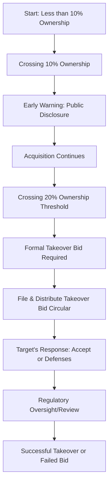

## 11.6 Takeover Bids and Insider Trading

In Canada’s capital markets, the process of acquiring or increasing control of a public corporation is subject to various regulations designed to protect investors and promote equitable treatment of all shareholders. Provincial securities commissions, along with the Canadian Securities Administrators (CSA), enforce rules that govern corporate takeovers and prohibit insider trading. Understanding these rules helps safeguard market integrity and ensure that corporate control changes occur in a fair, transparent manner.

This section covers:

• Takeover bids: essential definitions, processes, and regulations  
• Defensive tactics by target companies and their regulatory limitations  
• Insider trading rules and compliance obligations  
• Early warning requirements to promote transparency  
• Reporting requirements for insiders and the role of fairness in Canadian markets  

Let’s explore how these topics interconnect and how you can apply them in practice.

---

## Introduction to Takeover Bids

### Definition of a Takeover Bid

A “takeover bid” refers to an offer made by an individual, corporation, or group (the offeror) to acquire a target company’s voting or equity securities above a prescribed threshold. In Canada, the threshold is often set at 20% or more of the target’s outstanding voting shares. By crossing this threshold, the acquiring party may obtain or significantly increase its control over the corporation.

Key points to remember:  
• Crossing the 20% ownership threshold typically triggers mandatory takeover bid requirements.  
• Even if an entity already holds shares, additional acquisitions that push its stake over 20% may also activate these rules.  

### The Importance of Transparency

The fundamental principle behind takeover bid regulations is to ensure that all shareholders receive timely, detailed information about the potential change in control. This enables fair decision-making around whether to sell or hold their shares.

---

## Formal Takeover Bid Circular

### Purpose of the Circular

Under CSA National Instrument 62-104 (Take-Over Bids and Issuer Bids), anyone initiating a takeover bid is required to file a Takeover Bid Circular. This circular must also be distributed to the target’s security holders. It provides information regarding:

• Offer terms: Price, payment details, and any conditions.  
• Timelines: How long the offer is open and deadlines for acceptance.  
• Intended actions: Proposed changes in corporate governance, business practices, or strategic direction.  

By mandating the circulation of these details, regulators ensure that shareholders have sufficient knowledge to evaluate the merits and risks of tendering their shares under the offer.

### Contents of the Takeover Bid Circular

A Takeover Bid Circular typically includes:  

• The background and rationale for the takeover bid.  
• The identity and financial resources of the offeror.  
• Any arrangements made between the offeror and existing shareholders.  
• Proposed management or strategic changes post-acquisition.  

Because shareholders rely heavily on this document, accuracy and completeness are crucial. Misrepresentations may lead to regulatory sanctions and civil liability.

---

## Defensive Tactics

### Common Defense Mechanisms

When a target corporation deems a takeover bid hostile or unfavorable, it may adopt certain defensive measures, often called “shark repellents,” to prevent or delay the acquisition. Examples include:

1. Poison Pill (Shareholder Rights Plan):  
   • Allows existing shareholders (other than the bidder) to purchase additional shares at a discount if a hostile bidder acquires more than a specified percentage of shares.  
   • Dilutes the bidder’s stake, increasing the cost of the takeover.

2. Share Buybacks:  
   • The target corporation repurchases its own shares from the open market.  
   • This can reduce outstanding shares, potentially making it more difficult for the bidder to quickly amass a controlling stake.

3. Crown Jewel Defense:  
   • The target sells off or transfers key assets or subsidiaries (the “crown jewels”) to make the company less attractive to the hostile bidder.

4. White Knight:  
   • The target seeks a more amicable suitor, known as a “white knight,” to acquire the company on more favorable terms.

### Regulatory Limitations

Canadian securities legislation imposes limits on defensive tactics to prevent an entrenched board from unfairly denying shareholders the opportunity to tender their shares at a premium. Canadian regulators allow boards to defend the corporation’s interests but often intervene if tactics appear to unfairly frustrate a genuine takeover offer. 

---

## Regulatory Oversight of Takeovers

### Provincial Regulators and CSA

Provincial securities commissions, coordinated through the Canadian Securities Administrators (CSA), require that takeover bids meet specific standards to protect shareholder interests. Key regulatory aims include:

• Timely disclosure: Shareholders must receive detailed information early enough to make informed decisions.  
• Equal treatment: All shareholders should have an opportunity to sell at the same price and conditions.  
• De minimis hold period: The offeror must leave the offer open for a minimum time (often 105 days) to allow shareholders to respond appropriately.

### The Early Warning System

Once an investor’s interest in a corporation surpasses 10% of its outstanding shares, a critical disclosure rule called the Early Warning System is triggered. Investors must promptly announce their holdings to the market. This transparency mechanism notifies other investors about accumulating positions, warning potential buyers and sellers that a change in control may be pending or that a takeover attempt might be on the horizon.

---

## Insider Trading Rules

### Definition of Insider Trading

Insider trading involves buying or selling a corporation’s securities while in possession of material, non-public information (MNPI). This privileged information can significantly impact the company’s share price once it becomes public. Trading on such information is strictly prohibited because it creates an uneven playing field, undermining market integrity and investor confidence.

#### Material, Non-Public Information (MNPI)

“Material” information is any data that could substantially influence an investor’s decision to buy or sell a security. The key considerations include:  
• A significant corporate transaction (e.g., merger, takeover, major contract).  
• Financial performance indicators (e.g., earnings results).  
• Insider dealings (e.g., the CEO is about to resign).

### Prohibited Behaviors

• Trading (buying or selling) securities on the basis of MNPI.  
• Communicating MNPI to others (“tipping”).  
• Recommending trades to others based on MNPI (“tipping by proxy”).

### Insider Reporting Requirements

Corporate insiders—such as directors, officers, and significant shareholders—must disclose their trades to regulators within prescribed timelines (e.g., five calendar days in many provinces). These reports are made public to enhance market transparency and allow investors to track the ownership changes and activities of insiders.

---

## Penalties and Enforcement

### Penalties for Breaching Insider Trading Laws

Violations of insider trading rules can result in severe penalties, including:  
• Monetary fines: Substantial, often multiple times the profit gained or loss avoided.  
• Imprisonment: While rare, Canadian courts can and do impose prison terms for egregious violations.  
• Reputational damage: Both individuals and firms may suffer long-term reputational harm, diminishing trust from investors and the public.

### Enforcement Mechanisms

Regulatory bodies, including the Ontario Securities Commission (OSC) and other provincial commissions, investigate suspicions of insider trading. Coordinating with self-regulatory organizations (SROs), they gather evidence, conduct hearings, and enforce sanctions if wrongdoing is proven.

---

## Practical Example: A Hypothetical Takeover of Northern Gold Mining

To understand how these regulations come into play, consider the following scenario:

• Company A holds an 8% stake in Northern Gold Mining, a public Canadian corporation.  
• After discovering a major gold reserve that is not yet public knowledge, Company A decides to rapidly acquire additional shares to surpass 20%.  
• As soon as Company A crosses 10% share ownership, it must disclose this to the Early Warning System.  
• Nearing the 20% threshold, Company A must launch a formal takeover bid. Under National Instrument 62-104, it prepares and distributes a Takeover Bid Circular outlining the offer price, conditions, and future strategy.  
• Northern Gold Mining’s board, considering the offer hostile, adopts a poison pill plan to delay the acquisition.  
• Meanwhile, investigators become suspicious of unusual trading patterns. If Company A is found to be trading based on undisclosed reserve data (material, non-public information), regulators can launch an insider trading investigation.  

This scenario shows the interplay between takeover bid rules, early warning requirements, and insider trading regulations—illustrating the need for strict compliance in Canada’s capital markets.

---

## Visualizing the Takeover Bid Process

Below is a Mermaid.js diagram that outlines a high-level process for a typical takeover bid in Canada:

Explanation of chart stages:

• Step 1: Holding less than 10% of shares, no special actions are required.  
• Step 2: Surpassing 10% triggers the early warning rules.  
• Step 3: Once you aim to exceed 20%, you must initiate a formal takeover bid.  
• Step 4: The target can either accept or launch defensive tactics.  
• Step 5: Provincial regulators oversee fairness and disclosure throughout.  

---

## Best Practices, Challenges, and Regulatory Considerations

### Best Practices

1. Engage Legal and Regulatory Expertise Early  
   • Before launching a takeover, consult securities lawyers to ensure compliance with CSA regulations and provincial laws.

2. Maintain Clear Communication  
   • Ensure all public disclosures are thorough and promptly updated.  

3. Adopt Robust Insider Policies  
   • Implement policies that restrict access to MNPI and train employees on insider trading rules.

4. Monitor Ownership Thresholds  
   • Track your stake in a target corporation to avoid accidentally triggering regulatory thresholds.

### Common Pitfalls

• Incomplete Disclosure: Failing to provide all material details in the Takeover Bid Circular could lead to regulatory action.  
• Insider Tipping: Casual remarks or unintentional sharing of MNPI (e.g., at conferences or social gatherings) can still constitute illegal insider trading.  
• Misuse of Defensive Tactics: Overly aggressive poison pills may be challenged by regulators and overturned by the courts.

### Potential Challenges

• Coordinating Across Jurisdictions  
  • Canada’s provinces each have distinct securities rules, though harmonized by the CSA. Acquirers must ensure compliance in each relevant province or territory.  
• Timing and Market Volatility  
  • Bids must remain open for a specific duration. Market conditions can shift dramatically during this period, affecting bidding strategies.

---

## Conclusion and Further Resources

Takeover bids and insider trading regulations are fundamental to upholding market fairness in Canada’s capital markets. Sophisticated investors, corporate managers, and legal teams must stay informed of evolving best practices and requirements. By complying with these regulations, market participants help maintain transparency, protect investor confidence, and foster equitable treatment of all shareholders.

For deeper exploration of these themes, consider the following resources:

• CSA National Instrument 62-104, Take-Over Bids and Issuer Bids:  
  https://www.securities-administrators.ca/  

• Ontario Securities Commission (OSC) Guidance on Insider Reporting and Early Warning:  
  https://www.osc.ca/  

• Donald DePamphilis, “Mergers, Acquisitions, and Other Restructuring Activities”  

Canadian finance professionals can also leverage open-source financial tools (e.g., data analytics platforms such as R or Python libraries) to monitor their share ownership levels and automate regulatory reporting processes. By applying the concepts shared throughout this section, you’ll not only build compliance proficiency but also gain strategic insights into the complexities and opportunities that arise during corporate control transactions.

---

## Summary of Key Points

• A takeover bid involves acquiring enough voting/equity securities (generally 20% or more) to gain control over a target corporation.  
• A formal Takeover Bid Circular, detailing terms and intentions, is mandatory for bids crossing this threshold.  
• Defensive strategies (e.g., poison pills) must uphold fairness and may be overturned by regulators if misused.  
• Insider trading—relying on material, non-public information for personal gain—is illegal, with severe penalties.  
• Insiders must promptly report their trades, and crossing key ownership thresholds (10% or more) triggers the Early Warning System.  
• Regulatory oversight under CSA National Instrument 62-104 and provincial securities commissions is critical to ensuring fair and transparent takeover operations.  

---

## Apply What You’ve Learned

Before proceeding, consider taking a moment to reflect on how takeover bids could play a role in your current or future investment strategies. If you’re an investor, think about watching for early warning signals in target corporations. If you’re advising a corporation, ensure you have robust procedures for complying with insider trading regulations. By actively applying these insights, you’ll be better positioned to navigate corporate control transactions, either as a shareholder, professional advisor, or regulator.

---

## High-Impact Takeover Bids and Insider Trading Quiz



### Which of the following best describes a takeover bid in Canada?

- [ ] An offer to acquire less than 5% of a corporation’s equity for short-term profit.  
- [ ] A method of issuing new shares to existing shareholders.  
- [x] An offer to acquire voting or equity securities, often 20% or more, to gain control.  
- [ ] A legal mechanism to remove the board of directors without shareholder approval.  

> **Explanation:**( In Canada, a takeover bid typically involves an offer to acquire at least 20% of a corporation’s voting or equity shares to gain or significantly increase control.)

### What is the primary purpose of the Takeover Bid Circular?

- [x] To provide shareholders with full disclosure of the terms and intentions of the offer.  
- [ ] To identify the names of all investors who will oppose the takeover.  
- [ ] To outline the government’s recommended defensive tactics.  
- [ ] To ensure the corporation issues new shares before the takeover.  

> **Explanation:**( The circular’s purpose is to inform shareholders of all relevant details—like price, conditions, and proposed changes—so they can decide whether to tender their shares.)

### Which of the following best describes a common defensive tactic known as a “poison pill”?

- [ ] A share buyback that immediately halts trading for 30 days.  
- [x] A shareholder rights plan that dilutes the bidder’s ownership by letting other shareholders purchase discounted shares.  
- [ ] A system where the target’s executives resign en masse to deter an acquisition.  
- [ ] A special dividend that reduces the stock price significantly.  

> **Explanation:**( A poison pill or shareholder rights plan grants existing shareholders (excluding the hostile bidder) the right to buy more shares at a discount, making the takeover more expensive.)

### What is the significance of the Early Warning System in Canadian takeover regulations?

- [x] It requires disclosure when an investor’s stake surpasses 10% of a company’s outstanding shares.  
- [ ] It grants investors a right to veto hostile takeovers.  
- [ ] It provides a grace period for bidders to exceed 20% ownership without penalties.  
- [ ] It allows the regulator to force a corporation to accept a takeover.  

> **Explanation:**( The Early Warning System ensures that investors must publicly declare holdings once their share ownership exceeds 10%, promoting market transparency.)

### Which statement is true regarding insider trading rules in Canada?

- [x] Trading on material, non-public information is prohibited and can result in severe penalties.  
- [ ] Only corporate executives are subject to insider trading rules.  
- [x] Both the tipper of MNPI and the tippee who trades can be held liable.  
- [ ] Insider trading rules apply only in the Province of Ontario.  

> **Explanation:**( Insider trading restrictions apply to anyone with MNPI. Both those who share this information (tipper) and those who trade on it (tippee) can face penalties.)

### What is a potential consequence for violating insider trading regulations in Canada?

- [x] Significant monetary fines and possible imprisonment.  
- [ ] Immediate dissolution of the corporation.  
- [ ] Lifetime ban on holding any job.  
- [ ] No consequences if the trades are eventually reported.  

> **Explanation:**( Enforcement can be severe, including hefty fines and potential jail time for those found guilty of insider trading.)

### Which of the following best describes “material information” in insider trading rules?

- [x] Information that could significantly affect an investor’s decision if made public.  
- [ ] Any information circulating on financial blogs.  
- [x] Information relating only to share buyback announcements.  
- [ ] Only facts disclosed during quarterly earnings calls.  

> **Explanation:**( “Material” information is any undisclosed data that would influence an investor’s decision. It’s not limited to a specific category—it could include mergers, contracts, financial reports, etc.)

### Which organization coordinates the provincial securities regulators in Canada?

- [ ] The Bank of Canada.  
- [ ] The Investment Industry Regulatory Organization of Canada (IIROC).  
- [x] The Canadian Securities Administrators (CSA).  
- [ ] The Canada Revenue Agency (CRA).  

> **Explanation:**( The CSA is an umbrella organization of Canada’s provincial and territorial securities regulators, fostering harmonized regulations where possible.)

### Why might a target company adopt a “white knight” strategy?

- [ ] To keep its share price artificially low.  
- [x] To seek an alternative, friendlier bidder offering more favorable terms.  
- [ ] To comply automatically with insider trading rules.  
- [ ] To circumvent the Early Warning System.  

> **Explanation:**( A “white knight” is another prospective buyer that the target sees as more amenable. This strategy possibly helps fend off a hostile bid.)

### If an investor crosses the 20% ownership threshold without issuing a formal takeover bid circular, this is:

- [x] A violation of Canadian securities laws, subject to enforcement action.  
- [ ] Acceptable if the investor holds for fewer than 30 days.  
- [ ] Permitted as long as the investor intends to sell the shares back within one year.  
- [ ] Only subject to a small fine without further consequences.  

> **Explanation:** Surpassing 20% ownership triggers the legal requirement to initiate a formal takeover bid under National Instrument 62-104. Failing to comply can lead to serious legal ramifications.



---

## For Additional Practice and Deeper Preparation

**Elevate your exam readiness with our comprehensive app, "Securities CA: Mock Exams," designed to challenge and refine your skills.**

* **Master Challenging Questions:** Dive into expertly crafted sample exam questions that go beyond standard references.
* **Scenario-Driven Learning:** Experience scenario-driven case questions and in-depth solutions to build practical expertise.
* **Sharpen Exam Strategies:** Build confidence with step-by-step explanations designed to refine your exam-day tactics.
* **Gain Real-World Insights:** Acquire practical tips and detailed rationales that demystify complex concepts.
* **CIRO and CSI Alignment:** Stay current with CIRO guidelines and CSI’s exam structure, with questions intentionally more challenging than the actual exam.

**Download the App Today:**

> Note: While these courses are specifically crafted to align with the CSC® exams outlines, they are independently developed and not endorsed by CSI or CIRO.

---
