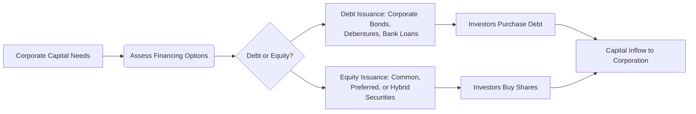

## 12.1 Government and Corporate Finance

Raising capital is a cornerstone of any robust economy. In Canada, both governments (federal, provincial, and municipal) and corporations employ various financing strategies to fund infrastructure projects, spur economic growth, and meet operating needs. In this section, we explore how governments and corporations access funds, the instruments they use, the role of credit ratings, and important regulatory considerations. We will also introduce practical tools, provide illustrative examples, and offer step-by-step approaches for analyzing and evaluating different financing pathways.

---

## Government Finance

### Overview of Government Financing in Canada

Each level of government in Canada—federal, provincial, and municipal—issues debt to finance programs, public works, and other expenditures. Borrowed funds go toward infrastructure projects such as highways, public transit systems, schools, and hospitals, as well as social services. Governments must carefully balance the cost of borrowing against public needs, debt sustainability, and credit ratings to ensure optimal financing structures.

Key types of government debt instruments include:  
• Treasury Bills (T-Bills) – Short-term debt instruments, typically maturing in under one year.  
• Government Bonds and Debentures – Longer-term securities with specific maturities and interest (coupon) payments.  

### Federal Government Financing

The federal government predominantly raises funds via:  
• Marketable Bonds – Issued with maturities stretching from a few years to decades (e.g., Government of Canada 10-year bonds).  
• Treasury Bills – Short-term debt securities that are sold at a discount and redeemed at face value on maturity (most have maturities of 3, 6, or 12 months).  

The Bank of Canada administers the auction process for these government securities. An auction schedule is regularly published on the Bank of Canada’s website, where participants (often large financial institutions like RBC or TD) place bids in a competitive bidding process. The lowest yield (or highest price) bids win. Proceeds from these auctions go toward funding federal government operations, infrastructure, and the management of Canada’s national debt.

### Provincial and Municipal Government Financing

Provincial governments also issue bonds—such as Ontario bonds, Alberta bonds, and Québec bonds—while municipalities float debentures to fund local projects (e.g., building libraries, transit expansions, or water treatment facilities). In many cases, provincial and municipal bonds carry slightly higher yields compared to federal government bonds because of the different credit risk profiles or perceived risk.  

Municipal governments may engage in pooled financing arrangements or work with specialized entities (like the Municipal Finance Authority in British Columbia) to benefit from economies of scale and better borrowing terms. Credit ratings are assigned by agencies (e.g., Fitch, DBRS Morningstar, Moody’s, S&P Global), reflecting the government’s capacity to meet its financial obligations.

### Role of Interest Rates and Credit Ratings

Government borrowing costs—primarily the interest rate it must pay investors—are significantly influenced by market rates and the credit rating assigned to that government’s debt. A high credit rating typically means lower borrowing costs, as investors deem that government more likely to service its debt on time. Conversely, a lower rating reflects higher perceived risk, leading to higher yields demanded by investors.

#### Example: Credit Rating Impact  
• A AAA-rated government bond often trades at a lower yield than a BBB-rated bond, reflecting the difference in credit risk.  
• Provincial bonds rated investment-grade (e.g., AA-, A+, etc.) have lower yields compared to similarly structured but lower-rated bonds.  

Below is a simplified Mermaid diagram illustrating the flow of government debt issuance:

The diagram shows that, to meet spending needs, governments determine the required funding, conduct auctions (or use underwriters), sell debt securities to investors, and receive the proceeds of the issuance.

---

## Corporate Finance

### Introduction to Corporate Fundraising

Corporations raise capital to expand their operations, develop new products, or refinance existing obligations. Management must decide how to structure financing in a way that balances cost, control, and risk. The two principal avenues for corporations to obtain funds are debt financing and equity financing.

### Debt Financing

Debt financing involves borrowing money that must be repaid with interest. Common debt instruments include:  
• Corporate Bonds – Long-term debt securities secured or unsecured by assets.  
• Debentures – Unsecured bonds backed only by the general creditworthiness of the issuer.  
• Bank Loans – Traditional loans secured by corporate assets or cash flow.  

#### Advantages of Debt Financing  
• Interest paid on debt is generally tax-deductible.  
• Existing shareholders do not experience dilution of ownership.  

#### Disadvantages of Debt Financing  
• Regular interest and principal payments must be met, which can stress cash flow.  
• Higher debt levels may increase financial risk and reduce credit ratings, leading to increased borrowing costs.  

### Equity Financing

Equity financing refers to raising capital by selling ownership stakes in the form of shares:  
• Common Shares – Entitle shareholders to vote on corporate matters and share in profits through dividends (if declared).  
• Preferred Shares – Often pay fixed dividends but generally do not carry voting rights.  

#### Advantages of Equity Financing  
• No obligation to repay the capital; dividends are not mandatory.  
• Lower financial risk compared to heavy reliance on debt.  

#### Disadvantages of Equity Financing  
• Issuance of new shares dilutes existing ownership.  
• Dividend payments, if made, are not tax-deductible for the corporation.  

### Non-Traditional and Hybrid Structures

Corporations may tap more complex financing strategies:  
• Convertible Bonds – Can be converted into a predetermined number of shares under specific conditions, offering benefits of both debt (fixed interest) and equity (conversion upside).  
• Hybrid Securities – Instruments blending debt and equity features, such as preferred shares with embedded warrants.  

These structures allow issuers to customize their cost of capital and investor appeal, while also addressing control considerations.

### Impact of Credit Ratings

Credit ratings from agencies like DBRS Morningstar, Moody’s, and S&P Global play a vital role in corporate finance. A favourable rating lowers the yield investors demand:  
• AA-rated corporate bonds typically have lower interest compared to BBB-rated corporate bonds.  
• In adverse market conditions, a downgrade can swiftly increase a firm’s cost of capital and constrain future borrowing capacity.

Below is a Mermaid diagram demonstrating the corporate capital-raising process:

This schematic shows how corporations evaluate needs, choose between debt and equity, and issue instruments that, once purchased by investors, inject new capital into the business.

---

## Regulatory Framework and Compliance

### Canadian Securities Administrators (CSA)

The Canadian Securities Administrators (CSA) is an umbrella organization of provincial and territorial securities regulators. Through national instruments such as NI 41-101 (General Prospectus Requirements) and NI 44-101 (Short Form Prospectus Distributions), the CSA harmonizes many aspects of securities regulation across provinces, ensuring:  
• Clear disclosure requirements for issuers.  
• Co-ordination of regulatory practices.  
• Efficient capital markets and investor protection.

### CIRO (Canadian Investment Regulatory Organization)

CIRO regulates investment dealers and marketplaces across Canada. Its oversight extends to underwriting standards, continuous disclosure obligations, and investor protection measures. Compliance professionals within investment banks work closely with CIRO when orchestrating new debt or equity issues.

### Legal and Tax Considerations

Both government and corporate issuers must abide by Canadian securities laws, ensuring robust disclosure and fair trading practices. From a tax standpoint:  
• Interest on government and corporate bonds is taxed as ordinary income in the hands of individual investors.  
• Dividends from Canadian corporations may benefit from the dividend tax credit, making preferred shares an attractive income investment in taxable accounts.  

For further exploration, refer to the Department of Finance Canada’s guidelines on debt management and securities regulation, found at:  
• https://www.canada.ca/en/department-finance.html

---

## Practical Applications and Real-World Scenarios

### Example: Federal Bond Investments by a Pension Fund

Consider a Canadian pension fund, such as one managed by a major bank or a provincial pension plan. The fund may buy large volumes of Government of Canada 10-year bonds as part of its long-term asset allocation strategy. Because of the high credit rating and liquidity of federal bonds, these investments offer stability and predictable returns.

### Example: Corporate Bond Issuance by a Bank

Major Canadian banks like RBC and TD often issue long-term debt securities in the form of covered bonds or debentures to fund lending activities. Investors analyze the banks’ credit strength, using ratings from DBRS Morningstar or Moody’s, to decide how much yield premium they will demand over Government of Canada benchmarks.

### Using Modeling Tools for Interest Rate Analysis

Financial professionals can utilize open-source tools like Python or R to evaluate bond dynamics. For instance, in Python, the “pandas” library can be combined with “NumPy” to compute bond prices and yield spreads. Similarly, R’s “quantmod” library can help visualize historical interest rate trends, enabling analysts to estimate future borrowing costs for both government and corporate issuers.

---

## Best Practices and Common Pitfalls

• Maintain an Appropriate Balance of Debt and Equity  
  – Excessively high leverage can strain a corporation’s credit rating, while too much dilution through equity may weaken existing ownership.  

• Monitor Interest Rate Environments  
  – Governments and corporations often issue new debt or refinance existing debt in low-interest-rate conditions to lock in reduced borrowing costs.  

• Watch for Regulatory Changes  
  – Shifts in CSA national instruments or CIRO guidelines can affect prospectus requirements, underwriting structures, and compliance obligations.  

• Assess Market Timing  
  – Launching a debt or equity offering in volatile or bearish market conditions can drive up costs and risk under-subscription.  

• Conduct Thorough Due Diligence  
  – For both issuers and investors, analyzing credit ratings, financial statements, and market conditions is essential to mitigate risk.

---

## Glossary

• <strong>Credit Rating:</strong> An independent assessment of an entity’s creditworthiness or risk of default on its debt obligations.  
• <strong>Treasury Bills (T-Bills):</strong> Short-term government debt with maturities typically under one year, issued at a discount and redeemed at par.  
• <strong>Debenture:</strong> A type of unsecured bond where no collateral is pledged, relying solely on an issuer’s creditworthiness.  
• <strong>Cost of Capital:</strong> The required return necessary for a project to be worthwhile, reflecting both debt and equity financing costs.

---

## References and Additional Resources

• <strong>Bank of Canada</strong>:  
  Information on Government of Canada securities auctions and market debt management.  
  https://www.bankofcanada.ca  

• <strong>Department of Finance Canada</strong>:  
  Detailed policy and regulatory framework for government borrowing.  
  https://www.canada.ca/en/department-finance.html  

• <strong>Canadian Securities Administrators (CSA)</strong>:  
  National Instruments and regulatory updates (e.g., NI 41-101, NI 44-101).  
  https://www.securities-administrators.ca  

• <strong>CIRO (Canadian Investment Regulatory Organization)</strong>:  
  Oversees investment dealers and marketplaces, including underwriting standards and marketplace regulations.  
  https://www.ciro.ca  

• <strong>Open-Source Tools</strong>:  
  Python (pandas, NumPy) and R (quantmod) for modeling interest rates and bond pricing.  

• <strong>Further Reading</strong>:  
  “Canadian Securities Regulation” (5th Edition) by Poonam Puri et al.

---

## Chapter Summary

Government and corporate finance both serve vital roles within Canada’s broader capital market. Governments use debt instruments like treasury bills, bonds, and debentures to fund public services and long-term infrastructure projects. Corporations rely on both debt (bonds, debentures, bank loans) and equity (common and preferred shares) to drive growth and manage capital structures. Credit ratings, interest rates, and regulatory frameworks each significantly influence borrowing costs and market confidence.  

By thoroughly understanding how governments and corporations raise funds, investors and financial professionals can make more informed decisions. Key takeaways include recognizing the various costs, risks, and benefits of debt versus equity financing, as well as the importance of credit ratings and the regulatory landscape.

---

## Test Your Knowledge: Government and Corporate Finance Quiz



### Which of the following is a short-term government debt instrument typically maturing in under one year?

- [x] Treasury Bill
- [ ] Variable-Rate Bond
- [ ] Preferred Share
- [ ] Convertible Debenture

> **Explanation:** Treasury bills (T-Bills) are short-term securities—often issued with maturities of 3, 6, or 12 months—sold at a discount and redeemed at par value.

### What is the main advantage of debt financing from a corporation’s perspective?

- [x] Interest payments are generally tax-deductible.
- [ ] Debt never requires repayment.
- [ ] Debt financing involves no interest costs.
- [ ] Debt financing never impacts the corporation’s credit rating.

> **Explanation:** One of the key benefits for a corporation issuing debt is the tax deductibility of interest payments. However, the corporation must meet regular interest and principal obligations, and credit ratings can be affected if leverage gets too high.

### Which of the following is true about credit ratings for government-issued debt?

- [x] A higher credit rating typically means lower borrowing costs.
- [ ] A lower credit rating nearly always boosts investor confidence.
- [ ] Credit ratings do not apply to short-term debt such as T-Bills.
- [ ] Governments do not rely on credit ratings to determine interest rates.

> **Explanation:** A strong credit rating often lowers a government’s cost of borrowing because investors perceive less risk and thus require a lower yield.

### Which of the following best describes a debenture?

- [x] An unsecured bond backed by the general creditworthiness of the issuer.
- [ ] A bond secured by a specific asset or collateral.
- [ ] A short-term instrument similar to a T-Bill.
- [ ] A fully convertible bond with attached warrants.

> **Explanation:** Debentures are unsecured bonds, meaning they do not have specific collateral backing. Their value depends on the issuer’s creditworthiness.

### Why might companies consider issuing convertible bonds or other hybrid securities?

- [x] They offer a blend of debt and equity characteristics that can reduce financing costs.
- [ ] They always avoid any dilution of existing shareholders’ ownership.
- [x] They may allow investors to convert debt into equity under specified conditions.
- [ ] They can only be issued by governments.

> **Explanation:** Convertible bonds and hybrid securities offer features of both debt and equity, often lowering interest costs while providing downside protection to investors and potential upside through conversion.

### Which regulatory body oversees investment dealers and underwriting standards in Canada?

- [x] CIRO (Canadian Investment Regulatory Organization)
- [ ] Canada Revenue Agency (CRA)
- [ ] Office of the Superintendent of Financial Institutions (OSFI)
- [ ] Chartered Professional Accountants (CPA Canada)

> **Explanation:** CIRO is responsible for regulating investment dealers and dealing representatives, underwriting standards, and providing investor protection.

### Which of the following is NOT typically affected by interest rate environments?

- [x] Historical cost of a completed project
- [ ] Issuer’s borrowing cost
- [x] Investor appetite for fixed-income securities
- [ ] Bond prices

> **Explanation:** The historical cost of a previously completed project does not change with the current interest rate environment. However, the cost of borrowing, bond prices, and investor demand are all affected by shifts in interest rates.

### Which of the following are considered equity securities?

- [x] Common shares
- [ ] Debentures
- [ ] Covered bonds
- [ ] T-Bills

> **Explanation:** Common shares (and preferred shares) are classified as equity securities, representing an ownership stake in a corporation.

### What is the primary benefit of using Python or R when analyzing bond pricing?

- [x] Access to powerful libraries like “pandas” or “quantmod” for quantitative analysis
- [ ] Automatic regulatory approval
- [ ] Guaranteed improvement in credit ratings
- [ ] Elimination of all investment risk

> **Explanation:** Tools like Python and R offer sophisticated libraries that streamline modeling, forecasting, and data analysis, particularly for pricing and yield calculations.

### True or False: Municipal governments in Canada can issue debentures to finance local projects.

- [x] True
- [ ] False

> **Explanation:** Municipalities often issue debentures to fund local community projects like transit expansions, road repairs, and other infrastructure needs.



---

