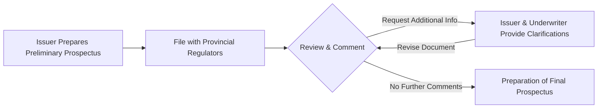

## 12.2 The Corporate Financing Process

In today’s competitive financial landscape, Canadian corporations must constantly evaluate their need for new capital and determine the optimal means to raise it. Whether through equity, debt, or hybrid instruments, the corporate financing process is a critical measure of an organization’s growth strategy. This chapter explores how corporations plan their financing strategies, secure underwriting and advisory services, and navigate regulatory requirements—all within the distinctive context of Canada’s financial environment.

---

## Planning and Strategic Decision-Making

### Assessing Capital Needs

Corporations begin by examining their strategic business plans, market conditions, and current balance sheets to determine how much capital they require. Factors influencing capital needs include:  
• Expansion plans (e.g., opening new facilities, mergers, or acquisitions).  
• Refinancing or restructuring existing debt obligations.  
• Research and development initiatives aimed at innovation.  
• Working capital requirements to maintain daily operations.  

It is not uncommon for corporations to use advanced financial modeling tools—many of which are open source—to conduct scenario analyses and stress tests. These tools, such as Python’s pandas data analysis library or R’s Shiny platform, enable teams to forecast outcomes under various economic and market assumptions.

### Balancing Debt and Equity Financing

An optimal capital structure usually involves a strategic balance of debt and equity. Corporate boards and senior management weigh factors such as:  
• Cost of capital: Interest rates on debt vs. expected returns demanded by shareholders.  
• Impact on leverage: A higher level of debt can increase earnings per share but also elevates the risk of default.  
• Market conditions: If equity markets are strong, a share issuance may be more favorable; if interest rates are low, bond issuance can be less expensive.  
• Regulatory considerations: Certain ratios and compliance benchmarks (e.g., maximum debt-to-equity ratio) might be enforced by regulators or covenants.  

A simple illustration in KaTeX shows how corporations might calculate the Weighted Average Cost of Capital (WACC):


WACC = \left(\frac{E}{V} \times R_e\right) + \left(\frac{D}{V} \times R_d \times (1 - T)) 


Where:  
• \\( E \\) = Market value of the firm's equity.  
• \\( D \\) = Market value of the firm's debt.  
• \\( V = E + D \\).  
• \\( R_e \\) = Cost of equity.  
• \\( R_d \\) = Cost of debt.  
• \\( T \\) = Corporate tax rate.

By calculating the WACC, corporations can evaluate whether their projects or investments are expected to generate returns above their overall cost of financing.  

---

## Underwriting and Advisory Services

Investment dealers—often regulated by the Canadian Investment Regulatory Organization (CIRO)—play a major role in corporate financing. They can serve as underwriters, financial advisors, or both, helping issuers navigate the complexities of the capital markets.

### Role of Investment Dealers

• Guidance on Security Type: Investment dealers assess market conditions and the issuer’s financial position to recommend whether to raise capital through equity, debt, convertible securities, or a combination.  
• Pricing Strategies: Using market data, comparables, and investor sentiment analyses, dealers suggest an offering price or coupon rate that is both attractive to investors and beneficial to the corporate issuer.  
• Distribution Network: Investment dealers maintain relationships with institutional investors, pension funds, and retail brokerages. This network plays a pivotal role in placing securities efficiently.  

### Types of Underwriting Arrangements

1. **Firm Commitment**  
   - Underwriters agree to buy the entire offering from the issuer and then sell it to the investing public.  
   - The underwriter bears the risk of unsold securities if market conditions shift or if demand is weaker than anticipated.  

2. **Best-Efforts Basis**  
   - Underwriters sell as much of the offering as possible but do not guarantee the total issue will be sold.  
   - The issuer retains a greater share of the risk, as unsold securities remain the issuer’s responsibility.  

### Raising Capital in Practice: A Case Study

Consider a mid-sized Canadian technology company seeking CAD 100 million to fund a new product line:  
• Management analyzes its capital structure and current ratio of debt to equity, concluding that issuing new equity is a strategic move.  
• The firm retains an investment dealer subject to CIRO oversight. Based on market data and valuations of comparable tech firms, both parties agree on a best-efforts arrangement to minimize underwriting costs.  
• After due diligence, the underwriter sets a preliminary price of CAD 25 per share and embarks on marketing efforts to institutional investors. If market sentiment is favorable at final pricing, the offering may still reach its target.

---

## Preparing the Prospectus

### Legal and Regulatory Requirements

A prospectus is a comprehensive, legal disclosure document required in Canadian securities offerings. It must align with **National Instrument 41-101 “General Prospectus Requirements,”** as enforced by the Canadian Securities Administrators (CSA). Issuers file with provincial or territorial regulators, who review the document to ensure it presents "full, true, and plain disclosure."

### The Preliminary Prospectus (Red Herring)

• **Content:** Contains essential details about the issuer’s business model, audited and interim financial statements, and management team biographies. It is stamped with a disclaimer specifying that the information is subject to completion or amendment.  
• **Regulatory Review:** Provincial securities commissions provide feedback (comments) that the issuer must address before publishing a final prospectus.  

Below is a simplified Mermaid diagram illustrating the preliminary prospectus workflow:

### The Final Prospectus

Once regulators’ feedback is adequately addressed, the issuer files the final prospectus, and it becomes publicly accessible via **SEDAR+** (System for Electronic Document Analysis and Retrieval). The final prospectus includes:  
• The final offering price.  
• Updated financials or disclosures (if required).  
• Any changes reflecting material events during the review period.

---

## Roadshows and Marketing

### Executing the Roadshow

Before final pricing is set, the issuer’s executive team in collaboration with the underwriters often engage in a “roadshow.” These sessions typically involve:

• **Institutional Meetings**: Presentations to large funds, insurance companies, and pension plans—key players in Canadian capital markets.  
• **Retail Outreach**: Sometimes, the underwriter’s retail advisory network hosts webinars or smaller gatherings, enabling broader public access.  

### Gauging Demand and Setting Price

Through these marketing efforts, underwriters gain insight into investor demand. If interest is especially strong, they might consider increasing the offering size or the price per share. Conversely, a lukewarm response could result in a revision to the pricing or a reevaluation of the issuance size.  

---

## Practical Tips and Best Practices

1. **Underwrite or Not?**  
   Some larger Canadian corporations, like RBC or TD, may choose to sell directly to the market through shelf prospectus filings, reducing reliance on a particular underwriter.

2. **Due Diligence and Audit**  
   A thorough due diligence process prevents regulatory setbacks and maintains investor confidence. Audited statements should reflect the highest standards of accuracy.

3. **Timing with Market Conditions**  
   Avoid launching new issues in periods of significant market volatility, such as around major geopolitical events, if possible.

4. **Leveraging Technology**  
   Electronic platforms streamline the filing process and investor communication—dependent, however, on sufficient cybersecurity measures.  

5. **Investor Relations**  
   Skilled investor relations teams can mitigate misunderstanding or mispricing. Transparent communication fosters a strong market for future issuances.

---

## Challenges and Common Pitfalls

• **Underestimation of Regulatory Complexity**: Missing critical disclosures can delay or jeopardize an offering.  
• **Mismatched Financing**: Issuing too much equity can dilute existing shareholders, whereas excessive debt can lead to liquidity concerns.  
• **Inadequate Marketing**: Lackluster roadshows may produce insufficient demand, affecting pricing.  
• **Market Fluctuations**: A sudden drop in the TSX or global indices can dampen investor willingness.  

Corporations should implement contingency plans (e.g., partial drawdowns, revised allocations between debt and equity) to adapt to evolving market conditions.

---

## Additional Regulatory and Institutional References

Below are key resources for understanding the complexities of corporate financing in Canada:

- **National Instrument 41-101 “General Prospectus Requirements”**  
  https://www.securities-administrators.ca

- **CIRO Rules on Underwriting**  
  https://www.ciro.ca

- **SEDAR+**  
  https://www.sedarplus.ca

- “**Securities Law and Practice**” by Alboini, Puri, and Yalden—an in-depth look at Canadian securities regulation and underwriting processes.

- **Open-Source Tools**:  
  • Python libraries (pandas, NumPy) for financial modeling.  
  • R’s ggplot2 and Shiny for data visualization and scenario analysis.  

---

## Summary

The corporate financing process is a multifaceted endeavor requiring adept strategic planning, collaboration with investment dealers, and compliance with rigorous regulatory standards. From identifying capital requirements to preparing the final prospectus and orchestrating roadshows, each step influences the eventual success and cost of raising funds. Canadian corporations—whether large financial institutions or emerging tech startups—benefit from transparent disclosures, market-aligned strategies, and prudent timing.  

By mastering these principles, corporations can secure capital in ways that not only fund immediate needs but also enhance long-term shareholder value.

---

## Quiz: Corporate Financing Process in Canada



### Which of the following best describes the firm commitment underwriting arrangement?

- [x] The underwriter purchases the entire offering and bears the risk of unsold securities.
- [ ] The underwriter sells only a portion of the securities.
- [ ] The issuer retains all liability for unsold securities.
- [ ] Investors are obligated to purchase all remaining unsold shares.

> **Explanation:** In a firm commitment underwriting, the underwriter commits to buying the entire offering from the issuer, taking on the market risk if the securities cannot be sold at the offering price.

### During the financing process, why might a corporation calculate its Weighted Average Cost of Capital (WACC)?

- [x] To determine if anticipated project returns exceed the cost of financing.
- [ ] To set fixed dividend rates for preferred shareholders.
- [x] To measure the cost of both equity and debt financing.
- [ ] To calculate the corporation’s total market capitalization.

> **Explanation:** WACC helps corporations assess whether the expected returns on new projects will be higher than their blended cost of debt and equity, ensuring financial viability.

### Which of the following is TRUE regarding a best-efforts underwriting?

- [x] The issuer retains the primary risk of any unsold securities.
- [ ] The underwriter guarantees the proceeds to the issuer.
- [ ] The underwriter purchases all remaining unsold shares.
- [ ] The issuer sets a minimum sale price that underwriters must guarantee.

> **Explanation:** In a best-efforts arrangement, underwriters do not guarantee the sale of all the securities; the issuer is at risk if the entire offering is not sold.

### At what stage in the prospectus filing does the "red herring" appear?

- [x] During the preliminary prospectus phase, before final pricing.
- [ ] After the regulators have approved the final version.
- [ ] Simultaneously with the issuance of the final prospectus.
- [ ] Only when an exemption from offering procedures is needed.

> **Explanation:** The preliminary prospectus, often called the “red herring,” is released for review by regulators and potential investors before the final prospectus is approved.

### When corporate boards determine the optimal mix of debt versus equity, which factors are typically considered?

- [x] The cost of capital and potential shareholder dilution.
- [ ] The personal preferences of the executive team only.
- [x] Leverage ratios and market conditions.
- [ ] The ratio of old shares to new preferred stock only.

> **Explanation:** Boards weigh multiple considerations—such as cost of debt, dilution of ownership, interest rates, and market conditions—to arrive at an ideal capital structure.

### Which one of the following actions typically occurs during a roadshow?

- [x] The issuer’s management presents the offering to institutional and retail investors.
- [ ] The underwriter files the final prospectus with securities regulators.
- [ ] CIRO directly sells the corporation’s stock to the public.
- [ ] The issuer finalizes and announces dividend payments.

> **Explanation:** Roadshows involve the issuer's team and the underwriter conducting presentations and Q&A sessions for potential investors to generate interest in the new offering.

### A preliminary prospectus must adhere to which important principle under Canadian securities law?

- [x] Full, true, and plain disclosure of all material facts.
- [ ] Ensuring all outstanding debts are repaid.
- [x] Reducing the risk for underwriters to zero.
- [ ] Guaranteeing a minimum share price to investors.

> **Explanation:** Canadian regulations require that the prospectus (including the preliminary version) give investors a clear, truthful, and complete disclosure to enable informed decision-making.

### What is a downside of issuing too much equity in pursuing new financing?

- [x] Existing shareholders could face dilution of their ownership.
- [ ] High-interest rates could impact the corporation’s credit rating.
- [ ] The WACC becomes irrelevant.
- [ ] Equity holders are forced to convert shares into debt securities.

> **Explanation:** Issuing a large volume of new equity can dilute the ownership percentage and control of existing shareholders.

### Which resource would you primarily consult to review an issuer’s final prospectus in Canada?

- [x] SEDAR+.
- [ ] The Bank of Canada’s website.
- [ ] A U.S. Securities and Exchange Commission database.
- [ ] An underwriter’s internal portal.

> **Explanation:** SEDAR+ is the centralized Canadian platform where final prospectuses and other public company documents are filed and made accessible to the public.

### True or False: A best-efforts underwriting agreement always protects the issuer from any loss if the securities do not sell well.

- [x] True
- [ ] False

> **Explanation:** In a best-efforts agreement, underwriters pledge to do their utmost to sell securities but do not guarantee the entire issue will be sold. Thus, the issuer, not the underwriter, absorbs the risk of unsold securities.



---

