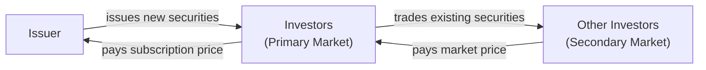
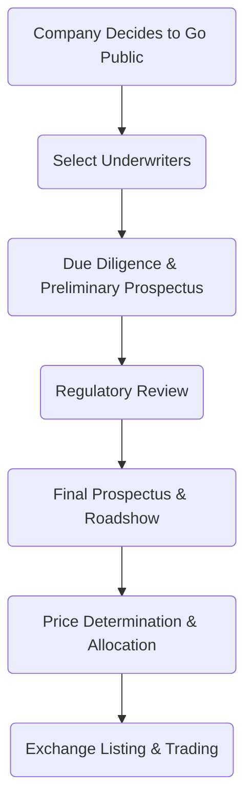

## 12.3 Bringing Securities to the Market

When a corporation or government entity needs to raise capital, one of its primary options is to bring new securities to the market. In Canada, this process is regulated closely to ensure fairness, transparency, and investor protection. In this section, we will examine the distinction between the primary and secondary markets, outline the distribution process for an Initial Public Offering (IPO), review the concept of aftermarket stabilization, and discuss how the offering price is determined.

This comprehensive overview will equip you with the knowledge to understand how securities first enter the marketplace, the mechanics and potential risks of an IPO, and the regulatory frameworks governing these transactions.

---

## The Primary Market vs. the Secondary Market

One of the most fundamental distinctions in capital markets is the difference between primary and secondary markets:

1. **Primary Market**  
   In the primary market, new securities—whether stocks or bonds—are offered for the first time. Proceeds from these initial issuances go directly to the issuer (such as a corporation or government). This is where organizations raise new capital to finance expansions, projects, or other initiatives. The most notable example in equity markets is an IPO, where shares of a private company are sold to public investors for the first time.

2. **Secondary Market**  
   Once securities have been issued and purchased by investors in the primary market, they can be traded among investors in the secondary market. Examples include national exchanges like the Toronto Stock Exchange (TSX) or the TSX Venture Exchange (TSXV). Here, the proceeds of the sale go to the selling investor, not the original issuer. Secondary markets are driven by supply and demand, which in turn are influenced by factors like company performance, economic conditions, and market sentiment.

### Visualizing Primary and Secondary Markets

Below is a simple Mermaid diagram illustrating the flow of funds (green arrows) in the primary market, contrasted with the secondary market flow (blue arrows):

In the primary market, the issuer benefits directly from the sale of new securities. In the secondary market, securities simply change hands among investors, with the issuer no longer receiving capital.

---

## Distribution Process of an IPO

An IPO represents one of the most high-profile ways that organizations tap the public markets. This process transforms a privately held company into a publicly traded corporation, which then must comply with continuous disclosure requirements and ongoing regulatory oversight. While each IPO can have unique characteristics, the general steps are relatively consistent:

### Preliminary Decision and Advisor Selection

• **Corporate Decision-Making:** The organization’s leadership (e.g., the board of directors and executive management) determines that public equity financing is the best route for raising capital.  
• **Engagement of Advisors:** The company typically engages an investment dealer (often referred to as an underwriter or sponsor) to help structure the offering. Major Canadian investment dealers—such as RBC Capital Markets, TD Securities, BMO Capital Markets, or CIBC World Markets—often play a lead role.

### Due Diligence and Prospectus Preparation

• **Due Diligence:** The underwriter performs a thorough examination of the company’s financials, business model, management team, and competitive landscape.  
• **Preliminary (Red Herring) Prospectus:** A preliminary prospectus is prepared in accordance with Canadian securities laws and filed with the relevant securities commission(s). This “red herring” document outlines the company’s financial statements, risk factors, and business strategy, offering potential investors a chance to review the key information before deciding whether to invest.

### Regulatory Review

• **Review by Securities Commissions:** Regulatory bodies—such as the provincial securities commissions—review the preliminary prospectus. In Canada, collaboration among the different regulators can occur under a “passport” system for certain offerings, thereby streamlining the process.  
• **Comment and Revision Period:** The issuer, assisted by its underwriters and legal counsel, responds to any comments or requests for clarification from regulators.

### Final Prospectus and Roadshow

• **Final Prospectus:** Once concerns are addressed and approval is granted, a final prospectus is filed. This document contains the final details of the offering, including the intended price range, the number of shares, and any underwriting discounts or commissions.  
• **Roadshow and Investor Meetings:** Company executives and underwriting representatives meet with potential investors—both institutional (e.g., pension funds, mutual funds) and retail (through broker networks)—to generate interest in the upcoming IPO.

### Price Determination and Allocation

• **Book Building:** Underwriters gauge investor demand for the new security, which helps refine a final price based on the initially indicated range.  
• **Setting the Final Price:** Taking into account market conditions and investor interest, the **offer price** is finalized.  
• **Allocation of Shares:** Underwriters allocate shares among interested investors, often giving priority to institutional clients with large purchase orders, but also reserving a portion for retail investors.  

### Listing and Trading

• **Listing on the Exchange:** On the designated IPO date, the shares are officially listed on a recognized Canadian exchange, such as the TSX or the CSE (Canadian Securities Exchange). Trading commences once the market opens.  
• **Public Company Status:** From this point forward, the company is a publicly traded entity and must adhere to continuous disclosure requirements, including quarterly and annual reporting, and abide by relevant regulations such as National Instrument 44-101 for future offerings.

Below is a Mermaid flowchart summarizing the entire IPO distribution process:

---

## Aftermarket Stabilization

When a stock begins trading, its price can fluctuate significantly as buyers and sellers find equilibrium. Underwriters may take steps to stabilize the share price through specific, regulated mechanisms. One of the most common methods in Canada (and in many global markets) is the overallotment or “greenshoe” option.

### The Greenshoe Option

The greenshoe option allows underwriters to purchase additional shares from the issuer—usually up to 15% more than the original offering size—or sell more shares than are initially allocated if demand is high. Conversely, if the stock price weakens post-IPO, underwriters may buy shares in the open market to cover their short positions, thus supporting the share price. This form of aftermarket stabilization is subject to rules and guidelines, such as those stipulated by the Canadian Investment Regulatory Organization (CIRO, formerly IIROC), to prevent market manipulation.

### Best Practices and Potential Pitfalls

• **Regulatory Compliance:** Underwriters must thoroughly document any aftermarket stabilization activities to prove they are conducted within legal limits.  
• **Transparency:** Issuers and investors should be made aware of how any greenshoe option functions and how it may affect share availability and pricing.  
• **Market Misinterpretation:** If stabilization activities are misunderstood, they could lead to unjustified investor optimism or skepticism.

---

## Price Determination

The underwriter’s core responsibility is to set the issue price of the new security as accurately as possible. Key factors influencing price determination include:

1. **Company Fundamentals:** The issuer’s financial performance, growth prospects, and risk profile.  
2. **Market Comparables:** How similar companies are valued in the public markets (price-to-earnings ratios, price-to-book ratios, etc.).  
3. **Market Sentiment:** Overall risk appetite and liquidity in the market.  
4. **Investor Demand (Book Building):** Orders submitted and demand level indicated by institutional and retail investors.  
5. **Economic Conditions:** Macroeconomic factors such as interest rates, inflation trends, and economic growth can significantly influence investor confidence.

Mispricing can have notable consequences. If the offer price is set too high, the stock may underperform immediately after trading begins, leading to investor dissatisfaction and reputational risk for the underwriters. If the offer price is set too low, the issuer may fail to realize the full value of the company, and underwriters might be accused of favoring specific investors who receive an immediate price “pop.” Balancing these interests is crucial.

---

## Real-World Example: A Hypothetical IPO

Suppose a mid-sized Canadian technology firm, “TechNova Solutions,” plans to go public to finance an expansion into the U.S. market. The company engages RBC Capital Markets as the lead underwriter. RBC conducts detailed due diligence on TechNova’s business model, financial statements, competitive landscape, and intellectual property. They draft a preliminary prospectus, file it with the provincial securities commission, and initiate discussions with CIRO about potential aftermarket stabilization provisions.

Following regulatory comments and investor roadshows, TechNova and RBC set the IPO price at $20 per share, aiming to raise $100 million. In addition, they negotiate a greenshoe option granting RBC the right to purchase an extra 15% of shares if demand exceeds supply. On the listing day at the Toronto Stock Exchange, if the market shows enthusiastic demand, RBC may exercise the greenshoe to sell additional shares and stabilize pricing. If the price begins to fall below $20, RBC can buy back shares, within regulatory limits, to support the price in the immediate aftermath of the IPO.

---

## Additional Resources and References

• **National Instrument 44-101 “Short Form Prospectus Distributions”**:  
  [Canadian Securities Administrators](https://www.securities-administrators.ca)  
  Often used for issuers with established reporting histories who want to distribute securities quickly.

• **CIRO Guidance**:  
  [Canadian Investment Regulatory Organization](https://www.ciro.ca)  
  Offers clear rules for stabilizing transactions and how underwriters can operate legally in the aftermarket.

• **Canadian Exchanges**  
  - [The Canadian Securities Exchange (CSE)](https://thecse.com)  
  - [Toronto Stock Exchange (TSX)](https://www.tsx.com)  
  - [TSX Venture Exchange (TSXV)](https://www.tsx.com/listings/listing-with-us)  

• **Further Reading**  
  - Michel Fleuriet, “Investment Banking Explained: An Insider’s Guide to the Industry,” for a global perspective on underwriting and IPO mechanics.  
  - Public filings from major Canadian banks—RBC, TD, BMO, etc.—which often illustrate real-world underwriting activities.  

---

## Best Practices, Challenges, and Strategies

• **Thorough Compliance**: Engage legal counsel and compliance professionals to navigate national and provincial regulations, ensuring the final prospectus and stabilization activities meet regulatory requirements.  
• **Accurate Valuation**: Invest time in robust financial modeling and market research to determine the appropriate valuation range. Be prepared to adjust in response to shifting market conditions.  
• **Transparent Communication**: Throughout the IPO process, maintain open lines of communication with potential investors. Accurate disclosures and transparent discussions of risks enhance credibility.  
• **Monitoring and Aftermarket Support**: Once trading begins, monitor the secondary market for volatility. Use stabilization tools judiciously—never in a way that manipulates the market or misleads investors.  
• **Continuous Learning**: Both issuers and investment dealers should analyze post-IPO performance and incorporate insights into future offerings.  

By understanding each stage—from the initial decision to go public through to after-market activities—issuers, investors, and financial professionals can better manage the complex task of bringing securities to the market. This knowledge provides a strong foundation for navigating Canada’s dynamic capital markets.

---

## Summary of Key Points

• **Primary Market vs. Secondary Market**: Funds from newly issued securities go to the issuer in the primary market, whereas proceeds in the secondary market go to the selling investor.  
• **IPO Steps**: Preparation includes due diligence, preparing the prospectus, regulatory review, and roadshows, culminating in the final prospectus and listing day.  
• **Aftermarket Stabilization**: Underwriters can use methods like the greenshoe option to smooth price volatility immediately post-IPO, within CIRO guidelines.  
• **Price Determination**: Balances issuer needs against investor demand, guided by company fundamentals, comparables, and market sentiment.  
• **Regulatory Framework**: National Instrument 44-101, CIRO rules for stabilization, and exchange listing requirements are all key references for participants.  

Bringing new securities to the Canadian market is both an art and a science—combining in-depth financial analysis with regulatory adherence. Equipped with a detailed understanding of each phase and a knowledge of the major regulatory and institutional players, you will be ready to navigate or support the IPO and new issue process in Canada.

---

## Test Your Knowledge: Canadian IPOs and Securities Issuance Quiz



### Which market involves the issuance of new securities directly by the issuer?

- [x] Primary market  
- [ ] Secondary market  
- [ ] Debt market  
- [ ] Derivatives market  

> **Explanation:**( In the primary market, issuers (e.g., corporations or governments) sell new securities to raise capital.  )

### In the distribution of an IPO, what document is typically filed with the securities commissions before the final prospectus?

- [x] Preliminary (Red Herring) Prospectus  
- [ ] Annual Information Form  
- [ ] Short Form Prospectus  
- [ ] Shareholder Agreement  

> **Explanation:**( The preliminary or "red herring" prospectus is filed to provide potential investors with initial information before a final prospectus is issued.  )

### In Canada, if a company has already established a reporting history, it may use National Instrument 44-101 to:

- [x] Distribute securities more quickly with a short form prospectus  
- [ ] Avoid filing any prospectus  
- [ ] Prohibit retail investors from participating  
- [ ] Limit the underwriter’s ability to engage in stabilization  

> **Explanation:**( National Instrument 44-101 allows eligible issuers to distribute securities using a more streamlined prospectus, known as the short form prospectus.  )

### Aftermarket stabilization mechanisms by underwriters are most commonly employed:

- [x] During the first few days or weeks following an IPO  
- [ ] Before a preliminary prospectus is filed  
- [ ] Only when a stock’s price doubles  
- [ ] Several years after listing  

> **Explanation:**( Underwriters may stabilize the stock price soon after the IPO to manage immediate volatility, subject to prescribed legal and regulatory frameworks.  )

### Which of the following statements about the greenshoe (overallotment) option is correct?  
- [x] It allows underwriters to buy or sell additional shares to help stabilize the stock price.  
- [ ] It is mandatory for all IPOs exceeding $10 million in offered securities.  
- [ ] It allows the underwriters to cancel the entire IPO if initial demand is weak.  
- [ ] It does not require any regulatory disclosure.  

> **Explanation:**( The greenshoe option gives underwriters flexibility to buy or sell more shares than originally allocated to manage market volatility, provided it is disclosed.  )

### If the offering price of an IPO is set too high, what is a possible outcome?

- [x] The security’s price might drop immediately, disappointing investors.  
- [ ] The issuer raises significantly more than it expected.  
- [ ] The underwriter no longer needs to file a final prospectus.  
- [ ] There is no effect on the security’s trading after listing.  

> **Explanation:**( If the price is higher than market demand justifies, the secondary market price may drop below the IPO offer price, leading to immediate losses for early investors.  )

### Which of the following factors least influences IPO pricing?

- [x] The lead underwriter’s office rental costs  
- [ ] Comparable valuations in the market  
- [ ] The issuer’s financial fundamentals  
- [ ] Current macroeconomic conditions  

> **Explanation:**( The lead underwriter’s office overhead is not a direct factor in determining where the IPO is priced. Market comparables, fundamentals, and economic conditions are key drivers.  )

### What is a key difference between the primary and secondary markets?

- [x] In the primary market, proceeds go to the issuer; in the secondary market, proceeds go to the investor selling the security.  
- [ ] Only debt instruments are traded in the secondary market.  
- [ ] The primary market is unregulated, whereas the secondary market is strictly regulated.  
- [ ] There are no price fluctuations in the secondary market.  

> **Explanation:**( In the primary market, new issues raise funds for the issuer, while secondary market transactions involve existing securities trading among investors.  )

### Which of the following is a main role of underwriters in an IPO?

- [x] Performing due diligence, structuring the offering, and distributing shares  
- [ ] Auditing the issuing company’s annual financial statements  
- [ ] Setting monetary policy for Canadian banks  
- [ ] Registering shareholders for a newly created investment fund  

> **Explanation:**( Underwriters undertake due diligence, help determine the offer price, market the securities to prospective investors, and distribute the shares.  )

### True or False: Underwriters can engage in unlimited aftermarket stabilization without any regulatory constraints.

- [x] False  
- [ ] True  

> **Explanation:** Underwriters must follow strict guidelines for stabilization to avoid market manipulation. In Canada, CIRO imposes clear rules on how and when stabilization can be conducted.  



---

