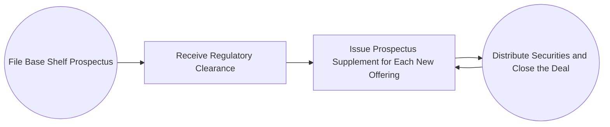

## 12.4 Other Methods of Distributing Securities to the Public

In Canadian capital markets, issuing new securities to the public can take multiple forms. While the “traditional” route of a long-form prospectus might be the most recognized, there are several alternative (and often more efficient) methods of distributing securities to investors. These methods include private placements, short form prospectuses, shelf registrations (also known as shelf prospectuses), and bought deals. By choosing the right vehicle to issue securities, corporations can effectively manage regulatory requirements, costs, and market timing to optimize their fundraising strategies. This chapter explores each of these methods in depth, illustrating how they operate and discussing their key advantages, challenges, and best-fit scenarios.

---

## Private Placements

Private placements involve the sale of securities (either equity or debt) directly to a relatively small group of institutional or accredited investors without filing a public prospectus. Typically, private placements fall under prospectus exemptions set out in [National Instrument 45-106 “Prospectus Exemptions”](https://www.securities-administrators.ca), which provides the legal framework for offering securities privately. Under this framework:

• An issuer can raise capital from “accredited investors,” which often include pension funds, insurance companies, mutual funds, or high-net-worth individuals.  
• The issuer avoids the expense and disclosure requirements of a public offering, although certain reporting and disclosure obligations still apply (e.g., providing an offering memorandum).  
• Private placements can typically be completed more rapidly than public offerings.

### Typical Workflow for a Private Placement

1. Identify Potential Investors: Issuers, underwriters, or dealers approach high-net-worth individuals or institutional clients.  
2. Negotiate Terms: Price per share, number of shares, or coupon rates for debt instruments are established.  
3. Documentation: A private placement memorandum (or offering memorandum) detailing investment risks, business operations, and terms of the offering is prepared.  
4. Closing & Funding: Upon investors’ agreement, funds are transferred to the issuer. Legal documentation is signed and the issuer delivers the newly issued securities.

### Real-World Example

Consider a smaller Canadian technology startup aiming to raise CA$10 million to expand its product line. The startup might choose a private placement due to time constraints and a desire to maintain confidentiality regarding their internal growth strategy. By securing funds from a few venture capital firms that qualify as accredited investors, the issuer avoids extensive public disclosure and can close the deal swiftly.

### Best Practices and Common Pitfalls

• Conduct Thorough Due Diligence: Even though prospectus requirements are exempt, comprehensive due diligence remains vital.  
• Maintain Clear Investor Communication: Investors must understand the risks and benefits associated with the private offering.  
• Watch for Resale Restrictions: These securities will often have a “hold period” before they can be traded on the open market.  
• Regulatory Compliance: Failure to meet exemption requirements can lead to penalties or rescission rights for investors.

---

## Short Form Prospectus

A short form prospectus allows eligible issuers to file a condensed prospectus if they meet continuous disclosure requirements. The process is governed by rules under [National Instrument 44-101 “Short Form Prospectus Distributions”](https://www.securities-administrators.ca).

### Key Features

• Streamlined Disclosure: Rather than producing an exhaustive document, the issuer references information from its existing continuous disclosure records (e.g., annual information form, management discussion & analysis).  
• Faster Time to Market: Companies meeting the eligibility criteria often have already satisfied ongoing disclosure requirements, reducing regulatory review times.  
• Lower Costs: Reduced length and complexity of documents can mean lower legal, printing, and administrative expenses.

### Step-by-Step Process

1. Preliminary Short Form Prospectus: Issuer prepares a preliminary version and files it.  
2. Review by Regulators: Securities commissions examine the document for completeness and accuracy.  
3. Marketing of Securities: The issuer and underwriters gauge investor interest while awaiting regulatory clearance.  
4. Final Short Form Prospectus: After incorporating any required changes, the final document is filed.  
5. Closing: Investors purchase the new securities under the offering.

### Real-World Example

Royal Bank of Canada (RBC), being a large and longstanding reporting issuer, frequently uses the short form prospectus system. Because RBC consistently meets continuous disclosure requirements, it can quickly file a short form prospectus when raising capital. This agility can be crucial if RBC anticipates favourable market conditions and seeks to lock in an advantageous price.

### Challenges and Considerations

• Must Be a Qualified Reporting Issuer: Not all companies qualify. Firms with insufficient reporting history or major recent corporate events may be ineligible.  
• Market Timing Complexity: Even with a streamlined process, external market conditions can change rapidly, requiring quick strategic decisions.  
• Underwriters’ Liability: Underwriters still carry liability for ensuring full and fair disclosure.

---

## Shelf Registration (Shelf Prospectus)

A shelf registration (or “shelf prospectus”) is a mechanism that lets an issuer file a base shelf prospectus with regulators, which is valid for a specified period (usually 25 months in Canada). During this period, the issuer can offer securities in multiple tranches without needing to file a new prospectus each time, provided the offerings fall within the scope described in the base prospectus. This structure is governed by [National Instrument 44-102 “Shelf Distributions”](https://www.securities-administrators.ca).

### Advantages of a Shelf Prospectus

• Flexibility and Speed: Once the base shelf prospectus is cleared, new offerings can be launched quickly, allowing the issuer to capitalize on market windows.  
• Reduced Regulatory Burden: Shorter supplemental or “prospectus supplement” documents typically accompany each subsequent issuance, referencing the base shelf.  
• Cost Efficiency: Legal and documentation expenses may be lower over time, especially for issuers with recurring funding needs.  

### Visual Overview

Below is a simplified diagram illustrating how shelf registration works from filing to subsequent offerings:

1. The issuer files a base shelf prospectus with regulators.  
2. Upon approval, the issuer has a window (e.g., up to 25 months) to issue multiple tranches of securities under that shelf.  
3. Each time the issuer wants to distribute new securities, it files a short supplement referencing the base prospectus.  

### Practical Example: Timing the Market

Imagine Toronto-Dominion (TD) Bank expects to raise CA$4 billion over the next two years for strategic acquisitions. By filing a shelf prospectus, TD can time each issuance to match favourable market conditions (e.g., lower interest rates for bond issues). This approach gives TD flexibility to spread out financing across multiple tranches when capital is cheapest.

### Considerations and Pitfalls

• Continuous Disclosure: The issuer must keep all disclosures (financial statements, material changes) current throughout the shelf’s validity.  
• Size and Demand Estimates: Overestimating investor demand or undervaluing the total shelf size can lead to unused capacity or capital structure mismatches.  
• Regulatory Limitations: Exceeding the scope of the base prospectus triggers additional filings and reviews.

---

## Bought Deals

In a bought deal, investment banks (underwriters) agree to purchase the entire offering—equity or debt—before the preliminary prospectus is filed. The underwriter then resells the securities to the public. This arrangement is common for seasoned issuers with stable credit histories and strong investor followings.

### How Bought Deals Work

1. Pre-Negotiation: The issuer and underwriters discuss offering size, price, and timing.  
2. Underwriter Commitment: The underwriter (or syndicate) commits to purchasing all securities, effectively guaranteeing the issuer a set amount of capital.  
3. Preliminary Prospectus Filing: The preliminary prospectus is prepared and filed.  
4. Risk Transfer: Market risk shifts from issuer to underwriter, raising the stakes for underwriters to accurately price the offering.  
5. Distribution to Public: The underwriter markets and sells parcels of the offering to investors (institutions, retail, etc.).

### Why Choose a Bought Deal?

• Speed and Certainty: The issuer knows immediately how much capital will be raised.  
• Market Risk Reduction for Issuer: Any immediate fluctuation in market prices affects the underwriter, not the issuer.  
• Favourable for Strong Credits/Brands: Underwriters are more willing to agree to bought deals for established companies with robust financials.

### Example in Practice

A major mining company, known for consistent production and stable prices, might execute a bought deal with a top-tier Canadian investment bank. Given the miner’s solid track record, the underwriter is comfortable taking on the risk. The miner benefits from an expedited timeline and less uncertainty about final proceeds.

### Key Challenges

• Underwriter Pricing Dilemma: If the underwriter overestimates demand, it could be left holding unsold securities.  
• Regulation: Although the process is quick, it must still comply with [National Instrument 44-101 “Short Form Prospectus”](https://www.securities-administrators.ca) and related disclosure rules if a short form prospectus is used.  
• High Underwriting Fees: Such deals typically come with a premium to compensate underwriters for the added risk.

---

## Glossary

• **Private Placement**: Sale of securities to a small group of select investors without filing a full public prospectus, usually under exemptions such as National Instrument 45-106.  
• **Short Form Prospectus**: Streamlined version of a prospectus used by qualifying issuers with a record of timely and accurate continuous disclosure.  
• **Shelf Prospectus**: A base prospectus filed for a set period, allowing the issuer to launch multiple offerings without re-filing a full prospectus each time.  
• **Bought Deal**: Underwriting arrangement whereby underwriters buy an entire issue from the issuer upfront, assuming the market risk themselves.

---

## Strategies, Best Practices, and Actionable Insights

1. **Select the Right Method**: Assess the size of the financing, market conditions, investor appetite, and your company’s disclosure track record to decide between a private placement, short form prospectus, shelf prospectus, or bought deal.  
2. **Regulatory Compliance**: Familiarize yourself with the relevant provisions of [National Instrument 44-101](https://www.securities-administrators.ca), [National Instrument 44-102](https://www.securities-administrators.ca), and [National Instrument 45-106](https://www.securities-administrators.ca).  
3. **Use of Open-Source Tools**: Various open-source spreadsheet templates are available for modeling offering scenarios. Specialized platforms such as “Dealogic” or “PitchBook” can help track market data and historical deal structures.  
4. **Stay Updated with Regulatory Bodies**: Check the [Canadian Investment Regulatory Organization (CIRO) bulletins](https://www.ciro.ca) for current distribution guidelines and compliance standards.  
5. **Manage Timing and Market Conditions**: For short form or shelf prospectus offerings, be prepared to move quickly when markets shift. Keep an eye on interest rates, investor sentiment, and macroeconomic indicators.  
6. **Investor Relations**: Regardless of the distribution method, maintaining transparent communication with current or potential investors is crucial. Proactive updates on business performance can enhance trust and facilitate future offerings.

---

## Summary

Alternative methods of distributing securities—from private placements to short form prospectuses, shelf registrations, and bought deals—offer diverse advantages for issuers looking to raise capital in Canada. Key considerations include speed to market, disclosure requirements, underwriting risk, and overall cost. For seasoned issuers, short form and shelf prospectuses deliver efficiency, while private placements may attract early-stage ventures or those seeking confidentiality. Meanwhile, bought deals can provide immediate certainty but typically work best for stable, well-known issuers.

By understanding the merits and complexities of each offering method, financial professionals, corporate executives, and investors can make informed decisions when structuring or participating in a securities distribution. Managing regulatory compliance, engaging underwriters effectively, and timing the market astutely are essential for executing a successful offering.

---

## Master the Art of Canadian Securities Distribution: Test Your Knowledge



### Which of the following statements best describes a private placement in Canada?

- [ ] It involves public disclosure of a full prospectus for retail investors.  
- [ ] It is only accessible to government entities.  
- [x] It is an offering exempt from prospectus requirements, targeting select accredited investors.  
- [ ] It is a mandatory method for all new securities distributions.  

> **Explanation:**( Private placements are a way of selling securities to a limited number of accredited or institutional investors without filing a full public prospectus, as permitted by National Instrument 45-106.)

### Which document typically references existing continuous disclosure records rather than creating an entirely new disclosure document?

- [ ] Preliminary long-form prospectus  
- [x] Short form prospectus  
- [ ] Indicative term sheet  
- [ ] Standby commitment agreement  

> **Explanation:**( A short form prospectus process allows qualified reporting issuers to incorporate by reference their previously filed disclosure documents to streamline the process.)

### Under a shelf prospectus, which of the following is NOT true?

- [ ] It generally remains valid for a set period, often 25 months.  
- [ ] It requires filing a base document, after which multiple offerings can be launched.  
- [ ] It eliminates the need to file any subsequent supplements.  
- [x] The issuer must still disclose material changes throughout the shelf period.  

> **Explanation:**( A shelf prospectus allows multiple offerings under a single base filing, but each new tranche typically requires a short supplement, and the issuer must continue filing ongoing disclosure for material changes.)

### Which distribution method provides the issuer with certainty about the total proceeds from the offering before the preliminary prospectus is filed?

- [ ] Agency offering  
- [x] Bought deal  
- [ ] Overnight marketed deal  
- [ ] Warrant offering  

> **Explanation:**( In a bought deal, underwriters commit to purchasing the entire issue upfront, guaranteeing the issuer a specific amount of proceeds.)

### Which best describes a challenge for underwriters in a bought deal?

- [x] They assume the market risk of unsold securities.  
- [ ] They have full recourse to the issuer for unsold securities.  
- [ ] They wait until investor interest is confirmed before taking any risk.  
- [ ] They are exempt from disclosure obligations.  

> **Explanation:**( In a bought deal, underwriters commit to buying the entire issue before gathering firm expressions of investor interest, placing market risk on the underwriters.)

### Which entity provides guidelines and bulletins on distribution methods and compliance standards for capital markets in Canada?

- [ ] The World Bank  
- [ ] Canada Mortgage and Housing Corporation (CMHC)  
- [x] Canadian Investment Regulatory Organization (CIRO)  
- [ ] Bank for International Settlements  

> **Explanation:**( CIRO issues bulletins, guidelines, and updates on compliance standards for member firms engaged in securities distribution and other aspects of capital markets.)

### Why might a smaller Canadian startup opt for a private placement over a public offering?

- [ ] To benefit from extensive retail investor participation.  
- [x] To expedite the capital raise process and avoid comprehensive public disclosure.  
- [ ] To comply with mandatory government lending regulations.  
- [ ] Because private placements are free of any legal documentation.  

> **Explanation:**( Private placements generally have fewer regulatory requirements, can close more quickly, and allow smaller issuers to maintain confidentiality about their strategic plans.)

### Which of the following best characterizes a short form prospectus issuer?

- [ ] A company with zero reporting history that is listing for the first time.  
- [ ] A firm exempt from all continuous disclosure obligations.  
- [x] An existing reporting issuer with a history of timely filings and robust disclosure.  
- [ ] An issuer that is legally restricted from disclosing financial statements.  

> **Explanation:**( Only reporting issuers that meet certain continuous disclosure requirements and have a strong track record can use the short form prospectus system.)

### When an issuer wants to time multiple issuances within a two-year horizon while minimizing repeated regulatory filings, which method is most suitable?

- [ ] Long form prospectus for each issuance  
- [ ] Overnight marketed offering  
- [ ] Private placement for each issuance  
- [x] Shelf prospectus  

> **Explanation:**( A shelf prospectus lets an issuer file once and then issue securities in multiple tranches over a valid period, leveraging a shorter supplement filing process each time.)

### Bought deals typically cater to:

- [x] Seasoned issuers with stable credit and strong market demand.  
- [ ] Only high-risk startups with uncertain revenue models.  
- [ ] Government bodies looking to issue new currency.  
- [ ] Venture capital firms seeking private equity investments.  

> **Explanation:** Bought deals generally target established, stable businesses that are well-regarded in the market, as underwriters are more inclined to accept the risk of a full purchase from these issuers.



---

