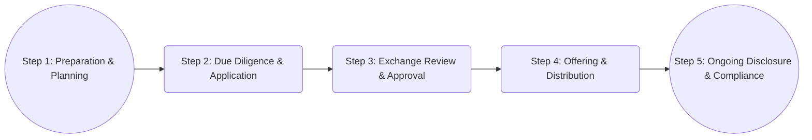

## 12.5 The Listing Process

Listing a company’s securities on a recognized Canadian stock exchange—such as the Toronto Stock Exchange (TSX), TSX Venture Exchange (TSXV), Neo Exchange (NEO), or Canadian Securities Exchange (CSE)—is often a transformative milestone. It signals to investors that a company has achieved a level of maturity, credibility, and transparency required to access Canada’s public capital markets. For many companies, listing provides a critical avenue to attract new investors, increase liquidity for current shareholders, and strengthen overall brand recognition. Below, we explore the key steps, requirements, and considerations involved in listing on a Canadian exchange, along with the potential risks and rewards.

---

### Importance of Listing

When a private company decides to go public, it undertakes the process of issuing shares to the public and having those shares listed on a stock exchange. This action extends beyond just offering ownership; it shapes the company’s structure, governance, and reputation in the market.

1. **Enhanced Visibility and Liquidity**  
   • Listing on a recognized exchange like the TSX, TSXV, NEO, or CSE exposes the company to a broad pool of investors, including retail investors, institutional investors, and pension funds.  
   • Improved visibility often translates to enhanced liquidity, meaning that the company’s shares can be bought and sold more easily, which helps stabilize pricing and widens the investor base.  

2. **Reputation and Credibility**  
   • A listing signals to the market that the company has met stringent regulatory standards, enhancing investor confidence.  
   • Being public can boost brand recognition and can help the company secure favorable financing terms in the future, reflecting an improved reputation.

3. **Regulated and Transparent Marketplace**  
   • Canada’s stock exchanges are closely regulated, providing investors with protection through continuous disclosure requirements, market surveillance, and overarching regulatory frameworks.  
   • This transparency helps build trust with current and potential shareholders, as they have consistent access to reliable information about company operations and performance.

---

### Listing Requirements

Different exchanges in Canada have distinct listing requirements, tailored to the size, industry, and maturity level of the companies they accept. However, there are general criteria that span across most exchanges:

1. **Minimum Market Capitalization**  
   • Exchanges usually require a certain market capitalization threshold that reflects the overall value of the company (calculated as the share price multiplied by the total number of outstanding shares).

2. **Public Float**  
   • Public float represents the number of securities available for purchase and sale by the general public (excluding shares held by insiders, controlling shareholders, or strategic long-term investors). Exchanges stipulate a minimum percentage of shares that must be floated to ensure liquidity.

3. **Shareholders and Distribution**  
   • Exchanges typically require a minimum number of shareholders and a broad distribution of shares. This stipulation helps maintain active trading and prevents situations where too few individuals hold a large ownership stake.

4. **Financial Requirements**  
   • Companies must prove a certain level of financial stability, often demonstrated by earnings history, net tangible assets, or a minimum cash flow.  
   • Growth-oriented exchanges (e.g., TSXV) may have lower financial thresholds to accommodate smaller or emerging companies with strong potential.

5. **Corporate Governance**  
   • Listed issuers are subject to governance rules, including having a board of directors, independent committees (e.g., an audit committee), and robust internal controls.  
   • Compliance with Canadian Securities Administrators (CSA) corporate governance guidelines is typically required.

6. **Continuous Disclosure Obligations**  
   • Companies must meet ongoing reporting requirements. This includes filing quarterly and annual financial statements, Management Discussion & Analysis (MD&A), material change reports, and providing timely disclosure of material events.  
   • These documents are publicly accessible on SEDAR+ (System for Electronic Document Analysis and Retrieval Plus), ensuring transparency for all market participants.

#### Example: TSX Minimum Requirements

For illustration, the Toronto Stock Exchange (TSX) mandates specific financial thresholds that can include minimum earnings or net tangible assets for industrial companies. Additionally, the TSX will look at the size of the public float, the number of shareholders, and other brackets such as minimum share price. To get a granular breakdown of requirements, consult the [TSX Manual](https://www.tsx.com/listings) and speak with listing professionals if your company is considering a TSX listing.

---

### The Listing Process in Action

The path to listing involves several steps of preparation and regulatory review. Below is a simplified visual outline of how a company can move from private operations to a successfully listed entity:

1. **Step 1: Preparation and Planning**  
   • Engage investment bankers, legal counsel, and auditors experienced in public offerings.  
   • Undertake feasibility studies to confirm that the company meets the financial and governance thresholds.  
   • Evaluate whether the TSX, TSXV, NEO, or CSE is the best fit based on the company’s size, industry, and strategic objectives.

2. **Step 2: Due Diligence and Listing Application**  
   • Work closely with external auditors and legal advisers to ensure your financial statements and business operations meet exchange requirements.  
   • Prepare offering documents (e.g., prospectus or listing statement) rigorously reviewed by securities regulators and the listing exchange.

3. **Step 3: Exchange Review and Approval**  
   • Submit the formal application. The exchange reviews the company’s documents, financials, public float structure, and governance practices.  
   • Companies may receive queries or requests for additional documentation or clarifications. Swift and thorough responses can expedite approval.

4. **Step 4: Offering and Distribution**  
   • If the listing is accompanied by an Initial Public Offering (IPO), shares are distributed to investors, often with underwriters (investment dealers) playing a lead role.  
   • Marketing efforts (e.g., a roadshow) help build investor interest and determine the appropriate share price.

5. **Step 5: Ongoing Disclosure and Compliance**  
   • Once listed, the company must maintain ongoing compliance, including continuous disclosure, timely filing of financial reports, and meeting board governance standards.  
   • Issues that arise due to non-compliance, halted trading, or sudden changes in financial health can lead to scrutiny from the exchange and regulators.

---

### Advantages and Disadvantages of Listing

#### Advantages

1. **Greater Access to Capital**  
   • Public companies can tap a wider pool of investors for both primary and secondary offerings, offering flexibility in raising funds for growth, expansion, or acquisitions.

2. **Higher Status and Market Recognition**  
   • Listing on a reputable exchange can raise the company’s profile, leading to enhanced media coverage and investor interest.  
   • Shares can be used strategically as a form of currency in mergers and acquisitions due to readily available pricing comparisons in the market.

3. **Public Valuation and Liquidity for Shareholders**  
   • Going public provides an official market valuation, allowing insiders and early investors to monetize part of their holdings.  
   • Liquidity makes it easier for existing shareholders to sell shares over time, fostering broader ownership.

#### Disadvantages

1. **Increased Costs**  
   • Listing fees, regulatory compliance, investor relations efforts, and ongoing reporting can significantly raise operational expenses.  
   • Companies must dedicate resources to meet legal, financial, and administrative obligations.

2. **Stringent Reporting Requirements**  
   • There's a high level of transparency required in terms of financial reporting and material change disclosures.  
   • This level of oversight can present strategic and operational risks if proprietary or competitive information becomes accessible to competitors.

3. **Greater Public Scrutiny**  
   • Publicly listed companies face more intense examination by investors, analysts, media, and regulators.  
   • Management decisions are often scrutinized, and short-term market reactions can pressure executives to prioritize immediate performance over long-term strategies.

---

### Delisting and Suspension

While listing is a significant achievement, companies can face suspension or delisting if they fail to comply with exchange rules or fall into financial distress.

1. **Delisting Triggers**  
   • Failure to maintain minimum listing requirements (market cap, share price, public float, etc.).  
   • Significant legal, regulatory, or insolvency issues.  
   • Voluntary delisting in favor of migrating to another exchange or going private.

2. **Consequences of Delisting**  
   • Reduced market visibility, liquidity, and investor confidence.  
   • Potential loss of access to new equity capital.  
   • Reputation damage, which may impede future financing efforts.

3. **Suspension vs. Delisting**  
   • Suspension is a temporary halt in the trading of a company’s shares while the exchange or regulators investigate compliance concerns or new material facts.  
   • If issues cannot be resolved, delisting follows, effectively removing the security from the exchange.

---

### Real-World Examples and Case Studies

1. **Case: A Technology Startup Listing on the TSXV**  
   • A small Canadian software developer aims to grow quickly. Although it has yet to turn a profit, it meets the TSXV Tier 1 or Tier 2 financial requirements. By listing on the TSXV, the company gains access to a new pool of growth-oriented investors. Over time, the startup scales operations, and as its financials strengthen, it might graduate to the TSX.

2. **Case: Canadian Energy Company Transitioning from Private Equity**  
   • An energy company, historically backed by private equity, decides to list on the TSX to diversify its investor base and enable early investors to realize returns. Although the listing process demands considerable transparency, the company’s established operational record and robust governance credentials streamline the due diligence phase and attract significant demand during the IPO.

3. **Case: Delisting of a Mining Company**  
   • A junior mining company fails to file financial statements on time for several quarters. The TSXV suspends trading while regulators investigate. With no clear improvement plan, the exchange ultimately delists the company’s securities, severely hindering the firm’s access to institutional capital.

---

### Best Practices, Common Pitfalls, and Strategies

1. **Best Practices**  
   • Develop comprehensive corporate governance frameworks that align with CSA guidelines.  
   • Maintain consistent and transparent financial reporting to build credibility with investors.  
   • Leverage investor relations (IR) expertise to manage communications and expectations effectively.

2. **Common Pitfalls**  
   • Underestimating the high costs and complexity of listing, including legal fees, accounting fees, and ongoing compliance.  
   • Failing to build robust internal controls, leading to reporting errors or regulatory penalties.  
   • Not adequately preparing for market volatility or swings in investor sentiment.

3. **Strategies to Overcome Challenges**  
   • Conduct a thorough gap analysis of corporate governance and financial controls before starting the listing process.  
   • Seek experienced legal, accounting, and underwriting partners with deep knowledge of the chosen exchange.  
   • Plan for investor relations management post-listing to ensure consistent communication and market support.

---

### Practical Exercises and Self-Assessment

1. **Assess Your Company’s Readiness**  
   • Suppose you are the CFO of a mid-sized Canadian manufacturing firm. Evaluate whether your business meets key TSX listing criteria—consider market cap, public float, corporate governance, and financial health.

2. **Analyze an Existing Listed Entity**  
   • Pick any Canadian public company on the TSX and review its continuous disclosure filings on [SEDAR+](https://www.sedarplus.ca). Identify examples of material change reports and MD&A discussions to understand how public issuers communicate changes and financial performance.

3. **Evaluate the Impact of Delisting**  
   • Consider a scenario where a hypothetical company in your portfolio is threatened with delisting due to missing filing deadlines. Brainstorm potential solutions to regain compliance and restore investor confidence.

---

### Glossary of Key Terms

• **Public Float**: The portion of a company’s outstanding shares available for purchase by the public, excluding shares held by insiders or strategic investors.  
• **Market Capitalization**: The overall market value of a company’s shares, calculated as share price × total outstanding shares.  
• **Delisting**: The removal of a company’s shares from an exchange, either voluntarily or involuntarily (due to non-compliance or failure to meet listing standards).  
• **Continuous Disclosure**: The regulatory requirement for public companies to provide timely, accurate, and complete information regarding any material events, financial results, or operational changes.

---

### References and Additional Resources

• [Toronto Stock Exchange (TSX) Manual](https://www.tsx.com/listings) – Official guide to listing requirements.  
• [Canadian Securities Exchange (CSE)](https://thecse.com) – Listing requirements and continuous disclosure obligations.  
• [Canadian Investment Regulatory Organization (CIRO)](https://www.ciro.ca) – Oversees trading and marketplace operations to ensure compliance with listing and trading rules.  
• [SEDAR+](https://www.sedarplus.ca) – The platform for viewing continuous disclosure documents such as financial statements, MD&A, and material change reports.  
• “The Exchange Manifesto: TSX Guide to Going Public” – Detailed planning and execution guide for a successful Canadian listing (available on the TSX website).  

For guidance on compliance, open-source financial models, and frameworks to track listing progress, you can explore various public repositories on GitHub and developer communities focusing on financial analytics platforms.

---

## Listing Process Mastery Quiz



### Which of the following is the main advantage of listing on a major Canadian stock exchange?

- [ ] Reduced regulatory requirements  
- [x] Enhanced liquidity and visibility for shares  
- [ ] Guaranteed dividend payments  
- [ ] Exemption from corporate governance rules  

> **Explanation:**( Listing on a major exchange like the TSX enhances visibility and liquidity, broadens the investor base, and can lead to increased credibility. However, regulatory requirements and corporate governance obligations typically intensify.)

### What does the public float represent?

- [ ] The total market capitalization of the company  
- [ ] The total number of insiders holding shares  
- [x] The portion of the company’s shares readily available to the public for trading  
- [ ] The minimum share price assigned by the exchange  

> **Explanation:**( The public float is the volume of shares that can be traded by outside investors, separate from shares owned by insiders or large, long-term shareholders.)

### Which of the following is a common requirement for listing on Canadian stock exchanges?

- [ ] A minimum of five years of operation  
- [ ] No board of directors required  
- [ ] No need for financial statements  
- [x] A minimum percentage of shares held by the public  

> **Explanation:**( Exchanges often require that a certain percentage of outstanding shares be distributed among public shareholders, ensuring adequate liquidity and a broad investor base.)

### True or False: Delisting always occurs at the request of the issuer.

- [ ] True  
- [x] False  

> **Explanation:**( While companies can request to be delisted voluntarily, exchanges can also force delisting if there is a failure to maintain listing standards or serious regulatory breaches.)

### Which of these is a downside of listing your company’s shares?

- [ ] A more diversified investor base  
- [x] High costs and increased public scrutiny  
- [ ] Access to additional capital  
- [ ] Easier mergers and acquisitions  

> **Explanation:**( Listing involves meeting ongoing disclosure and corporate governance requirements, incurring compliance and reporting expenses, and facing scrutiny from regulators and public markets.)

### A company is seeking a listing on the TSX, but is new to the market, has minimal revenue, and is focused on early-stage biotech research. Which exchange might be more appropriate for them?

- [ ] Toronto Stock Exchange (TSX)  
- [ ] Canadian Securities Exchange (CSE)  
- [x] TSX Venture Exchange (TSXV)  
- [ ] Over-the-Counter (OTC) markets  

> **Explanation:**( The TSXV typically caters to earlier-stage companies that may not meet the stricter financial standards of the TSX.)

### Which of the following best summarizes “continuous disclosure” in Canada?

- [ ] A requirement to disclose quarterly marketing campaigns  
- [ ] Regular communication with private investors only  
- [x] Ongoing obligation to report material changes, financials, and other significant events to the public  
- [ ] Publishing company internal memos without filtering  

> **Explanation:**( Continuous disclosure rules ensure that public companies file periodic financials and promptly announce material changes that could affect security prices or investment decisions.)

### When a company is delisted from an exchange due to insolvency or regulatory issues, investors primarily risk:

- [ ] Market stability  
- [x] Reduced liquidity and diminishing share value  
- [ ] Higher dividends  
- [ ] Unlimited liability  

> **Explanation:**( Delisting often makes it difficult or impossible for shareholders to sell their holdings, thus undermining liquidity and potentially eroding share value significantly.)

### What is the most critical function of an underwriter in an IPO process?

- [x] Helping the company price and distribute shares to investors  
- [ ] Setting corporate governance rules  
- [ ] Filing the company’s tax returns  
- [ ] Taking over company management  

> **Explanation:**( Underwriters guide the IPO process, advise on share pricing, facilitate marketing, and help distribute shares to the investing public.)

### Continuous disclosure documents, such as financial statements and MD&A for Canadian public companies, are primarily accessible on which platform?

- [ ] EDGAR  
- [x] SEDAR+  
- [ ] Bloomberg Terminal  
- [ ] A company’s intranet system  

> **Explanation:** SEDAR+ is the central repository for continuous disclosure filings in Canada, enabling public access to financial statements and MD&A.



---

## For Additional Practice and Deeper Preparation

**Elevate your exam readiness with our comprehensive app, "Securities CA: Mock Exams," designed to challenge and refine your skills.**

* **Master Challenging Questions:** Dive into expertly crafted sample exam questions that go beyond standard references.
* **Scenario-Driven Learning:** Experience scenario-driven case questions and in-depth solutions to build practical expertise.
* **Sharpen Exam Strategies:** Build confidence with step-by-step explanations designed to refine your exam-day tactics.
* **Gain Real-World Insights:** Acquire practical tips and detailed rationales that demystify complex concepts.
* **CIRO and CSI Alignment:** Stay current with CIRO guidelines and CSI’s exam structure, with questions intentionally more challenging than the actual exam.

**Download the App Today:**

> Note: While these courses are specifically crafted to align with the CSC® exams outlines, they are independently developed and not endorsed by CSI or CIRO.
