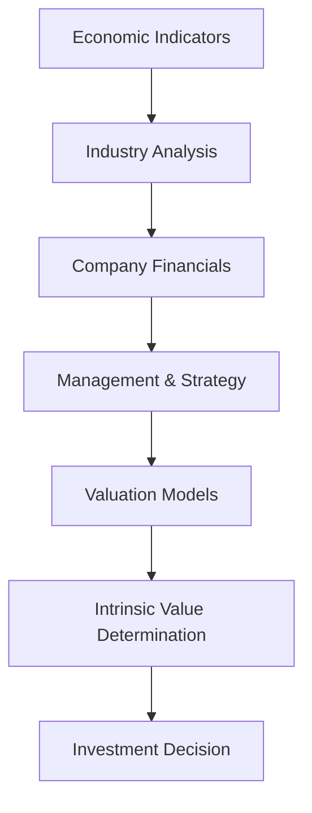
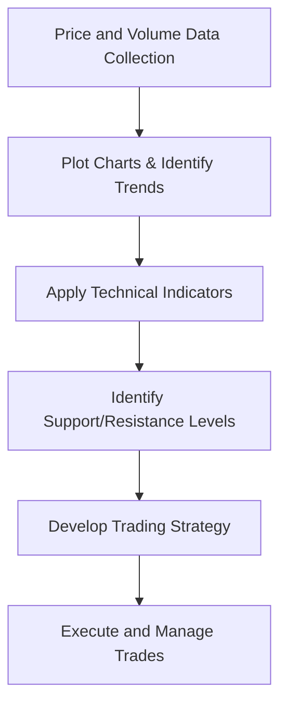

## 13.1 Methods of Equity Analysis

Equity analysis centers on evaluating publicly traded shares—common or preferred—to uncover their potential value, growth prospects, and associated risks. Two predominant methodologies shape how analysts and investors arrive at buy, hold, or sell decisions:

1. **Fundamental Analysis**  
2. **Technical Analysis**

Though the two approaches differ in their methods and underlying assumptions, they can be used in tandem to form a comprehensive perspective on a stock’s outlook. Understanding core principles of both is critical for anyone involved in Canada’s capital markets, from individual investors and advisors to institutional portfolio managers.

---

## Introduction to Equity Analysis

Investing in equities involves balancing expected returns against inherent market risks. The Canadian Securities Course (CSC®) introduces two large domains of equity analysis—fundamental and technical—that cater to the varying strategies, time horizons, and risk appetites of market participants.

- **Time Horizon:**  
  • Short-term traders typically focus on technical indicators such as price trends and volume.  
  • Long-term investors emphasize the underlying value of a business, measured through earnings potential, growth forecasts, and management effectiveness.

- **Risk Tolerance:**  
  • Conservative investors often favor stable financial fundamentals and steady earnings, aiming to minimize volatility.  
  • More aggressive investors or traders may pursue momentum-driven or breakout opportunities, relying on technical signals to profit from short-term price fluctuations.

- **Market Efficiency:**  
  • In highly efficient markets, stock prices rapidly incorporate new information, making it challenging to gain a persistent advantage through research alone.  
  • In less efficient or niche market segments, in-depth fundamental or technical research might uncover mispriced securities.

---

## Fundamental Analysis

### Definition and Purpose

Fundamental analysis seeks to determine a stock’s “intrinsic value” by examining economic, industry-specific, and company-level factors. The goal is to estimate a fair value for the shares and compare this with the current market price, which may be above or below that fair value.

### Macro-Level Considerations

1. **Economic Indicators**  
   Analysts start by assessing broader economic data—GDP growth, inflation rates, and employment levels—to gauge overall market conditions. In Canada, crucial economic releases come from agencies like Statistics Canada and the Bank of Canada. For example, when analyzing a Canadian bank’s stock—such as RBC (Royal Bank of Canada) or TD (Toronto-Dominion Bank)—analysts pay particular attention to interest rate trends, housing market indicators, and consumer debt levels.

2. **Industry Analysis**  
   After understanding the macroeconomic landscape, analysts refine their focus to the industry or sector in which the company operates. Key considerations include competitive pressures, regulatory changes, and technological trends. For instance:  
   • **Energy Sector**: Fluctuations in oil prices, environmental regulations, and geopolitical events can significantly impact energy companies.  
   • **Financial Sector**: Regulations from the Office of the Superintendent of Financial Institutions (OSFI) and market conditions shape the profitability of banks and insurance firms.

### Company-Specific Analysis

1. **Financial Statements**  
   Investors review a company’s balance sheet, income statement, and cash flow statement to assess its financial health. Key metrics include:  
   • **Revenue Growth**  
   • **Profit Margins**  
   • **Return on Equity (ROE)**  
   • **Earnings per Share (EPS)**  
   • **Dividend Payout Ratios**

2. **Management Quality and Corporate Governance**  
   A capable and ethical management team can steer the company toward consistent growth. Equity analysts often examine corporate governance structures, board composition, and strategic decisions (e.g., mergers and acquisitions, capital expenditure).

3. **Valuation Approaches**  
   Numerous valuation models exist, including:  
   • **Discounted Cash Flow (DCF)**: Projects future cash flows and discounts them back to present value.  
   • **Price/Earnings (P/E) Ratio**: Compares a stock’s price to its earnings per share.  
   • **Dividend Discount Model (DDM)**: Focuses on the present value of expected future dividends.

Below is a simple illustration of how fundamental analysis fits into an overall valuation framework:

Here, each step feeds into the next, building a holistic picture and culminating in an investment decision—buy, hold, or sell—based on how the intrinsic value compares to the market price.

---

### Practical Case Study: RBC

Consider Royal Bank of Canada (RBC), one of Canada’s largest financial institutions:

- **Macro Factors**: A stable Canadian economy with moderate GDP growth, low unemployment, and relatively low interest rates supports consumer lending and mortgage activity.  
- **Industry Factors**: RBC competes with other major Canadian banks under robust regulatory oversight by OSFI, which imposes capital requirements to ensure financial stability.  
- **Company Financials**: Analysts examine RBC’s net interest margin, loan portfolio quality, fee-based income, and efficiency ratio.  
- **Valuation**: Comparing RBC’s P/E ratio with its historical average or with peers (e.g., TD, BMO, CIBC) helps determine if the stock is undervalued or overvalued.

If RBC’s intrinsic value (based on the analyst’s model) exceeds its current market price, a fundamental analyst might recommend a buy position, depending on client objectives and risk tolerance.

---

## Technical Analysis

### Definition and Purpose

Technical analysis focuses on price trends, trading volume, and other statistical indicators to predict future market behavior. The underlying premise is that all relevant information is eventually reflected in price and volume data, and that patterns repeat over time.

### Chart Types and Tools

1. **Line Charts**: Show closing prices over time and help identify general trends.  
2. **Bar and Candlestick Charts**: Provide more detail, including opening, closing, high, and low prices for each session.  
3. **Support and Resistance Levels**: These horizontal price ranges often indicate where buying or selling pressure meets momentum, halting a trend.

### Technical Indicators

1. **Moving Averages (MA)**  
   • Simple Moving Average (SMA) and Exponential Moving Average (EMA) smooth out short-term fluctuations, highlighting overall trends.  
   • A “golden cross” occurs when a short-term moving average crosses above a long-term moving average, often signaling bullish momentum.

2. **Relative Strength Index (RSI)**  
   • Measures momentum by comparing the magnitude of recent gains to recent losses.  
   • Readings above 70 suggest overbought conditions; below 30 indicate oversold.

3. **Moving Average Convergence/Divergence (MACD)**  
   • Generates potential buy or sell signals based on the convergence or divergence of two moving averages.  
   • A positive MACD line crossing above the signal line can imply upward momentum.

Here is a simplified flow diagram representing how traders may apply technical analysis in their decision-making:

### Example: Momentum Trading on TSX

An investor analyzing a mid-cap technology stock listed on the Toronto Stock Exchange (TSX) might observe:  
- A consistent upward trend developing in the price chart.  
- An RSI reading of around 50, suggesting neutral momentum with potential upside.  
- A positive MACD crossover, indicating rising buying pressure.

If these technical signals align with the investor’s risk profile and near-term market outlook, they might take a position, setting stop-loss orders near established support levels.

---

## Integrating Fundamental and Technical Analysis

Although the two methodologies appear distinct, they often complement each other:

- **Confirming Valuation with Price Action**: A fundamentally undervalued stock in a long-term uptrend might present a compelling opportunity, especially if technical indicators confirm bullish momentum.  
- **Risk Management**: Technical analysis can offer entry and exit points informed by chart patterns, while fundamental analysis provides confidence in the stock’s underlying value.  
- **Style Blending**: Many Canadian pension funds, like the Canada Pension Plan Investment Board (CPPIB), and large institutional investors, such as RBC Asset Management, use a mix of quantitative, fundamental, and technical strategies to balance risk and return.

---

## Regulatory and Compliance Considerations in Canada

### Standards of Conduct and Suitability (CIRO)

The Canadian Investment Regulatory Organization (CIRO) sets standards for advisors and analysts, including know-your-client (KYC) and know-your-product (KYP) guidelines. These ensure that recommendations derived from any analytical approach—fundamental or technical—are suitable for clients’ objectives, risk tolerance, and overall profiles.

### Provincial Regulations and the CSA

The Canadian Securities Administrators (CSA) coordinates provincial and territorial regulators to promote harmonized securities regulation across Canada. Analysts consulting publicly available financial data must adhere to disclosure rules and insider trading restrictions.

### Transparency and Investor Protection

When advisors provide clients with research reports or investment recommendations based on fundamental or technical analysis, transparency is paramount. Regulatory bodies encourage clear explanations of methodologies, potential conflicts of interest, and relevant disclosures.

---

## Practical Guidelines and Best Practices

1. **Maintain Objectivity**: Avoid confirmation bias by regularly challenging your assumptions and cross-checking your analysis with independent sources.  
2. **Use Reliable Data**: Ensure data accuracy by cross-referencing multiple providers. Open-source tools like Python’s “pandas” and “matplotlib” can help clean data and generate analytical charts.  
3. **Risk Management**: Combine fundamental insight with technical signals to set logical stop-loss levels or profit targets.  
4. **Continuous Learning**: Capital markets evolve, and new techniques—such as algorithmic trading—emerge. Stay updated through professional development, courses, and official regulator publications.

---

## Actionable Insights and Next Steps

- **Practice**: Use real-world data from the TSX or from major Canadian companies (e.g., RBC, TD) to test valuation models and technical indicators.  
- **Compare**: Evaluate differences in outcomes when using pure fundamental, pure technical, and a hybrid method.  
- **Adapt**: Continuously refine models to account for shifts in business cycles, changes in consumer behavior, or new regulatory developments.  
- **Comply**: Keep up to date with CIRO and CSA rules, especially regarding disclosure, suitability, and insider information.

---

## Summary of Key Points

1. **Fundamental Analysis** examines economic indicators, industry conditions, and company-specific data—such as financial statements and management quality—to estimate a stock’s intrinsic value.  
2. **Technical Analysis** uses historical price and volume data, as well as technical indicators (MA, RSI, MACD), to identify trading opportunities and potential market sentiment.  
3. **Regulatory Oversight** in Canada (by CIRO, CSA, and provincial authorities) ensures that equity research and recommendations meet suitability, transparency, and integrity standards.  
4. **Practical Application** comes from blending both methods, leveraging the insights of one to confirm the signals of the other, and aligning recommendations with the investor’s objectives and risk tolerance.  

Remember that market conditions, investor sentiment, and regulatory environments evolve, so ongoing study and active portfolio management are essential for successful equity investors.

---

## Test Your Knowledge: Advanced Methods of Equity Analysis



### Which of the following is a key difference between fundamental and technical analysis?

- [x] Fundamental analysis focuses on intrinsic value derived from company data, while technical analysis focuses on price and volume trends.
- [ ] Fundamental analysis uses short-term price charts for forecasting, while technical analysis focuses on financial statements.
- [ ] Fundamental analysis always produces more accurate results than technical analysis.
- [ ] Technical analysis is regulated by CIRO, but fundamental analysis is not.

> **Explanation:**( Fundamental analysis prioritizes metrics such as earnings, revenues, and market position, whereas technical analysis prioritizes chart patterns, indicators, and trading volumes.)

### Which indicator is considered a momentum oscillator in technical analysis?

- [ ] Moving Average (MA)
- [x] Relative Strength Index (RSI)
- [ ] Dividend Yield
- [ ] Return on Equity (ROE)

> **Explanation:**( The RSI is a widely used momentum oscillator that signals overbought or oversold conditions based on recent price changes.)

### In fundamental valuation, which model discounts future cash flows back to their present value?

- [ ] Price-to-Earnings (P/E) Ratio
- [ ] Dividend Yield
- [x] Discounted Cash Flow (DCF)
- [ ] Moving Average Convergence/Divergence (MACD)

> **Explanation:**( The DCF approach calculates the present value of projected future cash flows, factoring in a discount rate to account for time and risk.)

### The Canadian Securities Administrators (CSA) primarily coordinates:

- [ ] Federal income tax rates.
- [ ] Global regulatory standards on derivatives.
- [x] Harmonized securities regulations across provinces and territories.
- [ ] Monetary policy decisions and interest rates.

> **Explanation:**( The CSA comprises provincial and territorial regulators collaborating to streamline and harmonize securities laws across Canada.)

### A “golden cross” in technical analysis occurs when:

- [ ] The stock’s price crosses below historical averages.
- [x] A short-term moving average crosses above a long-term moving average.
- [ ] The RSI moves above 70.
- [ ] The P/E ratio of a stock crosses below the industry average.

> **Explanation:**( A golden cross is typically interpreted as a bullish signal, indicating a potential upward trend.)

### Which organization oversees the registration and conduct of dealers and advisors in Canada?

- [x] Canadian Investment Regulatory Organization (CIRO)
- [ ] Canadian Pension Plan Investment Board (CPPIB)
- [ ] Office of the Superintendent of Financial Institutions (OSFI)
- [ ] U.S. Securities and Exchange Commission (SEC)

> **Explanation:**( CIRO (formerly IIROC) supervises the conduct of investment dealers and advisors in Canada, ensuring compliance and investor protection.)

### Combining fundamental and technical analysis can:

- [x] Provide both valuation insights and timing signals.
- [ ] Guarantee a profit in all market conditions.
- [x] Help manage risk by aligning entry/exit points with intrinsic value.
- [ ] Eliminate the need for monitoring portfolio performance.

> **Explanation:**( While it does not guarantee success in every trade, combining both approaches offers a more holistic viewpoint, strengthening investment decisions and risk management.)

### Which of the following is typically examined in fundamental analysis?

- [x] A company’s financial statements
- [ ] Hourly candlestick chart patterns
- [ ] Elliott Wave Theory
- [ ] Stochastic oscillator

> **Explanation:**( Financial statements such as balance sheets, income statements, and cash flow statements are key components of fundamental analysis.)

### In technical analysis, support and resistance levels indicate:

- [x] Price levels at which selling or buying pressure commonly halts price moves.
- [ ] Fixed price boundaries mandated by securities regulations.
- [ ] Valuation floors based on DCF models.
- [ ] Guaranteed reversal points recognized by all traders.

> **Explanation:**( Support and resistance levels often mark areas where the balance of buyers and sellers shifts, potentially stalling or reversing a trend.)

### In the context of the RSI indicator, a value above 70 generally suggests:

- [x] Overbought conditions
- [ ] Oversold conditions
- [ ] Golden cross formation
- [ ] Weak momentum

> **Explanation:** An RSI reading above 70 is commonly interpreted as an overbought signal, while readings below 30 suggest an oversold condition.



---

## For Additional Practice and Deeper Preparation

**Elevate your exam readiness with our comprehensive app, "Securities CA: Mock Exams," designed to challenge and refine your skills.**

* **Master Challenging Questions:** Dive into expertly crafted sample exam questions that go beyond standard references.
* **Scenario-Driven Learning:** Experience scenario-driven case questions and in-depth solutions to build practical expertise.
* **Sharpen Exam Strategies:** Build confidence with step-by-step explanations designed to refine your exam-day tactics.
* **Gain Real-World Insights:** Acquire practical tips and detailed rationales that demystify complex concepts.
* **CIRO and CSI Alignment:** Stay current with CIRO guidelines and CSI’s exam structure, with questions intentionally more challenging than the actual exam.

**Download the App Today:**

> Note: While these courses are specifically crafted to align with the CSC® exams outlines, they are independently developed and not endorsed by CSI or CIRO.
