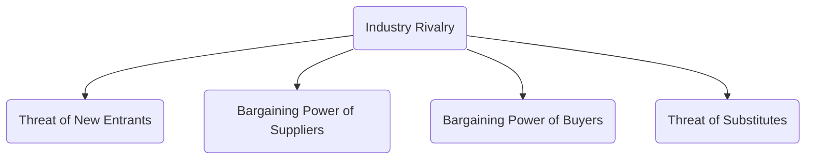

## 13.3 Fundamental Industry Analysis

Fundamental industry analysis is a critical bridge between broad macroeconomic trends (e.g., GDP growth, interest rates, inflation) and specific company performance. By evaluating the structural factors, competitive dynamics, and regulatory environment of an industry, investors can better assess the risks and opportunities facing companies within that sector. This form of analysis enables a deeper understanding of where a firm stands in relation to its peers and how larger industry forces might shape its financial performance.

Below, we explore the main components of fundamental industry analysis, including the industry life cycle, Porter’s Five Forces framework, regulatory considerations, key industry metrics, and strategies for identifying competitive advantages. We will also provide real-world Canadian examples, use diagrams to illustrate core concepts, and highlight best practices for conducting a thorough industry review.

---

## Purpose of Industry Analysis

Industry analysis is the process of studying a specific market segment or sector to understand how various dynamics — economic, competitive, technological, and regulatory — interact to influence profitability and growth prospects. This analysis helps you:

• Identify which industries are experiencing above-average growth or facing structural decline.  
• Understand how competitive intensity affects margins and long-term sustainability for companies.  
• Recognize the regulatory and policy environment that may either foster expansion or impose constraints.  
• Evaluate industry-specific metrics and signals that can indicate shifts in profitability or demand.  

Ultimately, industry analysis considers both macro and micro factors. At this point, you have analyzed the broader economic environment (e.g., interest rates, consumer confidence, unemployment rates). Now, you narrow the scope to see how these macro trends influence particular sectors, such as banking, energy, mining, technology, or healthcare.

---

## The Industry Life Cycle

An industry’s life cycle significantly influences its growth trajectory, competitive behavior, and investment appeal. The life cycle is typically divided into four distinct stages:

### Emerging Industries
Emerging industries are often born out of innovation and technological advancement. They are characterized by:
• Rapid Growth: High growth rates beyond what is seen in more established sectors.  
• Volatility: Earnings and stock prices can fluctuate significantly due to uncertain demand and evolving consumer preferences.  
• High R&D Costs: Significant portion of budgets dedicated to research and development.  

Example (Canadian Context):  
• The Canadian clean technology (cleantech) sector, focusing on renewable energy solutions and sustainable practices, saw rapid growth in its early stages. The federal government and provincial programs provided funding, reflecting strong policy support.  

### Growth Industries
In the growth stage, products or services have gained more recognition and a clear market. These industries typically exhibit:  
• Above-Average Expansion: Demand grows quickly, often outpacing baseline GDP growth.  
• Earnings Reinvestment: Companies often reinvest profits for expansion, acquisitions, or product innovation.  
• Competition Becomes More Defined: As demand is established, more competitors may enter or consolidate.  

Example (Canadian Context):  
• Canada’s technology scene, buoyed by a flourishing startup environment in cities like Toronto and Montréal, often transitions from emerging to growth status. Notable examples include financial technology (FinTech) startups that have grown with collaborations from major Canadian banks like RBC and TD.

### Mature Industries
Mature industries tend to have well-established products and a steady customer base, featuring:  
• Stable or Saturated Markets: Growth is closer to the overall economic growth rate.  
• Consolidation: Mergers and acquisitions often occur to increase market share or achieve economies of scale.  
• Price and Margin Pressures: Competition intensifies, leading to increasing focus on cost management.  

Example (Canadian Context):  
• The Canadian banking sector is widely considered mature. The Big Five banks (e.g., RBC, TD, Scotiabank, BMO, CIBC) enjoy stable earnings but face ongoing pressure from new competitors, such as digital-only banks and FinTech players.

### Declining Industries
Industries in decline face negative growth and structural hurdles, often due to:  
• Technological Obsolescence: Innovations make older technologies outdated.  
• Shifting Consumer Preferences: Customers move to new alternatives or platforms.  
• Global Competition: Cheaper solutions or labor markets abroad can diminish domestic production.  

Example (Canadian Context):  
• Certain segments of the manufacturing sector have contracted due to automation, globalization, and changing consumer demands, resulting in factory closures and downsizing.

---

## Porter’s Five Forces Analysis

Harvard Business School Professor Michael E. Porter developed the Five Forces framework to help understand the competitive intensity and profit potential of an industry. Evaluating these forces assists investors in identifying which industries may offer robust, sustainable returns versus those susceptible to margin erosion.

### Threat of New Entrants
• Entrants can increase supply and threaten established companies’ market share.  
• High barriers to entry (e.g., large capital investment, strict regulations, brand loyalty) generally protect incumbents.  

Case in Canada:  
• Telecommunication companies face high infrastructure costs and strict licensing requirements for spectrum, limiting new entrants and preserving higher profit margins for existing players.

### Bargaining Power of Suppliers
• Supplier concentration can lead to strong control over input pricing.  
• Companies dependent on unique materials or specialized technology may be vulnerable to cost fluctuations.  

Case in Canada:  
• In the Canadian energy sector, specialized drilling companies can wield negotiating power if their technology or rigs are unique and in limited supply.  

### Bargaining Power of Buyers
• Buyers with significant purchasing power or the ability to switch providers can force prices downward.  
• Bulk purchasers (e.g., large retailers, government agencies) can negotiate more favorable contracts.  

Case in Canada:  
• Large grocery chains, such as Loblaws or Metro, can exercise tremendous leverage over food suppliers by demanding volume discounts and imposing strict product specifications.

### Threat of Substitutes
• Substitute products meeting the same customer need can reduce demand for an incumbent’s offerings.  
• The severity of this threat depends on the availability, price, and perceived quality of substitutes.  

Case in Canada:  
• Ride-sharing platforms pose a substitute threat for traditional taxi services, offering convenient app-based booking and competitive rates in urban centers like Toronto and Vancouver.

### Industry Rivalry
• High rivalry leads to pricing pressure and moderate profit margins.  
• The number of competitors, industry growth rate, and degree of product differentiation drive rivalry.  

Case in Canada:  
• The online brokerage market in Canada has seen a rise in competition among established banks (e.g., RBC Direct Investing) and newer discount brokerages, pushing fees lower and increasing customer choice.

---

## Regulatory and Policy Considerations

The Canadian market is governed by various regulations and is influenced by federal, provincial, and territorial bodies. Complying with these regulations is vital for companies, particularly in heavily regulated sectors such as financial services, energy, and healthcare.

• Canadian Securities Administrators (CSA): Coordinates and harmonizes regulation across provinces and territories.  
• CIRO (Canadian Investment Regulatory Organization): Oversees investment dealers and trading practices, providing guidelines for analyzing industry-specific risks.  
• Chartered banks and insurance companies operate under federal supervision by the Office of the Superintendent of Financial Institutions (OSFI).  
• Environmental regulations and carbon pricing affect industries with significant greenhouse gas emissions, influencing companies’ investment decisions and risk profiles.  

When evaluating an industry, be mindful of pending legislative changes or policy proposals that may reshape the competitive landscape. For instance, expansions of pipeline infrastructure for energy companies might face environmental and regulatory hurdles; new reforms in healthcare can shift reimbursement models for drug manufacturers.

---

## Industry Metrics and Ratios

Each industry has unique indicators for assessing performance and momentum. While general metrics (e.g., revenue growth, profitability, debt ratios) apply to most sectors, specialized metrics can offer deeper insights.

• Capacity Utilization: Measures the extent to which a company uses its available production capacity. Low capacity utilization often suggests inefficiency or weak demand.  
• Market Share: Indicates a firm’s percentage of total industry sales. A rising market share may signal competitive strength or successful marketing efforts.  
• Profit Margins: Gross, operating, and net margins reveal how effectively companies convert revenues into profits.  
• Specialized Indicators:  
  - Same-Store Sales Growth (Retail): Gauges performance by isolating revenue growth from existing outlets.  
  - Rig Counts (Energy): Helps assess the level of exploration activity.  
  - Loan Growth and Net Interest Margins (Banking): Reflect lenders’ profitability and market conditions.

### Table: Examples of Industry-Specific Metrics

| Industry        | Metric                 | Relevance                                                                                       |
|-----------------|------------------------|-------------------------------------------------------------------------------------------------|
| Retail          | Same-store sales       | Measures organic growth in established locations                                                |
| Energy          | Rig count              | Indicates upstream investment and confidence in future production                               |
| Banking         | Net interest margin    | Assesses the difference between interest earned on loans and interest paid on deposits          |
| Telecom         | ARPU (Average Revenue per User) | Evaluates revenue generated per mobile subscriber                                              |
| Airlines        | Load factor            | Gauges capacity utilization of planes (e.g., passenger seats filled versus total seats offered) |

---

## Competitive Advantages and Moats

In an environment with multiple players, a company’s ability to maintain superior profitability often hinges on its competitive advantage—or moat. Recognizing these moats is crucial for long-term investors:

1. Patents and Intellectual Property  
   • Pharmaceuticals and tech firms frequently rely on patents to secure exclusive rights, limiting competition.  

2. Brand Recognition and Customer Loyalty  
   • Strong brand value (e.g., Tim Hortons in the Canadian quick-service restaurant market) can sustain repeat business and pricing power.  

3. Network Effects  
   • Social media platforms and financial marketplaces become more valuable as more users participate, creating barriers for new entrants.  

4. Cost Leadership or Economies of Scale  
   • Low-cost producers (e.g., some Canadian mining companies) can maintain healthier margins even if commodity prices drop.

By identifying moats, you can pinpoint which companies may enjoy more stable earnings and competitive insulation. Keep in mind that these advantages can erode over time, necessitating continuous monitoring, especially during shifts in technology or consumer preferences.

---

## Practical Applications and Best Practices

Below are actionable steps for incorporating industry analysis into your investment decisions:

1. Start with Macro Trends  
   • Understand the broader economic environment in Canada (e.g., unemployment rates, consumer confidence).  
   • Identify which sectors are likely to benefit from expansions or suffer in downturns.

2. Choose an Appropriate Framework  
   • Use Porter’s Five Forces to gauge competitive dynamics.  
   • Layer in additional factors like regulatory influences and new technologies that may disrupt the status quo.

3. Gather Industry-Specific Data  
   • Consult SEDAR+ (sedar.com) for corporate filings, particularly the Management Discussion and Analysis (MD&A), where companies often discuss industry-specific risks and opportunities.  
   • Explore open-source data sources, such as Statistics Canada, to track production volumes, consumer spending patterns, and sector-level employment.  

4. Calculate and Compare Metrics  
   • Evaluate ratios like capacity utilization and market share across several firms to spot emerging leaders or potential losers.  
   • Review specialized indicators for deeper insight (e.g., same-store sales or rig counts).

5. Assess Competitive Advantages  
   • Identify moats, such as brand strength, intellectual property, cost leadership, or strong distribution networks.  
   • Determine whether these advantages are sustainable within the current and projected stages of the industry life cycle.

6. Monitor Regulatory Changes  
   • Stay current on policy developments from the CSA, CIRO, and OSFI, especially in heavily regulated sectors.  
   • Anticipate how proposed changes in taxation, environmental regulations, or reporting requirements might alter industry profitability.

7. Look for Confirmation Across Multiple Sources  
   • Cross-verify official filings, analyst reports, trade publications, and reputable financial websites.  
   • Attend industry conferences or listen to company earnings calls for direct insights into evolving market conditions.

---

## Glossary

• Barriers to Entry: Economic, technological, or regulatory factors that make it difficult for new companies to enter an industry.  
• Market Share: A firm’s total sales or revenues relative to the industry’s cumulative output, reflecting its competitive standing.  
• Competitive Moat: Any structural advantage that allows a company to protect its market share and maintain above-average profitability.  
• Industry Concentration: A measure of how much a small number of firms dominate an industry’s total market share.  

---

## Summary and Key Takeaways

Fundamental industry analysis is an essential component for assessing a company’s long-term potential. By recognizing where an industry lies in its life cycle—emerging, growth, mature, or declining—you can infer investment risks and opportunities. Coupled with Porter’s Five Forces analysis and an awareness of regulatory frameworks, industry-specific metrics, and potential moats, you obtain a holistic view of an industry’s current health and future prospects.

Successful industry analysis involves continuous learning and monitoring. Industries are not static; competitive dynamics, technological upheaval, changing consumer tastes, and government policies all contribute to perpetual evolution. By staying informed, employing robust analytical frameworks, and adopting a disciplined research process, investors can effectively navigate real-world markets and make sound, evidence-based decisions.

---

## References and Additional Resources

• CIRO (Canadian Investment Regulatory Organization): ciro.ca  
• SEDAR+ (System for Electronic Document Analysis and Retrieval): sedar.com  
• Statistics Canada: statcan.gc.ca — Provides data on economic indicators and sector performance.  
• Porter’s Five Forces: “How Competitive Forces Shape Strategy” by Michael E. Porter (Harvard Business Review).  

Consider consulting open-source financial tools for ratio analysis and charting platforms to track industry trends. You can also review industry trade publications, professional associations, and academic research to remain current on emerging developments within specific sectors.

---

## Test Your Knowledge: Fundamental Industry Analysis Quiz



### Which stage of the industry life cycle is typically associated with substantial R&D costs and rapid market expansion?

- [x] Emerging industries
- [ ] Mature industries
- [ ] Declining industries
- [ ] Growth industries

> **Explanation:**( Emerging industries are characterized by their strong focus on R&D to establish new technologies or innovative products, along with rapid (but often volatile) market expansion.)

### Which of the following is NOT traditionally considered one of Porter’s Five Forces?

- [x] Technological Innovations
- [ ] Threat of New Entrants
- [ ] Bargaining Power of Suppliers
- [ ] Threat of Substitutes

> **Explanation:**( Porter’s Five Forces include (1) Threat of New Entrants, (2) Bargaining Power of Suppliers, (3) Bargaining Power of Buyers, (4) Threat of Substitutes, and (5) Industry Rivalry. Technological innovation, while influential, is not one of the original five forces.)

### How does high bargaining power of suppliers affect industry profitability?

- [x] It can reduce industry profitability by raising input costs.
- [ ] It always increases industry profitability.
- [ ] It has no significant effect on profitability.
- [ ] It eliminates the need for competitive advantages.

> **Explanation:**( When suppliers have high bargaining power, they can demand higher prices for their goods or services, forcing firms to endure lower profit margins unless they pass these costs on to consumers.)

### Which of the following sectors in Canada is widely considered to be in a mature stage of its life cycle?

- [x] Banking
- [ ] FinTech startups
- [ ] Electric vehicle manufacturing
- [ ] Blockchain financing

> **Explanation:**( The Canadian banking sector is generally viewed as mature, given its well-established customer base, regulatory framework, and stable growth. Other examples, like FinTech startups, are more commonly in emerging or growth phases.)

### Which ratio is often most relevant for comparing efficiency among banks?

- [x] Net interest margin
- [ ] Rig count
- [ ] Load factor
- [ ] Same-store sales

> **Explanation:**( Net interest margin (NIM) is a key metric in banking, measuring the difference between interest income and interest expenses.)

### Which regulatory body is responsible for overseeing federal financial institutions, such as Canadian chartered banks?

- [x] Office of the Superintendent of Financial Institutions (OSFI)
- [ ] Canada Revenue Agency (CRA)
- [ ] CIRO
- [ ] Canadian Securities Administrators (CSA)

> **Explanation:**( OSFI supervises federally regulated financial institutions, including chartered banks and insurance companies, to ensure their financial stability.)

### When analyzing a potential investment in the Canadian telecom sector, which of the following forces would best help you understand barriers to entry?

- [x] Threat of New Entrants
- [ ] Threat of Substitutes
- [x] Bargaining Power of Suppliers
- [ ] Industry Rivalry

> **Explanation:**( Telecom has high entry barriers due to capital-intensive infrastructure and licensing requirements. While bargaining power of suppliers (equipment providers) can also play a role, new entrants need to overcome large financial and regulatory hurdles first and foremost.)

### If a new technology emerges that allows solar panels to be produced at half the previous cost, which of Porter’s forces is most directly impacted?

- [x] Threat of Substitutes
- [ ] Bargaining Power of Buyers
- [ ] Industry Rivalry
- [ ] Bargaining Power of Suppliers

> **Explanation:**( A more cost-effective solar technology can substitute for traditional energy sources, so the “Threat of Substitutes” for conventional energy becomes more intense.)

### Why is it important to track specialized indicators, like same-store sales in retail or rig counts in energy?

- [x] They provide industry-specific insights that general ratios might miss.
- [ ] They are only relevant for emerging industries.
- [ ] They are too complex to be of practical use.
- [ ] They are rarely available to retail investors.

> **Explanation:**( Specialized indicators allow deeper insight into the nuances of each industry. Same-store sales measure retail growth excluding new locations, while rig counts highlight exploration activity in the energy sector.)

### “Industry concentration” refers to the extent to which a small number of firms dominate total industry output or sales.

- [x] True
- [ ] False

> **Explanation:** A high concentration ratio implies that a few firms hold most of the market share, while a low concentration ratio suggests that market share is more evenly distributed among many competitors.



---

## For Additional Practice and Deeper Preparation

**Elevate your exam readiness with our comprehensive app, "Securities CA: Mock Exams," designed to challenge and refine your skills.**

* **Master Challenging Questions:** Dive into expertly crafted sample exam questions that go beyond standard references.
* **Scenario-Driven Learning:** Experience scenario-driven case questions and in-depth solutions to build practical expertise.
* **Sharpen Exam Strategies:** Build confidence with step-by-step explanations designed to refine your exam-day tactics.
* **Gain Real-World Insights:** Acquire practical tips and detailed rationales that demystify complex concepts.
* **CIRO and CSI Alignment:** Stay current with CIRO guidelines and CSI’s exam structure, with questions intentionally more challenging than the actual exam.

**Download the App Today:**

> Note: While these courses are specifically crafted to align with the CSC® exams outlines, they are independently developed and not endorsed by CSI or CIRO.
