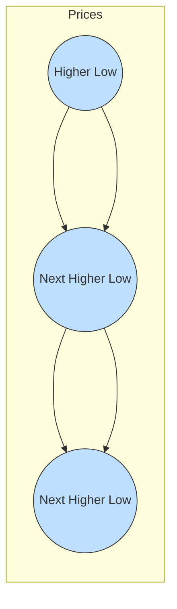

## 13.4 Technical Analysis

Technical analysis is the practice of studying historical price and volume data to anticipate future trends in the securities markets. It assumes that the market discounts all accessible information, that prices move in discernable patterns, and that these patterns repeat over time. Canadian investors often use technical analysis strategies—alone or in conjunction with fundamental analysis—to strengthen their trading decisions and manage risk within the regulatory framework overseen by Canadian self-regulatory organizations such as CIRO (Canadian Investment Regulatory Organization).

This section presents an in-depth exploration of technical analysis, including foundational assumptions, chart types, key patterns, technical indicators, and the advantages and limitations of these strategies within the Canadian markets.

---

### Defining Technical Analysis

Technical analysis is built on the premise that price and volume data reflect investor sentiment, market psychology, and supply-demand dynamics. Since prices adjust rapidly to reflect new information, many technical analysts believe it is more effective to focus on market patterns than to rely solely on macroeconomic factors, corporate financial statements, or market fundamentals.

Key reasons to employ technical analysis include:
• Identifying market trends early.  
• Spotting price reversal signals.  
• Pinpointing entry and exit points.  
• Augmenting or confirming fundamental analysis.

---

### Key Assumptions of Technical Analysis

There are three core assumptions central to technical analysis:

1. **Market Discounts Everything**  
   Technical analysts assume that all publicly available information—corporate earnings, economic news, and broader market sentiments—is already reflected in the asset’s price.

2. **Prices Move in Trends**  
   Once a trend is established—bullish (upward), bearish (downward), or sideways—it will persist until evidence suggests otherwise. Investors often focus on trend identification and continuation signals.

3. **History Tends to Repeat Itself**  
   Market psychology and investor behavior recur in patterns that, once identified, can be used to anticipate future price trajectories. Chart patterns like head and shoulders or double tops are considered manifestations of repeated investor psychology over time.

---

### Charts and Patterns

Charts provide a visual representation of price and volume data. Understanding their construction helps technical analysts identify key levels and evaluate future price movements.

#### Types of Charts

• **Line Chart:** Depicts price changes over time using a single continuous line (often closing prices). It offers a simple overview but omits intraday volatility.  

• **Bar Chart:** Shows the open, high, low, and close (OHLC) for each time frame (e.g., daily, weekly). Analysts often prefer bar charts for their detailed view of price action.  

• **Candlestick Chart:** Similar to a bar chart, but uses “candles” with bodies representing the difference between the open and close and wicks representing highs and lows. Candlestick patterns (e.g., doji, hammer) can provide signals about market turning points.  

• **Point-and-Figure Chart:** Focuses solely on price changes (not time). Price moves are represented by column Xs (rising prices) and Os (falling prices). Point-and-figure charts help eliminate minor price fluctuations, emphasizing major price reversals.

#### Support and Resistance

• **Support Level:** A price threshold below which a stock or index has historically not fallen. Buyers often step in here, creating a “floor.”  
• **Resistance Level:** The level at which selling pressure is strong enough to halt a price rise. It acts as a “ceiling.”

When a price breaks through a strong support or resistance, it may signal a change in sentiment. For example, surpassing resistance with high volume could indicate a bullish breakout.

#### Trend Lines

Trend lines connect successive higher lows in an uptrend or lower highs in a downtrend. They help illustrate the market’s directional bias. An uptrend line is drawn by connecting at least two low points, while a downtrend line links at least two high points. A breached trend line, confirmed by higher or lower closes, can be an early warning signal of trend reversal.

Below is a simple Mermaid.js diagram to visualize how trend lines are formed:

#### Chart Patterns

Chart patterns typically fall into two broad categories: continuation and reversal.  

1. **Continuation Patterns**  
   • **Triangles:** Price converges into a triangle, and a breakout typically continues in the direction of the prevailing trend.  
   • **Flags and Pennants:** Short consolidation periods within a strong trend, after which price often resumes its previous direction.  

2. **Reversal Patterns**  
   • **Head and Shoulders:** Consists of three peaks, with the middle peak (the head) higher than the others. Breaking the neckline confirms a possible reversal.  
   • **Double Top/Bottom:** Occur when price tests the same level twice and fails to move beyond it. The pattern suggests a potential reversal.

---

### Technical Indicators

Technical indicators are quantitative tools that complement chart pattern analysis. They help measure momentum, volatility, and sentiment.

#### Moving Averages

Moving averages smooth out price fluctuations, making it easier to identify trends and confirm support/resistance levels.  

• **Simple Moving Average (SMA):** Averages the closing prices for a fixed number of periods (e.g., 20-day SMA).  
• **Exponential Moving Average (EMA):** Gives more weight to recent prices, making it more responsive to sudden price changes.

One common strategy is to watch for a “golden cross,” where a short-term moving average crosses above a longer-term moving average, signaling potential bullish momentum.

#### Momentum Oscillators

Oscillators gauge the speed and magnitude of price changes, often helping traders identify overbought or oversold conditions.

• **Relative Strength Index (RSI):** A scale from 0 to 100; readings above 70 suggest overbought conditions, while readings below 30 suggest oversold conditions.  
• **Moving Average Convergence Divergence (MACD):** Tracks the difference between two EMAs and includes a signal line. Crossovers above or below the signal line can trigger buy or sell signals.

#### Volume Analysis

Volume can validate the significance of price moves. For instance, an upward price breakout accompanied by a surge in volume suggests robust buying interest. Conversely, a breakout on low volume may be a “false” or weak signal.

---

### Limitations and Criticisms

While technical analysis is widely adopted, it does face criticisms:

1. **Subjectivity:** Drawing trend lines, identifying patterns, and interpreting signals can vary among analysts.  
2. **Whipsaws:** Sudden market reversals can produce false or conflicting signals, especially in volatile or “choppy” markets.  
3. **Market Efficiency Debate:** If markets exhibit strong-form efficiency, any recurring pattern could be arbitraged away once discovered. Critics argue that technical patterns may stop working when widely followed.

Traders using technical analysis should remain adaptable, employing risk management techniques like stop-loss orders to limit losses in the event of whipsaws.

---

### Combining Technical with Fundamental Analysis

Technical analysis can add value when integrated with fundamental approaches:

• **Strategic Blends:** A value investor identifying an undervalued stock may wait for a bullish technical signal—like a breakout above resistance on strong volume—before buying.  
• **Risk Management:** Setting close technical stop-loss levels can hedge downside risk for portfolios primarily driven by fundamental investment theses.

For example, Canadian pension funds with a long-term fundamental outlook might still utilize technical triggers for tactical rebalancing or short-term trading decisions, especially during volatile markets.

---

### Glossary

• **Support Level:** A price level at which a stock or market tends to find buying interest as it declines.  
• **Resistance Level:** A price level at which a stock or market repeatedly encounters selling pressure.  
• **Moving Average Convergence Divergence (MACD):** A momentum-based indicator derived from moving averages.  
• **Relative Strength Index (RSI):** An oscillator ranging from 0 to 100, used to identify overbought (>70) or oversold (<30) market conditions.

---

### Practical Canadian Examples and Real-World Scenarios

To illustrate practical uses of technical analysis in the Canadian market:

1. **Canadian Bank Stocks (e.g., RBC, TD):** Traders might use RSI to identify short-term oversold conditions when economic headlines turn negative. If RSI dips below 30 while fundamentals remain robust, investors could see a potential entry point.  
2. **Canadian Pension Funds:** Institutions like the Ontario Teachers’ Pension Plan often take a longer-term view but may employ technical signals for timing certain trades or tactical allocations.  
3. **TSX Composite Breakouts:** Watching the S&P/TSX Composite Index for breakouts above historical resistance levels can help gauge overall market sentiment and confirm sector-wide strength.

---

### References, Tools, and Additional Resources

Below are some references and tools that Canadian investors and advisors may find helpful:

• **CIRO (Canadian Investment Regulatory Organization):**  
  Website: [https://ciro.ca](https://ciro.ca)  
  Provides regulatory oversight to ensure fair and ethical trading practices.  
• **TradingView:**  
  Website: [https://www.tradingview.com/](https://www.tradingview.com/)  
  A leading web-based charting platform offering real-time data for Canadian and global equities, along with built-in technical indicators.  
• **“Technical Analysis of the Financial Markets” by John J. Murphy:**  
  A comprehensive resource on chart patterns, indicators, and market behavior.  
• **Chartered Market Technician (CMT) Program:**  
  A globally recognized credential for technical analysts, covering advanced levels of charting, indicators, and market psychology.

© 2024 Tokenizer Inc. CC BY-NC-SA 4.0. Please note that regulatory references are subject to change. Always verify the latest guidelines from CIRO and other Canadian authorities when formulating investment strategies.

---

## Quiz: Master Your Technical Analysis Skills



### Which of the following best describes the foundation of technical analysis?

- [x] It studies past price and volume data to forecast future trends.  
- [ ] It relies solely on macroeconomic data to predict price movements.  
- [ ] It focuses exclusively on insider trades in Canadian financial institutions.  
- [ ] It discards historical data and concentrates on earnings reports.  

> **Explanation:**( Technical analysis assumes that all available information is embedded in price and volume data, making historical data a key component of predicting future trends.)

### In technical analysis, what is a primary assumption regarding price movement?

- [x] That prices move along established trends and continue until evidence points otherwise.  
- [ ] That prices are always random and unpredictable.  
- [x] That prices never change beyond a fixed range.  
- [ ] That prices solely reflect fundamental factors such as earnings growth.  

> **Explanation:**( Technical analysis holds that prices tend to move in recognizable trends, which continue unless a reversal signal is confirmed.)

### What is a support level?

- [x] A price level where buying activity is strong enough to prevent further price declines.  
- [ ] A price level at which selling is guaranteed to occur.  
- [ ] A price level representing a government-mandated floor for securities.  
- [ ] A price level established by a single day’s trade volume.  

> **Explanation:**( Support levels are areas where the market recognizes value and buyers historically step in to support prices.)

### Which of the following is an example of a reversal chart pattern?

- [ ] Flag  
- [ ] Triangle  
- [x] Head and Shoulders  
- [ ] Cup and Handle  

> **Explanation:**( Head and Shoulders is a classic reversal pattern, signaling a potential trend change when the neckline is breached.)

### When a short-term moving average crosses above a long-term moving average, analysts often refer to this as:

- [x] A golden cross  
- [ ] A margin call  
- [x] A short squeeze  
- [ ] A fade  

> **Explanation:**( A golden cross indicates a shift in momentum that could precede a bullish price run.)

### The Relative Strength Index (RSI) is considered overbought when it moves above:

- [x] 70  
- [ ] 30  
- [ ] 50  
- [ ] 100  

> **Explanation:**( RSI measures momentum, and readings above 70 are commonly interpreted as overbought, possibly signaling an upcoming correction or consolidation.)

### Which organization provides regulatory oversight to ensure fair and ethical trading practices in Canada?

- [x] CIRO (Canadian Investment Regulatory Organization)  
- [ ] U.S. Securities and Exchange Commission (SEC)  
- [x] Federal Reserve Board  
- [ ] European Central Bank  

> **Explanation:**( CIRO is the primary self-regulatory organization overseeing investment dealers and trading activity in Canada.)

### What is the primary benefit of combining technical and fundamental analysis?

- [x] It can confirm fundamental investment theses with market-based signals and manage risk with technical stops.  
- [ ] It completely eliminates the need to analyze a company’s financial statements.  
- [ ] It ensures zero losses for all market participants.  
- [ ] It removes the need for chart reading.  

> **Explanation:**( Using both approaches allows investors to align fundamental valuations with timing signals and risk management from technical indicators.)

### Which charting method carefully strips away minor price movements to highlight significant reversals?

- [ ] Bar Chart  
- [ ] Candlestick Chart  
- [ ] Line Chart  
- [x] Point-and-Figure Chart  

> **Explanation:**( Point-and-figure charts emphasize meaningful price movements and filter out smaller fluctuations.)

### True or False: Market efficiency can diminish the predictive power of technical analysis if everyone uses the same patterns.

- [x] True  
- [ ] False  

> **Explanation:** Critics argue patterns can become self-fulfilling or vanish when too many traders attempt to exploit them, reflecting the efficient market hypothesis.



---

---

By mastering both fundamental and technical approaches, Canadian finance professionals can sharpen their investment acumen. Technical analysis complements fundamental insights by offering a framework for timing and risk management. Nonetheless, it is crucial to remain vigilant about regulatory compliance, market efficiency challenges, and the broader economic landscape when applying these techniques.
