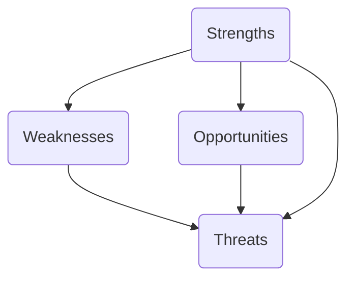

## 14.1 Performing Company Analysis

In this section, we explore the process of evaluating a company’s financial and strategic strengths, with a particular focus on Canadian public firms. A well-rounded company analysis includes qualitative assessments—such as leadership quality, governance structures, and brand reputation—and quantitative evaluations of financial statements, ratio analysis, and market performance. This process allows analysts and investors to distinguish fundamentally strong companies from those facing structural or strategic challenges.

---

### Defining the Scope and Purpose of the Analysis

The first step in company analysis is determining whether you are examining a publicly traded firm or a private company. This distinction shapes the depth and availability of data:

• Publicly Traded Companies  
  - Must adhere to disclosure regulations, filing detailed reports (such as annual and quarterly financial statements) through the System for Electronic Document Analysis and Retrieval (SEDAR).  
  - Provide investor presentations, management discussion & analysis (MD&A), and press releases.  
  - Often have widespread analyst coverage, which can offer valuable insights and third-party opinions.

• Private Companies  
  - May not have stringent disclosure obligations.  
  - Data availability can be far more limited, often relying on private databases, business registries, or interviews with company management (if feasible).  
  - Valuations can be more subjective and rely on privately sourced financials.

In Canada, publicly traded companies must comply with continuous disclosure requirements set by provincial securities regulators under the umbrella of the Canadian Securities Administrators (CSA). This compliance ensures that crucial financial and strategic information is periodically updated and accessible for investors.

---

### Gathering Qualitative Data

Qualitative data captures the strategic, managerial, and structural attributes of the company:

1. Management Quality and Leadership  
   - Consider the executive team’s track record and reputation. For instance, a Chief Executive Officer (CEO) who consistently expands market share or diversifies revenue channels could indicate effective leadership.  
   - Assess leadership style, communication transparency, and alignment of management incentives with shareholder interests.

2. Competitive Landscape and Industry Position  
   - Investigate the firm’s reputation within its sector. For instance, RBC (Royal Bank of Canada) has historically been recognized for strong retail banking operations, while TD (Toronto-Dominion Bank) is often praised for stable growth and robust U.S. expansion.  
   - Identify the company’s rank relative to peers: Is it a market leader, a niche player, or a fast-growing challenger?

3. Brand and Customer Loyalty  
   - Evaluate brand strength and customer loyalty metrics. A company with enduring customer trust can experience more stable revenues, particularly in highly competitive markets.

4. Strategic Vision and Corporate Culture  
   - Review annual reports or corporate presentations for statements about strategic priorities. Have past strategies been successfully executed? Is the new direction realistic and in line with emerging market trends?

---

### Gathering Quantitative Data

Quantitative analysis focuses on objective, numerical measures of company performance:

• Financial Statements  
  - Income Statement: Reveals revenue streams, costs, and profitability.  
  - Balance Sheet: Shows assets, liabilities, and shareholders’ equity, painting a picture of financial stability.  
  - Cash Flow Statement: Highlights ability to generate operating cash flow and the company’s liquidity position.

• Ratio Analysis  
  - Profitability Ratios: For instance, Return on Equity (ROE) and Return on Assets (ROA) gauge how effectively a company uses its capital.  
  - Liquidity Ratios: Current and quick ratios assess the firm’s capacity to meet short-term obligations.  
  - Solvency Ratios: Debt-to-equity (D/E) or interest coverage ratios illustrate how heavily the company relies on borrowed funds.  
  - Valuation Ratios: Price-to-earnings (P/E), price-to-book (P/B), and price-to-sales (P/S) help compare a company’s share price with its fundamentals.

• Performance Benchmarks  
  - Benchmarking involves comparing the company’s financial metrics against sector averages or primary competitors. For example, comparing RBC’s ROE with other Canadian “Big Five” banks to see if RBC stands out in terms of profitability.

---

### Industry and Sector Research

Placing a company in the right context requires robust industry-level understanding:

• Sector Fundamentals  
  - Bank stocks often hinge on interest rates, consumer confidence, and regulatory capital requirements. Mining companies are influenced by commodity price cycles and global economic conditions. Technology startups might depend heavily on innovation and intellectual property.

• Competitive Dynamics  
  - Barriers to Entry: Are there regulatory barriers, capital intensity, or patent protection that limit new entrants?  
  - Industry Growth Rate: A high-growth industry may buoy even average performers, while a stagnant sector subjects each firm to fierce rivalry.  
  - Key Success Factors: Identify critical drivers of success—for banks, it often includes cost efficiency, trust, and diversified product offerings; for tech, it might be unique IP, large R&D budgets, or a first-mover advantage.

---

### Evaluating the Business Model and Revenue Streams

Once you have the data, the next step is to study how the company converts raw materials, services, or intellectual property into sustainable revenue:

• Revenue Streams  
  - Diversification: A single-revenue-stream model is riskier, especially if demand shifts. By contrast, a bank with personal banking, wealth management, and capital markets divisions has balanced operations.  
  - Recurring vs. One-Time Sales: Subscription-based or fee-based models possibly provide more predictable cash flows.  
  - Geographical Reach: Companies operating worldwide—particularly in stable economies—can mitigate local economic downturns.

• Risks to the Business Model  
  - Technological Disruption: New fintech entrants can threaten traditional banking models.  
  - Regulatory Changes: A shift in government policy (e.g., new housing regulations) directly impacts mortgage growth for banks.  
  - Supply Chain Vulnerabilities: Commodity price spikes or shipping constraints can affect manufacturing costs.

---

### Conducting a SWOT Analysis

A SWOT (Strengths, Weaknesses, Opportunities, Threats) analysis helps systematically identify internal capabilities and external conditions.

• Strengths (Internal)  
  - Example: A well-known Canadian coffee chain might leverage its extensive store network and brand loyalty.  
  - High cash reserves or a valuable brand name can also be internal strengths.

• Weaknesses (Internal)  
  - Example: Over-reliance on a single product or poor cost structure.  
  - If the company lacks talented leadership or invests minimally in R&D, it is at a disadvantage.

• Opportunities (External)  
  - Examples: Expansion into emerging regions, partnerships with fintech companies, government contracts.  
  - Shifts in consumer preferences that align with the company’s offerings.

• Threats (External)  
  - Competitive pressures from new market entrants.  
  - Unfavourable regulatory changes, macroeconomic slowdowns, or changing consumer tastes.

Below is a simple Mermaid diagram illustrating the structure of a SWOT analysis for an illustrative Canadian technology firm:

Use separate lists under each category to keep your observations organized. This visual approach makes it easier to see how each area interacts.

---

### Reviewing Strategic Priorities and Past Performance

Annual reports and investor presentations often outline the company’s strategic roadmap. Look for:

• Clarity of Strategic Goals  
  - Does management have a clear plan for driving growth, fostering innovation, or cutting costs?  
  - Example: RBC’s multi-year strategy might emphasize digital banking, expanding abroad, or building investment platforms.

• Alignment with Past Successes  
  - Has management historically followed through on its commitments? Consistent track records can indicate strong execution capabilities.

• Realism of the Plan  
  - Evaluate whether the company’s objectives are grounded in market realities and supported by adequate financial resources.

---

### Examining Corporate Governance

Sound corporate governance typically indicates prudent risk management and transparency:

• Board Composition  
  - Balance of independence and expertise. A board with diverse industry backgrounds can add strong oversight.  
  - Directors’ alignment with shareholder interests (e.g., director share ownership guidelines).

• Executive Compensation  
  - Are bonuses or stock options tied to long-term performance metrics?  
  - Excessively short-term incentives can push management to prioritize quick share price gains over sustainable growth.

• Ethical Conduct and Compliance  
  - Assess any history of scandals or litigation.  
  - A strong corporate social responsibility (CSR) framework can signal robust ethical standards.

---

### Considering Macroeconomic Factors

Canadian companies face various macroeconomic and industry-specific influences:

• Interest Rates  
  - Canadian banks’ net interest margins can rise or fall depending on Bank of Canada’s rate changes.  
  - High rates increase the cost of borrowing, which can dampen expansion plans.

• GDP Growth  
  - Economic expansion often correlates with stronger consumer spending and corporate profitability.  
  - A slowing economy can reduce demand for loans, consumer goods, or discretionary services.

• International Trade Policies  
  - Trade agreements (e.g., CUSMA) or tariff changes can enormously impact exporters.  
  - Shifts in global supply chains affect resource-based or manufacturing-intensive Canadian companies.

---

### Sources of Information

Staying current and well-informed is essential:

• SEDAR (System for Electronic Document Analysis and Retrieval)  
  - Access audited financial statements, annual information forms, and material change reports for publicly listed Canadian companies.  
  - Visit https://www.sedar.com/.

• Press Releases and Corporate Websites  
  - Track updates such as acquisitions, dividend increases, or strategic partnerships.  
  - Review investor relations sections for presentations and webcasts of quarterly earnings calls.

• Analyst Reports  
  - Professional analysts often highlight trends, upcoming risks, and competitor benchmarking in their published research.  
  - Be mindful of any conflicts of interest or disclaimers regarding the analyst’s or institution’s holdings.

• Financial News Platforms  
  - Canadian business publications like The Globe and Mail and the Financial Post regularly feature insights on company performance and broader industry trends.

---

### Putting It All Together

A thorough company analysis merges these qualitative and quantitative aspects into a cohesive narrative about the company’s future prospects. By evaluating strategy, governance, and economic context, you can form an informed opinion on valuation and risk level. Whether you are an individual investor, a portfolio manager for a buy-side firm, or part of a sell-side research team, the steps in performing company analysis remain largely the same. The difference lies in the scope and depth of investigation based on your objectives and the market environment.

Below is a Mermaid diagram showing an overview of the company analysis process:

---

### Best Practices, Common Pitfalls, and Actionable Strategies

• Best Practices  
  - Triangulate data from multiple credible sources to reduce the risk of confirmation bias.  
  - Regularly update your analysis to capture new developments—particularly for fast-evolving industries like technology or energy.

• Common Pitfalls  
  - Overreliance on short-term metrics or purely financial data without appreciating qualitative shifts.  
  - Ignoring macroeconomic factors or external forces (trade wars, commodity shocks) that can rapidly alter a company’s outlook.

• Actionable Strategies  
  - Practice scenario analysis: Consider optimistic, base-case, and pessimistic forecasts to gauge potential returns and risks.  
  - Develop personal checklists. For instance, evaluate the Debt-to-Equity ratio, read the CEO’s annual letter, survey competitor announcements, and consult regulatory filings.

---

### Summary

Performing company analysis is a multifaceted process blending quantitative, qualitative, and contextual factors. Investors and financial professionals should start by defining their goal—whether it’s evaluating a stock for a personal portfolio or performing due diligence for institutional investments—and then systematically gather data, analyze strategic elements, and frame the company within broader market dynamics. A structured approach reduces information overload, enabling clear decision-making and improved risk assessment.

---

## Quiz: Mastering Company Analysis



### Which of the following statements best defines the purpose of company analysis?  
- [ ] To determine global macroeconomic conditions independent of the business in question.  
- [x] To evaluate a company’s financial health, strategic position, and risks for informed investment decisions.  
- [ ] To solely focus on the company’s stock price fluctuations.  
- [ ] To conduct comprehensive audits of regulatory compliance only.  

> **Explanation:**( Company analysis blends both quantitative and qualitative perspectives to reveal a company’s strengths, weaknesses, and future prospects, arming investors with the information needed to make prudent decisions.)

### When evaluating a publicly traded Canadian company, which resource provides the most direct access to mandatory disclosures and filings?  
- [x] SEDAR (System for Electronic Document Analysis and Retrieval)  
- [ ] The company’s official social media pages  
- [ ] A personal finance blog  
- [ ] Newspaper commercials and advertisements  

> **Explanation:**( SEDAR is the official channel in Canada for publicly listed companies to submit financial statements, MD&A, and other disclosures, making it the primary source for comprehensive, unbiased data.)

### Which of the following traits is considered qualitative data in company analysis?  
- [x] Management’s track record and reputation  
- [ ] Quarterly revenue growth  
- [ ] The current ratio  
- [ ] Debt-to-equity ratio  

> **Explanation:**( Qualitative data deals with non-numerical insights—such as leadership quality, brand perception, and corporate culture—while metrics like revenue growth, current ratio, and D/E ratio are quantitative measures.)

### What is the main purpose of ratio analysis in quantitative evaluation?  
- [ ] To provide a purely subjective view of company performance  
- [x] To compare financial metrics objectively against peers and industry benchmarks  
- [ ] To assess only profitability without factoring in leverage  
- [ ] To replace the need for deeper qualitative investigation  

> **Explanation:**( Ratios translate raw financial numbers into comparable measures, helping investors benchmark a firm’s performance over time or against industry averages. However, ratio analysis should be complemented by qualitative context.)

### In assessing a bank’s business model, which factor is most relevant for understanding future growth prospects?  
- [x] Interest rate environment and its impact on net interest margins  
- [ ] Patents on consumer electronics  
- [x] Expansion into foreign markets  
- [ ] Changes in global oil prices only  

> **Explanation:**( Banks heavily depend on interest rate changes for profitability; expanding into foreign markets also diversifies revenue streams, whereas factors like oil prices generally have a more indirect influence on banking revenues.)

### Which of the following is not a key aim of a SWOT analysis?  
- [ ] Identifying internal strengths  
- [x] Determining bond yield spreads  
- [ ] Pinpointing external threats  
- [ ] Recognizing growth opportunities  

> **Explanation:**( SWOT—Strengths, Weaknesses, Opportunities, and Threats—focuses on internal and external business factors. While bond yield spreads can be important in certain fixed-income analyses, they are not a central component of a SWOT framework.)

### Which of the following elements indicates good corporate governance practices?  
- [x] A diverse and independent board of directors  
- [ ] A board composed solely of close associates of the CEO  
- [x] Performance-based executive compensation tied to long-term goals  
- [ ] A single individual holding the roles of both CEO and board chair without oversight  

> **Explanation:**( Strong corporate governance typically features independent board oversight, long-term incentive structures, and clear separate roles for executive leadership and board supervision to avoid conflicts of interest.)

### How can macroeconomic factors, such as GDP growth, affect a company’s operations?  
- [x] Higher GDP growth can lead to increased consumer spending, boosting revenues.  
- [ ] They have no effect on companies focused on domestic markets.  
- [ ] They only matter to technology companies with global reach.  
- [ ] They strictly dictate a company’s share price movements.  

> **Explanation:**( Strong economic growth often creates a positive climate for consumer spending and corporate investment, potentially increasing revenues and profitability across various sectors. However, macroeconomic factors alone do not fully dictate share price.)

### Which step ensures that newly emerging risks or opportunities are captured in your company analysis?  
- [x] Regularly updating the analysis with new financial disclosures and market data  
- [ ] Sticking to a single static report from the prior year  
- [ ] Relying exclusively on outdated broker research  
- [ ] Focusing on technical charts while ignoring fundamental updates  

> **Explanation:**( Markets evolve rapidly; ongoing monitoring and updating your analysis with fresh data ensures that decisions reflect the current environment and any emerging business or economic risks.)

### True or False: Focusing solely on quantitative data provides a complete picture of a company’s prospects.  
- [x] True  
- [ ] False  

> **Explanation:** This statement is intentionally tricky—while quantitative data is crucial, a full analysis also requires qualitative insights into management quality, corporate culture, and industry dynamics. Both are critical for an accurate assessment.



---

## For Additional Practice and Deeper Preparation

**Elevate your exam readiness with our comprehensive app, "Securities CA: Mock Exams," designed to challenge and refine your skills.**

* **Master Challenging Questions:** Dive into expertly crafted sample exam questions that go beyond standard references.
* **Scenario-Driven Learning:** Experience scenario-driven case questions and in-depth solutions to build practical expertise.
* **Sharpen Exam Strategies:** Build confidence with step-by-step explanations designed to refine your exam-day tactics.
* **Gain Real-World Insights:** Acquire practical tips and detailed rationales that demystify complex concepts.
* **CIRO and CSI Alignment:** Stay current with CIRO guidelines and CSI’s exam structure, with questions intentionally more challenging than the actual exam.

**Download the App Today:**

> Note: While these courses are specifically crafted to align with the CSC® exams outlines, they are independently developed and not endorsed by CSI or CIRO.
