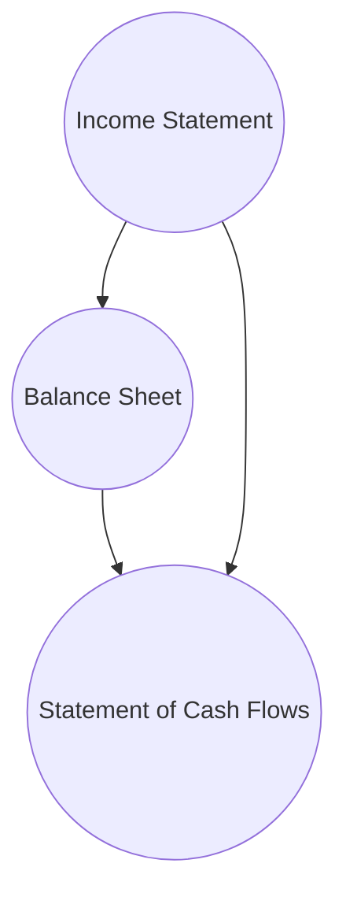

## 14.2 Interpreting Financial Statements

Financial statements are critical tools for investors, analysts, and other stakeholders to evaluate a company’s performance and assess its future prospects. In the Canadian context, financial statements typically follow either International Financial Reporting Standards (IFRS) for public companies or Accounting Standards for Private Enterprises (ASPE) for privately held entities. This section explores how to interpret the three primary financial statements—Income Statement, Balance Sheet, and the Statement of Cash Flows—and outlines approaches to glean deeper insights by examining supporting notes, management discussion & analysis (MD&A), and the company’s overall financial ecosystem.

---

### Overview of the Three Primary Statements

#### Income Statement
Also referred to as the profit and loss statement (P&L), the Income Statement summarizes the company’s revenues, expenses, and net income (or net loss) over a specific reporting period (e.g., a quarter, semi-annual, or annual period). It allows investors to see the company’s operational performance and profitability. Key elements include:

• Revenues (also called sales or turnover)  
• Cost of goods sold (COGS) or cost of sales  
• Gross profit (revenues minus COGS)  
• Operating expenses (including selling and administrative expenses)  
• Operating income or EBIT (earnings before interest and taxes)  
• Net income (the bottom line, after interest and taxes are accounted for)

Investors should pay special attention to large or unusual expenses—such as restructuring charges—that might distort the true underlying performance of the business. For example, a large Canadian bank like RBC may have one-time litigation costs or restructuring charges linked to realigning certain business segments. These costs can either inflate or deflate the net income in a given period.

#### Balance Sheet
A Balance Sheet provides a snapshot of a company’s financial position at a specific point in time. It outlines three main components:

• Assets: What the company owns, such as cash, receivables, inventory, property, plant, and equipment (PPE), and intangible assets.  
• Liabilities: What the company owes, including short-term payables, long-term debt, and accrued liabilities such as pensions.  
• Shareholders’ Equity: The portion of assets remaining after all liabilities have been settled. It includes common stock, retained earnings, and other reserves.

One significant aspect of analyzing the Balance Sheet is assessing the capital structure, including the mix of debt and equity financing. If a company (e.g., TD Bank) has too much leverage, it may face higher financial risk during economic downturns, as interest and principal repayments become more burdensome. Conversely, insufficient debt might indicate a conservative strategy that could limit growth potential.

#### Statement of Cash Flows
The Statement of Cash Flows details how the company’s cash position changes over the reporting period. It segments cash flow activity into three categories:

1. Operating Activities: Cash inflows and outflows related to day-to-day operations, such as revenue collection, payment of wages, and interest expenses.  
2. Investing Activities: Cash used or generated through the purchase or sale of long-term assets (capital expenditures, acquisitions, or disposals).  
3. Financing Activities: Cash changes from issuing or repurchasing equity, taking on or repaying debt, and paying dividends.

A robust cash flow from operating activities generally suggests the company is generating sufficient internal funds to support its operations, pay dividends, and invest in growth. For instance, companies operating within Canada’s energy sector might show significant outflows in the investing section due to capital-intensive projects (e.g., purchase of drilling equipment). By comparing operating cash flow with net income, analysts can also assess the quality of earnings, ensuring that profits are backed by actual cash and not merely accounting entries.

---

### Financial Reporting Standards and Disclosures

#### IFRS, ASPE, and Other Standards
Majority of publicly traded Canadian companies adhere to IFRS, while private enterprises may follow ASPE if they do not report publicly. Companies that are cross-listed on U.S. exchanges (e.g., dual-listed RBC shares on the NYSE) might apply or reconcile to U.S. GAAP. Understanding which standards the firm follows is essential because measurement and recognition rules can vary, sometimes causing differences in reported profit or asset valuation.

#### Management Discussion & Analysis (MD&A)
The MD&A section often accompanies the financial statements in a company’s annual or quarterly report. It provides management’s perspective on financial results, including explanations for revenue growth, risk factors, significant changes to operational strategies, and future direction. MD&A can highlight one-time gains or losses, changes to accounting policies, or anticipated trends in the industry—crucial details that help clarify the financial statements.

#### Notes to the Financial Statements
Footnotes supply vital supplemental detail on accounting policies, contingent liabilities (e.g., pending lawsuits or environmental obligations), and significant events that have not yet impacted the financials but could in the future. For instance, a mining company’s note might disclose reclamation liabilities or newly discovered reserves that could alter its future asset base.

---

### Identifying Non-Recurring and Extraordinary Items
When evaluating performance, it is crucial to distinguish between recurring operational results and special items that may never recur or are highly irregular. Examples include:

• Sale of a non-core division  
• Impairment of intangible assets or goodwill  
• Restructuring or severance costs  
• One-time legal settlements  

By excluding or adjusting for such items, analysts can better gauge the firm’s sustainable profitability. For instance, if an oil and gas firm sold off a division at a substantial gain, it might inflate net income for that quarter, but is unlikely to repeat this windfall in subsequent periods.

---

### Evaluating Trends Over Multiple Periods
Reviewing a single quarter or one year of financial data in isolation can be misleading. Savvy analysts look for patterns spanning multiple reporting periods:

• Revenue Growth: Are sales rising consistently, or is there volatility tied to certain seasons or economic cycles?  
• Profit Margins: Are margins improving as the business scales, or are they stagnating or declining?  
• Expense Management: Are operating costs increasing faster than revenues, suggesting operational inefficiencies?

Tracking trends helps identify whether the company is adapting effectively to industry changes and improving its bottom line. For instance, a Canadian tech start-up that grows revenue by 30% annually while maintaining consistent gross margins may signal strong growth potential. However, if administrative and marketing costs balloon at a faster pace, profitability might remain elusive.

---

### Capital Structure Analysis
Assessing capital structure is critical for evaluating financial stability and risk:

• Debt-to-Equity Ratio (D/E): High leverage can magnify returns but also increases financial risk in adverse conditions.  
• Interest Coverage Ratio: Gauges a company’s ability to service its debt using operating income.  
• Equity Financing: Dilution of existing shareholders occurs if new shares are issued repeatedly without corresponding growth in earnings.

A balanced approach to financing—precise amounts of debt and equity—often suggests prudent financial management. For example, if a Canadian grocery chain repeatedly issues shares to fund expansion, it may dilute investor ownership. Alternatively, too much reliance on debt might become a burden if interest rates rise or revenues decline unexpectedly.

---

### Assessing the Quality of Earnings
Comparing net income on the Income Statement to cash flow from operations on the Statement of Cash Flows can reveal discrepancies. A company displaying robust earnings but weak operating cash flows may be employing aggressive revenue recognition or carrying significant unpaid receivables. Conversely, strong cash flows that exceed net income could signal conservative accounting practices or efficient working capital management.

#### Example: Evaluating a Canadian Bank
Imagine RBC reports net income of $15 billion for the year, but operating cash flows only total $5 billion. This discrepancy might be attributable to timing differences in loan and credit card payments or changes in policy for loan loss provisions. By scrutinizing the MD&A and footnotes, analysts can piece together whether these differences are temporary or indicative of more concerning issues like credit quality deterioration.

---

### Analytical Tools and Next Steps
The final step in interpreting financial statements involves applying ratio analysis to compare performance against industry peers and benchmarks, a topic explored in detail in Section 14.3. Nonetheless, even basic measures like the current ratio (current assets ÷ current liabilities) and return on equity (net income ÷ shareholders’ equity) can deliver significant insights immediately:

• Benchmarking: Compare ratios to industry norms to identify potential outliers or strengths.  
• Trend Analysis: Study the evolution of ratios over time to spot improvements or deteriorations promptly.

---

### Utilizing Visual Aids for Clarity

Visual representations can help clarify relationships among statements:

• The Income Statement influences the Balance Sheet via retained earnings (net income is added to shareholders’ equity).  
• Operating activities on the Statement of Cash Flows share a direct link with items on the Income Statement (e.g., net income, depreciation).  
• Financing and investing activities connect back to changes in the Balance Sheet (e.g., issuing debt or share capital).

---

### Common Pitfalls and Best Practices
• Overlooking Footnotes: Key disclosures—such as off-balance sheet liabilities or upcoming regulatory changes—often appear in these notes.  
• Focusing Only on Net Income: Earnings can be manipulated through accounting policies; cash flow analysis reduces these distortions.  
• Ignoring Non-Recurring Items: One-off items can artificially inflate or deflate results. Always adjust to see the underlying trend.  
• Short-Term Emphasis: Evaluate multiple periods and look ahead using MD&A to capture forward-looking insights.  
• Neglecting Macro Factors: Consider how interest rates, currency fluctuation, and the broader economic environment can affect operations, particularly for companies with global footprints.

---

### References and Additional Resources
• CPA Canada Handbook for guidance on IFRS and ASPE requirements:  
  https://www.cpacanada.ca/  
• National Instrument 51-102 Continuous Disclosure Obligations outlines reporting requirements for Canadian public issuers.  
• IFRS Foundation site for up-to-date IFRS standards:  
  https://www.ifrs.org/  
• “Financial Statement Analysis and Security Valuation” by Stephen Penman for more advanced reading.  

These resources offer a solid foundation for anyone aiming to deepen their knowledge of financial reporting and statement analysis in Canada.

---

## Summary and Key Takeaways

• Understanding the Income Statement, Balance Sheet, and Statement of Cash Flows is the bedrock of sound investment decisions.  
• Look beyond net income by scrutinizing recurring vs. one-time items and reconciling earnings with operating cash flow.  
• Management Discussion & Analysis (MD&A) sheds light on how management interprets the numbers and what to expect in the future.  
• The notes to the financial statements are integral in clarifying data, highlighting accounting policies, and revealing potential risks.  
• Monitoring multiple periods and leveraging ratio analysis can help track performance trends and compare a company to its industry peers.  

By combining your knowledge of these statements with the advanced techniques covered in the next sections, you will be equipped to make more informed assessments of company performance and overall investment potential.

---

## Unlocking Financial Statement Mastery: CSC® Quiz



### Which financial statement provides a snapshot of a company's financial position at a specific point in time?  
- [ ] Income Statement  
- [x] Balance Sheet  
- [ ] Statement of Cash Flows  
- [ ] Statement of Shareholders’ Equity  

> **Explanation:** The Balance Sheet captures the company's assets, liabilities, and shareholders’ equity on a particular date, making it a snapshot of financial position.

### When comparing net income to cash flows from operations, what might a significant and persistent deficit in cash flows indicate?  
- [x] Aggressive revenue recognition practices  
- [ ] A healthy, well-managed organization  
- [ ] Lower levels of inventory  
- [ ] Higher productivity in sales  
 
> **Explanation:** If net income is high but operating cash flow is persistently low, it may suggest that revenues are being recognized without corresponding cash collection, raising concerns about the quality of earnings.

### Which accounting standard is used by most Canadian public companies?  
- [x] IFRS  
- [ ] ASPE  
- [ ] US GAAP  
- [ ] Canadian GAAP (pre-2011)  

> **Explanation:** Canadian public companies typically follow International Financial Reporting Standards (IFRS) for external reporting.

### In the Income Statement, which item represents revenues less cost of goods sold?  
- [ ] Net income  
- [ ] EBIDTA  
- [x] Gross profit  
- [ ] Operating income  

> **Explanation:** Gross profit is calculated by subtracting cost of goods sold (COGS) from revenues. It reflects the profitability before accounting for operating and other expenses.

### Which of the following is NOT typically found under "financing activities" in the Statement of Cash Flows?  
- [ ] Issuance of new shares  
- [ ] Repayment of debt  
- [ ] Dividend payments  
- [x] Sale of a manufacturing plant  

> **Explanation:** Selling a fixed asset like a manufacturing plant is considered an investing activity, not a financing activity.

### According to best practices, non-recurring items should generally be:  
- [x] Removed or adjusted when assessing long-term performance  
- [ ] Considered a core part of earnings  
- [ ] Used to forecast future profits  
- [ ] Ignored in any analysis  

> **Explanation:** Non-recurring items can inflate or deflate earnings in a given period. They should typically be excluded or adjusted to derive normalized earnings.

### What does MD&A typically address?  
- [ ] Solely the company’s tax obligations  
- [ ] Historical data without forward-looking statements  
- [x] Management’s perspective on financial results and forward-looking strategies  
- [ ] Irrelevant past events with no future impact  

> **Explanation:** The MD&A provides management's explanation of financial results, performance drivers, risks, and future plans.

### Why are footnotes to the financial statements important?  
- [ ] They only repeat the information already in the statements  
- [ ] They rarely contain material disclosures  
- [x] They provide crucial details on accounting policies, contingent liabilities, and unusual items  
- [ ] They are optional for public companies  

> **Explanation:** Footnotes disclose vital information such as the accounting policies used, pending lawsuits, or other off-balance sheet risks that are integral to a thorough analysis.

### Which ratio would best indicate a company’s ability to cover its day-to-day liabilities?  
- [x] Current ratio  
- [ ] Debt-to-equity ratio  
- [ ] Return on equity  
- [ ] Gross margin ratio  

> **Explanation:** The current ratio (current assets ÷ current liabilities) measures a company’s short-term solvency by indicating how well current assets can cover short-term obligations.

### When a Canadian company cross-lists on a U.S. exchange, it may be required to reconcile its financial statements to US GAAP.  
- [x] True  
- [ ] False  

> **Explanation:** Cross-listed companies often must provide reconciliations or secondary statements to comply with U.S. securities regulations, though this depends on current requirements and exemptions.



---

