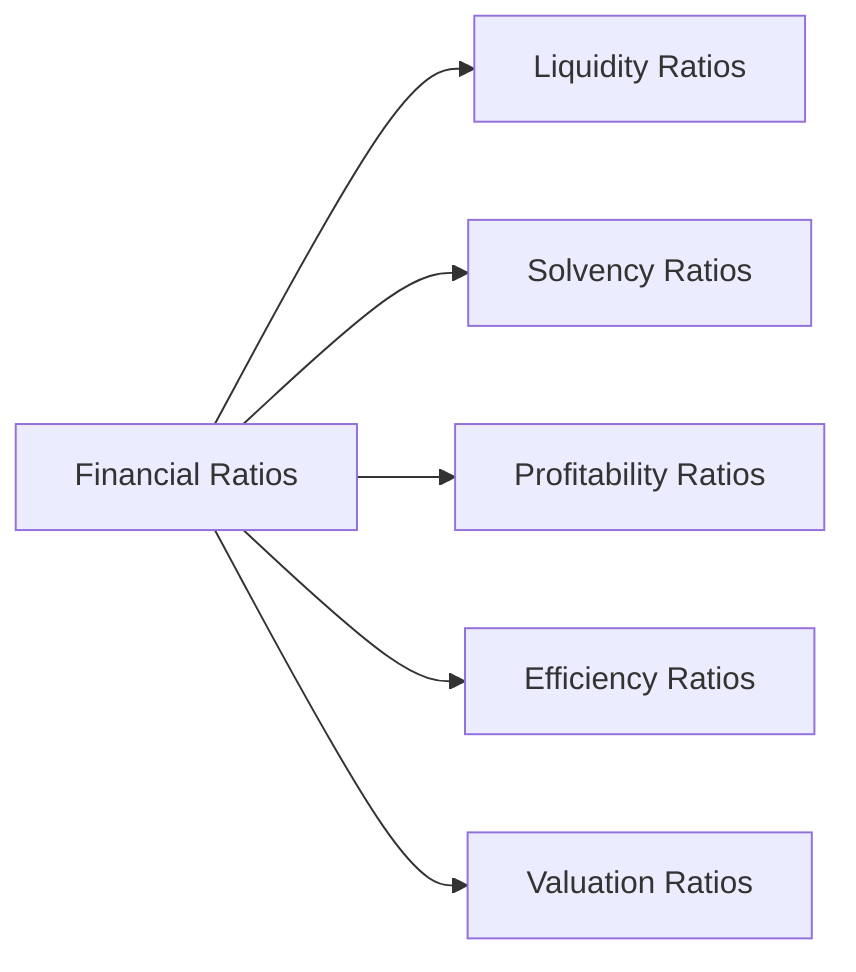

## 14.3 Analyzing Financial Ratios

Analyzing financial ratios is a powerful way to evaluate a company’s performance, stability, and growth prospects. In this section, we will walk through the essential categories of ratios, interpret how they can be used to compare companies within the same industry, and demonstrate how Canadian-specific contexts can influence ratio analysis. We will also explore real-world examples, relevant tools, and best practices for using ratios in an investment decision-making process.

---

## Introduction

Financial ratios provide investors, analysts, and stakeholders with concise metrics that simplify complex financial information presented in a company’s financial statements. By converting large data sets (e.g., income statements, balance sheets, and cash flow statements) into interpretable indicators, you can quickly pinpoint strengths, weaknesses, and trends. Ratios play a critical role in both:

• Trend (time series) analysis — observing how a company’s ratios change over multiple reporting periods.  
• Cross-sectional analysis — comparing a company’s ratios to those of its peers or industry benchmarks.

In Canada, ratio analysis is particularly useful because publicly traded corporations often follow standardized reporting frameworks under International Financial Reporting Standards (IFRS). This consistency helps ensure ratios are calculated and reported in a manner that facilitates meaningful comparisons among companies, whether you are looking at major Canadian banks such as TD Bank or industrial giants like Canadian National Railway (CN).

---

## The Role of Ratio Analysis in Company Analysis

1. Identifying Company Health: A set of healthy ratios can indicate sufficient liquidity to meet short-term obligations, robust profitability, and well-managed debt.  
2. Detecting Emerging Problems: Unfavourable ratio trends (e.g., declining profitability or increasing debt) can serve as early warning signs of operational or financial distress.  
3. Facilitating Benchmarking: Comparing ratios of similar Canadian companies within the same industry (such as RBC vs. TD Bank) can highlight whether a firm is performing above or below the sector norms.  
4. Supporting Decision-Making: Portfolio managers, advisors, and retail investors often rely on ratio analysis to decide whether to purchase, hold, or sell a stock.  

Ratio analysis should not operate in a vacuum—you must also account for macroeconomic factors like interest rates, regulatory changes from the Canadian Investment Regulatory Organization (CIRO), or shifts in consumer behaviour (e.g., growing demand for digital banking).

---

## Key Categories of Financial Ratios

Financial ratios often fall into five main categories: Liquidity, Solvency, Profitability, Efficiency, and Valuation. The flowchart below illustrates how these categories relate to the broader scope of financial ratios:

### Liquidity Ratios

Liquidity ratios show a company’s ability to meet short-term financial commitments. They are particularly important for assessing near-term risk.

• Current Ratio = (Current Assets) ÷ (Current Liabilities)  

  - Measures whether the company’s current assets are sufficient to cover its short-term liabilities.  
  - A current ratio of 2.0 means that the firm has $2 in current assets for every $1 owed in current liabilities.  

• Quick Ratio (Acid-Test Ratio) = (Current Assets – Inventory) ÷ (Current Liabilities)  

  - More stringent than the Current Ratio because it excludes inventory, which may not be quickly liquidated without discounts.

A Canadian manufacturing company, for instance, might experience brief liquidity tightness if raw material costs rise. If the quick ratio dips below 1.0 over multiple quarters, it could indicate potential cash flow challenges.

### Solvency Ratios (Leverage Ratios)

Solvency ratios focus on a company’s long-term financial viability, primarily through the lens of its debt obligations.

• Debt-to-Equity (D/E) Ratio = (Total Debt) ÷ (Shareholders’ Equity)  

  - Reflects how much a company relies on borrowings compared to equity financing.  
  - A high D/E ratio can be normal for a capital-intensive industry (e.g., utilities or mining) but may pose concerns in tech-oriented or growth sectors.  

• Interest Coverage Ratio = (Earnings Before Interest and Taxes (EBIT)) ÷ (Interest Expense)  

  - Measures the company’s ability to service its debt.  
  - A ratio of 5.0 means the firm’s EBIT covers its interest expenses five times over.

### Profitability Ratios

Profitability ratios measure how well a company deploys its resources to generate earnings.

• Net Profit Margin = (Net Income) ÷ (Revenue)  

  - Gauges the percentage of each dollar of revenue that remains as profit.  
  - A net profit margin of 10% indicates that for every $1 in sales, $0.10 is net profit.

• Return on Equity (ROE) = (Net Income) ÷ (Average Shareholders’ Equity)  

  - Evaluates a company’s ability to generate profits from shareholders’ investments.  
  - If a Canadian bank like RBC reports a 15% ROE while a competitor shows 12%, it suggests RBC is more efficient in using shareholder equity to create profit.

• Return on Assets (ROA) = (Net Income) ÷ (Average Total Assets)  

  - Measures how effectively a company utilizes its total asset base to generate profits.  
  - Larger capital-intensive firms (e.g., major Canadian telecom operators) often have lower ROA due to substantial fixed assets.

### Efficiency Ratios

Efficiency ratios examine how efficiently a company uses its assets and manages operations.

• Asset Turnover = (Net Sales) ÷ (Average Total Assets)  

  - Higher turnover indicates that each dollar of assets is generating more revenue.  

• Inventory Turnover = (Cost of Goods Sold (COGS)) ÷ (Average Inventory)  

  - Reveals how quickly a business cycles through inventory.  
  - An inventory turnover of 8.0 implies the company sells and replaces its inventory roughly eight times per year.

### Valuation Ratios

Valuation ratios are most relevant for assessing the attractiveness of a company’s shares in the stock market.

• Price-to-Earnings (P/E) Ratio = (Market Price per Share) ÷ (Earnings per Share)  

  - Shows what investors are willing to pay for each dollar of earnings.  
  - In high-growth sectors like Canadian tech, higher P/Es may be justified by growth expectations.  

• Price-to-Book (P/B) Ratio = (Market Price per Share) ÷ (Book Value per Share)  

  - Indicates whether a stock is undervalued or overvalued compared to its balance-sheet net worth.  

• Dividend Yield = (Annual Dividends per Share) ÷ (Market Price per Share)  

  - Reflects the cash return on investment from dividends alone.  
  - For companies like Canadian pipelines or utility operators, a high, sustainable dividend yield can be a significant draw for income-focused investors.

---

## Interpreting and Benchmarking Ratios

### Trend Analysis

Comparing ratios over multiple quarters or years reveals whether a company is improving, holding steady, or losing ground. For example:

• A stable increase in net profit margin might highlight pricing power or better cost management.  
• A sudden drop in ROE might indicate an adverse shift in the business or unusual expenses.

### Cross-Sectional Analysis

Comparing a company’s ratios to those of similar organizations highlights competitive positioning. If a technology startup in Toronto posts a D/E ratio significantly higher than industry peers, it might suggest the firm is aggressively leveraging debt — a risk factor that warrants deeper scrutiny.

### Industry Norms and Qualitative Factors

Financial ratios vary widely by sector. A high debt load in the utilities or real estate sector may be normal due to stable, recurring cash flows. Meanwhile, a high debt load in a fledgling biotech could be alarming. Qualitative factors also matter strongly. Management credibility, brand strength, and corporate governance can amplify or mitigate concerns raised by raw numbers.

---

## Practical Examples and Case Studies

Consider these real-world scenarios in the Canadian market:

• A large Canadian pension fund evaluating bank stocks might compare ROE, Debt-to-Equity, and the Price-to-Earnings Ratio of RBC, TD, and Scotiabank to decide which bank is most aligned with the fund’s risk-return objectives.  
• An investor analyzing a mid-cap TSX-listed energy firm might focus on solvency ratios, given the cyclical nature of the industry and the need to handle market downturns with stable levels of debt.  
• Startups in fast-growing industry sectors may show negative or low profitability ratios in their early phases. Investors would then look more closely at liquidity ratios and their ability to raise sustainable capital.

---

## A Step-by-Step Approach to Ratio Analysis

1. Gather Financial Statements: Acquire the firm’s latest annual and interim statements (balance sheet, income statement, and cash flow statement) from its investor relations website or SEDAR+ (the Canadian Securities Administrators’ website for filing).  
2. Calculate Key Ratios: Use consistent formulas. In many cases, software tools or spreadsheet templates can expedite calculations.  
3. Compare Against Benchmarks: Examine ratios relative to historical data (e.g., past three to five years) and, if possible, against industry peers.  
4. Interpret in Context: Note any company-specific or industry-specific factors that may influence certain ratios (e.g., seasonality, regulatory changes, or unusual items in the financial statements).  
5. Reconcile with Qualitative Factors: Investigate any anomalies or outliers. Low liquidity might be tolerable if the firm has strong credit lines or high brand value.  
6. Formulate Conclusions: Integrate ratio analysis results into your investment or credit decision. Consider how the company’s risk profile aligns with your portfolio objectives.  

---

## Common Pitfalls and Best Practices

• Focusing Solely on a Single Ratio: Relying on just P/E or the Current Ratio can be misleading. Use a broad set of indicators.  
• Ignoring Industry Differences: Compare like with like. A robust ratio in one sector might be weak in another.  
• Overlooking Qualitative Dimensions: Management quality, product innovation, and economic trends can drastically alter numeric interpretations.  
• Misinterpreting Short-Term Swings: Seasonal fluctuations or one-time events might temporarily skew ratios. It is crucial to analyze the underlying drivers.  
• Stale Data: Relying on outdated statements can lead to misinformed decisions—particularly in rapidly changing sectors such as Canadian tech.

---

## Tools and Resources

• Financial Databases: Bloomberg, Reuters, Yahoo Finance, Canadian-specific databases like TMX Money, or SEDAR+.  
• Regulatory Guidelines: CIRO provides best practices regarding leverage, capital requirements, and client disclosures.  
• Open-Source Tools: Python libraries like pandas can automate calculations of common ratios once you retrieve data via APIs or CSV files.  
• Industry Benchmarks: Statistics Canada (https://www.statcan.gc.ca/) often publishes sector averages and statistics that can serve as a reference.  

---

## Summary

Ratio analysis is indispensable for both novice and experienced investors seeking to evaluate a company’s financial health. By examining liquidity, solvency, profitability, efficiency, and valuation metrics, you gain critical insights into short-term stability, long-term viability, and growth prospects. Always contextualize ratios within an industry framework and combine quantitative findings with solid qualitative research. This well-rounded approach helps ensure more confident and informed investment decisions within the Canadian securities marketplace.

---

## Test Your Knowledge: Financial Ratio Analysis for Canadian Investors



### Which of the following best describes the primary reason for conducting ratio analysis?

- [ ] To comply with Canadian tax laws.
- [x] To simplify and interpret complex financial statement data.
- [ ] To avoid using qualitative indicators in investment decisions.
- [ ] To predict economic recessions with certainty.

> **Explanation:** Ratio analysis condenses vast data from financial statements into primary indicators that help decision-makers evaluate a company’s performance, liquidity, or profitability.  

### Which ratio is most directly related to a company’s capacity to pay short-term bills as they become due?

- [ ] Debt-to-Equity Ratio
- [x] Current Ratio
- [ ] Return on Equity
- [ ] Asset Turnover

> **Explanation:** The Current Ratio specifically measures a company’s quick ability to meet short-term obligations by comparing current assets with current liabilities.  

### If a firm displays a significantly higher Debt-to-Equity Ratio than its industry peers, which of the following is most likely true?

- [x] It may be taking on more debt than peers, suggesting higher financial risk.
- [ ] It automatically indicates that the firm should suspend dividend payments.
- [ ] It shows the firm has very low leverage.
- [ ] It reflects no significant differences in credit risk overall.

> **Explanation:** A higher Debt-to-Equity Ratio means the company is financing operations more heavily with debt than equity, increasing risk if cash flows are uncertain.  

### The Net Profit Margin ratio is calculated as:

- [ ] Net Income ÷ Cost of Goods Sold
- [x] Net Income ÷ Revenue
- [ ] Net Income ÷ Operating Expenses
- [ ] EBIT ÷ Revenue

> **Explanation:** Net Profit Margin indicates the percentage of each revenue dollar retained as net income (profit).  

### Which of the following ratios is considered a profitability ratio?

- [x] Return on Equity (ROE)
- [ ] Quick Ratio
- [x] Net Profit Margin
- [ ] Debt-to-Equity

> **Explanation:** Both ROE and Net Profit Margin evaluate how effectively a company converts resources into profit and are therefore profitability ratios.  

### In valuation terms, a high Price-to-Earnings (P/E) ratio often suggests:

- [x] Investors expect higher future growth from the company.
- [ ] The stock is definitely undervalued.
- [ ] The company has no earnings.
- [ ] There are minimal earnings expectations from investors.

> **Explanation:** A high P/E ratio typically signals that investors anticipate significant growth in a company’s future earnings potential.  

### Efficiency ratios measure:

- [x] How effectively a firm utilizes its assets to generate revenue.
- [ ] How much debt is financed by equity.
- [x] Inventory turnover rates and asset turnover rates.
- [ ] Profitability in terms of net margin.

> **Explanation:** Efficiency ratios focus on areas like asset turnover and inventory turnover, indicating how productively a company manages resources.  

### If a company’s ROA has gradually declined over several quarters, which of the following might be contributing factors?

- [x] Larger capital investments without corresponding revenue growth.
- [ ] Lower Debt-to-Equity ratio.
- [ ] Short-term inventory buildup due to seasonality.
- [ ] Reduced book value per share.

> **Explanation:** A declining ROA can reflect overinvestment in assets or inefficient utilization of those assets without matching revenue gains.  

### When comparing two companies’ P/B ratios, a significantly higher P/B ratio for one may indicate:

- [x] The market perceives greater intangible value or growth potential in that company.
- [ ] The company’s assets are undervalued by the market.
- [ ] The company’s stock price is definitely lower than its peers.
- [ ] The company has higher short-term liquidity.

> **Explanation:** A higher P/B can correspond to stronger perceived future performance or intangible assets not fully captured on the balance sheet.  

### In an industry with consistent cash flows like utilities, a relatively high Debt-to-Equity ratio is:

- [x] True
- [ ] False

> **Explanation:** Capital-intensive industries, including utilities, often operate with higher debt loads if they enjoy stable and predictable cash flows. This structure is generally accepted in such sectors.  



---

