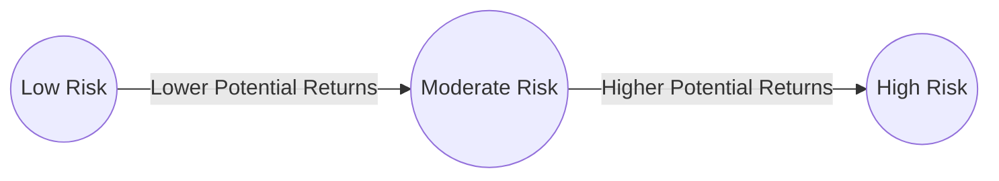

## 15.1 Risk and Return

A fundamental principle in finance is the relationship between risk and return. Every investment decision you make involves assessing how much uncertainty (risk) you’re willing to take on for the potential financial benefit (return). In this section, we will explore different types of risk, delve into how return is measured, and illustrate the practical trade-off between risk and return. We will also discuss how Canadian investors can align their investment strategies with risk tolerance, market conditions, and regulatory guidelines.

---

## Understanding “Risk” in Investments

### Defining Risk

In the context of investments, “risk” refers to the uncertainty that actual returns may deviate from what you expected—these deviations can be positive (above your target return) or negative (below your target return). Although people often think of risk in purely negative terms, in finance, higher risk might lead to higher potential returns.

### Common Measures of Risk

1. **Standard Deviation**  
   • A statistical measure expressing the variability of returns around the average (mean).  
   • A higher standard deviation implies a wider range of potential outcomes, signaling higher risk.

2. **Variance**  
   • Variance is the square of standard deviation.  
   • Measures the spread of possible returns around the mean more prominently because it magnifies larger deviations.

3. **Beta**  
   • Gauges a security’s volatility relative to a benchmark index (commonly the S&P/TSX Composite Index in Canada).  
   • A beta of 1.0 indicates an investment that tends to move in tandem with the broader market, while a beta over 1.0 implies higher volatility, and under 1.0 indicates lower volatility.

4. **Value at Risk (VaR)**  
   • Estimates how much an investment might lose under normal market conditions over a specified timeframe.  
   • Used by Canadian banks (like RBC, TD, BMO) to calculate potential downside in their trading portfolios.

### Sources of Risk

• **Market Risk (Systematic Risk):** Affects the overall market and cannot be eliminated through diversification. Examples include recession-driven market downturns and global issues like pandemics.  
• **Industry or Company-Specific Risk (Unsystematic Risk):** Risks unique to a company or sector, such as regulatory changes impacting the oil industry in Alberta or new competition in the tech space.  
• **Credit Risk:** The possibility that a debt issuer (e.g., a corporate bond) fails to meet payment obligations. Particularly relevant when evaluating lower-rated bonds or high-yield securities.  
• **Interest Rate Risk:** The risk that changing interest rates from the Bank of Canada will affect the value of fixed-income securities. When rates rise, bond prices generally fall.  
• **Currency Risk:** For Canadians investing in foreign markets, fluctuations in exchange rates can dilute or enhance returns.  
• **Liquidity Risk:** The risk that an asset cannot be quickly sold at its fair market value. Some thinly traded stocks or alternative investments (e.g., certain hedge funds) can be illiquid.  
• **Inflation Risk:** The possibility that rising prices (measured by the Consumer Price Index) will erode purchasing power and investment returns.

---

## The Concept of “Return”

### Measuring Return

Return can be expressed in:
• **Dollar Terms:** The absolute gain (or loss) on the investment.  
• **Percentage Terms:** The gain or loss relative to the amount invested (percentage return).  

Several popular methods to measure return include:

1. **Holding Period Return (HPR):**  
   • Measures the total return (including price appreciation and dividends/interest) across the specific holding period of the investment.  
   • Example: An investor buys a stock at CAD 50 and sells it at CAD 55 after one year, receiving a CAD 1 dividend. The HPR is (55 – 50 + 1) / 50 = 12%.

2. **Annualized Return:**  
   • Standardizes the return to a one-year period, helpful for comparing differentholding periods.  

3. **Compound Annual Growth Rate (CAGR):**  
   • Reflects the growth rate of an investment over multiple periods while factoring in compounding.

### Nominal Return vs. Real Return

• **Nominal Return:** The return before adjusting for inflation.  
• **Real Return:** The inflation-adjusted return, which offers a more accurate understanding of changes in purchasing power.  
  - Real Return = Nominal Return – Inflation Rate

### Expected Return

• An estimate of the probable future return, often based on historical performance, probability distributions, or fundamental forecasts.  
• For Canadian dividend-paying stocks, the expected return can include projected dividends and anticipated price changes based on economic analysis (e.g., a stable bank like RBC or TD Bank).

---

## Trade-Off Between Risk and Return

Generally, higher potential returns come with higher risk. This foundational concept underpins many valuation and portfolio theories:

• **Risk Premium:** The excess return over the “risk-free rate” (often proxied by Government of Canada Treasury bills) that investors demand to compensate for additional risk.  
• **Modern Portfolio Theory (MPT):** Argues that an optimal portfolio balances the trade-off between risk and return through diversification.

The following diagram illustrates a simplified representation of the risk-return relationship:

The vertical axis can be seen as “Expected Return” while the horizontal axis can be understood as “Risk.” This arrow essentially shows that as you move from lower to higher risk, there is a corresponding increase in the potential return.

---

## Risk Tolerance and Investor Profiles

### Why Risk Tolerance Matters

Risk tolerance is the degree to which an investor is comfortable with fluctuations in the value of their investments. Factors influencing risk tolerance include:
• **Investment Goals:** Saving for retirement, a house down payment, or generating monthly income.  
• **Time Horizon:** A longer time horizon generally allows investors to take on more risk because they have more time to recover from market downturns.  
• **Liquidity Needs:** If you need quick access to cash (for example, to cover emergent expenses), high-liquidity assets or lower-volatility investments may be more appropriate.  
• **Psychological Factors:** Personal disposition and emotional reaction to market volatility.

### Assessing Risk Tolerance

Most Canadian investment advisors use a “Know-Your-Client (KYC)” form to establish an investor’s profile, which includes:
• Investment objectives and timelines  
• Income and net worth  
• Past investment experience  
• Comfort with price swings  

---

## Incorporating Economic Factors

Changes in macroeconomic variables, such as interest rates, inflation, and GDP growth, can directly or indirectly affect asset prices:

• **Interest Rates:** When the Bank of Canada raises rates, bond prices tend to decline, impacting overall portfolio returns.  
• **Macroeconomic Trends:** A recession can decrease corporate earnings, affecting equity valuations.  
• **Geopolitical Risks:** Trade agreements, political stability, and global tensions all influence Canadian markets.

---

## Planning and Monitoring

### Building a Robust Investment Plan

1. **Define Objectives:** Are you aiming for capital growth, income, or preservation?  
2. **Identify Risk Tolerance:** Incorporate your results from the KYC process.  
3. **Diversify Appropriately:** Spread your investments across asset classes (equities, fixed-income, alternatives) and geographic regions to manage specific risks.

### Continuous Monitoring

• **Track Performance and Rebalance:** Review how each asset class is performing relative to your goals. Rebalance if necessary to maintain your target asset allocation.  
• **Stay Informed:** Keep abreast of economic news, Bank of Canada announcements, and regulatory changes by the Canadian Securities Administrators (CSA).  
• **Adapt to Life Events:** Major life changes (e.g., retirement) may necessitate revisiting your risk tolerance and return objectives.

---

## Table: Selected Types of Risk and Their Impact

| Risk Type          | Definition                                                                                           | Example                                                                          |
|--------------------|-------------------------------------------------------------------------------------------------------|----------------------------------------------------------------------------------|
| Market Risk        | Systematic risk affecting the whole market.                                                          | Recession-induced drop in the S&P/TSX Composite Index.                           |
| Industry Risk      | Sector-specific risk that can affect all companies within a particular industry.                      | Changes in oil regulations hitting Alberta energy stocks simultaneously.         |
| Credit Risk        | The possibility of a bond issuer defaulting.                                                         | A high-yield bond issuer missing its coupon payment.                             |
| Interest Rate Risk | Impact of fluctuating interest rates (Bank of Canada’s key policy rate) on asset values.             | Bond prices falling when interest rates rise.                                    |
| Currency Risk      | The effect of exchange rate movements on investment returns.                                         | A Canadian investor’s U.S. equity returns shrinking due to a stronger CAD.       |
| Liquidity Risk     | Inability to sell an asset quickly without a significant loss in value.                               | Thinly traded small-cap stocks or certain hedge funds.                           |
| Inflation Risk     | Erosion of purchasing power when inflation outpaces investment returns.                               | Holding cash during periods of high inflation reduces real return.              |

---

## Glossary

• **Risk:** The potential for investment results (returns) to deviate from the expected outcome.  
• **Risk Premium:** The additional return investors expect for taking on higher risk compared to a risk-free asset, such as a Government of Canada T-bill.  
• **Standard Deviation:** A statistical measure that indicates how much returns vary around their average (mean).  
• **Beta:** A measure of an asset’s volatility relative to a benchmark (often a Canadian index). A beta of 1.0 indicates the asset’s price moves in tandem with the index.  
• **Variance:** The square of the standard deviation, a measure of return dispersion.  
• **Nominal Return:** The rate of return on an investment unadjusted for inflation.  
• **Real Return:** The rate of return adjusted for inflation.  
• **Value at Risk (VaR):** An estimate of how much an investment might lose, given normal market conditions, over a specified period.

---

## References and Additional Resources

• **CIRO (Canadian Investment Regulatory Organization):** Visit <https://www.ciro.ca> for proficiency standards, investor protection guidelines, and updates on risk management.  
• **Canadian Securities Administrators (CSA):** <https://www.securities-administrators.ca> for national instruments, staff notices, and risk disclosures.  
• **“Investment Funds in Canada” by CSI:** In-depth coverage on mutual fund risk and return metrics.  
• **Bank of Canada:** <https://www.bankofcanada.ca> for trends on interest rates, inflation, and economic indicators.  
• **CFA Institute:** <https://www.cfainstitute.org> for articles and guides on Modern Portfolio Theory.  
• **Open-Source Libraries (Python’s NumPy, pandas, PyPortfolioOpt):** Effective for historical return analysis, portfolio optimization, and backtesting.  

---

### Summary

A solid grasp of risk and return is critical for all investors seeking to optimize their portfolios within the Canadian markets. By understanding and measuring various types of risk, balancing potential returns, and continuously monitoring the economic and regulatory environment, investors can make informed decisions that align with their financial goals and risk tolerance. This foundational knowledge paves the way for more advanced portfolio theories and strategies, helping Canadians invest responsibly and confidently.

---

## Test Your Knowledge: Risk and Return in Canadian Securities – Comprehensive Quiz



### Which of the following best defines “risk” in an investment context?

- [ ] The likelihood of a positive return on investment
- [ ] The inability to measure historical returns accurately
- [x] The potential for actual returns to deviate from expected returns
- [ ] The ratio of revenue to expenses for a company

> **Explanation:** Risk relates to the uncertainty of returns, meaning the possibility that actual results differ from expected outcomes—whether positively or negatively.

### Beta measures which aspect of a security?

- [ ] Its absolute loss in monetary terms
- [ ] Its liquidity in the secondary market
- [x] Its volatility relative to a benchmark index
- [ ] Its creditworthiness relative to other bonds

> **Explanation:** Beta indicates how much a security’s price movement correlates with the broader market, often the S&P/TSX Composite Index.

### When discussing risk and return, the “risk premium” is best described as:

- [ ] The guaranteed profit from a risk-free asset
- [ ] The difference between the highest and lowest expected returns
- [x] The extra return demanded by investors for taking on additional risk above the risk-free rate
- [ ] The fee charged by investment advisors to manage high-risk assets

> **Explanation:** The risk premium is the amount of return above the risk-free rate (e.g., Government of Canada T-bills) that compensates the investor for higher risk.

### Which of the following is true regarding real return vs. nominal return?

- [ ] Nominal return is always higher than real return
- [ ] Real return is calculated by adding inflation to the nominal return
- [x] Real return accounts for inflation, offering a better measure of purchasing power
- [ ] There is no meaningful difference between nominal and real returns if inflation is zero

> **Explanation:** Real return adjusts the nominal return for the rate of inflation, providing a clearer picture of an investor’s true purchasing power.

### Which of the following influences interest rate risk in Canada?

- [ ] The U.S. Federal Reserve’s policy alone
- [x] The Bank of Canada’s monetary policies
- [ ] Only corporate earnings in the TSX index
- [ ] Commodity prices in global markets

> **Explanation:** The Bank of Canada sets the key policy rate, influencing broader interest rates in Canadian financial markets.

### An investor is concerned about not being able to quickly sell a thinly traded security at its fair price. This describes:

- [ ] Credit risk
- [ ] Inflation risk
- [ ] Systematic risk
- [x] Liquidity risk

> **Explanation:** Liquidity risk arises when there is insufficient market activity (low trading volume) to sell an asset promptly without impacting its price significantly.

### If a bond’s beta relative to the market is significantly lower than 1.0, what does this imply?

- [x] It has lower volatility relative to the overall market
- [ ] It has higher volatility relative to the overall market
- [ ] It always provides a negative return
- [ ] Its price will mirror the risk-free rate precisely

> **Explanation:** A beta below 1.0 suggests that the security (in this case, a bond) tends to experience smaller price movements relative to the benchmark.

### Which metric would an investor use to estimate potential maximum losses under normal market conditions?

- [ ] Standard Deviation
- [ ] Beta
- [x] Value at Risk (VaR)
- [ ] Real Return

> **Explanation:** VaR (Value at Risk) specifically estimates how much one could lose in a worst-case scenario under normal market conditions within a set timeframe.

### According to Modern Portfolio Theory, diversification attempts to:

- [ ] Eliminate systematic risk entirely
- [ ] Guarantee excess returns every year
- [ ] Focus all capital in a single high-yield stock
- [x] Minimize unsystematic risk by spreading investments across different asset classes

> **Explanation:** Diversification reduces company- or industry-specific risks. It cannot remove market-wide (systematic) risk but can help mitigate unsystematic risk.

### True or False: A thorough KYC (Know Your Client) process is essential for tailoring investment strategies to meet risk tolerance and objectives in Canada.

- [x] True
- [ ] False

> **Explanation:** Canadian regulatory standards mandate a KYC process so advisors can recommend suitable investments based on individual risk tolerance, financial status, and goals.



---

## For Additional Practice and Deeper Preparation

**Elevate your exam readiness with our comprehensive app, "Securities CA: Mock Exams," designed to challenge and refine your skills.**

* **Master Challenging Questions:** Dive into expertly crafted sample exam questions that go beyond standard references.
* **Scenario-Driven Learning:** Experience scenario-driven case questions and in-depth solutions to build practical expertise.
* **Sharpen Exam Strategies:** Build confidence with step-by-step explanations designed to refine your exam-day tactics.
* **Gain Real-World Insights:** Acquire practical tips and detailed rationales that demystify complex concepts.
* **CIRO and CSI Alignment:** Stay current with CIRO guidelines and CSI’s exam structure, with questions intentionally more challenging than the actual exam.

**Download the App Today:**

> Note: While these courses are specifically crafted to align with the CSC® exams outlines, they are independently developed and not endorsed by CSI or CIRO.
