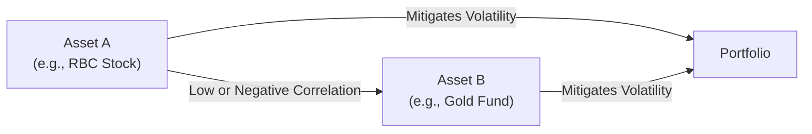
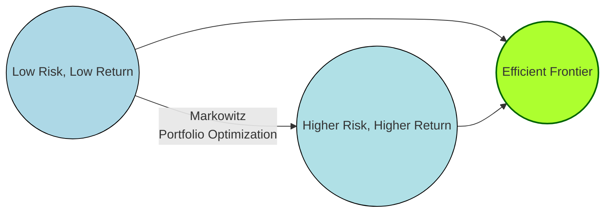

## 15.2 Relationship Between Risk and Return in a Portfolio

Building on the foundation of the portfolio approach, an investor’s primary challenge is balancing the desire for high returns against the exposure to risk. This section examines this delicate equilibrium by looking at how portfolio composition, asset correlation, market forces, and theoretical constructs (such as the Capital Asset Pricing Model) come together to form the backbone of portfolio risk management. We will explore how and why diversification works, what the efficient frontier represents, and how beta, alpha, and risk-adjusted performance measures factor into portfolio evaluation. By the end, you will have the tools and insights to better align your portfolios with your risk tolerance and performance goals, in line with Canadian regulations and best practices.

---

## Diversification and Correlation

### Fundamentals of Diversification
Diversification is among the most reliable mechanisms investors use to mitigate risk. The idea is straightforward: By investing across a variety of asset classes, sectors, and geographies, you reduce the impact that any single underperforming asset can have on an overall portfolio. Instead of placing all funds into one stock (e.g., a high-growth Canadian technology firm), you might hold a mix of:
• Government of Canada bonds.  
• Blue-chip stocks from Canadian banks such as RBC or TD.  
• Real estate investment trusts (REITs).  
• Shares in various industries like telecommunications, energy, or healthcare.  

When different assets respond in different ways to market events, portfolio volatility decreases. This concept is the crux of Modern Portfolio Theory (MPT), applied frequently by professional money managers in Canada and worldwide.

### The Role of Correlation
Correlation measures the degree to which two assets move in tandem. The correlation coefficient ranges from -1 to +1:
• +1: Perfect positive correlation (two assets move in the same direction to the same degree).  
• 0: No correlation (assets move independently of each other).  
• -1: Perfect negative correlation (assets move in exactly opposite directions).  

A well-diversified portfolio, ideally, includes assets with lower or negative correlations. For instance, certain sectors such as utilities may be resilient during economic slowdowns, while cyclical sectors like industrials may do well during expansions. Combining them can smooth out portfolio returns over time.

#### Example: Correlation in Practice
Consider a simplified scenario using Canadian bank stocks and gold mining companies. Historically, gold has sometimes moved inversely to broader equity markets. By pairing a bank stock (e.g., RBC) with a gold mining stock, you could reduce overall volatility if gold rallies during periods when financial stocks are weak.

Below is a basic diagram illustrating how two assets with low correlation can reduce overall portfolio risk:

In Canadian markets, portfolio managers pay keen attention to correlation coefficients, especially when constructing balanced funds—mixing equities, bonds, and alternative assets (such as real estate and infrastructure projects).

---

## The Efficient Frontier

### Definition and Concept
The efficient frontier is a cornerstone of Harry Markowitz’s Modern Portfolio Theory. It represents the set of optimal portfolios that deliver the highest expected return for each level of risk (or the lowest risk for a targeted return). Portfolios located below the efficient frontier are considered suboptimal—they either incur too much risk for their level of return or deliver too little return for their assumed risk.

### Plotting the Efficient Frontier

Typically, the efficient frontier is depicted on a graph with risk (standard deviation of returns) on the x-axis and expected return on the y-axis:

In a real-world scenario, a Canadian retirement portfolio might include a range of investment types—like Government of Canada bonds, provincial bonds, corporate bonds, domestic and international equities, and possibly alternative investments like venture capital funds. By combining these assets carefully, the portfolio can reach a position on the efficient frontier that balances the investor’s return objectives with their risk tolerance.

### Moving Along the Frontier
• Moving up the frontier: Achieving higher returns often involves taking on additional risk, perhaps by increasing exposure to equities or alternative assets.  
• Moving down the frontier: Reducing risk typically means shifting toward more conservative or fixed-income investments.  

---

## Systematic vs. Unsystematic Risk in a Portfolio

### Systematic Risk (Market Risk)
Systematic risk affects broad market segments and cannot be fully diversified away. It arises from factors such as geopolitical events, economic recessions, pandemics, or central bank policies (e.g., Bank of Canada’s monetary policy changes).

Examples:  
• A global economic downturn triggered by widespread trade disputes.  
• A significant hike in interest rates by the Bank of Canada aimed at taming inflation.  

### Unsystematic Risk (Idiosyncratic Risk)
Unsystematic risk is specific to a company, sector, or industry, such as a management scandal, a patent failure, or labor disputes in a particular factory. This form of risk can be mitigated—often almost eliminated—through diversification. Holding assets across multiple industries lowers the likelihood that any single event (e.g., a mining strike) severely impacts your entire portfolio.

#### Practical Illustration
Consider a diversified Canadian equity portfolio with holdings in:  
• Canadian banks (e.g., TD, RBC).  
• Energy producers (e.g., Suncor).  
• Telecommunications firms (e.g., BCE).  
• Mining companies (e.g., Barrick Gold).  
• Tech sector (e.g., Shopify).  

While one sector might underperform for company-specific reasons, strong performance elsewhere can counterbalance the negative effect, minimizing overall portfolio impact.

---

## Portfolio Beta and Alpha

### Beta
Beta measures an asset’s (or portfolio’s) sensitivity to market movements. A beta of 1 implies that the portfolio tends to move lockstep with the benchmark (often the S&P/TSX Composite Index in Canada). A portfolio with a beta of 0.8 is expected to move 20% less than the market’s returns, while a higher beta—say 1.2—would imply larger swings in response to market moves.  

When constructing a portfolio for a risk-averse client, a portfolio manager might target a lower beta; for an aggressive-growth strategy, they may accept a higher beta.

### Alpha
Alpha represents the excess return (positive or negative) of a portfolio relative to its expected return, given its beta. Specifically:
• Positive alpha suggests the asset or portfolio outperformed relative to risk level.  
• Negative alpha indicates underperformance relative to the risk taken.

For instance, if your portfolio earns 10% when, given its level of market risk (beta), the expected return is 8%, you have an alpha of +2%. This is often credited to superior stock selection or timely market decisions by the portfolio manager.

---

## Capital Asset Pricing Model (CAPM)

### CAPM Basics
CAPM provides a theoretical framework for determining the required rate of return of an asset based on systematic risk. The model’s formula is:


    \text{Expected Return} = R_f + \beta (R_m - R_f)


Where:  
• \\(R_f\\) = Risk-free rate (e.g., the yield on a Government of Canada Treasury bill).  
• \\(\beta\\) = Beta of the asset or portfolio.  
• \\(R_m\\) = Expected return of the market.

### Real-World Considerations
While CAPM offers a straightforward approach, real markets are never perfectly efficient. Behavioral biases, market anomalies, and macroeconomic events (like oil price shocks in Alberta’s energy sector) can cause short-term divergences from the CAPM assumptions. Canadian Portfolio Managers must also consider:
• Liquidity constraints of smaller-cap Canadian stocks or thinly traded government bonds.  
• Regulatory impacts from National Instruments or CIRO guidelines on securities selection.  
• The effect of currency fluctuations for portfolios with U.S. or international holdings.

---

## Risk-Adjusted Performance Measures

### Sharpe Ratio
The Sharpe Ratio measures the excess return (above the risk-free rate) per unit of total portfolio risk (standard deviation):


\text{Sharpe Ratio} = \frac{(R_p - R_f)}{\sigma_p}


Where:  
• \\(R_p\\) = Portfolio return  
• \\(R_f\\) = Risk-free rate  
• \\(\sigma_p\\) = Standard deviation (total risk) of the portfolio

A higher Sharpe Ratio indicates that the portfolio achieves more return per unit of overall risk.

### Treynor Ratio
Like the Sharpe Ratio, the Treynor Ratio focuses on excess returns but uses beta instead of standard deviation. It isolates the return per unit of systematic risk:


\text{Treynor Ratio} = \frac{(R_p - R_f)}{\beta_p}


For portfolios that seek to manage primarily market risk (and where unsystematic risk is adequately diversified), the Treynor Ratio can be particularly helpful.

### Information Ratio
The Information Ratio measures a manager’s ability to generate excess returns over a benchmark, relative to the volatility of those returns (tracked as tracking error). A high Information Ratio indicates consistent outperformance over the benchmark.

---

## Practical Examples and Case Studies

### Canadian Pension Fund Example
A Canadian pension fund, such as the Canada Pension Plan Investment Board (CPPIB), might maintain a globally diversified portfolio. By allocating funds to Canadian equities, foreign equities, fixed income, and alternative investments, CPPIB reduces unsystematic risk. Its overall performance is then measured using risk-adjusted metrics like the Sharpe Ratio and Information Ratio.

### Canadian Bank Example: RBC Balanced Fund
A balanced mutual fund managed by RBC might hold:
• 40% in Canadian government and corporate bonds  
• 40% in Canadian and U.S. equities  
• 20% in global equities or REITs  

Through strategic asset allocation, the fund attempts to maintain a relatively stable beta. Performance is tracked to assess alpha relative to a composite benchmark, which could be a blend of the FTSE Canada Universe Bond Index and S&P/TSX Composite Index.

### Sector-Specific Diversification
A TD asset manager looking to reduce risk for a client in the energy sector might add renewable energy companies and utility stocks to offset oil price volatility. This approach exploits lower correlation between traditional energy and renewables while still remaining within a broader energy theme.

---

## Best Practices, Challenges, and Strategies

### Best Practices in Canadian Portfolio Construction
• Maintain a mix of assets: Incorporate equity, debt, and alternative assets for risk diversification.  
• Monitor portfolio beta: Ensure the portfolio’s sensitivity to broad market movements aligns with client objectives.  
• Focus on correlation: Seek combinations of securities with low or negative correlations.  
• Rebalance regularly: Realign to the targeted asset mix to maintain the desired risk-return profile.

### Common Pitfalls
• Overconcentration: Investing too heavily in a single sector or stock (common with employee stock programs).  
• Ignoring liquidity: In Canada, thinly traded small-cap stocks or corporate bonds can increase both transaction costs and volatility.  
• Chasing high returns without managing risks: For instance, overly aggressive strategies might backfire if interest rates rise sharply or if commodity prices plummet.

### Mitigating Challenges
• Portfolio Monitoring: Continuous oversight, potentially using open-source financial tools like Python libraries (NumPy, pandas) to evaluate correlations, betas, and Sharpe Ratios.  
• Scenario Analysis: Stress testing portfolios against events like an interest rate hike by the Bank of Canada or a sudden recessions.  
• Regulatory Alignment: Adhering to guidelines laid out by the Canadian Securities Administrators (CSA) under National Instruments (e.g., NI 31-103 for registration and compliance) and CIRO requirements for investor suitability.

---

## Additional Resources

• **Canadian Investment Regulatory Organization (CIRO):**  
  (https://www.ciro.ca) — Provides ongoing updates on best practices, investor protection, and registration.  

• **CSA National Instruments:**  
  The Canadian Securities Administrators (http://www.csac-acvm.ca/) publish rules and frameworks such as NI 31-103, governing registration requirements for advice and portfolio management in Canada.

• **Bank of Canada Research:**  
  (https://www.bankofcanada.ca/research/) — Explores economic trends and macroeconomic factors impacting systematic risk.

• **Academic Foundations:**  
  - “Portfolio Selection” by Harry Markowitz (Journal of Finance, 1952).  
  - “Risk, Uncertainty, and Profit” by Frank Knight.  
  - University MOOCs on Modern Portfolio Theory (e.g., Coursera’s “Portfolio Selection and Risk Management”).

---

## Glossary of Key Terms

• **Correlation:** A measure (ranging from -1 to +1) of how two securities move in relation to each other.  
• **Diversification:** An investment approach that distributes capital across multiple assets to limit exposure to any single security’s risk.  
• **Efficient Frontier:** A curve that represents portfolios achieving the best possible return for a given level of risk.  
• **Alpha:** The extent to which a portfolio outperforms (or underperforms) its expected return based on its risk level (beta).  
• **CAPM:** A theoretical model that calculates the expected return based on risk-free rate and beta.  
• **Sharpe Ratio:** (Portfolio Return − Risk-Free Rate) ÷ Portfolio’s Standard Deviation.

---

## Summary and Encouragement for Further Exploration

In this section, we explored how risk and return intersect within a portfolio. Understanding correlation and diversification is crucial for mitigating unwanted volatility. The efficient frontier serves as a conceptual guide, illustrating optimal portfolios that balance risk and return. The difference between systematic and unsystematic risk underscores why diversification is essential, and beta and alpha help measure a portfolio’s sensitivity to market movements and manager skill. Practical risk-adjusted performance metrics—such as the Sharpe, Treynor, and Information ratios—allow investors to gauge how well they’re being compensated for the level of risk they assume.

To apply these concepts, conduct ongoing portfolio evaluations, remain updated with Canadian regulatory changes, and consider engaging in scenario analyses to stress test your strategies. Incorporate these principles into your daily portfolio management or long-term financial planning to confidently target returns that align with your risk tolerance, compliance obligations, and investment objectives.

---

## Test Your Mastery: Risk-Return Concepts in Canadian Portfolio Management



### Which of the following best describes the role of correlation in a diversified portfolio?

- [x] It measures how two assets move relative to each other, helping reduce overall portfolio volatility.
- [ ] It predicts the exact future return of a specific asset class.
- [ ] It automatically eliminates all systematic risk.
- [ ] It measures how frequently assets change their dividend policy.

> **Explanation:**( Correlation, ranging from -1 to +1, indicates how assets move in relation to one another. By combining assets with lower or negative correlations, overall portfolio volatility can be reduced.)

### Which statement accurately describes the efficient frontier?

- [x] It includes portfolios that provide the highest expected return for a defined level of risk.
- [ ] It only applies to portfolios with 100% allocation in Canadian government bonds.
- [x] It consists of portfolios that produce the lowest risk for a specified expected return.
- [ ] It is a method for calculating the correlation coefficients of two stocks.

> **Explanation:**( The efficient frontier is a set of optimal portfolios that maximize returns for a given level of risk (or minimize risk for a given level of return). It arises from Modern Portfolio Theory concepts developed by Harry Markowitz.)

### What distinguishes systematic risk from unsystematic risk?

- [x] Systematic risk affects the entire market and cannot be diversified away, whereas unsystematic risk is specific to a company or industry and can be significantly reduced by diversification.
- [ ] Systematic risk is caused by poor company management, while unsystematic risk stems from global crises.
- [ ] Unsystematic risk affects all companies in the market equally, while systematic risk affects only targeted sectors.
- [ ] Systematic risk disappears if the correlation between assets is zero.

> **Explanation:**( Systematic (market) risk pertains to broad market or economic factors and remains even in diversified portfolios. Unsystematic risk is idiosyncratic and can be mitigated through diversification.)

### How is a portfolio’s beta calculated?

- [x] By taking the weighted average of the betas of the individual securities within the portfolio.
- [ ] By averaging historical returns of the industry index over a 10-year period.
- [ ] By using standard deviation in isolation.
- [ ] By adding up the correlation coefficients of all stocks in the portfolio.

> **Explanation:**( Portfolio beta is derived from the weighted beta of each individual security in the portfolio, reflecting overall sensitivity to market movements.)

### Which outcome most clearly signals that a portfolio has generated a positive alpha?

- [x] Its return exceeds the expected return implied by its beta.
- [ ] Its total correlation coefficient with the market is -1.
- [x] It has a Sharpe Ratio that is less than the risk-free rate.
- [ ] It shows performance exactly equal to the risk-free rate.

> **Explanation:**( Alpha measures the difference between a portfolio’s actual return and its expected return given its risk (beta). Exceeding the expected return implies a positive alpha.)

### What does the Capital Asset Pricing Model (CAPM) seek to measure or explain?

- [x] The theoretical link between expected return and systematic risk (beta).
- [ ] The correlation between unsystematic risk and total market volatility.
- [ ] Bond yields offered by the Government of Canada only.
- [ ] Real returns within a single sector of the Canadian market.

> **Explanation:**( CAPM proposes that an asset’s expected return is determined by the risk-free rate plus a risk premium, based on the asset’s beta relative to the market.)

### When would an investor typically rely on the Treynor Ratio over the Sharpe Ratio?

- [x] When primarily interested in systematic risk and the portfolio’s beta exposure.
- [ ] When concerned only with unsystematic risk.
- [x] When the portfolio does not require compliance with any Canadian regulatory framework.
- [ ] When focusing on publicly available liquidity data.

> **Explanation:**( The Treynor Ratio uses beta (systematic risk) in its denominator, making it especially relevant if you assume the portfolio is well-diversified, thereby emphasizing market risk over total risk.)

### In a risk-adjusted context, how can a high Information Ratio be interpreted?

- [x] It means the portfolio manager has consistently outperformed the benchmark relative to the volatility of those excess returns.
- [ ] It indicates the manager only invests in fixed-income securities.
- [ ] It reflects that the portfolio’s unsystematic risk is entirely eliminated.
- [ ] It proves the portfolio never experiences drawdowns.

> **Explanation:**( The Information Ratio indicates the consistency of a manager’s outperformance compared to a benchmark, factoring in the volatility of that outperformance.)

### Which regulation or framework specifically addresses portfolio management registration requirements in Canada?

- [x] CSA National Instrument 31-103.
- [ ] NI 81-101, which deals only with mutual fund prospectus requirements.
- [ ] The GDPR privacy regulation.
- [ ] Basel III international banking norms.

> **Explanation:**( The Canadian Securities Administrators’ NI 31-103 details registration and compliance obligations for advisers and portfolio managers in Canada.)

### The correlation coefficient between Canadian bank stocks and precious metal mining firms is often low or negative. Is this correlation beneficial for a portfolio?

- [x] True 
- [ ] False

> **Explanation:** Having negatively or weakly correlated asset classes can reduce overall portfolio volatility, thus offering better risk-return outcomes.



---

