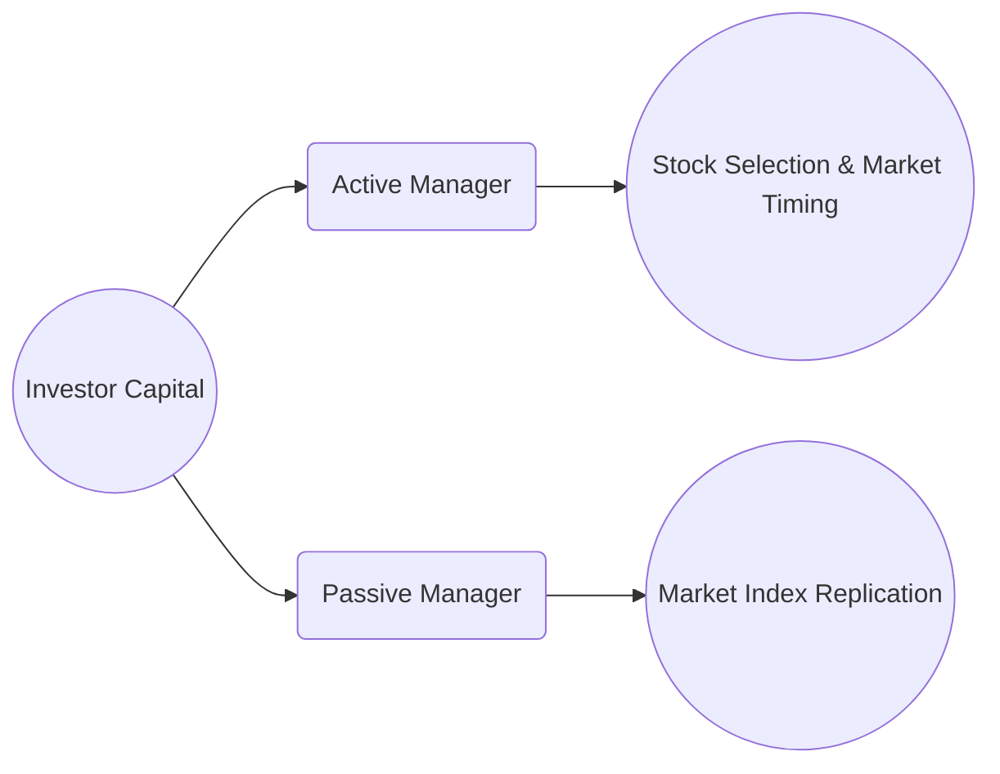

## 15.3 The Portfolio Manager Styles

Portfolio management styles represent distinct approaches that investment professionals use to select assets and construct portfolios. These styles are anchored in specific philosophies regarding market efficiency, valuation, growth prospects, and risk tolerance. In Canada, portfolio managers must align their strategies with national regulations, such as the Canadian Securities Administrators (CSA) and the Canadian Investment Regulatory Organization (CIRO), ensuring they remain compliant and uphold robust ethical standards. Understanding these styles—ranging from the aggressively selective active management to the more hands-off passive management—equips investors and advisors with valuable perspectives for achieving specific investment objectives.

This section explores the most common portfolio management styles seen in the Canadian marketplace—active vs. passive, growth vs. value, top-down vs. bottom-up, and quantitative vs. qualitative methods—offering practical insights, real-world scenarios, and references to Canadian regulations. We will also delve into style attribution and performance analysis, guiding you on how to evaluate a manager’s performance accurately. Whether you are allocating assets for a private client, structuring a pension fund portfolio, or simply improving your own investment approach, these styles form the cornerstone of modern portfolio management.

--------------------------------------------------------------------------------
## Active vs. Passive Management

### Active Management

Active management is a strategy in which a portfolio manager makes specific investments with the goal of outperforming a market index or benchmark. This approach often involves:

• Thorough Research: Active managers typically undertake extensive fundamental, technical, or quantitative research to identify mispriced securities.  
• Market Forecasting: They may rely on economic forecasts, interest rate predictions, or changing market trends to adjust their portfolio allocations.  
• Frequent Trading: Since active managers rebalance and adjust the portfolio more often, transactions can be relatively frequent.  
• Higher Fee Structure: Given the additional research and trading, active management strategies often carry higher management fees and operating costs.  

As an example, an active portfolio manager at RBC Dominion Securities might utilize both top-down and bottom-up research to pinpoint Canadian equities that seem undervalued due to temporary sector downturns. By periodically adjusting positions based on market signals and economic forecasts, the manager aims for returns exceeding the S&P/TSX Composite Index.

### Passive Management (Indexing)

Passive management, often referred to as indexing, focuses on mirroring (or replicating) the performance of a specific market index rather than aiming to outperform it:

• Lower Costs: Since the portfolio composition closely follows an index, trading activity is lower, leading to reduced management fees and lower turnover.  
• Simplicity & Transparency: Portfolio holdings are generally the same as those of the index, making it easier for investors to understand what they own.  
• Market-Matching Returns: Passive funds typically achieve returns close to the index, offering broad market exposure without significant stock-picking risks.  

For instance, a Canadian index fund tracking the S&P/TSX Composite attempts to replicate the benchmark holdings proportionately. If Royal Bank of Canada (RBC) constitutes 6% of the index, the passive fund will target that same weighting.

Beyond cost efficiency, passive strategies often lead to fewer taxable transactions, which can be advantageous for investors holding securities in taxable accounts. However, indexing also implies no attempt to shield the portfolio from broader market declines.  

Below is a simplified diagram illustrating the conceptual difference between Active and Passive approaches:

--------------------------------------------------------------------------------
## Growth vs. Value Investing

### Growth Investing

Growth investing targets companies that are expected to experience above-average growth in revenues, earnings, or cash flow. Key characteristics of growth stocks include:

• High Potential for Capital Appreciation: These companies reinvest profits, prioritizing expansion over immediate dividends.  
• Elevated Valuation Ratios: Growth stocks often trade at higher price-to-earnings (P/E) multiples, reflecting investors’ expectations of future profitability.  
• Forward-Looking Research: Managers spend significant time assessing the company’s strategic plans, market opportunities, innovative products, and consumer trends.  

In Canada, technology companies or biotech firms—often small- to mid-cap—might attract growth investors if they show promising product pipelines or unique competitive advantages. A practical example could be a Canadian pension fund investing in emerging technology firms listed on the TSX Venture Exchange, anticipating a surge in earnings tied to new innovations.

### Value Investing

Value investing concentrates on finding companies that appear undervalued relative to their intrinsic fundamentals. These undervalued aspects could include:

• Low Price-to-Book (P/B) Ratios: Suggesting that the market might be mispricing the firm’s assets.  
• Higher Dividend Yields: Some value stocks offer stable dividend payouts while being undervalued in share price.  
• Relatively Low P/E Ratios: Often signaling that the market has overlooked or shunned these companies.  

Iconic Canadian value investors might focus on securities in cyclical industries such as natural resources (e.g., mining, forestry) when global market sentiments temporarily undervalue them. The assumption is that once the market recognizes the intrinsic worth, the stock price will move upward, generating capital gains.

--------------------------------------------------------------------------------
## Top-Down vs. Bottom-Up Approaches

### Top-Down Strategy

In a top-down investment strategy, portfolio managers first analyze macro-level economic parameters:

1. **Global and Domestic Economic Outlook**: Assess whether GDP growth is improving or deteriorating.  
2. **Interest Rate Environment**: Investigate the potential impact of Bank of Canada policy decisions.  
3. **Sector Analysis**: Identify sectors poised to benefit from prevailing economic conditions, such as consumer staples during economic slowdowns or energy sectors when commodity prices surge.  
4. **Regional and Country Analysis**: Explore international markets or concentrate on Canadian provinces with strong growth potential.  

After narrowing down attractive sectors or regions, managers select individual securities that best capture the anticipated market trend. For example, a manager might overweight Canadian banks during periods of low-interest rates, expecting strong mortgage growth and stable profit margins.

### Bottom-Up Strategy

Bottom-up investors start by examining individual companies, largely ignoring broader economic indicators. Key factors include:

• **Financial Statements**: Income statements, balance sheets, and cash flow analysis.  
• **Competitive Position**: Investigating barriers to entry, industry moats, and product uniqueness.  
• **Management Quality**: Evaluating executive leadership, corporate governance practices, and strategic initiatives.  

Once they identify promising firms, bottom-up managers then assemble a portfolio, confident that the inherent strength of these entities will prevail despite market fluctuations. A Canadian example could be discovering a small-cap manufacturer in Alberta with a robust niche product and undervalued shares relative to its fundamentals.

--------------------------------------------------------------------------------
## Quantitative vs. Qualitative Methods

### Quantitative Methods

Quantitative strategies employ mathematical models and statistical tools to identify investment opportunities:

• **Big Data & Machine Learning**: Use advanced algorithms to uncover price patterns, signals, or anomalies in market data.  
• **High-Frequency Trading (HFT)**: Executes trades at lightning speed based on momentary market inefficiencies.  
• **Risk Metrics**: Thorough reliance on metrics such as Value at Risk (VaR), beta, and volatility to manage portfolio risk.  

For example, a quantitative hedge fund in Toronto might rely on a model analyzing thousands of stock-specific factors (e.g., momentum, earnings revisions) to create a basket of Canadian equities with a favorable risk-adjusted return. These strategies frequently use open-source libraries like Python’s “pyfolio” or R’s “PerformanceAnalytics” to track performance and risk metrics.

### Qualitative Methods

Qualitative methods revolve around non-numerical analyses:

• **Management Competency**: Assess leadership’s track record, credibility, and innovation capacity.  
• **Brand Strength**: Examine a company’s brand loyalty, market position, and customer satisfaction.  
• **Corporate Culture**: Investigate the company’s internal environment, employee retention, and the alignment of interests among stakeholders.  

A fund manager might scrutinize a Canadian mining company’s environmental stewardship and Indigenous community relations—factors that can profoundly impact the firm’s license to operate and long-term sustainability in Canada’s resource-driven sectors.

--------------------------------------------------------------------------------
## Style Attribution and Performance

### Dissecting Portfolio Returns

Style attribution is the process of breaking down a portfolio’s performance to understand which factors contributed the most. It typically distinguishes between:

1. **Market (Benchmark) Return**: The baseline performance of the chosen index or sector.  
2. **Style Return**: The contribution from adhering to a specific style (e.g., growth, value, top-down, or a quantitative tilt).  
3. **Security Selection**: The impact of choosing individual securities—above or below the index weighting—that ultimately alters returns.  
4. **Market Timing**: The gains or losses from adjusting exposure in anticipation of market movements, such as shifting assets into cash during an anticipated downturn.

The goal is clear: if a manager claims to be a “value” manager, we can use style attribution to verify how much of the outperformance truly comes from a value tilt, as opposed to mere market movements.

### Monitoring Style Drift

Style drift occurs when a manager systematically deviates from the original declared strategy. For instance, a manager advertising a “value” methodology may gradually allocate more of the portfolio to high-P/E or growth stocks. Canadian securities regulators and CIRO guidelines emphasize the importance of truth in marketing: if a fund is sold as a value fund, it should remain predominantly invested in value strategies unless clearly disclosed otherwise.

--------------------------------------------------------------------------------
## Regulatory and Ethical Considerations

Canadian regulators, including the CSA and CIRO, set forth frameworks to ensure that portfolio managers maintain consistency between their marketed style and actual investments. Key ethical considerations include:

• **Accurate Marketing Materials**: A manager must not claim to follow a growth style if the portfolio is primarily investing in established, low-growth dividend stocks.  
• **Disclosure of Fees**: Aligning with best practices for transparency, managers must detail any performance-based fees, trailer fees, or underlying fund expenses.  
• **Performance Reporting**: Following robust guidelines such as the Global Investment Performance Standards (GIPS) reduces misrepresentations.  
• **Compliance with Know Your Client (KYC)**: Ensures the portfolio style is suitable for the client’s risk tolerance and objectives.  

Supporting frameworks:
- CIRO guidelines on accurately representing investment styles in product marketing (https://www.ciro.ca).  
- CSA investor protection mandates requiring fund facts documents to reflect the true nature of the strategy.  
- GIPS standards set by the CFA Institute, focusing on transparent, consistent performance measurement and presentation.

--------------------------------------------------------------------------------
## Practical Examples and Case Studies

Below are a few real-world scenarios to illustrate how different styles function in practice:

1. **Canadian Bank-Focused Active Fund**: A portfolio manager at TD Asset Management actively rotates among the Big Five banks (RBC, TD, Scotiabank, BMO, and CIBC) depending on quarterly earnings prospects and interest rate expectations. This approach exemplifies active management, where frequent trades capitalize on near-term advantages.

2. **Low-Fee Index ETF**: A passive manager launching an ETF replicates the S&P/TSX 60. This ETF charges minimal fees and holds precisely the same securities and weightings as the index. Investors benefit from broad market exposure without incurring the higher costs associated with active managers.

3. **Tech Growth Strategy**: A growth manager invests primarily in Toronto-listed technology start-ups exhibiting high growth rates in AI or cloud computing. Even at higher valuations, the manager believes the potential earnings expansion justifies the elevated prices.

4. **Resource Value Play**: A value investor identifies a mid-cap energy firm based in Alberta trading below its book value due to temporary sector-wide pessimism. They anticipate the stock to rebound once global commodity prices recover.

5. **Quantitative Trading Strategy**: A hedge fund in Montreal uses proprietary machine learning models to sift through large-volume stock transaction data. Their algorithms search for patterns or anomalies, executing trades at high speed to exploit short-lived market inefficiencies.

--------------------------------------------------------------------------------
## Summary and Best Practices

Portfolio manager styles each have unique merits and drawbacks, and no single style guarantees success in every market environment. Key points to remember:

• **Active vs. Passive**: Active aims for outperformance but comes with higher fees. Passive matches market returns more cost-effectively, but lacks defensive maneuvers against declines.  
• **Growth vs. Value**: Growth hinges on expected earnings expansion, often carrying higher valuation multiples. Value seeks temporarily undervalued stocks, relying on the market’s correction of mispricing.  
• **Top-Down vs. Bottom-Up**: Top-down starts with macroeconomic analysis, while bottom-up zeroes in on company-specific fundamentals.  
• **Quantitative vs. Qualitative**: Quantitative relies heavily on models and data, whereas qualitative looks at intangible factors like management and brand strength.  
• **Style Attribution & Drift**: Style attribution tools help distinguish between returns driven by the market, style choice, or security selection; style drift must be monitored to maintain transparency.  
• **Regulatory Framework**: Canada’s CSA, CIRO, and GIPS guidelines ensure ethical, transparent, and consistent application of declared strategies.

Ultimately, the best approach often combines elements from various styles, tailored to the specific objectives, risk profile, and constraints of the portfolio in question. Embrace continuous learning, leverage open-source tools for performance analysis, and maintain alignment with Canadian regulations to succeed in professional practice.

--------------------------------------------------------------------------------
## Glossary

• **Active Management**: A strategy aiming to outperform a benchmark by actively selecting securities and timing the market.  
• **Passive Management (Indexing)**: Replicates an index to match its returns, often at lower cost.  
• **Growth Investing**: Focuses on companies that exhibit rapid earnings or revenue growth.  
• **Value Investing**: Targets stocks believed to be trading below their intrinsic worth.  
• **Style Drift**: Occurs when a manager shifts away from the fund’s stated investment strategy.  
• **Style Attribution**: Analytical process to separate the sources of returns by style, sector weighting, and security selection.  

--------------------------------------------------------------------------------
## References and Additional Resources

• **CIRO:** https://www.ciro.ca – Regulatory guidelines on accurate representation of investment strategies.  
• **CSA:** Canadian Securities Administrators – Coordinates securities regulation across provincial bodies; administers investor protection frameworks.  
• **GIPS (Global Investment Performance Standards):** By the CFA Institute, detailing ethical principles for performance measurement.  
• **Canadian Securities Institute (CSI):** Offers advanced courses on active vs. passive investing styles.  
• **Open-Source Tools:**  
  – “PerformanceAnalytics” in R (https://cran.r-project.org/web/packages/PerformanceAnalytics/index.html)  
  – “pyfolio” in Python (https://github.com/quantopian/pyfolio)  

These resources provide in-depth coverage of computational techniques, best practices, and regulatory requirements in Canada’s investment landscape.

--------------------------------------------------------------------------------
## For Additional Practice and Deeper Preparation

**Elevate your exam readiness with our comprehensive app, "Securities CA: Mock Exams," designed to challenge and refine your skills.**

* **Master Challenging Questions:** Dive into expertly crafted sample exam questions that go beyond standard references.
* **Scenario-Driven Learning:** Experience scenario-driven case questions and in-depth solutions to build practical expertise.
* **Sharpen Exam Strategies:** Build confidence with step-by-step explanations designed to refine your exam-day tactics.
* **Gain Real-World Insights:** Acquire practical tips and detailed rationales that demystify complex concepts.
* **CIRO and CSI Alignment:** Stay current with CIRO guidelines and CSI’s exam structure, with questions intentionally more challenging than the actual exam.

**Download the App Today:**

> Note: While these courses are specifically crafted to align with the CSC® exams outlines, they are independently developed and not endorsed by CSI or CIRO.

--------------------------------------------------------------------------------

## Test Your Knowledge: Portfolio Manager Styles in Canada



### Which of the following statements best describes the goal of active management?

- [x] To outperform a benchmark through security selection and market timing.
- [ ] To replicate a benchmark with minimal fees.
- [ ] To reduce fees by avoiding frequent trading.
- [ ] To limit exposure to equity risk.

> **Explanation:** Active managers strive to beat a benchmark index by selecting undervalued securities or timing market shifts.

### Which style primarily seeks to replicate the performance of an index and often results in lower fees?

- [x] Passive management
- [ ] High-frequency trading
- [ ] Active management
- [ ] Quantitative approach

> **Explanation:** Passive (index) funds aim to match a benchmark’s returns and conventionally charge lower fees due to fewer trades.

### A growth investor is most likely to focus on which of the following characteristics?

- [x] Above-average earnings potential and higher P/E ratios
- [ ] Consistently low P/E ratios and high dividends
- [ ] Severely undervalued shares with low fundamentals
- [ ] Short-term price swings with minimal fundamental research

> **Explanation:** Growth investors typically prefer companies with rapid earnings expansion, even if that means paying a premium.

### Value investors often look for companies that have:

- [x] Low price-to-book ratios and strong fundamentals
- [ ] Sky-high valuation metrics
- [ ] Rapidly fluctuating earnings despite high share prices
- [ ] No intrinsic value assessment

> **Explanation:** Value investors identify stocks trading below intrinsic worth, often reflected by low P/B ratios and healthy core metrics.

### How does a top-down approach differ from a bottom-up approach?

- [x] It starts with macroeconomic or sector analysis before narrowing to specific stocks.
- [ ] It focuses first on individual stock fundamentals, ignoring broader economic conditions.
- [x] It may emphasize global trends and interest rates.
- [ ] It only considers short-term technical indicators.

> **Explanation:** Top-down analysis begins at the macro level (economic trends, sector outlooks), then refines spirit to individual security level.

### In a bottom-up approach, portfolio managers primarily consider:

- [x] Fundamental merits of individual companies
- [ ] Economic cycles and region-specific factors first
- [ ] Central bank monetary policies exclusively
- [ ] Technical price patterns and chart formations only

> **Explanation:** Bottom-up investors focus on the intrinsic strength of firms, including balance sheets and competitive advantages.

### Which of the following is a key characteristic of quantitative portfolio management?

- [x] Extensive use of mathematical models and statistical techniques
- [ ] Exclusive reliance on management interviews and brand analysis
- [x] Algorithmic trading based on historical data patterns
- [ ] Complete disregard for risk metrics

> **Explanation:** Quantitative strategies depend on large datasets, advanced analytics, and often algorithmic execution.

### Qualitative analysis might prioritize:

- [x] Management quality and brand reputation
- [ ] Purely numerical screening
- [ ] High-frequency trade execution
- [ ] Algorithmic analysis of market microstructure

> **Explanation:** Qualitative managers focus on intangibles such as executive leadership and firm culture that are not always captured in numeric data.

### Which of the following best describes “style drift”?

- [x] A manager deviates from their stated investment style.
- [ ] A manager replicates a benchmark index precisely.
- [ ] Persistent underperformance relative to a style-specific benchmark.
- [ ] Continuous improvement in performance due to additional research.

> **Explanation:** Style drift occurs when a portfolio shifts out of alignment with the originally declared strategy.

### Style attribution helps investors determine:

- [x] How much of a manager’s performance is due to style, market moves, or individual security selection.
- [ ] Whether the fund replicates a benchmark index.
- [ ] If the manager invests only in growth stocks.
- [ ] The real-time price of each stock in the portfolio.

> **Explanation:** Style attribution breaks down performance into various drivers, revealing if outperformance stems from style bias, market timing, or selection skill.


