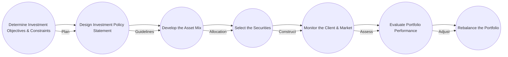

## 16.1 Overview of the Portfolio Management Process

The portfolio management process is a structured, repeatable approach designed to help advisors, portfolio managers, and other financial professionals build investment solutions that align with clients’ objectives, risk tolerance, and constraints. In Canada, this process is governed by a robust regulatory environment, which includes “Know Your Client” (KYC) and “Know Your Product” (KYP) obligations. By following a systematic process, advisors can ensure consistency in decision-making, maintain extensive documentation, and demonstrate compliance with professional and legal standards.

Below, we examine the essential components, best practices, and real-world applications of the portfolio management process as it is commonly practiced in Canadian financial institutions.

---

### Defining the Portfolio Management Process

#### Key Elements and Definitions

1. **Portfolio Management Process**  
   A structured approach for defining, implementing, and continuously monitoring an investment strategy to achieve specific client objectives. It weaves together client assessment, market analysis, product selection, and ongoing diligence to strike an optimum balance between risk and reward.

2. **KYC (Know Your Client)**  
   A regulatory obligation requiring advisors to gather and maintain current information about each client’s financial situation, investment knowledge, objectives, and risk tolerance. Detailed client profiles help advisors tailor portfolios to client-specific needs.

3. **KYP (Know Your Product)**  
   The requirement for advisors to understand the characteristics, costs, risks, and benefits of each investment product they recommend. This includes awareness of product structures such as mutual funds, exchange-traded funds (ETFs), alternative mutual funds, bonds, and structured products.

4. **Risk-Return Trade-Off**  
   Balancing the desire for higher returns with the need to limit or manage risk. The advisor’s objective is to create a portfolio that delivers the highest likelihood of achieving the client’s goals without exceeding their tolerance for potential losses.

---

### Core Steps of the Portfolio Management Process

Although practitioners may categorize steps slightly differently, a typical approach includes the following seven stages. Each stage builds on the previous one, ensuring a logical progression from initial planning to ongoing assessment and rebalancing.

These steps ensure a disciplined approach, enabling the portfolio manager or advisor to deliver consistent and transparent results. 

#### Determine Client Objectives and Constraints

The first step focuses on gathering comprehensive client information. This is the essence of KYC. Advisors may use questionnaires, interviews, and financial statement reviews to determine:

• Investment objectives (e.g., capital preservation, income generation, growth).  
• Time horizon (short-, medium-, or long-term goals).  
• Liquidity needs (planned cash outflows for education, home purchase, retirement).  
• Risk tolerance and capacity (psychological comfort with volatility and real ability to withstand losses).  
• Tax considerations (marginal tax rate, use of registered accounts like RRSPs, TFSAs, or pension structures).  
• Unique constraints (ethical preferences, concentration limits, or specific exclusion criteria).

Comprehensive initial data gathering not only satisfies regulatory mandates but also ensures the portfolio’s structure will truly reflect the client’s goals.

#### Design an Investment Policy Statement (IPS)

An Investment Policy Statement (IPS) is a written document capturing the client’s objectives, constraints, and guidelines for portfolio construction. It outlines:

• Target asset allocation ranges (e.g., 60% equities / 40% fixed income).  
• Permitted and prohibited investments (alternative assets, derivatives, etc.).  
• Performance benchmarks (e.g., the S&P/TSX Composite Index for Canadian equities).  
• Risk parameters (maximum drawdown, expected volatility range).  
• Reporting frequency and responsibilities of both advisor and client.

Regulatory bodies such as the Canadian Investment Regulatory Organization (CIRO) and the Canadian Securities Administrators (CSA) encourage clear documentation of client objectives and portfolio strategy. The IPS helps ensure that portfolio decisions are justifiable and traceable.

#### Develop the Asset Mix

Asset allocation typically has the greatest influence on a portfolio’s risk and return. During this phase, advisors determine how to distribute capital among major asset classes: equities, fixed income, cash, and potentially alternative assets (e.g., real estate, private equity, or hedge fund strategies). Common considerations include:

• Top-down vs. bottom-up approach: Emphasizing macroeconomic factors (top-down) or concentrating on security-level analysis (bottom-up).  
• Diversification across industries, regions, and asset categories to reduce unsystematic risk.  
• Inflation protection strategies (e.g., real-return bonds, commodity exposure).

Canadian practitioners often use data from the Bank of Canada (bankofcanada.ca) and official economic releases to gauge interest rate trends and economic conditions, adjusting asset mixes to reflect monetary policy shifts and anticipated market cycles.

#### Select the Securities

Once the asset mix is established, advisors choose specific securities that will populate each segment of the portfolio. This selection should reflect not only the overall strategy but also the KYP obligation. Key tasks include:

• Researching industry trends and company fundamentals.  
• Evaluating mutual funds and ETFs for transparency, fees, and historical performance.  
• Assessing credit quality and duration in fixed income instruments.  
• Considering derivatives or alternative investments if consistent with the client’s IPS.  
• Comparing costs, tax efficiency, and liquidity of different instruments.

For example, an advisor at RBC or TD might recommend a broad-market ETF for the equity component, Government of Canada bonds for stability, and a hedge fund strategy for alpha generation—provided the client meets the suitability requirements and the products align with the IPS.

#### Monitor the Client, the Market, and the Economy

Markets fluctuate, and client circumstances often evolve. Monitoring involves keeping an eye on:

• Changes in client preferences or major life events (e.g., inheritance, retirement, job change).  
• Economic data releases, interest rates, inflation trends, corporate earnings.  
• Global political events affecting trade or capital flows.  
• Product-level adjustments, such as management changes or shifts in fund strategy.

Advisors must record major decisions and rationales, creating a transparent record that supports good governance.  

#### Evaluate Portfolio Performance

Regular performance reviews compare the portfolio’s returns and risk profile against stated objectives and benchmarks. Key metrics might include:

• Absolute return (nominal and real).  
• Relative performance against indexes (e.g., S&P/TSX Composite, MSCI World, FTSE Canada Universe Bond Index).  
• Risk-adjusted returns, such as the Sharpe Ratio or Sortino Ratio.  
• Tracking error for actively managed products compared to appropriate benchmarks.

Global Investment Performance Standards (GIPS), promoted by the CFA Institute (cfainstitute.org), provide a recognized framework for measuring and presenting performance with consistency and transparency.

#### Rebalance the Portfolio

Finally, portfolio managers realign the asset mix with the original or evolving targets. Portfolio drift occurs naturally over time due to differing growth rates among assets. Rebalancing may involve:

• Selling overweight positions and reinvesting proceeds in underweight areas.  
• Adjusting the portfolio based on changing market conditions or updated client objectives.  
• Considering tax implications, especially in taxable accounts—strategies like tax-loss harvesting may come into play.

Rebalancing ensures the portfolio continues to match the original objectives and risk profile. Advisors also have the opportunity to reduce exposure to overheated markets and reinvest in undervalued segments.

---

### Importance of a Structured Process

Adhering to a formal portfolio management process provides multiple benefits:

1. **Consistency and Transparency**  
   Documenting every decision means both clients and regulators can understand the rationale behind each investment.

2. **Risk Management**  
   Systematic procedures help identify potential pitfalls, ensuring the portfolio remains within acceptable risk parameters.

3. **Regulatory Compliance**  
   A well-documented approach meets CIRO guidance, satisfies KYC/KYP requirements, and helps address any concerns from regulators.

4. **Client Trust**  
   Demonstrating professional diligence reassures clients and differentiates advisors in a competitive marketplace.

---

### Practical Examples and Case Studies

1. **Case Study: Pension Fund Asset Allocation**  
   Large Canadian pension funds, such as the Canada Pension Plan Investment Board (CPPIB), often exemplify the portfolio management process. They begin with long-term return targets and risk tolerances, set strategic asset allocations (e.g., 50% equities, 30% fixed income, 20% alternatives), and rebalance according to market shifts and changing liability profiles.

2. **Real-World Advisor Example**  
   An investment advisor at a major Canadian bank like RBC might discover that a client’s job loss unexpectedly reduced their risk tolerance. Upon reviewing the client’s constraints, the advisor might shift asset allocation from a growth-oriented balanced fund to a more fixed income–heavy position, illustrating how the portfolio management process accommodates real-life events.

3. **Open-Source Tools**  
   For hands-on practitioners, open-source financial libraries (e.g., QuantLib, found at quantlib.org) or data analytics platforms (such as Python-based pandas) can help in modeling bond valuations, simulating portfolio return scenarios, and optimizing portfolio allocations. These resources support evidence-based decisions aligned with the IPS.

---

### Best Practices, Pitfalls, and Challenges

• **Best Practices**  
  – Conduct annual or semi-annual reviews of all KYC information to ensure data is current.  
  – Maintain extensive documentation to fulfill CIRO guidelines and facilitate internal audits.  
  – Use scenario analysis (e.g., stress testing for rising interest rates or equity market downturns).

• **Common Pitfalls**  
  – Failing to update a client’s risk profile(s) when their circumstances change (e.g., marriage, divorce, receiving a large inheritance).  
  – Neglecting to diversify adequately, leading to concentration risk.  
  – Overlooking the benefits and complexities of currency risk management, especially for international investments.

• **Challenges to Overcome**  
  – Balancing short-term client anxiety during volatile markets with longer-term portfolio goals.  
  – Ensuring KYP obligations are met when new, complex structured products or alternative mutual funds enter the marketplace.  
  – Staying informed about evolving regulations from both federal and provincial authorities—consult the Canadian Securities Administrators (securities-administrators.ca) for updated national instruments.

---

### Additional References and Resources

For further reading and up-to-date guidelines, consult the following:

• **CIRO Rule Book** (ciro.ca) – Comprehensive source for Canadian investment dealer and mutual fund dealer regulations.  
• **Canadian Securities Administrators (CSA)** (securities-administrators.ca) – Stay informed about national instruments and harmonized rules for securities legislation.  
• **CFA Institute** (cfainstitute.org) – Explore GIPS standards, investment white papers, and continuing education resources.  
• **Bank of Canada** (bankofcanada.ca) – Monitor key interest rate announcements, economic research, and monetary policy insights.  
• **QuantLib** (quantlib.org) – An open-source library to model complex fixed-income products, essential for accurate pricing and risk assessment.

---

### Summary

A well-defined, methodical approach to portfolio management underpins the success of financial advisors and portfolio managers in Canada. By systematically applying KYC and KYP principles, aligning portfolio strategies with clear client objectives, and adhering to regulatory standards set by CIRO and the CSA, investment professionals can build robust portfolios that respond to changing market conditions and client needs. As you continue through this course, you will gain deeper insight into each step of this process, learning how to fine-tune asset allocation, periodic rebalancing, and performance analysis to optimize client outcomes.

---

## Enhance Your Portfolio Management Expertise: Interactive Quiz



### Which of the following is a primary reason to adopt a structured portfolio management process in Canada?

- [x] It ensures consistency and regulatory compliance through documentation of each investment decision.  
- [ ] It guarantees outperforming the market indexes.  
- [ ] It completely eliminates market volatility.  
- [ ] It requires only a single annual client review.

> **Explanation:**( Adopting a formal process ensures consistent decision-making and compliance with CIRO and CSA guidelines. No investment process can guarantee market outperformance or eliminate volatility.)

### Which Canadian regulatory organization enforces KYC/KYP requirements for investment dealers and mutual fund dealers?

- [ ] CSA (Canadian Securities Administrators)  
- [x] CIRO (Canadian Investment Regulatory Organization)  
- [ ] IIROC (Investment Industry Regulatory Organization of Canada)  
- [ ] FINTRAC (Financial Transactions and Reports Analysis Centre of Canada)

> **Explanation:**( CIRO is responsible for overseeing KYC/KYP obligations and other regulatory requirements for both investment dealers and mutual fund dealers.)

### In the portfolio management process, which document details target asset allocations, risk tolerance ranges, and performance benchmarks?

- [x] Investment Policy Statement (IPS)  
- [ ] Financial Statement of Investment Return  
- [ ] Prospectus  
- [ ] Letter of Engagement

> **Explanation:**( The IPS formally captures objectives, constraints, and guidelines, ensuring transparency and accountability in the advisor-client relationship.)

### When advisors rebalance a portfolio, what is their primary aim?

- [x] To realign the portfolio’s asset allocation with the client’s initial or updated targets  
- [ ] To maximize short-term profits only  
- [ ] To simplify record-keeping for tax returns  
- [ ] To entirely avoid market volatility

> **Explanation:**( Rebalancing re-aligns the portfolio with the desired risk-reward framework and helps maintain the client’s strategic asset allocation. It is not solely about short-term profit or removing volatility.)

### Which of the following is a best practice in monitoring the portfolio?

- [x] Reviewing the client’s financial and personal circumstances to capture any new constraints  
- [ ] Avoiding contact with the client until major market events occur  
- [x] Monitoring macroeconomic indicators, such as interest rates and inflation, via the Bank of Canada  
- [ ] Making unrecorded changes to the portfolio

> **Explanation:**( Staying current on the client’s changing financial situation and economy-wide shifts is crucial. Any modifications must be documented.)

### What is an example of a “Know Your Product” (KYP) obligation?

- [x] An advisor must understand the structure, fees, and risks of the mutual fund they recommend.  
- [ ] An advisor must meet with the client once a year, regardless of product knowledge.  
- [ ] An advisor selects products solely based on past returns.  
- [ ] An advisor relies on the client’s own research for product selection.

> **Explanation:**( KYP mandates that advisors have robust knowledge of the characteristics and risks of each recommended product, not just rely on past performance or client research.)

### Which approach emphasizes the macroeconomic environment first when performing asset allocation?

- [x] Top-down approach  
- [ ] Bottom-up approach  
- [x] Sector-focused approach  
- [ ] Random selection approach

> **Explanation:**( A top-down approach starts with analyzing broad economic factors and trends, then drills down to sectors, industries, and individual securities.)

### Which metric is commonly used to evaluate risk-adjusted performance in portfolios?

- [x] Sharpe Ratio  
- [ ] Duration  
- [ ] Paid-up capital  
- [ ] Current yield only

> **Explanation:**( The Sharpe Ratio measures the portfolio’s excess return over the risk-free rate relative to its total risk (standard deviation), making it a key indicator of risk-adjusted returns.)

### Which of the following best describes one benefit of adhering to Global Investment Performance Standards (GIPS)?

- [x] Provides a recognized framework for measuring and presenting performance consistently  
- [ ] Guarantees the highest returns possible  
- [ ] Eliminates the need to track portfolio performance  
- [ ] Restricts the use of international investments

> **Explanation:**( GIPS provides standardized guidelines that help ensure performance figures are transparent, comparable, and reliable, but it does not promise specific performance outcomes.)

### Monitoring and rebalancing are crucial parts of the portfolio management process. True or False?

- [x] True  
- [ ] False  

> **Explanation:** Monitoring helps advisors keep track of changes in market conditions and client objectives, while rebalancing ensures the portfolio remains aligned with its intended risk-return profile.



---

