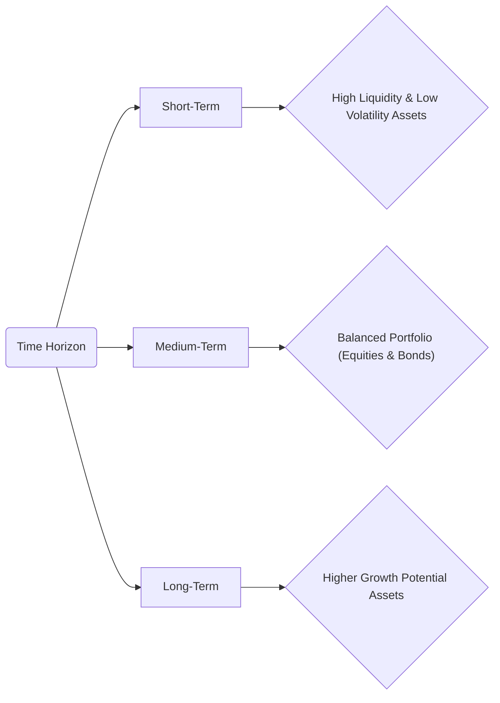

## 16.2 Step 1: Determine Investment Objectives and Constraints

Effective portfolio management begins with a thorough understanding of a client’s investment objectives and constraints. This process goes well beyond simply asking a client how much money they want to make; it involves a holistic assessment of their financial standing, personal goals, risk appetite, and any special circumstances that may affect their portfolio. In Canada, investment professionals are bound by CIRO (Canadian Investment Regulatory Organization) regulations to ensure proper suitability and due diligence in this first and crucial step.

Below, we explore the key objectives and constraints that guide portfolio construction, along with practical examples, real-world case studies, diagrams, and references to official Canadian sources and open-resource tools.

---

## Overview of Objectives

The investment objectives define the ultimate “why” behind a portfolio. Are clients looking for long-term growth? Do they want to preserve capital? Are they seeking regular income streams, or do they have a higher tolerance for risk to speculate on new market opportunities?

### Capital Appreciation (Growth)

Many clients seek capital growth over time, especially for longer-term goals such as retirement or a child’s education. These portfolios often include equities, equity mutual funds, or exchange-traded funds (ETFs) with growth-oriented strategies.  
• Example: A young professional invests in a diversified equity portfolio including Canadian banks (e.g., RBC, TD), tech stocks, and global funds aiming to outpace inflation and build wealth over a 20+ year horizon.  
• Consideration: Growth-oriented investments may experience more volatility, requiring a longer time horizon to recover from market dips.

### Capital Preservation

Preserving capital is the priority for clients who cannot afford substantial fluctuations in principal. Retirees or individuals approaching major life events (like buying a home) commonly fall under this category.  
• Example: A retiree in British Columbia, with limited sources of income, invests primarily in Government of Canada bonds and guaranteed investment certificates (GICs) to ensure minimal risk.  
• Consideration: Lower risk usually means lower returns, which may struggle to keep pace with inflation.

### Income Generation

Some investors prioritize a steady income stream to cover monthly expenses—e.g., retirees or those supplementing their salary. Typical income-oriented portfolios might include dividend-paying stocks, corporate bonds, or real estate investment trusts (REITs).  
• Example: A pension fund invests in dividend-focused ETFs holding Canadian banks and utility companies to pay out regular, stable dividends.  
• Consideration: Ensuring the sustainability of income often involves diversifying across different income-producing assets to mitigate risk.

### Speculative Gains

These clients possess a higher risk tolerance and may seek significant returns over a short period. They may often invest in emerging markets, derivatives, or specific sectors like cryptocurrencies or start-ups.  
• Example: A tech-savvy entrepreneur allocates a percentage of his portfolio to high-risk, high-reward venture capital deals or options trading on the TSX.  
• Consideration: High risk can lead to substantial losses, requiring robust risk management strategies and strong alignment with the client’s financial goals.

---

## Core Constraints

No matter the objective, portfolios must respect certain constraints that can shape the strategy and limit possible actions. Properly documenting these constraints prevents unsuitability issues and aligns with CIRO’s regulatory guidelines.

### Liquidity Needs

Liquidity refers to how quickly an investment can be converted into cash with minimal loss in value.  
• Example: A client planning to purchase a cottage in the next 12 months may require a portion of their assets in highly liquid instruments, such as a money market fund or short-term GIC.  
• Consideration: Illiquid investments (e.g., private equity) can lock up funds, making them unsuitable for specific clients who anticipate near-term cash needs.

### Time Horizon

The duration over which a client plans to invest is critical for determining appropriate asset allocation.  
• Short-Term (1–3 years): May emphasize capital preservation and liquidity over growth.  
• Medium-Term (3–10 years): Moves toward balanced investments, combining moderate growth with some income.  
• Long-Term (10+ years): Allows a heavier tilt toward equities and other higher-volatility instruments for greater growth potential.  

Below is a simple flow diagram illustrating the role time horizon plays in determining risk exposure:

### Risk Tolerance

Risk tolerance measures how much volatility or potential loss a client can endure. It blends both the client’s financial capacity (ability to absorb losses) and their emotional comfort level (willingness to accept short-term fluctuations).  
• Example: A software engineer earning a high salary with no dependents may have a higher capacity to take risks compared to someone nearing retirement with many dependents.  
• CIRO Requirement: Advisors must use structured questionnaires and discussions to ascertain a client’s risk threshold. This helps ensure the portfolio aligns with the client’s financial and emotional capacity to handle market swings.

### Tax Considerations

Canadian investors can utilize registered accounts such as RRSPs (Registered Retirement Savings Plans), TFSAs (Tax-Free Savings Accounts), and RESPs (Registered Education Savings Plans). The tax treatment in these accounts often influences investment choices.  
• Example: High-dividend-paying stocks in a TFSA can provide tax-free dividend income.  
• Consideration: Non-registered accounts require attention to capital gains, dividends, and interest, all of which may be taxed differently by the Canada Revenue Agency (CRA).

### Legal or Regulatory Constraints

Institutional investors, such as pension funds or endowments, must comply with specific laws and guidelines dictating how funds are managed. Similarly, trust arrangements or investor guardianship may limit investment options.  
• Example: A charitable foundation might be restricted to safe, conservative investments to protect donor capital.  
• Consideration: Always review the legal documentation governing the assets to avoid conflicts with any formal mandates.

### Ethical or Personal Preferences

Increasingly, many investors use Environmental, Social, and Governance (ESG) metrics to align investments with their personal values.  
• Example: A client strictly excludes tobacco, weapons manufacturing, or companies with poor environmental practices from their portfolio.  
• Consideration: Filtering out portions of the market can limit diversification or alter risk/return profiles.

---

## Gathering Client Data

Comprehensive and accurate data collection is pivotal. Advisors must carefully document the client’s assets, liabilities, insurance coverage, expected inheritances, income and expense patterns, and future aspirations. This data underpins any recommendations made.

### Typical Information Collected

• Detailed net worth statement (assets minus liabilities)  
• Income sources and stability (salary, business income, rental income, etc.)  
• Current and planned expenditures (mortgage, tuition for children, or major purchases)  
• Existing investment accounts (registered and non-registered)  
• Family situation and estate planning concerns

### Tools and Resources

• CIRO Suitability Requirements – (ciro.ca) for in-depth guidelines on how to gather and interpret client data.  
• Financial Consumer Agency of Canada (FCAC) – (canada.ca) for free resources on budgeting and financial goal-setting.  
• Government of Canada’s Retirement Calculator – (canada.ca) to approximate future retirement income scenarios and gauge how much capital may be needed.

---

## Regulatory Context and Suitability

CIRO’s suitability requirements underscore that all recommendations must match the client’s unique profile. This goes beyond product-specific risk ratings; it demands a holistic view of the client’s situation. Advisors have to:

1. Know Your Client (KYC): Thoroughly document the client’s financial and personal circumstances.  
2. Know Your Product (KYP): Understand product features and risks to match them to client needs.  
3. Act Fairly, Honestly, and in Good Faith: Provide objective advice, free from conflicts of interest.

Neglecting any of these elements can lead to investments that fail to meet the client’s objectives or that exceed their risk tolerance—potentially resulting in regulatory scrutiny and reputational harm.

---

## Practical Canadian Examples and Case Studies

Below are brief scenarios illustrating how objectives and constraints guide final recommendations:

### Case Study A: Sandra’s Retirement Fund

• Age: 35  
• Objectives: Growth for retirement in 25–30 years  
• Constraints:  
  – Time Horizon: Long-term  
  – Risk Tolerance: Moderate-high (willing to accept short-term volatility)  
  – Liquidity Needs: Low (no major expenses in the near future)  

Recommended Approach: Focus on equities and equity-oriented ETFs (e.g., diversified global equity funds, RBC or TD equity mutual funds). Allocate a smaller portion to fixed-income to stabilize overall volatility. Use RRSP contributions to reduce taxable income and potentially a TFSA for additional tax-sheltered growth.

### Case Study B: Gilbert’s Cottage Purchase

• Age: 52  
• Objectives: Capital preservation and partial growth  
• Constraints:  
  – Time Horizon: 1 year for a down payment  
  – Risk Tolerance: Low (cannot afford loss of principal)  
  – Liquidity Needs: High  

Recommended Approach: Substantial allocation to short-term GICs or money market funds to ensure cash will be available without capital erosion. Equities would be minimal given the tight time horizon.  

---

## Best Practices and Common Pitfalls

• Comprehensive Profiling: Avoid relying on a single questionnaire. Engage the client in conversation about their dreams, fears, and financial literacy.  
• Avoid Over-Estimating Risk Tolerance: Clients may claim to be comfortable with risk until they experience a market downturn. Continuously reassess genuine comfort levels and capacity.  
• Stay Current on Tax Laws: The Canadian tax landscape evolves. Stay informed about changes to contribution limits or tax credits to ensure suitable asset location.  
• Document Everything: Maintaining a well-documented client file protects both the client and the advisor. In the event of regulatory scrutiny, thorough documentation is vital.

---

## Summary

Determining investment objectives and constraints is the cornerstone of any successful portfolio strategy. By aligning the client’s financial goals—whether growth, preservation, income, or speculation—with their personal and regulatory constraints—liquidity, time horizon, risk tolerance, tax implications, legal directives, and moral values—advisors ensure that the portfolio truly addresses the client’s needs.

Once these objectives and constraints are clearly defined and documented, the next step is to craft the Investment Policy Statement (IPS), guiding daily decision-making and long-term portfolio construction. We explore this process in the following section.

---

## Investment Objectives & Constraints: Test Your CSC® Knowledge



### Which of the following best describes a capital preservation objective?

- [ ] Achieving maximum long-term growth by holding high-volatility equities.  
- [x] Prioritizing the safety of principal with minimal loss of capital.  
- [ ] Generating speculative returns through derivatives.  
- [ ] Maintaining a short-term liquidity buffer for unexpected expenses.  

> **Explanation:** Capital preservation focuses on safeguarding the initial principal, typically with lower-volatility, conservative investments.

### When assessing a client’s time horizon, which factor is most critical for determining the equity versus fixed-income mix?

- [x] The length of time until the client needs to access the funds.  
- [ ] The client’s occupation and annual salary.  
- [x] The client’s anticipated inheritance timeframe.  
- [ ] The broker’s commission structure.  

> **Explanation:** Time horizon directly influences how much volatility the client can reasonably accept before needing the invested capital. An impending large purchase or short investment window reduces the ability to ride out market fluctuations.

### Under Canadian regulatory guidelines, which principle ensures that an investment aligns with a client’s risk profile and objectives?

- [ ] KYP (Know Your Product) alone.  
- [x] Suitability.  
- [ ] Leverage.  
- [ ] Liquidity risk.  

> **Explanation:** Suitability is the overarching requirement that the recommended investment must match the client’s objectives, constraints, and risk tolerance.

### Which of the following constraints would be most relevant to a high-net-worth investor who wants to invest in a private equity fund locked in for ten years?

- [ ] Tax considerations.  
- [x] Liquidity needs.  
- [ ] Speculative gains only.  
- [ ] Time horizon of 12 months.  

> **Explanation:** Illiquid investments, like many private equity funds, typically lock up capital. Evaluating the client’s liquidity needs is paramount.

### Which statement best illustrates a speculative investment objective?

- [ ] “I’d like to invest in large-cap Canadian companies that pay steady dividends.”  
- [x] “I’m willing to risk a significant portion of my capital in emerging tech start-ups for the chance of high returns.”  
- [ ] “I want to maintain my balance and preserve capital for next year’s home purchase.”  
- [ ] “I need a reliable monthly income from my portfolio.”  

> **Explanation:** Speculative gains involve higher risk assets with the expectation of substantial returns.

### For a client who wants to exclude all oil and gas companies from their portfolio, which type of constraint is at play?

- [ ] Time horizon constraint.  
- [ ] Liquidity constraint.  
- [ ] Capital preservation objective.  
- [x] Ethical or personal preference.  

> **Explanation:** Ethical or personal (ESG) preferences restrict investing in certain industries or sectors.

### Which regulatory body in Canada provides guidelines on risk tolerance assessments for investment suitability?

- [x] CIRO (Canadian Investment Regulatory Organization).  
- [ ] FCAC (Financial Consumer Agency of Canada).  
- [x] CSI (Canadian Securities Institute).  
- [ ] CFP (Certified Financial Planner Board of Standards).  

> **Explanation:** CIRO (previously IIROC) is responsible for overseeing investment dealerships and enforcing suitability guidelines. CSI offers educational programs but is not a regulatory body.

### A retiree needs stable monthly inflows from his RRIF. Which primary investment objective aligns most closely with this scenario?

- [ ] Capital appreciation.  
- [x] Income generation.  
- [ ] Speculative gains.  
- [ ] Capital preservation for the next 30 years.  

> **Explanation:** Income generation is essential for clients who rely on their portfolios for ongoing living expenses.

### Which Canadian government resource can help clients approximate their future retirement income needs?

- [ ] RBC Wealth Management website.  
- [x] Government of Canada’s Retirement Calculator.  
- [ ] TD’s mortgage simulator only.  
- [ ] Provincial securities commissions.  

> **Explanation:** The Government of Canada’s Retirement Calculator (located on canada.ca) helps estimate pension benefits and required retirement savings.

### Suitability ensures that:

- [x] Investments match a client’s objectives, risk tolerance, and constraints.  
- [ ] All clients receive the same portfolio allocation.  
- [ ] Clients must open a margin account before trading.  
- [ ] Tax planning is unnecessary for registered accounts.  

> **Explanation:** Suitability is about tailoring investments to each client’s profile, ensuring alignment with financial goals and regulatory requirements.



---

