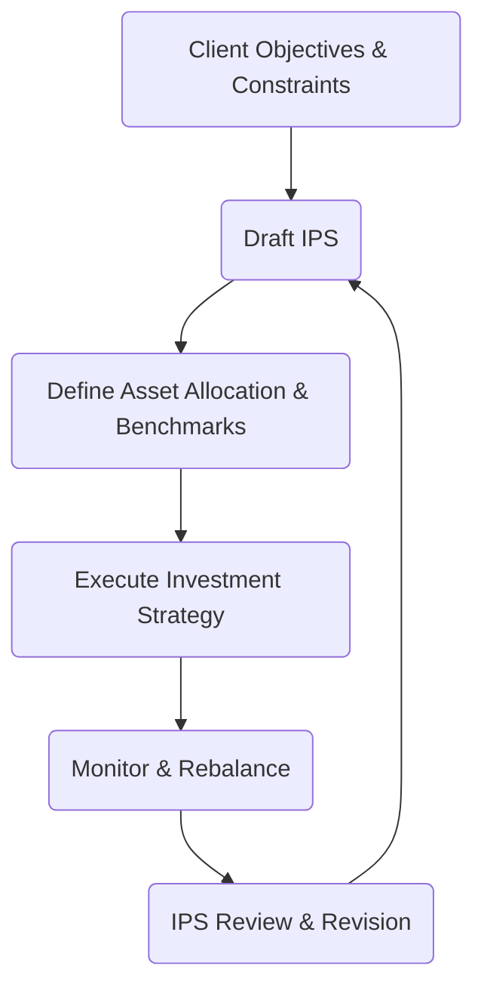

## 16.3 Step 2: Design an Investment Policy Statement

An Investment Policy Statement (IPS) is the cornerstone of a well-structured portfolio management process. This formal document clearly articulates how the portfolio will be managed to meet the client’s financial goals. In Canadian practice, it aligns client needs with industry regulations, fosters transparency, and establishes accountability between the advisor and client. 

In this section, we delve into each core component of an IPS and explore how it helps streamline the portfolio management process. We’ll also present real-world examples and practical tips for designing, implementing, and revising an IPS.

---

## Purpose and Importance of an Investment Policy Statement

A properly constructed IPS serves multiple objectives:

1. Establish clear communication of the client’s investment goals and constraints.  
2. Define the roles and responsibilities of both the client and the advisor.  
3. Provide guidelines on asset allocation, rebalancing, and risk management.  
4. Set benchmarks and key performance indicators (KPIs).  
5. Outline ethical, social, and governance (ESG) considerations.  
6. Comply with Canadian regulatory requirements, notably CIRO guidelines on client-focused relationships.  

By doing so, the IPS reduces miscommunication and the potential for emotional or impulsive decision-making. It also promotes a disciplined approach to portfolio management, ensuring investment decisions remain consistent with the client’s risk tolerance and financial goals.

---

## Key Components of an IPS

Below are the primary elements typically included in an IPS:

### Client Profile

The client profile section establishes the foundation for all subsequent decisions:

• Client Objectives:  
  – The target return or growth objective.  
  – The specific time horizon, such as saving for retirement or buying a home.  

• Constraints:  
  – Liquidity needs (e.g., emergency funds or scheduled withdrawals).  
  – Canadian tax considerations (e.g., using RRSPs, TFSAs, or RESPs for savings goals).  
  – Unique client circumstances (e.g., upcoming large expenses, philanthropic goals).  

By documenting these in the IPS, both client and advisor can reference them to avoid deviating from clearly stated goals.

### Asset Allocation Guidelines

An asset allocation plan provides target mixes for various asset classes (e.g., equities, fixed income, cash equivalents, and alternative investments). Typically, the IPS will specify:

• Target Ranges:  
  – Equity: 50–70%  
  – Fixed Income: 30–40%  
  – Cash and Short-Term Instruments: 0–10%  

• Degree of Flexibility:  
  – The allowable deviation before rebalancing occurs.  
  – Conditions under which tactical shifts are allowed (e.g., in response to significant market events).  

For example, a Canadian investor seeking moderate growth might allocate 60% to equities, 35% to bonds (with a focus on Government of Canada securities or provincial bonds), and 5% to cash. These targets keep the portfolio aligned with medium risk tolerance.

### Rebalancing Protocols

One of the most critical aspects of maintaining a disciplined investment strategy is rebalancing. This section of the IPS details:

• When to Rebalance:  
  – Periodic rebalancing (e.g., quarterly or annually).  
  – Threshold-based rebalancing (e.g., if any asset class drifts 5% from its target).  

• How to Rebalance:  
  – By adding new capital to underweight asset classes.  
  – By selling overweight assets and reallocating proceeds.  
  – By using dividends or interest earnings to adjust allocations.  

For instance, RBC or TD pension fund managers might systematically rebalance once a quarter if equity holdings deviate more than 3% from the target, ensuring consistent exposure to desired asset class weightings.

### Performance Benchmarks

A performance benchmark is a touchstone for evaluating a portfolio’s success relative to the market. This section clarifies which benchmark(s) will be used:

• Examples of Common Canadian Benchmarks:  
  – S&P/TSX Composite Index for Canadian equities.  
  – S&P 500 or MSCI World Index for global equities.  
  – FTSE Canada Universe Bond Index for fixed-income holdings.  

• Blended Benchmarks:  
  – A weighted combination reflecting the portfolio’s asset mix.  

This approach allows ongoing performance tracking, ensuring the portfolio meets or exceeds targets within acceptable risk parameters.

### Risk Tolerance and Liquidity Requirements

These guidelines help shape the portfolio’s overall construction and management:

• Risk Tolerance:  
  – Specifies acceptable levels of volatility or drawdowns.  
  – Outlines how to handle market downturns or major economic shifts.  

• Liquidity Requirements:  
  – Immediate needs for cash or short-term obligations.  
  – Expected future expenses (e.g., tuition, retirement income, or property purchases).  

Clients approaching retirement, for example, may require lower volatility and higher liquidity. In that case, the IPS might tilt more heavily toward fixed-income securities, cash, or short-term instruments to ensure sufficient liquidity.

### Ethical, Social, and Governance (ESG) Mandates

Canada’s investment landscape increasingly incorporates ESG factors. If a client has ESG preferences, the IPS should outline:

• Exclusionary Screens:  
  – Industries or companies to avoid (e.g., tobacco, fossil fuels, or poor environmental track records).  

• Positive Screens:  
  – Preferences for companies showcasing strong diversity, governance, or environmental policies.  

• Proxy Voting Policies:  
  – Guidelines on how proxies should be voted, especially concerning ESG-related shareholder proposals or director elections.  

For example, a foundation focused on sustainable development might exclude coal mining companies and prioritize renewable energy firms. The IPS would specify the ESG ratings or criteria used for screening.

---

## Building Flexibility into the IPS

Though the IPS is a guiding document, it must remain adaptable over time:

• Life Changes:  
  – Job changes, inheritance, divorce, or health expenses.  
  – Shifting retirement plans or estate planning goals.  

• Market Conditions:  
  – Regulatory shifts (e.g., changes in CIRO regulations).  
  – Significant economic upheaval (e.g., financial crises or global recessions).  

Reviewing and revising the IPS ensures that it reflects both current market realities and the client’s evolving needs. Typically, advisors revisit the IPS annually or during major life events.

---

## Canadian Regulatory Insights and Best Practices

A strong IPS aligns with Canadian regulatory frameworks for investor protection:

• CIRO Compliance Rules:  
  – Emphasize “client-focused reforms,” requiring detailed documentation of investment objectives, risk tolerance, and time horizon.  

• CFA Institute Guidelines:  
  – Recommend thorough disclosure and due diligence, with ongoing communication between client and advisor.  

• FP Canada and Sample IPS Templates:  
  – Provide standardized frameworks for drafting an IPS, ensuring all essential elements are addressed.  

By adhering to these guidelines, advisors can better fulfill their fiduciary responsibilities and protect client interests.

---

## Practical Example: A Canadian Pension Fund

Consider a simplified case study of a medium-sized Canadian pension fund managed by an investment team at RBC:

1. Client Objectives: Achieve a long-term real return of 4% (above inflation) to meet pension obligations.  
2. Constraints: High liquidity requirement for pension payouts and a low risk tolerance due to retirement obligations.  
3. Asset Allocation: 45% Canadian and global equities, 45% fixed income (including Government of Canada and provincial bonds), and 10% in alternative investments (real estate or infrastructure).  
4. Rebalancing Protocol: Semi-annual threshold-based rebalancing if equities deviate by more than ±3%.  
5. Benchmarks: A blended index of S&P/TSX Composite (25%), S&P 500 (20%), and FTSE Canada Universe Bond Index (45%). Alternatives have separate benchmarks (e.g., real estate index).  
6. Risk Tolerance: Maximum annual drawdown of 10%.  
7. ESG Mandates: Screen out companies failing RBC’s in-house ESG criteria.  

When inflation spikes or bond yields change, the investment team can adjust the fixed-income composition within stated thresholds to address risk. The IPS ensures each decision aligns with the pension plan’s overarching goals.

---

## Flowchart of the IPS Process

Below is a Mermaid diagram illustrating how the IPS fits into the broader portfolio management process:

• Step A: Identify and document the client’s financial goals.  
• Step B: Draft the IPS, collecting all relevant details on objectives, constraints, and preferences.  
• Step C: Specify asset allocation and performance benchmarks in line with the IPS.  
• Step D: Execute trades and manage the portfolio according to asset mix and ESG guidelines.  
• Step E: Monitor performance, rebalancing whenever thresholds trigger.  
• Step F: Review and revise the IPS if there are significant changes.

---

## Step-by-Step Guidance to Creating an IPS

1. Conduct a Comprehensive Client Profile Interview  
   – Gather essential data: age, occupation, income, financial plans, and risk appetite.  
   – Identify specific short-term and long-term goals (e.g., a new home, retirement, or legacy planning).

2. Set Clear Investment Objectives  
   – Translate general goals into quantifiable targets, e.g., 5% annual return after fees.  
   – Determine the time horizon (3–5 years, 10–20 years, or indefinite).

3. Assess Constraints  
   – Evaluate liquidity requirements, tax considerations, regulatory restrictions, or other unique factors.  
   – Pay particular attention to whether the client can tolerate short-term volatility.

4. Develop an Appropriate Asset Allocation  
   – Balance growth and income-producing assets under Canadian market conditions.  
   – Incorporate TFSAs, RRSPs, or RESP strategies as relevant.

5. Establish Benchmark Criteria  
   – Choose the relevant benchmarks (domestic vs. international, equity vs. bonds).  
   – Consider a composite index if the portfolio is diversified across multiple asset classes.

6. Outline Risk Management and Rebalancing  
   – Indicate allowable deviation ranges for each asset class.  
   – Decide on the rebalancing frequency or performance triggers.

7. Incorporate ESG or Other Special Provisions  
   – Detail exclusions, inclusions, or specific engagement strategies.  
   – Note any requirements for proxy voting guidelines or shareholder activism.

8. Review, Finalize, and Implement  
   – Present the IPS to the client, clarifying any ambiguities.  
   – Obtain the client’s sign-off to confirm mutual understanding.  
   – Execute the initial trades and set up a monitoring schedule.

9. Ongoing Monitoring and Revisions  
   – Regularly review the portfolio’s performance against the IPS.  
   – Adjust the IPS for any major life events or significant market changes.

---

## Common Pitfalls and Challenges

• Drafting an IPS That Is Too Rigid:  
  – May hamper the advisor’s ability to respond to new opportunities or changing market conditions.

• Failing to Update the IPS:  
  – Outdated goals or risk parameters can lead to significant misalignment between client expectations and portfolio performance.

• Underestimating Risk Tolerance:  
  – Overexposure to equities or illiquid assets can damage client trust if significant drawdowns occur unexpectedly.

• Neglecting Tax Considerations:  
  – In Canada, improper use of RRSPs vs. TFSAs or lack of tax-loss harvesting strategies can reduce net returns over time.

• Overlooking ESG Factors:  
  – Investors with strong sustainability convictions may become dissatisfied if their ethical preferences are not integrated into the IPS.

---

## Recommended Resources

• CIRO Website (www.ciro.ca) – Provides regulatory updates and guidance on client-advisor relationship models.  
• CFA Institute (cfainstitute.org) – Offers rigorous materials and publications on drafting Investment Policy Statements.  
• FP Canada (fpcanada.ca) – Supplies various templates and guidelines for financial planners.  
• Open-Source Financial Tools – “PortfolioAnalytics” (in R) or “PyPortfolioOpt” (in Python) can help advisors assess asset allocations and risk metrics.

---

## Summary and Next Steps

The IPS is more than a formality; it is the strategic blueprint that aligns portfolio composition with a client’s life goals, risk appetite, and constraints. Investing the necessary time and effort to craft a detailed IPS can pay substantial dividends in client satisfaction, regulatory compliance, and overall portfolio performance. 

Recall that an IPS is a living document. Markets evolve, and so do clients’ lives. Regularly revisiting this blueprint is a best practice that ensures the portfolio remains relevant, balanced, and responsive to changing economic and personal circumstances.

Before moving on to the next step—selecting the securities (Step 4 in the Portfolio Management Process)—make sure the IPS is thoroughly understood and agreed upon by both advisor and client. Together, they form the bedrock of a professional and transparent advisor-client relationship.

---

## Test Your Knowledge: Design Your Investment Policy Statement Quiz



### Which element is typically included in an Investment Policy Statement (IPS)?
- [x] Asset allocation guidelines
- [ ] Legal disclaimers for third-party agreements only
- [ ] Preferred broker recommendations
- [ ] Immediate motion to terminate the advisor-client arrangement

> **Explanation:**( An IPS sets out the portfolio’s asset allocation targets, not just legal disclaimers or broker preferences.)

### Which of the following benchmarks might a Canadian equity investor most likely use in their IPS?
- [ ] The Nikkei 225
- [x] S&P/TSX Composite Index
- [ ] CAC 40
- [ ] FTSE 100

> **Explanation:**( In Canada, the S&P/TSX Composite Index is commonly used to benchmark domestic equity performance.)

### What is the main purpose of integrating ESG considerations into an IPS?
- [x] Aligning investments with the client’s ethical or sustainability goals
- [ ] Eliminating all risk from the portfolio
- [ ] Maximizing return regardless of ethical constraints
- [ ] Ensuring higher volatility

> **Explanation:**( ESG screening ensures that investment decisions reflect the client’s environmental, social, or governance preferences.)

### According to Canadian regulatory guidelines, how often should an IPS be reviewed and potentially updated?
- [x] Periodically, at least once a year or when material changes occur
- [ ] Only during market volatility
- [ ] Once every decade
- [ ] Updates are optional and not required

> **Explanation:**( Best practice and CIRO guidelines recommend updating the IPS at least annually or when significant changes occur in the client’s circumstances or the market.)

### Which of the following is a key trigger for rebalancing in most IPS documents?
- [x] When an asset class allocation deviates beyond a set threshold
- [ ] The client’s personal preference each month
- [ ] Market rumors about a potential crash
- [ ] Criminal charges against an unrelated CEO

> **Explanation:**( Rebalancing typically occurs based on a defined threshold (e.g., ±5% from target weights) rather than reacting solely to market rumors or isolated incidents.)

### What is the primary advantage of using a blended benchmark in an IPS?
- [x] It better reflects a diversified portfolio’s performance
- [ ] It increases complexity with no additional benefit
- [ ] It eliminates management fees
- [ ] It guarantees a higher return than a single benchmark

> **Explanation:**( A blended benchmark combines multiple indexes proportionally to mirror the portfolio’s asset mix, improving performance evaluation accuracy.)

### Which of the following might be considered a constraint in an IPS?
- [x] A client’s need for consistent withdrawals
- [ ] A desire to buy lottery tickets
- [ ] A preference for high volatility
- [ ] A friend’s investing habits

> **Explanation:**( A client’s liquidity needs (e.g., regular withdrawals) are a standard portfolio constraint and are addressed in the IPS.)

### Why are ESG factors increasingly significant in Canadian portfolio management?
- [x] They reflect growing client and institutional emphasis on responsible investing
- [ ] They are mandatory for all Canadian portfolios
- [ ] They eliminate the need for diversification
- [ ] They guarantee higher performance than non-ESG portfolios

> **Explanation:**( ESG integration has gained prominence as clients and regulators place more weight on responsible investing practices.)

### Which Canadian regulatory body emphasizes client-focused reforms that affect IPS requirements?
- [ ] Office of the Superintendent of Financial Institutions (OSFI)
- [x] Canadian Investment Regulatory Organization (CIRO)
- [ ] Investment Industry Association of Canada (IIAC)
- [ ] Toronto Stock Exchange (TSX)

> **Explanation:**( CIRO (formerly IIROC) oversees investment dealer and marketplace regulation, focusing on best practices for client-advisor relationships and clear documentation.)

### A flexible IPS means:
- [x] It can be updated if the client’s life or market conditions change significantly
- [ ] It has no guidelines or structure
- [ ] It can be overwritten by a single phone call
- [ ] It must be automatically replaced every six months

> **Explanation:** IPS documents should be adaptable but still hold structure. Material changes in life or market conditions often prompt formal updates.



---

## For Additional Practice and Deeper Preparation

**Elevate your exam readiness with our comprehensive app, "Securities CA: Mock Exams," designed to challenge and refine your skills.**

* **Master Challenging Questions:** Dive into expertly crafted sample exam questions that go beyond standard references.
* **Scenario-Driven Learning:** Experience scenario-driven case questions and in-depth solutions to build practical expertise.
* **Sharpen Exam Strategies:** Build confidence with step-by-step explanations designed to refine your exam-day tactics.
* **Gain Real-World Insights:** Acquire practical tips and detailed rationales that demystify complex concepts.
* **CIRO and CSI Alignment:** Stay current with CIRO guidelines and CSI’s exam structure, with questions intentionally more challenging than the actual exam.

**Download the App Today:**

> Note: While these courses are specifically crafted to align with the CSC® exams outlines, they are independently developed and not endorsed by CSI or CIRO.
