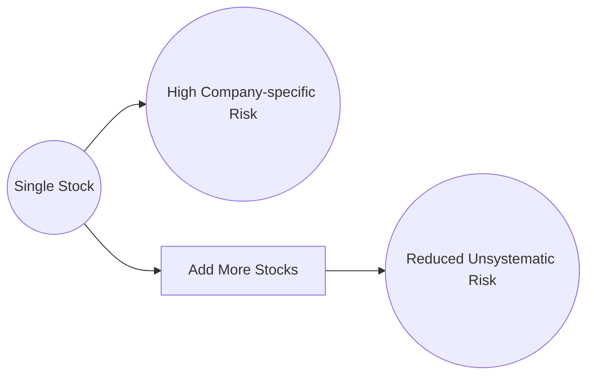
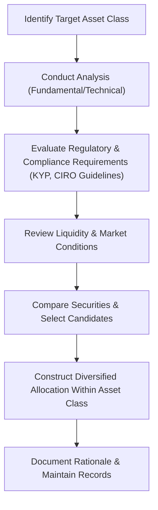

## 16.5 Step 4: Select the Securities

Selecting the right securities is a pivotal step in the portfolio management process. After determining client goals, constraints, risk tolerance (Steps 1 and 2), and establishing the asset mix (Step 3), the portfolio manager or advisor now decides which specific investments—such as stocks, bonds, mutual funds, ETFs, or alternative assets—to include in each asset class allocation. This process blends qualitative and quantitative approaches, utilizes both fundamental and technical analyses, and must align with Canadian regulations and best practices.

In Canada, portfolio managers and advisors operate under guidelines set out by the Canadian Investment Regulatory Organization (CIRO), which emphasizes the Know Your Product (KYP) and Know Your Client (KYC) rules. These regulations ensure that securities are appropriate for the investor’s objectives and risk tolerance. Moreover, the requirement to maintain product due diligence helps safeguard investors’ interests and uphold transparency in the market.

In this section, we explore the key considerations, methods, and tools that guide security selection, from analyzing equities and fixed-income options to selecting managed products like mutual funds or exchange-traded funds (ETFs). We’ll also take a closer look at diversification’s role in mitigating unsystematic risk.

---

## Overview of Security Selection Methodologies

Before diving into specific asset classes, it’s helpful to understand the two primary analytical approaches: fundamental analysis and technical analysis. Each approach yields different insights and can be applied independently or in tandem.

### Fundamental Analysis

Fundamental analysis involves studying a company’s financial statements, management quality, competitive landscape, overall industry position, and macroeconomic factors to derive an intrinsic value. By comparing the intrinsic value to the market price, analysts determine whether a security is undervalued, fairly valued, or overvalued.

• Key Factors:  
  – Revenue growth, margins, and profitability.  
  – Balance sheet strength: debt levels, liquidity, working capital.  
  – Cash flow stability and growth.  
  – Quality of management and governance.  
  – Economic climate and industry-specific trends.

When analyzing Canadian equities—such as those of RBC (Royal Bank of Canada) or TD (Toronto-Dominion Bank)—fundamental analysts often review quarterly and annual reports filed on Sedar+ (sedar.com). These filings provide updated financials, management’s discussion and analysis (MD&A), and other disclosures ensuring transparent investor communication.  

### Technical Analysis

Technical analysis evaluates past price movements to predict future pricing trends. It relies on price charts, trading volumes, and indicators such as moving averages, relative strength index (RSI), and support/resistance levels. Technical analysts believe that market trends and patterns often repeat over time.

• Common Tools:
  – Price Charts (candlestick, bar, line)  
  – Trading Volume Analysis  
  – Momentum Indicators (e.g., MACD, RSI)  
  – Chart Patterns (head and shoulders, triangles, flags)  

Technical analysis can be particularly useful for short-term trading strategies or for timing entry and exit points. It’s commonly employed by active traders and certain portfolio managers to supplement fundamentals or to manage trading risks in volatile market conditions.

The interplay between fundamental and technical analysis helps advisors generate comprehensive assessments of potential security performance.

---

## Security Selection Criteria and Considerations

With the analytical foundation set, the next step involves examining key factors unique to each asset class or product type. This is where knowledge of regulatory requirements—particularly CIRO’s product due diligence guidelines—comes into play. Advisors must ensure that the securities they select align with the client’s portfolio objectives, risk tolerance, and overall asset mix.

### Equities

Equities, or common shares, can provide long-term growth potential and dividend income. However, they carry varying degrees of market risk. Here are some equity-specific considerations:

1. Industry Trends and Market Positioning  
   – Evaluate sector outlook and macroeconomic environment (e.g., energy, technology, financial services).  
   – Identify competitive advantages, such as brand strength or patent protection.  
   – Assess potential disruptions, emerging trends, and sector-specific challenges.

2. Company-Specific Factors  
   – Review the firm’s financial health using fundamental metrics (earnings per share, return on equity, debt-to-equity ratio).  
   – Examine management effectiveness and corporate governance practices.  
   – Understand dividend policy and growth prospects.

3. Valuation  
   – Compare price-to-earnings (P/E) or price-to-book (P/B) ratios to industry benchmarks.  
   – Conduct discounted cash flow (DCF) or comparable company analysis to identify mispriced securities.

Example: An advisor might select shares of RBC if they believe its strong capital ratios and strategic global expansion plan will outperform peers. If key fundamentals align with attractive buy signals from technical charts, RBC could be a suitable equity holding in a dividends-focused Canadian portfolio.

### Fixed-Income Securities

Fixed-income securities—such as government bonds, corporate bonds, and preferred shares—offer predictable income and can stabilize portfolio returns. In security selection, advisors examine the following:

1. Credit Quality  
   – Review issuer credit ratings from agencies like DBRS Morningstar, S&P Global, or Moody’s.  
   – Assess default risk, applying rigorous due diligence for lower-rated securities.

2. Maturity Profiles and Yield  
   – Align bond maturities with investment horizons and interest rate outlook.  
   – Calculate yield to maturity (YTM), yield to call, or current yield to understand expected returns.

3. Interest Rate Environment  
   – Monitor the Bank of Canada’s monetary policy and interest rate announcements.  
   – Consider the impact of yield curve shifts on bond prices (see Step 2: Design an Investment Policy Statement for broader interest rate context).

Example: A Canadian pension fund might seek long-term provincial bonds with AA or higher credit ratings to match future liabilities. The fund will analyze bond spreads, overall interest rate environment, and the creditworthiness of provinces to ensure stable fixed-income returns.

### Mutual Funds, ETFs, and Alternative Investments

For many clients, managed products like mutual funds and ETFs form the core of their investments due to diversification benefits and professional management. Alternative investments (hedge funds, private equity, real estate) can also serve to further diversify returns and risks.

1. Management Style and Strategy  
   – Evaluate the fund manager’s track record, investment style (passive versus active), and performance in various market cycles.  
   – Examine how closely ETFs replicate underlying indices or how effectively a manager in a mutual fund outperforms benchmarks.

2. Fees and Expenses  
   – Compare Management Expense Ratios (MERs) and ongoing costs.  
   – Consider potential sales charges, trailer fees, and performance-based incentives for alternative products.

3. Transparency and Liquidity  
   – For ETFs, assess trading volume, bid-ask spreads, and tracking error.  
   – In hedge funds or real estate investments, examine lock-up periods and redemption terms.

Example: A fee-based advisor might suggest a low-cost Canadian equity ETF with a strong track record of tracking the S&P/TSX Composite Index. Alternatively, a hedge fund focusing on market-neutral strategies could complement an equity-heavy portfolio if the client’s risk tolerance is suited to more sophisticated strategies.

---

## Diversification and Unsystematic Risk

Unsystematic risk is risk associated with a specific company, industry, or sector. For instance, a natural disaster impacting a single company’s operations is an unsystematic risk. Diversifying within each asset class—selecting multiple issuers, sectors, and geographies—helps mitigate unsystematic risk.  

To illustrate, below is a simple Mermaid diagram showing how unsystematic risk can be reduced through diversification across multiple securities:

By investing in multiple securities (C), the unsystematic risk of holding a single stock (A) is spread out and reduced (D). The concept holds true for bonds, mutual funds, ETFs, and other assets—spreading capital among several issuers or fund managers can help limit the impact of a single underperforming security on the portfolio.

---

## Practical Steps in the Security Selection Process

While theory provides the analytical basis, advisors must follow a methodical process to select securities responsibly. Below is a high-level overview of a best-practice workflow:

1. Identify Target Asset Class: Determine which asset class needs additional securities based on the strategic asset allocation.  
2. Conduct Analysis: Apply both fundamental and technical approaches to create a shortlist of potential investments.  
3. Evaluate Regulatory & Compliance Requirements: Check CIRO guidelines for product due diligence (KYP) and ensure that the security matches the client’s KYC profile.  
4. Review Liquidity & Market Conditions: Assess market liquidity to confirm that selected securities can be bought or sold efficiently.  
5. Compare Securities & Select Candidates: Perform side-by-side comparisons of shortlisted securities to decide on the best fit.  
6. Construct Diversified Allocation: Spread investment capital across various names or instruments within that asset class.  
7. Document Rationale & Maintain Records: Keep a clear audit trail of why each security was selected, including references to research and due diligence.

---

## Glossary of Key Terms

• **Fundamental Analysis**: Studying a company’s financial statements, management, industry position, and economic factors to estimate intrinsic value.  
• **Technical Analysis**: Examining price charts, trading volume, and momentum indicators to forecast future price movements.  
• **Unsystematic Risk**: Company-specific or industry-specific risk that can be mitigated through diversification.

---

## Resources and References

• **CIRO Guidelines on Product Due Diligence (KYP)**  
  – Ensure compliance with Canadian rules for selecting and recommending securities.  
• **Sedar+ (sedar.com)**  
  – Access corporate filings, financial statements, and prospectuses for publicly traded Canadian companies.  
• **CFA Institute**  
  – Explore courses and articles on valuation, bond selection, and ethics in finance.  
• **Open-Source Financial Tools**  
  – Tools like QuantLib for bond pricing or open-source solutions leveraging Python libraries (NumPy, pandas) for data analysis.  

Advisors employ a combination of these resources in their research and decision-making processes, ensuring a comprehensive understanding of both the securities themselves and the evolving market landscape.

---

## Conclusion and Best Practices

Security selection is both an art and a science. A disciplined approach balances fundamental insights on company valuation with technical signals on price momentum. Maintaining compliance with CIRO directives, adopting KYP best practices, and diversifying within each asset class are crucial elements for protecting clients and delivering suitable portfolio outcomes.

For Canadian advisors, continuous learning is vital. Keep abreast of regulatory changes, new product offerings, and evolving market conditions. Leverage official filings, open-source analytics, and professional designations like the CFA to refine your skill set. Through careful scrutiny, consistent documentation, and unwavering commitment to client objectives, you ensure that each security added to a portfolio serves a distinct, valuable purpose.

---

## Mastering the Art of Security Selection: 10-Question Quiz



### What is the primary goal of security selection in portfolio management?

- [x] Choosing investments that align with the asset allocation and meet client objectives.
- [ ] Minimizing the number of securities in a portfolio.
- [ ] Selecting only the highest-risk securities for maximum returns.
- [ ] Avoiding compliance considerations in decision-making.

> **Explanation:**( The fundamental purpose of security selection is to find specific investments that not only fit within the client’s asset allocation strategy but also match their financial goals, risk tolerance, and regulatory requirements.)

### Which of the following is a major difference between fundamental and technical analysis?

- [x] Fundamental analysis assesses intrinsic value, while technical analysis focuses on price patterns and market signals.
- [ ] They are identical in approach but differ in data sources.
- [ ] Technical analysis solely uses macroeconomic data, while fundamental analysis only reviews trading volume.
- [ ] Only technical analysis addresses management quality.

> **Explanation:**( Fundamental analysis centers on company valuation and economic indicators, whereas technical analysis reviews past price movements and trading patterns to predict future price behavior.)

### When evaluating a corporate bond’s suitability, which factor is most important?

- [ ] The daily stock price of the issuing company.
- [ ] The company’s logo and branding.
- [x] The bond’s credit rating and default risk.
- [ ] The marketing campaigns of the issuer.

> **Explanation:**( The credit quality of the issuer (as reflected by ratings) is central to assessing default risk. A bond with a higher credit rating typically offers a lower probability of default, making it crucial for fixed-income security selection.)

### How can an advisor reduce unsystematic risk within a segment of the portfolio?

- [ ] By investing all funds in a single high-performing stock.
- [ ] By focusing on one industry to become an “expert” in that industry.
- [x] Through diversification across multiple companies and industries.
- [ ] By timing the market using daily technical indicators.

> **Explanation:**( Unsystematic risk is company-specific or sector-specific risk that can be reduced by spreading investments among various companies and sectors.)

### Which of the following best describes the essential role of the Know Your Product (KYP) requirement?

- [x] It ensures advisors understand the features, risks, and suitability of a product before recommending it.
- [ ] It mandates advisors only sell mutual funds.
- [x] It is a voluntary guideline in Canada.
- [ ] It replaces all client-related documentation.

> **Explanation:**( KYP requires advisors to understand thoroughly the products they recommend, including risks, fees, and underlying assets. This knowledge must be combined with KYC to ensure client suitability.)

### Which of the following factors is most critical for selecting equities?

- [x] Assessing both the company’s fundamentals and the broader industry outlook.
- [ ] Only evaluating the company’s logo and brand colors.
- [ ] Focusing on investor sentiment from social media.
- [ ] Exclusively looking at last week’s price movements.

> **Explanation:**( For equities, a full evaluation must include both fundamental data (e.g., financial statements, strategic positioning) and the broader industry context to ensure potential for sustainable growth.)

### In the context of bond investing, what is “yield to maturity”?

- [x] The total return anticipated if the bond is held until it matures, incorporating coupon payments and capital gains/losses.
- [ ] The interest rate set by the Bank of Canada for overnight loans.
- [ ] The difference between the stock’s price and its earnings per share.
- [ ] A guaranteed measured increase in the bond’s face value.

> **Explanation:**( Yield to maturity (YTM) considers all future coupon payments and the difference between the purchase price and par value to estimate the annualized return if the bond is held until maturity.)

### How might an advisor use technical analysis in conjunction with fundamental analysis?

- [x] By identifying undervalued securities through fundamentals, then using technical signals to determine entry and exit points.
- [ ] By ignoring all fundamental data and focusing exclusively on chart patterns.
- [ ] By relying on random price movements for security selection.
- [ ] By focusing only on bond credit ratings and ignoring market prices.

> **Explanation:**( An integrated approach often involves fundamental analysis to determine if a security is undervalued or overvalued, then leveraging technical analytics to time trade execution more effectively.)

### What is the main benefit of investing in mutual funds or ETFs over individual stock picking?

- [x] Instant diversification across a basket of securities.
- [ ] Lower regulatory standards.
- [ ] Guaranteed price increases over time.
- [ ] Elimination of market risk.

> **Explanation:**( Mutual funds and ETFs deliver an instant, professionally managed portfolio of multiple securities, reducing unsystematic risk and providing simplified exposure to various market segments.)

### True or False: Diversification within an asset class can eliminate all market risks.

- [x] True
- [ ] False

> **Explanation:** While diversification lowers unsystematic risk, it cannot eliminate all changes driven by general market forces (systematic risk). However, within an asset class, diversification does significantly reduce company-specific or industry-specific risks.



---

## For Additional Practice and Deeper Preparation

**Elevate your exam readiness with our comprehensive app, "Securities CA: Mock Exams," designed to challenge and refine your skills.**

* **Master Challenging Questions:** Dive into expertly crafted sample exam questions that go beyond standard references.
* **Scenario-Driven Learning:** Experience scenario-driven case questions and in-depth solutions to build practical expertise.
* **Sharpen Exam Strategies:** Build confidence with step-by-step explanations designed to refine your exam-day tactics.
* **Gain Real-World Insights:** Acquire practical tips and detailed rationales that demystify complex concepts.
* **CIRO and CSI Alignment:** Stay current with CIRO guidelines and CSI’s exam structure, with questions intentionally more challenging than the actual exam.

**Download the App Today:**

> Note: While these courses are specifically crafted to align with the CSC® exams outlines, they are independently developed and not endorsed by CSI or CIRO.
