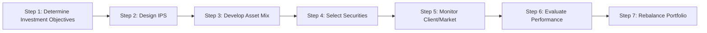

## 16.7 Step 6: Evaluate Portfolio Performance

Evaluating portfolio performance is a critical step in the portfolio management process. By assessing returns and comparing them with relevant benchmarks and objectives, portfolio managers gauge the effectiveness of their strategies and identify areas for improvement. This section offers an in-depth look at performance evaluation techniques within the Canadian context, incorporating global best practices such as the Global Investment Performance Standards (GIPS).

---

### Overview of Portfolio Performance Evaluation

Every portfolio has a specific objective, whether it be long-term growth, steady income, or capital preservation. The performance evaluation process determines how well the portfolio has achieved these objectives. This step revolves around three core tasks:

1. Measuring actual returns.
2. Comparing returns to predetermined benchmarks.
3. Assessing performance consistency and identifying sources of return or underperformance.

A comprehensive performance evaluation also involves analyzing the risks taken to achieve those returns. This ensures that the portfolio manager did not rely solely on market movements or excessive risk to generate performance.

---

### The Importance of Performance Evaluation in the Portfolio Management Life Cycle

Performance evaluation serves multiple purposes, including:

• Accountability: It allows portfolio managers to demonstrate how they have met client objectives and adhered to the Investment Policy Statement (IPS).  
• Continuous Improvement: By identifying strengths (e.g., excellent security selection) and weaknesses (e.g., inappropriate market timing), managers can evolve their strategy for future periods.  
• Compliance: Under Canadian regulatory frameworks, such as those set by the Canadian Securities Administrators (CSA) and the Canadian Investment Regulatory Organization (CIRO), advisors must ensure transparency in reporting and maintain consistent methods for tracking and disclosing performance.  

The following Mermaid diagram illustrates how performance evaluation fits into the broader portfolio management process:

---

### Performance Benchmarks

Performance benchmarks are reference points against which a portfolio’s returns can be compared. They may take the form of:

1. **Market Indexes** (e.g., S&P/TSX Composite Index, S&P 500, FTSE Canada Universe Bond Index): Useful for comparing equity or bond portfolios.  
2. **Blended Benchmarks**: A combination of multiple indexes weighted according to the portfolio’s asset mix.  
3. **Absolute Return Targets**: A specific annual return goal (e.g., 6% average annual return).

Selecting the right benchmark is crucial to achieving a fair evaluation; the benchmark should match the portfolio’s risk and return characteristics.

---

### Absolute vs. Relative Performance

Portfolios are often evaluated on both absolute and relative bases:

• **Absolute Performance**: Measures how closely the portfolio meets or exceeds an absolute return target (e.g., 6% annual return). This approach focuses on whether the portfolio reached the investor’s primary objective.  

• **Relative Performance**: Compares the portfolio’s return to a market index or blended benchmark. If the S&P/TSX Composite Index returns 8% and the portfolio returns 9%, the portfolio outperformed its benchmark, highlighting potential value-added strategies.

Emphasizing both absolute and relative performance ensures that the client’s financial goals are met without ignoring prevailing market conditions.

---

### Risk-Adjusted Measures

Assessing performance is not solely about returns. It also involves understanding how much risk was taken to achieve those returns. Various risk-adjusted measures help gauge this balance:

1. **Sharpe Ratio**:  
   - Formula:  
     
       \text{Sharpe Ratio} = \frac{R_{p} - R_{f}}{\sigma_{p}}
       
     Where \\(R_{p}\\) is the portfolio return, \\(R_{f}\\) is the risk-free rate, and \\(\sigma_{p}\\) is the standard deviation of the portfolio’s returns.  
   - Interpretation: A higher Sharpe Ratio indicates a more attractive risk-adjusted performance.

2. **Treynor Ratio**:  
   - Formula:  
     
       \text{Treynor Ratio} = \frac{R_{p} - R_{f}}{\beta_{p}}
       
     Where \\(\beta_{p}\\) is the portfolio’s beta relative to the market.  
   - Interpretation: It measures the excess return per unit of market (systematic) risk. A higher ratio suggests better risk-adjusted performance, focusing on systematic risk rather than total risk.

3. **Alpha**:  
   - Definition:  
     
       \alpha = R_{p} - \left(R_{f} + \beta_{p}(R_{m} - R_{f})\right)
       
   - Interpretation: Alpha measures the portfolio’s excess return relative to what would be expected based on its systematic risk (beta). A positive alpha indicates outperformance presumably due to the manager’s skill in security selection or market timing.

4. **Information Ratio**:  
   - Formula:  
     
       \text{Information Ratio} = \frac{R_{p} - R_{b}}{\sigma_{p-b}}
       
     Where \\(R_{b}\\) is the benchmark return, and \\(\sigma_{p-b}\\) is the standard deviation of the portfolio’s active returns (i.e., difference between portfolio and benchmark returns).  
   - Interpretation: A higher ratio signifies that the manager generates more active return per unit of active risk.

---

### Performance Attribution Analysis

Performance attribution isolates the specific contributions to overall returns from different aspects of the manager’s strategy. Broadly, it divides performance into three categories:

• **Asset Allocation Decisions**: Examines how variations in asset class weightings (e.g., equities vs. bonds) contributed to performance relative to a benchmark.  
• **Security Selection**: Looks at how the choice of individual securities within an asset class influenced returns.  
• **Market Timing or Tactical Shifts**: Evaluates how effectively the manager shifted allocations in response to changing market conditions.

A detailed attribution analysis can pinpoint where a manager’s skill is adding value and where potential weaknesses exist. For example, if a Canadian equity portfolio consistently underperforms due to stock selection in the technology sector, the manager may need to review research methods or re-assess sector allocations.

---

### Global Investment Performance Standards (GIPS)

The **Global Investment Performance Standards (GIPS)**, administered by the CFA Institute, establish ethical and standardized guidelines for calculating and reporting portfolio performance. While GIPS compliance is voluntary, it is widely considered a best practice in both Canada and globally. Key benefits of GIPS compliance include:

• **Uniformity**: Ensures all performance calculations follow the same methodology, allowing for fair comparisons.  
• **Transparency**: Increases credibility of performance reports, essential for institutional clients such as pension funds and large endowments.  
• **Global Recognition**: Demonstrates commitment to high ethical standards and international best practices.

Many Canadian investment managers—particularly those working with institutional assets—choose to adhere to GIPS standards to remain competitive on an international scale.

---

### Best Practices and Common Pitfalls

Below are actionable insights to ensure robust performance evaluation:

**Best Practices**  
1. **Use Relevant Benchmarks**: Tailor the benchmark to the portfolio’s asset classes, risk tolerance, and strategy.  
2. **Monitor Rolling Periods**: Evaluate performance over various time horizons (e.g., 1-year, 3-year, and 5-year rolling returns).  
3. **Focus on Risk-Adjusted Metrics**: Use multiple yardsticks (Sharpe Ratio, Treynor Ratio, alpha) to capture both returns and level of risk.  
4. **Follow GIPS**: Employ standardized methods and disclosures for interoperability and transparency.  
5. **Periodic Reviews**: Schedule regular performance reviews—semi-annual or annual—to keep clients informed and strategies up to date.

**Common Pitfalls**  
1. **Inappropriate Benchmarks**: Using a benchmark that differs significantly in asset mix or risk profile can lead to misleading conclusions.  
2. **Ignoring Risk Factors**: Focusing solely on returns can mask the impact of excess volatility or leverage.  
3. **Over-Reliance on Short-Term Data**: Performance can fluctuate over shorter time frames, obscuring the portfolio’s long-term track record.  
4. **Incomplete Attribution Analysis**: Failing to categorize sources of returns can hide skill deficits in security selection or timing.

---

### Real-World Examples and Use Cases

To illustrate these concepts, consider two Canadian-focused case studies:

1. **Institutional Investor Example**  
   - A large Canadian pension fund such as the Canada Pension Plan Investment Board (CPPIB) might set an absolute return target of 6% per year (above inflation), while also comparing performance to a blended benchmark composed of 50% Canadian equities (S&P/TSX Composite Index) and 50% Canadian bonds (FTSE Canada Universe Bond Index).  
   - By calculating the Sharpe Ratio and Treynor Ratio, the fund can determine whether it took on excessive systematic risk.  
   - A positive alpha figure indicates that the fund’s active strategies in private equity and infrastructure contributed beyond market returns.

2. **Retail Investor Example**  
   - A client with RBC Direct Investing or TD Direct Investing might run a self-directed growth-oriented portfolio aiming for an 8% annual return.  
   - By feeding their portfolio data into free tools like Yahoo! Finance or subscription-based platforms like Morningstar Direct, they can track performance against the S&P/TSX Composite.  
   - Attribution analysis might reveal that overweighting energy stocks during a commodity upswing contributed significantly to performance, while underweighting the financial sector reduced returns during a banking rally.

---

### Applying Performance Evaluation in Practice

Below is a simple step-by-step outline for evaluating portfolio performance:

1. **Aggregate Portfolio Data**  
   Collect reliable, daily or monthly performance data from a portfolio analysis system (e.g., Bloomberg PORT, Morningstar Direct).

2. **Calculate Returns**  
   Determine the time-weighted or money-weighted returns (commonly referred to as the IRR) over the relevant period.

3. **Compare to Benchmarks**  
   Identify appropriate indexes or blended benchmarks. Compare the portfolio’s cumulative and average annual returns.

4. **Assess Risk-Adjusted Performance**  
   Calculate the Sharpe Ratio, Treynor Ratio, alpha, and other relevant statistics.

5. **Conduct Attribution Analysis**  
   Decompose performance into asset allocation, security selection, and timing components.

6. **Refine Strategy**  
   Identify strengths in allocation or selection and address weaknesses. Initiate discussions with clients to manage expectations and align on future objectives.

7. **Maintain Compliance and Transparent Reporting**  
   Adhere to regulatory requirements set by CIRO and other Canadian bodies, and consider GIPS for standardized reporting.

---

### Key Takeaways

• Thorough performance evaluation combines absolute and relative returns, risk metrics, and attribution analysis.  
• **Risk-Adjusted Measurements** are crucial for understanding the balance between risk and reward.  
• **Attribution Analysis** helps isolate the specific contributions from allocation, selection, and timing decisions.  
• Adhering to **GIPS** fosters transparent and consistent performance reporting in Canada and internationally.  
• Regular reviews and best practices mitigate errors stemming from incorrect benchmark selection, short-term volatility, or insufficient disclosure.

By integrating these methods, Canadian investors and portfolio managers can more accurately assess whether a portfolio meets its objectives and delivers value commensurate with its level of risk.

---

## Portfolio Performance Evaluation Quiz



### Which statement best describes the purpose of performance evaluation?

- [ ] To highlight the brokerage commissions paid.
- [ ] To select the best mutual funds based solely on historical returns.
- [x] To measure returns against benchmarks and ascertain if risk levels are appropriate.
- [ ] To advertise the portfolio manager’s past successes on social media.

> **Explanation:** Performance evaluation aims to compare actual returns against benchmarks and understand risk levels, ensuring the portfolio aligns with the client’s objectives and risk tolerance.

### What is an example of an absolute performance goal?

- [x] A fixed annual return target of 6%.
- [ ] Outperforming the S&P/TSX Composite by 2%.
- [ ] Matching the performance of the FTSE Canada Universe Bond Index.
- [ ] Maintaining a 50/50 equity-to-bond asset mix.

> **Explanation:** An absolute performance goal provides a fixed return target independent of external market benchmarks.

### Which risk-adjusted measure focuses on total volatility?

- [x] Sharpe Ratio
- [ ] Alpha
- [ ] Treynor Ratio
- [ ] Information Ratio

> **Explanation:** The Sharpe Ratio compares excess returns over the risk-free rate to the standard deviation (total volatility) of the portfolio’s returns.

### What does a positive alpha indicate?

- [x] The portfolio outperformed what would be predicted by its beta exposure.
- [ ] The portfolio is riskier than the overall market.
- [ ] The portfolio follows a passive investing strategy.
- [ ] The portfolio’s returns match a fixed target.

> **Explanation:** A positive alpha suggests that the portfolio earned an excess return beyond what its market risk exposure (beta) would have predicted, indicating manager skill.

### Which of the following best describes performance attribution analysis?

- [x] It breaks down performance into contributions from asset allocation, security selection, and market timing.
- [ ] It sets absolute return goals.
- [x] It shows whether the manager added value beyond market movements.
- [ ] It is only applicable to large institutional portfolios.

> **Explanation:** Performance attribution analysis dissects overall returns to identify the impact of various decisions, such as asset allocation, security selection, and timing.

### Why might a portfolio manager use the Treynor Ratio in addition to the Sharpe Ratio?

- [x] To measure compensation for systematic risk separately from total volatility.
- [ ] To examine attribute-based financial ratios only.
- [ ] To comply with Canadian IPO disclosure rules.
- [ ] To measure liquidity in the bond market.

> **Explanation:** The Treynor Ratio focuses on systematic risk (beta) rather than total volatility, offering insight into how much return is generated per unit of market risk.

### What role do GIPS (Global Investment Performance Standards) play in portfolio evaluation?

- [x] They provide a consistent framework for calculating and presenting performance globally.
- [ ] They are mandatory within Canada, regardless of firm size.
- [x] They primarily relate to ethical standards in trading floors.
- [ ] They are designed exclusively for bank deposits and GICs.

> **Explanation:** GIPS is a set of standards creating a consistent, transparent approach to calculating and reporting performance, widely recognized as a global best practice.

### Which of the following is a pitfall when evaluating portfolio performance?

- [x] Using an inappropriate benchmark that differs in asset allocation and risk profile.
- [ ] Emphasizing risk-adjusted returns.
- [ ] Conducting periodic reviews.
- [ ] Using blended benchmarks for complex portfolios.

> **Explanation:** An inappropriate benchmark can lead to misleading conclusions about performance, skewing the evaluation process.

### What is the formula for the Information Ratio?

- [x] (Portfolio Return – Benchmark Return) / Standard Deviation of Active Returns
- [ ] (Portfolio Return – Risk-Free Rate) / Standard Deviation
- [ ] β / (Portfolio Return – Benchmark Return)
- [ ] (Risk-Free Rate – Benchmark Return) / Active Returns

> **Explanation:** The Information Ratio is the excess return over the benchmark, divided by the standard deviation of active (excess) returns.

### True or False: Performance evaluation should consider both short-term and long-term perspectives.

- [x] True
- [ ] False

> **Explanation:** Evaluating performance over multiple time horizons provides a more holistic and reliable view of a portfolio’s success and consistency.



## For Additional Practice and Deeper Preparation

**Elevate your exam readiness with our comprehensive app, "Securities CA: Mock Exams," designed to challenge and refine your skills.**

* **Master Challenging Questions:** Dive into expertly crafted sample exam questions that go beyond standard references.
* **Scenario-Driven Learning:** Experience scenario-driven case questions and in-depth solutions to build practical expertise.
* **Sharpen Exam Strategies:** Build confidence with step-by-step explanations designed to refine your exam-day tactics.
* **Gain Real-World Insights:** Acquire practical tips and detailed rationales that demystify complex concepts.
* **CIRO and CSI Alignment:** Stay current with CIRO guidelines and CSI’s exam structure, with questions intentionally more challenging than the actual exam.

**Download the App Today:**

> Note: While these courses are specifically crafted to align with the CSC® exams outlines, they are independently developed and not endorsed by CSI or CIRO.
