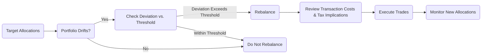

## 16.8 Step 7: Rebalance the Portfolio

Rebalancing is the essential final step in the portfolio management process, ensuring that a portfolio remains aligned with an investor’s objectives, risk tolerance, and time horizon. Over time, market fluctuations can cause asset classes to drift away from their target weights. Without periodic rebalancing, a portfolio may deviate from its intended risk/return profile, potentially compromising the investor’s long-term financial goals.

This section provides an in-depth look at why, when, and how to rebalance a Canadian investment portfolio, exploring practical strategies, tax implications, and real-world case studies from major Canadian financial institutions and robo-advisor platforms.

---

## The Importance of Rebalancing

At its core, rebalancing is about risk management:  
• Asset allocations drift when strong performers outweigh weaker ones, potentially increasing or decreasing a portfolio’s overall risk beyond an investor’s comfort level.  
• Systematically realigning asset weights back to target allocations helps maintain consistency with the original investment policy statement (IPS).  
• Without regular rebalancing, high-performing assets might dominate the portfolio, skewing both the risk and return potential.  

### Balancing Risk and Return

Consider a balanced portfolio structured at 60% equities and 40% fixed income. If equities perform exceptionally well, the allocation might shift to 70% equities and 30% fixed income. While this may improve returns in the short term, it also exposes the investor to greater market risk if equities suddenly drop.

---

## Common Triggers for Rebalancing

Rebalancing strategies vary depending on the investor’s goals, regulatory considerations, and taxation. The most frequently used triggers in the Canadian market are:

### Time-Based Rebalancing

• A set interval (e.g., quarterly, semi-annually, or annually) is used to check allocations and rebalance if necessary.  
• Advantage: Simple, predictable approach that ensures periodic evaluation.  
• Disadvantage: May rebalance at inopportune times, incurring unnecessary costs.

### Threshold-Based Rebalancing

• A “rebalancing threshold” is defined (e.g., ±5% deviation from the target allocation).  
• Example: If a 60/40 portfolio’s equity component exceeds 65% or falls below 55%, a rebalance is triggered.  
• Advantage: Targets significant deviations, limiting trade frequency.  
• Disadvantage: Large market swings can trigger frequent trades, potentially increasing costs.

### Hybrid Approach

• A combination of time-based and threshold-based triggers.  
• Example: Check the portfolio quarterly, but only rebalance if allocations deviate by 5% or more.  
• Advantage: Offers a balanced approach, reducing the likelihood of missing significant market moves while avoiding excessive trading.

---

## Transaction Costs, Tax Implications, and Regulatory Considerations

Rebalancing always comes with potential costs—both in trading fees and tax consequences. In Canada, these aspects include:

### Transaction Costs

• Brokerage fees: Vary across Canadian brokerages such as RBC Direct Investing, TD Direct Investing, Questrade, etc.  
• Bid-ask spreads: Especially relevant for thinly traded securities.  
• Short-term redemption fees: Common for some mutual funds if sold before a specified holding period.  

### Tax Consequences

• Capital gains (or losses) may be realized in non-registered accounts once securities are sold.  
• For registered accounts (RRSPs, TFSAs), capital gains are either tax-deferred (RRSP) or tax-free (TFSA).  
• Refer to the Income Tax Act (Canada) for the rules on capital gains and losses, as well as the CRA website for the latest regulations.  
• Strategies such as tax-loss harvesting and strategic use of dividend income can soften tax liabilities.  

### CIRO and CSA Guidelines

• Although there are no explicit regulatory mandates on how frequently to rebalance, the Canadian Investment Regulatory Organization (CIRO) and Canadian Securities Administrators (CSA) emphasize suitability and the “Know Your Client” (KYC) rule.  
• Ensuring that a client’s portfolio remains consistent with their risk profile is a regulatory requirement. Rebalancing is one mechanism that helps maintain this consistency.

---

## Methods and Approaches to Rebalancing

Below is an overview of the practical approaches Canadian investors and advisors might employ.

### Manual Rebalancing

1. Identify target allocations set in the Investment Policy Statement (IPS).  
2. Calculate current portfolio weights periodically (or as triggered by thresholds).  
3. Determine which assets to sell and which to buy to restore the original allocation.  
4. Execute trades carefully, factoring in transaction costs and tax implications.  

### Automated (Robo-Advisor) Rebalancing

Robo-advisor platforms in Canada, such as Wealthsimple, Questrade Portfolios, and others, often provide automated rebalancing:  
• Continuous monitoring of allocations, automatically triggering trades once allocations deviate from set thresholds.  
• Incorporate tax-loss harvesting strategies.  
• Accessible for investors with smaller portfolios or limited time.  

### Dynamic Rebalancing Models

Advanced asset management firms, including large Canadian pension funds, may use dynamic models to anticipate market changes:  
• Shorter intervals for volatile markets; longer intervals for stable conditions.  
• Quantitative algorithms to forecast potential risk/return trade-offs and optimize rebalancing decisions.

---

## Real-World Example: RBC Investment Portfolios

To illustrate the importance of rebalancing in a Canadian setting, consider a simplified scenario:

1. An investor opens a non-registered RBC Direct Investing account with a $100,000 balanced portfolio:  
   • 60% equities (Canadian, U.S., international)  
   • 40% fixed income (GICs, Government of Canada bonds)    

2. After 12 months of strong equity performance, the breakdown is now:  
   • 68% equities  
   • 32% fixed income  

3. The investor’s Investment Policy Statement states a rebalancing threshold of ±5%. By surpassing 65% in equities, the portfolio triggers a rebalance.  

4. Upon selling the excess equities and buying fixed-income assets:  
   • Short-term gains are realized on certain equities, triggering capital gains tax.  
   • The investor uses some capital losses from previous years, carried forward under the Income Tax Act (Canada), to offset a portion of these gains.  

5. After rebalancing, the new portfolio returns to the 60/40 target, aligning with the designated risk tolerance.  

---

## Practical Considerations for Canadian Investors

### Timing and Frequency

• Time-based rebalancing can fit neatly with an end-of-year tax planning session, optimizing capital loss harvests.  
• Threshold-based rebalancing in Canada can be beneficial when large market swings occur, as it can capture abrupt shifts and rebalance at potentially advantageous points.  

### Portfolio-Wide vs. Account-Specific

• Rebalancing is often done at the total portfolio level across all accounts (TFSA, RRSP, non-registered) to optimize tax efficiency.  
• For example, you might sell an asset in an RRSP (no capital gains taxes triggered) rather than in a non-registered account (where it would generate a taxable event).  

### Tax-Efficient Rebalancing

• In non-registered accounts, consider offsetting gains with realized losses or focusing on partial rebalancing (i.e., redirecting new contributions to underweight assets) to minimize taxable transactions.  
• Consult resources such as “Tax-Efficient Investing in Canada” (various articles, books, and CRA bulletins) for more robust strategies.

---

## Step-by-Step Rebalancing Process Flowchart

Below is a simple flowchart illustrating the rebalancing decision:

1. Check if the portfolio deviates from prescribed allocations.  
2. Compare the deviation to rebalancing thresholds.  
3. Assess transaction costs and tax implications to confirm the benefit of realignment.  
4. Execute any required buys or sells to restore target allocations.  
5. Monitor the updated portfolio.

---

## Overcoming Common Pitfalls

Investors often face the following challenges when rebalancing:

1. Procrastination: Delaying rebalancing can lead to excessive drift, increasing risk.  
2. Emotional Decisions: Market “highs” or “lows” may tempt investors to maintain overweight positions. A systematic approach helps remove emotional bias.  
3. Underestimating Costs: Frequent rebalances can erode returns through trading fees and taxes.  
4. Neglecting Tax-Efficient Account Placement: Selling appreciated securities in a non-registered account can trigger capital gains taxes that could be deferred within an RRSP.  

---

## Best Practices for Canadian Portfolio Rebalancing

1. Document a clear rebalancing policy in the Investment Policy Statement (IPS).  
2. Combine threshold- and time-based triggers for a balanced and disciplined approach.  
3. Leverage any available capital losses to offset gains, where permissible by the Income Tax Act (Canada).  
4. Rebalance within tax-sheltered accounts (RRSP, TFSA) whenever possible, especially for large or frequent adjustments.  
5. Consider partial rebalancing by using new cash inflows to buy underweight assets, minimizing transaction and tax costs.  

---

## Summary

Rebalancing is more than a mechanical exercise; it is a fundamental component of disciplined portfolio management. In the Canadian context, careful consideration of tax regulations, account structures (registered vs. non-registered), and market conditions ensures that rebalancing strategies remain cost-effective and aligned with an investor’s objectives. By systematically applying either time-based, threshold-based, or hybrid tactics, investors can preserve the integrity of their portfolio’s risk/return profile.

By following this seven-step portfolio management process—culminating in the final step of diligent rebalancing—advisors and investors can maintain continuous alignment with both client expectations and Canadian regulatory standards. The result is a portfolio that marries risk management with the opportunity for long-term investment success.

---

## Test Your Knowledge: Portfolio Rebalancing in Canada



### Which of the following is a primary purpose of rebalancing a portfolio?

- [ ] Maximizing capital gains in the short term
- [x] Realigning asset allocations to maintain desired risk levels
- [ ] Eliminating all trading fees
- [ ] Avoiding all forms of taxation

> **Explanation:** Rebalancing focuses on keeping a portfolio in line with its target asset allocations to maintain consistency with the investor’s original risk/return profile.

### Which rebalancing trigger is based on evaluating the portfolio’s allocation at regular intervals?

- [ ] Threshold-based
- [ ] Hybrid approach
- [x] Time-based
- [ ] Market-driven

> **Explanation:** Time-based rebalancing occurs at specific intervals (e.g., annually), regardless of market conditions.

### Which of the following best describes a threshold-based rebalancing strategy?

- [x] Rebalance only when an asset class drifts beyond a specific percentage
- [ ] Rebalance every quarter automatically
- [ ] Use a combination of time-based and threshold triggers
- [ ] Only rebalance during market downturns

> **Explanation:** Threshold-based rebalancing triggers action when allocations deviate by a predefined percentage from the target, such as ±5%.

### Which type of account in Canada offers tax-free growth on investments?

- [ ] RRSP
- [ ] Non-registered account
- [x] TFSA
- [ ] RESP

> **Explanation:** A Tax-Free Savings Account (TFSA) allows for tax-free investment growth, whereas an RRSP defers taxes until withdrawal.

### In a hybrid rebalancing approach, which two methods are combined?

- [x] Time-based and threshold-based
- [ ] Threshold-based and market timing
- [ ] Time-based and strategic allocations only
- [ ] Value-based and growth-based

> **Explanation:** A hybrid approach combines a regular schedule check with threshold triggers, bringing balance to rebalancing actions.

### Which of the following statements about transaction costs in rebalancing is TRUE?

- [x] They can include brokerage fees, bid-ask spreads, and potential redemption fees.
- [ ] They only apply when investing in government bonds.
- [ ] They are always zero for CIA or CMA accounts.
- [ ] They are not relevant for non-registered accounts.

> **Explanation:** Transaction costs can arise in various ways, including brokerage fees, bid-ask spreads, and short-term redemption fees, regardless of account type.

### How can capital gains taxes be mitigated during the rebalancing process in non-registered accounts?

- [ ] Avoid investing in higher-risk assets.
- [x] Use capital losses to offset realized gains.
- [ ] Only invest in GICs.
- [ ] Delay rebalancing indefinitely.

> **Explanation:** Offsetting gains with capital losses is a key strategy outlined in the Income Tax Act (Canada) for reducing net taxable income from rebalancing transactions.

### What does the “Know Your Client” (KYC) rule imply for rebalancing portfolios in Canada?

- [ ] Financial advisors must ignore the client’s risk tolerance.
- [ ] It is only applicable to large institutional investors.
- [ ] It aligns with the threshold-based approach exclusively.
- [x] Advisors must ensure portfolios match each client’s financial profile and objectives.

> **Explanation:** The KYC rule mandates that a client’s portfolio remains suitable for their risk tolerance and objectives, which rebalancing helps achieve.

### An example of implementing a time-based approach could be:

- [x] Reviewing and adjusting the portfolio every six months.
- [ ] Selling all equity positions on a random date.
- [ ] Only rebalancing when the media announces a recession.
- [ ] Combining both threshold and time-based triggers.

> **Explanation:** Time-based rebalancing occurs at predetermined intervals (e.g., semi-annually).

### Rebalancing can incur transaction fees and taxes, thereby:

- [x] Requiring cost-benefit analysis
- [ ] Eliminating all risk from the portfolio
- [ ] Ensuring higher returns than a buy-and-hold strategy
- [ ] Violating Canadian regulations

> **Explanation:** Frequent rebalancing can be costly, so investors and advisors must weigh the benefits of rebalancing against the associated fees and taxes.



---

