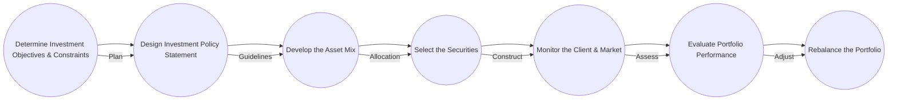

## Chapter 16: The Portfolio Management Process

The portfolio management process involves a series of carefully orchestrated steps designed to build, monitor, and evaluate an investment portfolio that meets the specific objectives and constraints of the investor. This chapter provides a comprehensive view of how professionals—such as portfolio managers, advisors, and investment analysts—navigate each phase in the Canadian market context. We will outline each step in detail, explore relevant regulations, and incorporate practical examples from Canadian financial institutions like RBC and TD. The ultimate goal is to equip you with the knowledge and tools required to design and manage investment portfolios effectively.

----------------

## Overview of the Seven-Step Process

A strong portfolio management process aligns the unique circumstances of the investor with the dynamic nature of financial markets. Below is a high-level model illustrating the seven key steps:

These steps ensure a disciplined approach, enabling the portfolio manager or advisor to deliver consistent and transparent results. 

----------------

## 1. Determine Investment Objectives and Constraints

### Understanding the Client’s Profile

The starting point in portfolio management is understanding your client’s unique financial situation. Typical considerations include:

• Investment horizon (e.g., short term vs. retirement planning for a 25-year horizon).  
• Liquidity needs (e.g., budgeting for a home purchase or education expenses).  
• Risk tolerance (e.g., conservative, moderate, or aggressive).  
• Return objectives (e.g., income generation, capital preservation, growth).  
• Any regulatory constraints (e.g., for institutional clients like pension funds that must adhere to the federal Pension Benefits Standards Act).

### Case Study: A Canadian Retirement Portfolio
Suppose a 40-year-old professional invests in an RRSP (Registered Retirement Savings Plan) and a TFSA (Tax-Free Savings Account) to capitalize on tax benefits in Canada. Their objective is steady, long-term growth with moderate risk tolerance. Key constraints might involve limiting exposure to high-volatility assets and ensuring sufficient liquidity in the TFSA for emergency needs.

----------------

## 2. Design the Investment Policy Statement (IPS)

The Investment Policy Statement (IPS) outlines guidelines for how a portfolio will be managed. It captures:

• Purpose and scope of the portfolio.  
• Target return relative to benchmarks.  
• Strategic asset allocation ranges.  
• Acceptable risk levels.  
• Constraints and unique mandates (e.g., socially responsible investment initiatives).  
• Permitted investment vehicles (e.g., mutual funds, exchange-traded funds, direct equities).  

### Regulatory Considerations in Canada
• CIRO (Canadian Investment Regulatory Organization) sets forth suitability requirements, ensuring that the chosen investments align with a client’s objectives and risk tolerance.  
• Client documentation regulations mandate that an IPS captures all relevant Know-Your-Client (KYC) information to demonstrate compliance and investor protection.  

----------------

## 3. Develop the Asset Mix

With the IPS in place, the next step is to decide how to allocate assets among different categories, such as:

• Equities (common shares, preferred shares).  
• Fixed income (Government of Canada bonds, provincial bonds, corporate bonds, GICs).  
• Cash equivalents (money market instruments).  
• Alternative investments (real estate investment trusts [REITs], hedge funds, alternative mutual funds).  

### Strategic vs. Tactical Asset Allocation
• Strategic Asset Allocation: Sets long-term targets based on the client’s return goals and risk tolerance. For example, a conservative investor might hold 60% in bonds and 40% in equities.  
• Tactical Asset Allocation: Involves short-term adjustments to the target mix to capitalize on market opportunities. For instance, if the portfolio manager anticipates an interest rate hike by the Bank of Canada, they might reduce long-duration bonds temporarily.

----------------

## 4. Select the Securities

### Security Selection Process
Once the broad asset mix is determined, the manager or advisor must choose specific securities within each asset class. This phase involves:

• Fundamental analysis (company financial statements, earnings forecasts, valuation models).  
• Technical analysis (price trends, market momentum, technical indicators).  
• Qualitative factors (management quality, competitive landscape, macroeconomic conditions).  

### Canadian Equity Example
A portfolio manager might choose RBC (Royal Bank of Canada) and Shopify as core Canadian equities. The decision could be based on RBC’s stable earnings history and dividend yield, while Shopify’s growth potential offers an opportunity for capital appreciation.  

### Fixed-Income Selection Example
Selecting a laddered bond portfolio of Government of Canada bonds or provincial issues from Ontario and Quebec might minimize interest rate risk while providing predictable coupon payments.  

----------------

## 5. Monitor the Client, the Market, and the Economy

### Ongoing Monitoring
After constructing the portfolio, continuous monitoring is crucial to ensure alignment with objectives. Monitoring parameters typically include:

• Client-specific events: life changes, liquidity needs, or increased risk tolerance.  
• Macroeconomic indicators: GDP growth, inflation, unemployment rates, interest rates.  
• Market conditions: equity market volatility, yield curve changes, foreign exchange movements.  

### Tools and Techniques
• Software platforms like Bloomberg, Refinitiv, or open-source libraries (e.g., Python’s pandas, R’s quantmod) can track performance in real-time.  
• Material changes in the Bank of Canada’s monetary policy stance or government fiscal measures necessitate periodic portfolio reviews.  

----------------

## 6. Evaluate Portfolio Performance

### Setting Benchmarks
Performance evaluation is often done by comparing returns to relevant benchmarks, such as the S&P/TSX Composite Index for Canadian equities or the FTSE Canada Universe Bond Index for Canadian fixed income.

• Absolute performance: Evaluating the portfolio’s raw returns over a given period.  
• Relative performance: Comparing portfolio returns against a benchmark or peer group.  
• Risk-adjusted metrics: Key metrics such as the Sharpe ratio, Jensen’s alpha, and the Treynor ratio.  

#### Example Calculation: Sharpe Ratio

If a portfolio yields 7% when the risk-free rate (e.g., yield on a Government of Canada Treasury bill) is 2%, and the standard deviation of returns is 10%, then:


\text{Sharpe Ratio} = \frac{7\% - 2\%}{10\%} = 0.5


A higher ratio (relative to peers or the market) indicates better risk-adjusted performance.

----------------

## 7. Rebalance the Portfolio

### Purpose of Rebalancing
Rebalancing realigns the portfolio with its target asset allocation. Over time, market fluctuations can cause drift, potentially increasing the portfolio’s overall risk or deviating from the original investment strategy.

• Time-based approach: Rebalance at set intervals (e.g., quarterly, semi-annually).  
• Threshold-based approach: Rebalance when an asset class deviates from its target by more than a set percentage.  

### Example: Canadian Equity Surge
If Canadian equities perform particularly well over a quarter and exceed the target allocation by 5%, the advisor may sell a portion of the equities to lock in gains and redistribute the profits into underweight sectors (e.g., fixed income or cash equivalents).

----------------

## Practical Examples and Case Studies

### Case Study: Canadian Pension Fund
A Canadian pension fund with a long-term liability structure might adopt a liability-driven investment (LDI) approach. Its portfolio might hold a high proportion of long-duration provincial bonds (e.g., Ontario bonds) to match future pension liabilities. When the Bank of Canada adjusts interest rates, the fund manager may rebalance the fixed-income segment to maintain duration matching.

### Example: Balanced Individual Portfolio
Consider a Toronto-based family accumulating savings in RRSP, TFSA, and non-registered accounts. A typical balanced approach could be:

• 50% Equities (both Canadian and international)  
• 40% Fixed Income (Canadian government and corporate bonds)  
• 10% Cash Equivalents (to meet short-term liquidity needs)

Through annual reviews, the family might shift compositional weights to accommodate changes in personal circumstances (e.g., children’s education costs).

----------------

## Best Practices, Pitfalls, and Regulatory Compliance

### Best Practices
1. Maintain clear communication with the client, regularly updating the IPS to reflect life events.  
2. Use discipline in rebalancing; avoid emotional decisions driven by market hype.  
3. Employ risk-adjusted metrics, not just absolute returns.  
4. Keep an eye on macroeconomic trends (e.g., inflation, interest rate changes) that can impact portfolio performance.

### Common Pitfalls
1. Ignoring changing client circumstances, such as new liquidity requirements or risk tolerance shifts.  
2. Failing to rebalance, resulting in unintentional overexposure to certain asset classes.  
3. Over-concentration in a single security or sector—particularly common in employer stock plans.  
4. Underestimating the effect of fees, including management fees, trading commissions, or embedded costs in mutual funds or ETFs.

### Regulatory Considerations
• Adhering to CIRO suitability obligations.  
• Observing the guidelines of CSA (Canadian Securities Administrators) regarding continuous disclosure for publicly listed securities.  
• Complying with insider trading regulations and ensuring ethical standards are upheld in security selection.  

----------------

## Summary and Practical Application

The Portfolio Management Process is a continuous cycle. It begins with a clear understanding of the client’s objectives and constraints and ends with an ongoing routine of evaluation and rebalancing. By following these systematic steps—grounded in an Investment Policy Statement and aligned with Canadian regulatory requirements—investors and advisors can better manage risks, enhance returns, and foster long-term financial success.

As you move forward:

• Apply these steps to hypothetical or real-life portfolios (e.g., an RRSP, RESP, or a corporate pension plan).  
• Explore diverse asset classes while respecting each investor’s unique constraints.  
• Leverage performance metrics and rebalance strategies to keep the portfolio aligned with evolving goals.  

Embrace a disciplined approach, remain mindful of Canadian regulations, and refine your decision-making skills with practical experience and structured analysis.

----------------

## Test Your Knowledge: The Portfolio Management Process Quiz



### Which of the following best describes the primary purpose of the Investment Policy Statement (IPS)?

- [x] To establish clear guidelines and constraints for portfolio management  
- [ ] To provide daily trading instructions to the portfolio manager  
- [ ] To regulate the fee structure of the investment manager  
- [ ] To determine the minimum number of securities to be held at any time  

> **Explanation:** The IPS details the investor’s objectives, constraints, and the guidelines under which the portfolio will be managed. It does not provide daily trading instructions nor does it govern fees.

### When constructing an asset allocation for a Canadian investor, which of the following should be considered the most long-term strategy component?

- [x] Strategic Asset Allocation  
- [ ] Tactical Asset Allocation  
- [ ] Portfolio Rebalancing  
- [ ] Performance Benchmarking  

> **Explanation:** Strategic Asset Allocation sets the long-term, target allocation for each asset class based on risk tolerance and objectives. Tactical Asset Allocation involves short-term adjustments made in response to market conditions.

### In monitoring a portfolio, which of the following factors would likely prompt a discussion about potential investment strategy changes?

- [x] A significant change in the client’s personal objectives  
- [ ] Stable inflation forecasts for the next quarter  
- [ ] Minor fluctuations in weekly stock prices  
- [ ] A standard deviation within historical norms  

> **Explanation:** A big shift in a client’s personal situation or objectives—such as a job loss, inheritance, or retirement—usually prompts a reassessment of the portfolio strategy. Minor fluctuations or stable conditions are usually not triggers.

### Which of the following metrics is most commonly used to assess risk-adjusted returns?

- [x] Sharpe Ratio  
- [ ] Price-to-Earnings (P/E) Ratio  
- [ ] Dividend Yield  
- [ ] Spread Duration  

> **Explanation:** The Sharpe ratio measures the excess return per unit of risk (volatility). P/E ratio and dividend yield are typically used for stock valuation, while spread duration is a fixed-income measure.

### In the context of rebalancing, a threshold-based approach typically involves:

- [x] Rebalancing only when asset class weights move beyond a specific percentage from the target  
- [ ] Rebalancing automatically every month regardless of market conditions  
- [x] Triggering trades when gains or losses exceed predefined or “tolerance” bands  
- [ ] Completely liquidating positions when performance declines  

> **Explanation:** In threshold-based rebalancing, the manager adjusts holdings only when allocations deviate significantly (beyond the threshold) from target weights. It involves waiting for significant asset drift before triggering trades.

### Which regulatory authority in Canada oversees suitability requirements for client investments?

- [x] The Canadian Investment Regulatory Organization (CIRO)  
- [ ] The Bank of Canada  
- [ ] The Office of the Superintendent of Financial Institutions (OSFI)  
- [ ] The Canada Revenue Agency (CRA)  

> **Explanation:** CIRO is responsible for overseeing investment advisors and ensuring that products match the investor’s risk profile and objectives. OSFI, in contrast, supervises certain financial institutions’ solvency, and CRA handles taxation.

### Select the two main categories of asset allocation that portfolio managers typically deploy:

- [x] Strategic Asset Allocation  
- [ ] Absolute Asset Allocation  
- [x] Tactical Asset Allocation  
- [ ] Random Asset Allocation  

> **Explanation:** The two prevalent categories are strategic (long-term) and tactical (short-term) asset allocation. Absolute and random asset allocation are not standard approaches in portfolio management.

### Which of the following is a key reason to evaluate a portfolio’s performance against a benchmark?

- [x] To determine whether the portfolio is meeting or exceeding expected returns and risk criteria  
- [ ] To guarantee the portfolio’s returns in all market conditions  
- [ ] To avoid any volatility in the portfolio’s holdings  
- [ ] To prevent any capital losses in the portfolio  

> **Explanation:** Comparing performance against a benchmark helps measure how effectively the portfolio meets its goals relative to the market or peers. It doesn’t guarantee returns or eliminate volatility/capital losses.

### What is one advantage of using a laddered bond approach in a fixed-income component of a Canadian portfolio?

- [x] It helps mitigate the impact of interest rate changes by spreading out maturity dates  
- [ ] It guarantees higher returns than equities  
- [ ] It eliminates the possibility of default risk  
- [ ] It offers higher liquidity than money-market funds  

> **Explanation:** A laddered bond strategy involves holding bonds that mature at different intervals, helping smooth out interest rate risks. It does not guarantee higher returns or eliminate default risk, and it may not always offer the same liquidity as money-market funds.

### The portfolio management process is best described as:

- [x] True  
- [ ] False  

> **Explanation:** It is a continuous cycle involving regular monitoring, evaluation, and rebalancing. Once you complete the final step, you loop back to the beginning if client circumstances or market conditions change significantly.



----------------

## For Additional Practice and Deeper Preparation

**[CSC® Vol.1 Mastery: Hardest Mock Exams & Solutions](https://www.udemy.com/course/canadian-securities-course-csc-exam-1-mastery/?referralCode=B1E33D9866B617FFB006)**  
• Dive into 6 full-length mock exams—1,500 questions in total—expertly matching the scope of CSC Exam 1.  
• Experience scenario-driven case questions and in-depth solutions, surpassing standard references.  
• Build confidence with step-by-step explanations designed to sharpen exam-day strategies.

**[CSC® Vol.2 Mastery: Hardest Mock Exams & Solutions](https://www.udemy.com/course/canadian-securities-course-csc-exam-2-mastery/?referralCode=63F2785877A0407790D7)**  
• Tackle 1,500 advanced questions spread across 6 rigorous mock exams (250 questions each).  
• Gain real-world insight with practical tips and detailed rationales that clarify tricky concepts.  
• Stay aligned with CIRO guidelines and CSI’s exam structure—this is a resource intentionally more challenging than the real exam to bolster your preparedness.

> Note: While these courses are specifically crafted to align with the CSC® exams outlines, they are independently developed and not endorsed by CSI or CIRO.
