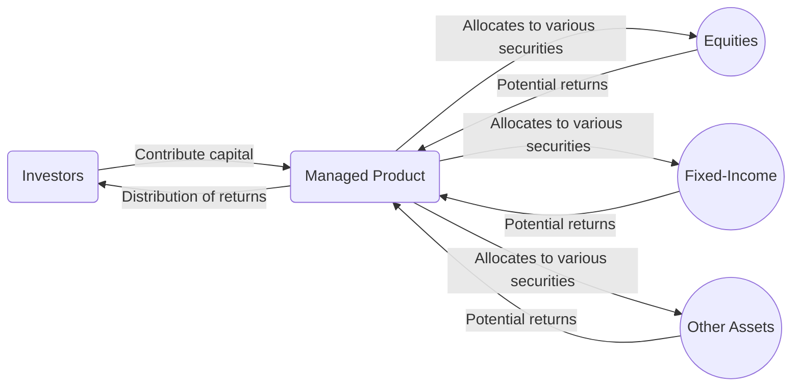

## 17.1 Overview of Managed Products

Managed products are investment vehicles designed to pool money from multiple investors—often called unitholders or shareholders—and invest these funds according to specific objectives outlined by professional portfolio managers. This approach allows individual investors to benefit from expertise, diversify their holdings, and leverage the economies of scale that come with larger pools of capital. In Canada, popular managed products include mutual funds, exchange-traded funds (ETFs), segregated funds, hedge funds, and other specialized vehicles.

In this section, we explore the core definitions, benefits, and drawbacks of managed products. We also examine their regulatory environment in Canada, discuss practical examples, and highlight key considerations for both investors and advisors.

---

## Defining Managed Products

### Key Characteristics

1. **Pooled Funds:** Managed products aggregate capital from many investors into a single pool. This capital is then invested in various asset classes (e.g., equities, fixed-income instruments, derivatives) based on the product’s stated mandate.  
2. **Professional Management:** Expert portfolio managers research and select securities as well as decide on asset allocations. By doing so, they strive to meet the product’s objectives—such as income generation, capital appreciation, or capital preservation.  
3. **Regulated Environment:** Given their importance in the financial market, managed products face specific legal and regulatory requirements in Canada (e.g., National Instrument 81-101, National Instrument 81-102).  
4. **Diverse Strategies:** Some managed products follow passive approaches (e.g., index-based strategies in ETFs), while others employ active management (e.g., many mutual funds and certain hedge funds).

### Common Types of Managed Products

• **Mutual Funds:** Often marketed to retail investors, mutual funds are subject to strict regulations under National Instrument (NI) 81-101 (Mutual Fund Prospectus Disclosure) and NI 81-102 (Investment Funds).  
• **Exchange-Traded Funds (ETFs):** ETFs trade on stock exchanges and generally track an index or follow a specific investment theme.  
• **Segregated Funds:** Offered by insurance companies, these funds provide unique insurance benefits, such as death and maturity guarantees.  
• **Hedge Funds:** Typically for accredited investors or high-net-worth individuals, hedge funds often employ sophisticated or higher-risk strategies, including leverage, short selling, or derivatives.

---

## Key Benefits of Managed Products

### Professional Management

One of the primary values of managed products is access to seasoned portfolio managers. These professionals bring specialized knowledge, rigorous research, and ongoing market monitoring to the investment process. For instance, a team at a major Canadian institution like RBC Global Asset Management might use advanced sector analysis, macroeconomic projections, and company-specific research to select securities for their funds.

### Diversification

Managed products pool assets from multiple investors, enabling even those with relatively small amounts of capital to achieve diversification across industries, asset classes, and geographies. By spreading risk across a variety of holdings, investors can help mitigate the impact of a significant decline in any single holding.

### Economies of Scale

When a manager executes trades on behalf of a large pool of investors, the overall transaction costs per dollar invested can be reduced. This cost-efficiency potentially enhances returns for investors. In addition, larger funds often have access to investments or markets that might be otherwise unattainable for individual investors.

### Convenience

Managed products, such as mutual funds, require less operational and administrative work from investors. Record-keeping, valuation, and regulatory filings are handled by fund sponsors and managers. Managed products also simplify the reinvestment of dividends or interest, saving investors time and effort.

---

## Potential Drawbacks of Managed Products

### Management Fees and Expenses

Professional management comes at a cost, typically reflected in a Management Expense Ratio (MER). These fees can include administrative costs, advisory fees, and marketing expenses. For example, a mutual fund might charge an MER of 2%, which directly impacts net returns.

### Underperformance Relative to Benchmarks

While the goal of active management is to exceed benchmark returns, some managed products underperform their respective indices, particularly after fees. Investors must weigh the likelihood of adding value through active management against the costs incurred.

### Liquidity Considerations

Not all managed products offer daily liquidity. For instance, hedge funds often have lock-up periods where redemptions are either unavailable or subject to penalties. Mutual funds and ETFs, on the other hand, typically provide daily redemption or intraday trading (in the case of ETFs).

### Suitability and Risk

Investors may mistakenly select a fund that is not aligned with their financial objectives, risk tolerance, or investment horizon. Segregated funds, for instance, may have insurance benefits and higher fees, making them more appealing for specific needs but less suitable for others.

---

## Regulatory Framework in Canada

Regulation of managed products is overseen by:

• **Canadian Securities Administrators (CSA):** Provincial and territorial securities commissions across the country collaborate under the CSA umbrella. The CSA’s primary goal is investor protection, market efficiency, and reduction of systemic risks.  
• **Canadian Investment Regulatory Organization (CIRO):** CIRO (formerly IIROC and the MFDA integrated) ensures that investment dealers and mutual fund dealers follow regulatory standards.  
• **National Instruments:**  
  - **NI 81-101 (Mutual Fund Prospectus Disclosure)**: Outlines the required format and content of prospectuses.  
  - **NI 81-102 (Investment Funds)**: Governs the operations of mutual funds and certain other investment vehicles to protect investors.  

When reviewing a prospectus, it is important to note the investment objectives, fees, risks, and past performance. Investors should also verify that advisors or dealers are duly licensed and regulated by CIRO.

---

## Considerations When Evaluating Managed Products

### Investment Objectives and Strategy

Ask questions such as: “Is the fund’s objective aligned with my own goals of growth, income, or capital preservation?” Consider whether the fund’s investment style (e.g., growth vs. value) suits your preferences.

### Risk Tolerance and Time Horizon

Review the fund’s historical volatility and maximum drawdowns. Typically, a younger investor with a long time horizon might be comfortable with a higher risk fund than a retiree focused on capital preservation.

### Fees and Expenses

Compare Management Expense Ratios, transaction fees, and loads (if applicable) across different products. A difference of even 0.5% in annual fees can have a material impact on investment returns over the long term.

### Track Record and Management Team

Examine the fund’s performance against a relevant benchmark over multiple timeframes (1-year, 3-year, 5-year, etc.). Also gather information about the manager’s tenure, experience, and consistent style.

### Transparency and Reporting

Mutual funds and ETFs are typically required to publish frequent updates and financial statements, while some alternative products (e.g., certain hedge funds) may provide more limited information.

---

## Example: RBC Balanced Fund Case Study

To illustrate how a managed product might operate:

1. **Fund Overview:** RBC Balanced Fund invests in a mix of equities and fixed-income securities to achieve moderate growth and income.  
2. **Asset Allocation:** The managers typically allocate around 40%–60% of the assets to equities and the remainder to fixed-income instruments.  
3. **Fee Structure:** The fund charges a management fee plus other operational expenses, which together make up the MER.  
4. **Historical Performance:** Over time, it might be compared to a blended benchmark (e.g., 50% equity index + 50% bond index) to gauge outperformance or underperformance.  
5. **Investor Suitability:** This type of balanced product could be suitable for investors seeking moderate capital growth with reduced volatility compared to an all-equity portfolio.

---

## Visualizing the Structure of a Managed Product

Below is a simple Mermaid diagram illustrating how investors pool their resources into a managed product, which then invests these funds in different asset classes. The fund’s returns (or losses) are proportionally distributed among investors according to the number of units or shares they hold.

---

## Practical Steps for Evaluating Managed Products

1. **Define Your Goals:** Establish whether you are seeking income, growth, or a balance of both.  
2. **Assess Your Risk Appetite:** Decide how much volatility you can withstand.  
3. **Review the Prospectus or Fund Facts:** Identify fees, historical performance, management style, and risks.  
4. **Seek Professional Advice:** Consider consulting with a CIRO-regulated advisor who can match funds with your financial plan.  
5. **Monitor Continuously:** Keep track of changes in portfolio management, shifts in asset allocation, or significant market events.  
6. **Evaluate Alternatives:** Compare multiple funds or product types (e.g., mutual funds vs. ETFs) to find one that suits your situation.  
7. **Stay Informed:** Visit official regulatory sites, such as the Canadian Securities Administrators (CSA) website (https://www.securities-administrators.ca/) or the Canadian Investment Regulatory Organization (CIRO) website (https://www.ciro.ca/), for up-to-date information.

---

## Common Pitfalls and Challenges

• **Overlooking Fees:** Many new investors scrutinize only performance, ignoring the cumulative effect of fees.  
• **Failing to Reassess Objectives:** Goals and risk appetites evolve. Regular portfolio reviews are essential.  
• **Lack of Diversification:** Even if a product is diversified, investors can still be overexposed if all their funds are in similar industries or strategies.  
• **Not Reading the Fine Print:** Important details regarding liquidity, redemption schedules, or special conditions may be buried in official documentation.  
• **Chasing Past Performance:** Selecting funds purely based on recent performance can be destructive, especially if results are due to unusual market conditions.

---

## Additional Tools and Resources

• **Canadian Securities Administrators (CSA):**  
  https://www.securities-administrators.ca/

• **Canadian Investment Regulatory Organization (CIRO):**  
  https://www.ciro.ca/

• **National Instruments (NI) 81-101 and NI 81-102** provide the formal guidelines for mutual fund disclosures and operations.

• **Investment Funds in Canada (Canadian Securities Institute):** A comprehensive guide that discusses all major aspects of managed products in Canada.

• **Open-Source Financial Tools:** Platforms like QuantLib offer libraries to model various financial instruments and can be used by advanced investors to simulate fund performance or conduct risk assessments.

---

## Summary

Managed products play a significant role in the Canadian investment landscape, offering individual investors the advantages of diversification, professional management, and economies of scale. Mutual funds, ETFs, segregated funds, and hedge funds differ in their structures and regulatory rules yet each aims to match a set of investment objectives with the portfolio preferences of a broad or targeted group of investors.

However, investors must be mindful of management fees, potential underperformance, and regulatory considerations. Proper due diligence—such as understanding a product’s objectives, risk profile, fee structure, and manager track record—can help align these investment vehicles with personal financial goals. The Canadian regulatory environment, enforced mainly by CSA and CIRO, provides a measure of investor protection, ensuring that transparent disclosures and ethical standards govern the marketing and operation of managed products.

---

## Test Your Knowledge: Overview of Managed Products Quiz



### Which of the following best describes a managed product?  
- [ ] An individual security chosen by retail investors without professional oversight  
- [ ] A hedge fund that only invests in government bonds  
- [x] An investment vehicle that pools funds from multiple investors and is managed by a professional  
- [ ] A short-term certificate of deposit with fixed interest  

> **Explanation:**( A managed product is characterized by pooling assets from multiple investors and having a professional manager oversee investment decisions.)

### Which key benefit do managed products typically offer?  
- [ ] Lower market returns  
- [x] Diversification and professional management  
- [ ] Guaranteed outperformance of all benchmarks  
- [ ] Zero transactional fees  

> **Explanation:**( Managed products provide diversification by investing in a range of assets and offer professional management, but returns are not guaranteed, and fees generally apply.)

### Under Canadian regulations, which National Instrument primarily governs mutual fund operations?  
- [ ] NI 45-106  
- [ ] NI 81-107  
- [x] NI 81-102  
- [ ] NI 31-103  

> **Explanation:**( NI 81-102 deals specifically with investment funds, including mutual funds, outlining their operational and compliance requirements in Canada.)

### Which managed product type often comes with insurance guarantees on capital?  
- [x] Segregated funds  
- [ ] ETFs  
- [ ] Hedge funds  
- [ ] REITs (Real Estate Investment Trusts)  

> **Explanation:**( Segregated funds, offered by insurance companies, typically provide maturity and death benefit guarantees, differentiating them from other fund types.)

### How can economies of scale in a managed product benefit investors?  
- [ ] By guaranteeing higher returns every year  
- [ ] By limiting the manager’s investment choices  
- [ ] By providing access to risk-free investments  
- [x] By reducing per-unit trading and administrative costs  

> **Explanation:**( Larger asset pools spread out costs such as trading commissions and administrative fees, leading to lower costs per invested dollar.)

### Which statement regarding fees in managed products is correct?  
- [x] Higher fees reduce the net return to investors  
- [ ] Management Expense Ratios do not affect returns  
- [ ] Fees only apply to ETFs  
- [ ] Performance fees are charged by all funds  

> **Explanation:**( The more an investor pays in fees, the less net return they retain. Different managed products have varying fee structures.)

### What is a common reason some actively managed funds underperform their benchmark?  
- [x] Higher management fees can erode returns  
- [ ] Lack of diversification rules  
- [x] Poor investment decisions by managers  
- [ ] Regulatory requirements force guaranteed minimum returns  

> **Explanation:**( Actively managed funds must earn enough returns above their benchmarks to offset management fees. Additionally, any poor investment strategy or timing miscalculations can adversely impact performance.)

### One drawback of including hedge funds in a portfolio is:  
- [ ] Lower legal and regulatory requirements  
- [ ] Guaranteed returns, which limit upside potential  
- [ ] No lock-up period for investors  
- [x] Potential illiquidity and higher risks  

> **Explanation:**( Hedge funds often have lock-up periods and use higher-risk strategies, making them less liquid and more speculative than traditional managed products.)

### Which of the following best describes the role of Canadian Investment Regulatory Organization (CIRO)?  
- [x] Oversight of investment dealers and advisors to ensure regulatory compliance  
- [ ] Setting interest rates for financial institutions  
- [ ] Underwriting initial public offerings (IPOs)  
- [ ] Providing government subsidies for hedge funds  

> **Explanation:**( CIRO supervises Canadian investment dealers and advisors, ensuring they meet industry regulations and maintain ethical standards.)

### True or False: Managed products eliminate all investment risks for individual investors.  
- [ ] True  
- [x] False  

> **Explanation:** While managed products offer professional oversight and diversification benefits, they do not guarantee the elimination of market, credit, or other investment-related risks.



---

