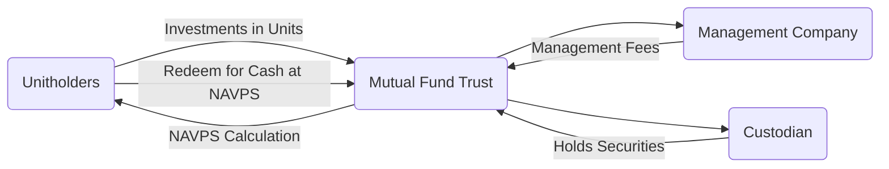

## 17.2 Overview of Mutual Funds

Mutual funds are a cornerstone of the Canadian investment landscape. As open-ended investment vehicles, they enable individual and institutional investors alike to pool their capital together to buy a professionally managed portfolio of securities. Mutual funds come in a wide array of mandates—equity, fixed income, balanced, growth, income, and more—allowing each investor to find a product that aligns with their financial goals and risk tolerance.

This section explores the core principles behind mutual funds, their structural elements, the regulatory framework in Canada, and the key advantages and disadvantages you should consider before investing.

---

## Defining Mutual Funds

A mutual fund is typically an open-ended fund, meaning that it continually issues new units (or shares) to incoming investors and redeems existing units at the current net asset value per share (NAVPS). The NAVPS is calculated daily by dividing the market value of all fund assets (minus liabilities) by the total number of units outstanding.

Using a simplified formula:

$$
\text{NAVPS} = \frac{\text{(Total Assets – Total Liabilities)}}{\text{Number of Units Outstanding}}
$$

When you invest in a mutual fund, you become a unitholder (or shareholder), generally acquiring proportional ownership of the fund’s total assets.

### Trust vs. Corporate Structure

Most Canadian mutual funds use a trust structure, meaning:

1. The assets of the fund are held by an independent custodian, often a trust company or specialized custodian bank, for the benefit of unitholders.
2. A mutual fund management company runs the daily operations, making portfolio decisions under the fund’s stated investment objectives.
3. In a trust structure, unitholders typically hold beneficial ownership of the fund’s assets rather than direct title.

Though less common, there are also corporate-class mutual funds. These are structured as corporations, issuing different classes of shares for various objectives but operating under a single corporate umbrella.

---

## Key Features of Mutual Funds

Mutual funds offer several distinct features that have cemented their popularity among Canadian investors:

1. **Professional Management:** Each fund hires portfolio managers and analysts who research securities and build a diversified portfolio. This can be especially appealing for investors without the time or expertise to manage a portfolio independently.

2. **Diversification:** Mutual funds generally invest across multiple asset classes, sectors, or regions. This approach helps spread risk, as gains in one part of the portfolio may offset losses in another.

3. **Liquidity:** As open-ended funds, mutual funds allow investors to redeem units daily at the prevailing NAVPS. This ready liquidity is one of the major attractions of the mutual fund structure.

4. **Choice of Strategies:** From fixed income to equity, sector-specific to balanced funds, investors can choose specific mandates that align with their personal objectives—be it growth, income, or capital preservation.

5. **Regulatory Oversight:** In Canada, mutual funds are regulated by the Canadian Securities Administrators (CSA), following rules such as National Instrument 81-101 (Mutual Fund Prospectus Disclosure). This robust regulatory environment promotes transparency, fair dealing, and investor protection.

---

## Advantages of Mutual Funds

### Professional Management

Investors benefit from the expertise of professional portfolio managers who perform research, execute trades, and continuously monitor economic and market conditions. Rather than make individual stock or bond selections, mutual fund investors delegate these decisions to experts.

### Diversification

By pooling the funds of many investors, mutual funds can buy a wide range of securities—stocks, bonds, money market instruments, etc. This extensive reach may reduce the risk of significant losses if one particular holding underperforms. For instance, a broad-based Canadian equity fund could hold shares of multiple sectors (e.g., financials, energy, and technology), thereby spreading risk.

### Liquidity and Flexibility

Open-ended mutual funds allow daily redemptions, meaning you can typically convert your investment to cash at the end of any trading day at the calculated NAVPS. This flexibility is particularly useful for investors who anticipate short-term liquidity needs or prefer to adjust their portfolios frequently.

---

## Potential Disadvantages

### Fees and Expenses

Management fees, operating expenses, and distribution costs can erode returns. The Management Expense Ratio (MER) reflects the total annual cost of portfolio management, administrative fees, and other fund expenses, expressed as a percentage of the fund’s average net assets.

• A high MER can significantly reduce the net return to investors.  
• Front-end loads, deferred sales charges, or redemption fees may also apply, depending on the fund’s fee structure.

### Lack of Control Over Investment Decisions

When investing in a mutual fund, you give up direct control over specific holdings and the timing of trades. While professional management can be beneficial, it also means the portfolio manager’s strategy may not always align with your personal market view.

### Potential for Over-Diversification

Although diversification can reduce risk, some critics argue that mutual funds can become “over-diversified,” diluting returns if they hold too many different securities. The performance of a single high-performing stock may not significantly impact the overall portfolio if it is just one of hundreds of holdings.

---

## Mutual Fund Distribution Channels

Mutual funds in Canada can be sold through various channels:

1. **Investment Dealers and Financial Advisors:** Registered dealers, who must be regulated by the Canadian Investment Regulatory Organization (CIRO), often provide personalized advice to help clients choose suitable funds.  
2. **Direct-to-Investor Services and Online Platforms:** Some mutual fund companies offer direct purchase options, cutting out the intermediary and potentially reducing costs. Online “do-it-yourself” (DIY) investing platforms allow investors to buy and sell mutual funds at their convenience.  
3. **Banks and Credit Unions:** Major Canadian financial institutions, such as RBC, TD, Scotiabank, BMO, and CIBC, often distribute proprietary mutual funds in their branches and online portals.

---

## Structural Walkthrough with Mermaid Diagram

Below is a mermaid diagram showing the general structure and flow of a Canadian mutual fund set up as a trust. This diagram illustrates the roles of the management company, custodian, unitholders, and the flow of cash and securities.

• “Unitholders” provide capital to the mutual fund.  
• The “Mutual Fund Trust” issues units at the calculated NAVPS.  
• The “Management Company” handles day-to-day operations and portfolio management, charging management fees deducted from the fund’s assets.  
• The “Custodian” safeguards all assets on behalf of unitholders.  
• The fund recalculates and publishes the NAVPS regularly, typically every trading day.  

---

## Regulatory Environment

Mutual funds in Canada operate under a framework designed to protect investors and ensure transparency:

• **National Instrument 81-101 (Mutual Fund Prospectus Disclosure):** Governs how mutual funds disclose information to potential and existing investors, including simplifying legal documents into more accessible “Fund Facts.”  
• **CSA Staff Notices:** Periodically published to clarify mutual fund disclosure rules and best practices.  
• **SEDAR+:** Documents such as prospectuses, financial statements, and annual information forms are publicly filed on SEDAR+ (https://www.sedarplus.ca/).  
• **CIRO Designations:** Dealers that distribute mutual funds must be regulated by CIRO, ensuring they adhere to suitability and Know Your Client (KYC) standards.

---

## Practical Examples and Case Studies

### Example 1: RBC Canadian Dividend Fund

RBC Canadian Dividend Fund invests primarily in dividend-paying Canadian equities. It aims to provide investors with steady income and moderate growth.  
• Management Expense Ratio (MER) is around 1%–2%, depending on the series.  
• The fund benefits from a focus on stable, high-dividend sectors, e.g., Canadian banks.  
• Risk rating is “medium,” reflecting exposure to stock market fluctuations.

### Example 2: TD Canadian Bond Fund

TD Canadian Bond Fund targets fixed-income instruments such as Government of Canada bonds, provincial bonds, and investment-grade corporate debt.  
• The fund’s primary objective is to generate income with a lower risk profile than an equity fund.  
• The MER might be closer to 1% for a broad-based bond fund.  
• Suitable for investors seeking stable income and capital preservation.

---

## Step-by-Step Guidance for Evaluating Mutual Funds

1. **Define Your Goals:** Clarify whether you seek growth, income, or capital preservation.  
2. **Assess Risk Tolerance:** Ensure the fund’s volatility matches your comfort level.  
3. **Review the Fund’s Investment Objective and Holdings:** Confirm the fund’s strategy (equity, fixed-income, balanced, etc.).  
4. **Check the MER and Other Fees:** A high MER impacts net returns, so compare fees among funds with similar objectives.  
5. **Study the Fund Facts:** Mandatory for all mutual funds in Canada, Fund Facts simplify the prospectus information into a concise format that covers fees, performance history, and risks.  
6. **Examine the Historical Performance:** While past performance is no guarantee of future results, long-term track records can reveal how a fund manages different market environments.  
7. **Consider Tax Implications:** If you hold funds outside registered accounts (e.g., RRSPs, TFSAs), distributions and capital gains could be taxable in the current year. Ensure you understand the tax efficiency of the fund.  
8. **Consult Professionals if Needed:** When uncertain, reach out to a licensed financial advisor or conduct further research.  

---

## Best Practices and Common Pitfalls

• **Regularly Review Your Investments:** Monitor any changes in the fund’s objectives, MER, or portfolio management team.  
• **Avoid Chasing Performance:** Strong recent returns can be misleading; always consider the fund’s long-term track record and consistency.  
• **Pay Attention to Fees:** Even a small difference in MER can translate to significant differences in returns over time.  
• **Diversify Among Funds or Asset Classes:** While one mutual fund can offer broad exposure, consider how it fits into your larger portfolio goals.  
• **Stay Informed on Regulatory Changes:** Keep an eye on new CSA Staff Notices or changes in regulations, as they may affect disclosure requirements or fee structures.

---

## Summary

Mutual funds provide Canadian investors with professionally managed portfolios, diversification, and daily liquidity. Their trust-based structure offers transparent oversight, while regulatory frameworks like National Instrument 81-101 ensure clarity in fund disclosures. Although they come with management fees and a degree of performance uncertainty, mutual funds remain a flexible and accessible vehicle for a variety of investment objectives.

By understanding how fees, structures, and regulations interplay, you will be better positioned to select funds that complement your financial objectives. Always review the Fund Facts, evaluate the management team’s track record, and consider engaging a financial advisor for personalized advice.

---

## 10 Quiz Questions to Test Your Understanding of Mutual Funds

## Mutual Funds in Canada: Your Essential Knowledge Check



### What does it mean for a mutual fund to be an “open-ended” fund?

- [x] It continuously issues and redeems units at the prevailing NAVPS.
- [ ] It has a fixed number of shares outstanding that rarely changes.
- [ ] It never allows redemptions under any circumstance.
- [ ] It is closed to new investments for most of the year.

> **Explanation:** Open-ended funds issue new units and redeem existing units at the current NAVPS based on the real-time value of the fund’s portfolio.

### Which statement best describes the role of the custodian in a mutual fund trust structure?

- [x] The custodian holds the fund’s assets in safekeeping on behalf of unitholders.
- [ ] The custodian is responsible for setting investment objectives and risk parameters.
- [ ] The custodian always acts as the dealer that distributes the fund.
- [ ] The custodian decides the fund’s redemption price every day.

> **Explanation:** The custodian’s primary duty is to safeguard the fund’s securities and ensure they are properly managed, providing an additional layer of security for investors.

### Why is diversification considered an advantage of mutual funds?

- [x] It helps reduce the impact of poor performance by any single asset in the portfolio.
- [ ] Diversified funds only invest in government bonds.
- [x] It can improve risk-adjusted returns by spreading exposure among multiple securities.
- [ ] It eliminates all investment risk.

> **Explanation:** By holding numerous securities across various sectors and regions, the fund can moderate risk if any particular asset or sector underperforms.

### Which of the following is a potential disadvantage of mutual funds?

- [x] Management fees and expenses can reduce overall returns.
- [ ] Investors maintain direct control over which securities the fund manager buys.
- [ ] They are illiquid and cannot be redeemed easily.
- [ ] They lack regulatory oversight in Canada.

> **Explanation:** While mutual funds are regulated and offer numerous benefits, the fees and expenses can significantly affect investors’ net returns over time.

### What is typically included in a mutual fund’s Management Expense Ratio (MER)?

- [x] Management fees and operating expenses.
- [ ] Personal advisor fees and private account charges.
- [x] Taxes and other administrative costs.
- [ ] Investors’ capital gains taxes on redemptions.

> **Explanation:** The MER generally includes the fund’s management fees, administrative costs, certain taxes, and other day-to-day operational expenses but does not include personal capital gains taxes.

### Which regulatory document simplifies complex prospectus information for investors?

- [x] The Fund Facts document.
- [ ] The WealthSimple Performance Report.
- [ ] The Federal Budget Overview.
- [ ] A personal financial statement from the investor.

> **Explanation:** Fund Facts documents provide a concise summary of the mutual fund’s essential information, including fees, risk rating, and past performance.

### Which organization regulates Canadian investment dealers who distribute mutual funds?

- [x] CIRO (Canadian Investment Regulatory Organization).
- [ ] Canada Revenue Agency (CRA).
- [x] The Bank of Canada Prudential Division.
- [ ] The Office of the Superintendent of Financial Institutions (OSFI).

> **Explanation:** CIRO regulates investment dealers in Canada, ensuring that they comply with industry standards, suitability requirements, and sales practice rules.

### What does a higher MER generally imply for an investor in a mutual fund?

- [x] It may erode more of the investor’s returns over time.
- [ ] It guarantees higher returns due to better management.
- [ ] It has no effect on the total return of the investment.
- [ ] It only matters if the investor holds the fund for less than one year.

> **Explanation:** A higher MER means more of the fund’s returns are consumed by fees, potentially reducing the net gain the investor receives.

### When evaluating a mutual fund, why is it important to review its investment objectives?

- [x] To ensure the fund’s goals align with your risk tolerance and return expectations.
- [ ] To determine the maximum number of shares you can purchase.
- [ ] To learn the exact number of days you must hold the fund before redeeming.
- [ ] The investment objective is rarely relevant to overall performance.

> **Explanation:** The fund’s strategy and objectives guide its asset allocation and risk profile, which should match your personal investment goals and comfort with risk.

### Is it possible to purchase Canadian mutual funds through online “self-directed” platforms without a financial advisor?

- [x] True
- [ ] False

> **Explanation:** Many mutual fund companies and brokerages allow direct online purchases. Investors can buy, sell, or switch funds through DIY investing platforms without consulting a financial advisor.



---

