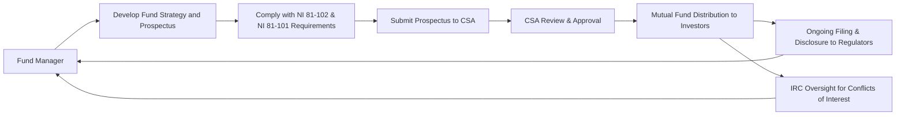

## 17.4 Mutual Fund Regulation

Mutual funds in Canada occupy a pivotal role in the retail investment landscape. Their popularity stems from professional management, diversification potential, and easy access for average investors seeking a path to long-term wealth creation. Because mutual funds attract a broad spectrum of investors, robust regulation is essential to protect public confidence, maintain standards of transparency, and ensure the fairness of industry practices. This section explores the regulatory environment surrounding mutual funds in Canada, focusing on key national instruments, the responsibilities of oversight bodies such as the Canadian Securities Administrators (CSA) and the Canadian Investment Regulatory Organization (CIRO), and the mechanisms put in place to safeguard investors.

---

## Overview of the Canadian Mutual Fund Regulatory Environment

In Canada, mutual funds are regulated through a combination of federal and provincial authorities, self-regulatory organizations, and specific national instruments. The overarching objective is twofold:
1. Protect investors by sustaining high standards of transparency and fairness.  
2. Maintain the stability and integrity of capital markets by preventing excess risk-taking and conflicts of interest that could undermine investor trust.

### National Instrument 81-102 (Investment Funds)
National Instrument (NI) 81-102 is at the core of Canadian mutual fund regulation. It sets forth operational standards and investment restrictions for various types of investment funds, including mutual funds. Key provisions under NI 81-102 include:

• Limitations on Leverage: Strict caps on borrowing and the use of derivatives help ensure that funds do not expose investors to excessive risk.  
• Concentration Limits: Mutual funds must abide by concentration restrictions that prohibit holding too large a position in a single issuer, thus promoting diversification.  
• Conflict-of-Interest Constraints: Fund managers must follow specific rules regarding transactions with entities that could present conflicts of interest.  

### National Instrument 81-101 (Mutual Fund Prospectus Disclosure)
While NI 81-102 governs how mutual funds operate, NI 81-101 governs what mutual funds must disclose. This regulation requires funds to provide:

• A Simplified Prospectus: A shorter, more comprehensible document outlining the fund’s investment objectives, purchase options, fees, and risks.  
• Fund Facts Document: A concise, plain-language summary of vital fund information, including performance history, fees, and potential risks. This document must be easily accessible to investors before or at the time of purchase.  

By mandating simplified documents, NI 81-101 ensures that investors can grasp essential information before deciding to invest.

---

## The Role of Regulatory Bodies

### Canadian Securities Administrators (CSA)
The CSA is an umbrella organization of Canada’s provincial and territorial securities regulators. Although securities laws are administered at the provincial and territorial levels, the CSA works to harmonize regulation across Canada. Its uniform standards, national instruments (like NI 81-102 and NI 81-101), and passport system allow market participants to register in one jurisdiction and operate in multiple regions, ensuring consistent protection for investors nationwide.

For more information, visit:  
• [Canadian Securities Administrators (CSA)](https://www.securities-administrators.ca/)  

### Canadian Investment Regulatory Organization (CIRO)
CIRO is the national self-regulatory organization (SRO) responsible for overseeing mutual fund dealers, investment dealers, and their registered representatives (Approved Persons). Formed through the consolidation of prior SROs to reduce regulatory overlap, CIRO enforces:

• Proficiency Requirements: Ensuring advisors and representatives have the necessary education and credentials (e.g., the Canadian Securities Course®).  
• Business Conduct Standards: Mandating fair practices, ethical behavior, and proper disclosure.  
• Suitability Obligations: Advisors must ensure investments align with clients’ risk tolerance, financial goals, and overall profile.

For more details, visit:  
• [CIRO’s Regulatory Guidelines](https://www.ciro.ca/)  

---

## Key Regulatory Provisions and Investor Protection Measures

### Disclosure and Transparency 
Disclosure rules in the mutual fund industry are comprehensive. Before buying units or shares, investors must receive essential documents such as the Fund Facts, highlighting a fund’s historical returns, fees, commissions, and risks. The objective is to equip investors with enough information to make well-informed decisions.

### Permissible Investment Practices
Regulatory compliance also involves adhering to permissible investment practices that shape the mutual fund’s portfolio management. NI 81-102, for instance, restricts:
• The types of derivatives that can be used for hedging or non-hedging strategies.  
• The degree of leverage or borrowed funds a mutual fund can employ.  
• The fund’s participation in short-selling activities.  

### Mutual Fund Governance: Independent Review Committee (IRC)
Many mutual funds maintain an Independent Review Committee (IRC), a panel of individuals free from conflicts of interest with the fund or fund manager. Their role is to review decisions involving potential conflicts (e.g., related-party transactions) and ensure they prioritize the best interest of the fund’s unitholders. This structure helps reinforce investor confidence in the ongoing governance processes.

---

## Practical Examples and Case Studies

### RBC Balanced Fund Compliance Example
Consider RBC Balanced Fund (hypothetical example inspired by a real fund). To remain in compliance with NI 81-102, fund managers must:

1. Diversify Assets  
   • Limit holdings so that no more than 10% of investable assets are allocated to a single issuer (subject to certain exceptions).  
2. Calculate Leverage Ratio  
   • If the fund uses derivatives for hedging, it must ensure that total effective leverage stays within prescribed limits and is primarily used to mitigate risk, not amplify returns excessively.  
3. Disclose Information in Plain Language  
   • Provide unit holders with accessible documents, like Fund Facts, describing the ratio of equity-to-fixed income exposure, management expense ratio (MER), and the latest performance data.

### TD Bond Fund Prospectus Disclosure
A bond fund example might involve TD Bond Fund. Under NI 81-101, TD Bond Fund’s simplified prospectus must describe:

• Investment Objective: Whether it focuses on corporate, government, or high-yield bonds.  
• Risk Classification Method: How the fund determines its risk rating (e.g., low to medium risk).  
• Fee Breakdown: Management fees, operating expenses, and trailing commissions to ensure full transparency.

Such disclosures help investors decide if the fund is suitable for their risk profile and investment horizon.

---

## Best Practices and Common Pitfalls

### Best Practices for Investors
• Thoroughly Read Fund Facts and the Simplified Prospectus: Key details such as fees, risk profile, and performance history must be understood before committing capital.  
• Assess Suitability: Consult a qualified professional to align fund characteristics with your financial goals and risk tolerance.  
• Monitor Ongoing Changes: Regulations may evolve, and funds can adjust their strategies; keep updated with reports and regulatory communications.

### Common Pitfalls
• Overlooking Ongoing Costs: Management fees, trailing commissions, and fund expenses can erode returns. A high Management Expense Ratio (MER) can significantly impact net performance over time.  
• Inadequate Risk Assessment: Simply because a fund is regulated does not guarantee it suits your investment or retirement goals.  
• Relying on Past Performance Alone: Historical returns do not guarantee future success, and prudent fund selection should also involve market outlook and manager expertise.

---

## Regulatory Compliance Process: Step-by-Step

Below is a simplified view of how a mutual fund dealer and fund manager must comply with the regulatory framework:

• Step 1: Develop Fund Strategy & Documentation  
  The fund manager defines investment objectives, approach, and governance strategies consistent with regulatory guidelines.  

• Step 2: Comply with NI 81-102 & NI 81-101  
  The manager ensures compliance with operational, disclosure, and marketing standards.  

• Step 3: Submit Documents to the CSA  
  The simplified prospectus, Fund Facts, and other pertinent materials are filed with the CSA.  

• Step 4: CSA Review & Approval  
  The regulatory bodies examine the documentation. Once approved, the fund can be legally offered to the public.  

• Step 5: Ongoing Disclosure & IRC Oversight  
  Continuous reporting, including annual and semi-annual reports, is provided to the CSA and unitholders. The IRC ensures that conflicts of interest are addressed appropriately.

---

## Additional Resources and Further Reading

Below are valuable references for deeper exploration:

• [Canadian Securities Administrators (CSA)](https://www.securities-administrators.ca/) – Official resource for national instruments, policy statements, and notices.  
• [NI 81-102 (Investment Funds)](https://www.osc.ca/) – Specific guidelines that detail mutual fund operational standards.  
• [CIRO’s Regulatory Guidelines](https://www.ciro.ca/) – Oversight requirements for mutual fund dealers and advisory representatives.  
• [Investment Funds Institute of Canada (IFIC)](https://www.ific.ca/) – Industry research, publications, and investor education resources.  

Open-source financial tools and educational platforms can also help you compare mutual funds and track their performance. Applications like GnuCash or online resources from Morningstar and FundLibrary offer free versions and trial periods to help you get started.  

---

## Summary and Key Takeaways

Canadian mutual fund regulation is designed to protect investors and maintain efficient markets. By setting transparent operational rules (NI 81-102) and clear disclosure requirements (NI 81-101), regulators empower investors to make informed decisions. The CSA, in conjunction with CIRO, provides consistent oversight, while Independent Review Committees address conflicts of interest within fund operations.  
 
As an investor or financial professional, a thorough grasp of these regulations enables better decision-making and bolsters trust in the mutual fund landscape. Ultimately, the regulatory framework underscores a shared goal across industry stakeholders: uphold market integrity and investor confidence through accountability, transparency, and fairness.

---

## Test Your Knowledge: Canadian Mutual Fund Regulation Essentials



### Which National Instrument primarily governs the operations of Canadian mutual funds, including restrictions on leverage and concentration?

- [ ] National Instrument 81-101
- [x] National Instrument 81-102
- [ ] National Instrument 45-106
- [ ] National Instrument 31-103

> **Explanation:** National Instrument 81-102 (Investment Funds) is the principal regulation specifying operational standards, leverage restrictions, and concentration limits for mutual funds.

### What document must be provided to investors that offers a concise, plain-language summary of a mutual fund's fees, performance, and risks?

- [ ] Annual Information Form
- [x] Fund Facts
- [ ] Statement of Additional Information
- [ ] Monthly Performance Sheet

> **Explanation:** Under NI 81-101, the Fund Facts document concisely highlights essential information regarding fees, performance, and risks. It must be provided to investors before or at the point of sale.

### Which organization oversees mutual fund dealers and investment dealers, enforcing proficiency, business conduct, and suitability obligations?

- [ ] Canada Deposit Insurance Corporation (CDIC)
- [ ] The Office of the Superintendent of Financial Institutions (OSFI)
- [x] The Canadian Investment Regulatory Organization (CIRO)
- [ ] The Canada Revenue Agency (CRA)

> **Explanation:** CIRO sets and enforces rules for both mutual fund dealers and investment dealers, ensuring they meet proficiency and ethical standards.

### What is the purpose of an Independent Review Committee (IRC) within a mutual fund structure?

- [ ] To prepare the fund’s tax returns
- [ ] To handle day-to-day trading activities
- [x] To address potential conflicts of interest and act in the fund’s best interest
- [ ] To guarantee a specific rate of return

> **Explanation:** An IRC ensures decisions involving conflicts of interest are scrutinized with the fund unitholders’ best interests in mind.

### Under NI 81-102, which of the following best describes a fund manager's limitation regarding holdings in a single issuer?

- [x] The fund manager is subject to concentration limits to minimize undue risk.
- [ ] The fund manager can hold up to 75% in a single security if it’s a government bond. 
- [x] The fund manager may allocate an unlimited percentage to a single issuer as long as the issuer is Canadian.
- [ ] The fund manager must hold all securities in equal proportions to maintain diversification.

> **Explanation:** NI 81-102 places concentration limits on mutual funds so that exposure to a single issuer does not become excessive. This protects investors from issuer-specific risks.

### Which of the following is NOT a key requirement under National Instrument 81-101?

- [ ] Provision of a Simplified Prospectus
- [ ] Mandatory Fund Facts delivery
- [ ] Transparency on fees and charges
- [x] Using only Canadian-based custodians

> **Explanation:** NI 81-101 focuses on disclosure requirements, not on strictly mandating the nationality of custodians, although custodians must meet regulatory standards.

### Which step must occur before a mutual fund can be distributed to investors?

- [x] The CSA must review and approve the simplified prospectus and Fund Facts.
- [ ] CIRO must provide risk prevention guidelines directly to the fund manager.
- [x] The fund manager must issue monthly performance reports to potential investors.
- [ ] The fund must be insured by the Canada Deposit Insurance Corporation.

> **Explanation:** Before distribution, the mutual fund’s simplified prospectus and Fund Facts must undergo CSA review and approval, ensuring they meet required disclosure standards.

### What is a common pitfall for investors when selecting a mutual fund?

- [ ] Carefully reading all disclosure documents
- [ ] Considering the fund's risk level and long-term goals
- [x] Focusing solely on past performance without examining fees or overall strategy
- [ ] Consulting a licensed investment advisor

> **Explanation:** Excessive reliance on past performance fails to account for changes in market conditions, fund strategy, or fees that can significantly impact future returns.

### Which of the following official resources can a mutual fund manager consult for current policy statements and national instruments?

- [x] The Canadian Securities Administrators (CSA) website
- [ ] The Canada Revenue Agency (CRA) website
- [ ] The Bank of Canada website
- [ ] The Canadian Insurance Regulators website

> **Explanation:** The CSA’s official website offers updated national instruments, policy statements, and other relevant resources on securities regulation.

### True or False: Regulatory requirements for Canadian mutual funds are designed solely to maximize fund returns for investors.

- [x] True
- [ ] False

> **Explanation:** This is a trick question. Actually, the goal of mutual fund regulation is primarily to protect investors and ensure market integrity, not necessarily to maximize returns. The correct statement is that these rules protect investors and maintain transparent, fair markets, rather than guaranteeing or maximizing returns.



---

